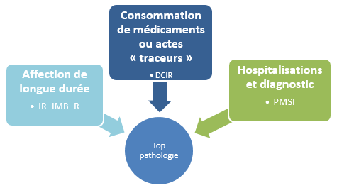

# La cartographie des pathologies de la CNAM
<!-- SPDX-License-Identifier: MPL-2.0 -->
La cartographie des pathologies et des dépenses est une base produite par la CNAM et consiste à identifier au sein du régime général (SLM comprises) les patients pris en charge pour:
*  des pathologies chroniques fréquentes, graves, ou coûteuses,
*  les femmes prises en charge pour le risque maternité, 
*  les patients qui n’ont pas ces pathologies chroniques repérées ou évènements de santé mais ont eu des hospitalisations ponctuelles 
*  et ceux qui ne sont dans aucune de ces situations.

Elle concerne environ **57 millions de bénéficiaires du régime général** ayant eu recours à des soins remboursés dans l’année. Des algorithmes permettent de repérer les patients ayant une pathologie chronique, un traitement chronique ou un événement de santé, à partir des diagnostics mentionnés dans le **PMSI à la suite d'une hospitalisation**, du diagnostic ayant donné lieu à une prise en charge pour **affection de longue durée** [(ALD)](../fiches/beneficiaires_ald.md) , ou d'**actes ou médicaments spécifiques** de pathologies, donc à partir d’un recours à des soins spécifiques et remboursés :



Il existe 56 tops pathologies (variables binaires), qui se synthétisent en 13 grands groupes de pathologies:
* Maladies cardioneurovasculaires (dont la maladie coronaire, l’insuffisance cardiaque…), 
* Facteurs de risque vasculaire traités, 
* Diabète, 
* Cancers, 
* Maladies neurologiques ou dégénératives, 
* Maladies psychiatriques, 
* Traitements psychotropes, 
* Maladies respiratoires chroniques, 
* Maladies inflammatoires ou rares ou VIH/Sida, 
* Maladies du foie ou du pancréas, 
* Insuffisance rénale chronique terminale traitée, 
* Maternité (avec ou sans pathologies)
* et autres affections de longue durée. 

Ces indicatrices de repérage d'une pathologie sont calculées **individuellement chaque année** (AAAA) et selon plusieurs versions de la méthode de repérage (en 2017, la version en cours est la version G5).
Les variables sont ensuite restituées dans les tables **CT_IND_AAAA_GX**. Une table de dépenses **CT_DEP_AAAA_GX** accompagne cette table (par poste de dépenses de soins de ville, d’hôpital, et de prestations en espèces) et permet de calculer rapidement des dépenses par pathologie. Enfin, la table **CT_IDE_AAAA_GX** permet d'obtenir la table de passage entre les identifiants BEN_NIR_PSA et BEN_RNG_GEM du DCIR, et l'identifiant ID_CARTO propre à la cartographie.


## Maladies cardioneurovasculaires (sup_Cv_cat)
### Syndrome coronaire aigu (top_CvIDM_aig)

**Description du top :**

Personnes hospitalisées l’année n pour cardiopathie ischémique aigüe (DP d’un des RUM).   

*Codes CIM10 utilisés dans le PMSI :*
* I21 (Infarctus aigu du myocarde) ;
* I22 (Infarctus du myocarde à répétition) ;
* I23 (Certaines complications récentes d'un infarctus aigu du myocarde) ;
* I24 (Autres cardiopathies ischémiques aiguës).
 

**Code SQL SAS**

```sas
PROC SQL; CREATE TABLE top_coro_aigu 
    AS SELECT 
        DISTINCT b.nir_ano_17,c.ben_nir_psa, c.ben_rng_gem,e.*
            FROM ORAVUE.T_MCO16UM a
            LEFT JOIN ORAVUE.T_MCO16C b
            ON a.RSA_NUM=b.RSA_NUM AND a.ETA_NUM=b.ETA_NUM
                LEFT JOIN ORAVUE.IR_BEN_R c
                ON b.NIR_ANO_17=c.BEN_NIR_PSA
                    LEFT JOIN ORAVUE.CT_IDE_2016_G5 d
                    ON c.BEN_NIR_PSA=d.BEN_NIR_PSA and c.BEN_RNG_GEM=d.BEN_RNG_GEM
                        LEFT JOIN ORAVUE.CT_IND_2016_G5 e
                        ON d.ID_CARTO=e.ID_CARTO
    WHERE a.DGN_PAL LIKE "I21%" OR a.DGN_PAL LIKE "I22%" OR
    a.DGN_PAL LIKE "I23%" OR
    a.DGN_PAL LIKE "I24%" ;
QUIT;

```

**Résultats :** 

79 563 tops reconstruits en 2016   
99,98% des tops pathos retrouvés sur le régime général

[Lien vers la fiche pathologie](https://www.ameli.fr/fileadmin/user_upload/documents/Syndrome_coronaire_aigu.pdf)

## Références

::: tip Crédit
Le contenu original de cette fiche provient du document [Méthode médicale Cartographie ](https://www.ameli.fr/fileadmin/user_upload/documents/Methode_medicale_Cartographie.pdf) disponible sur le site Ameli.  
Les codes ont été reconstitués par Claire-Lise Dubost (DREES).
:::

