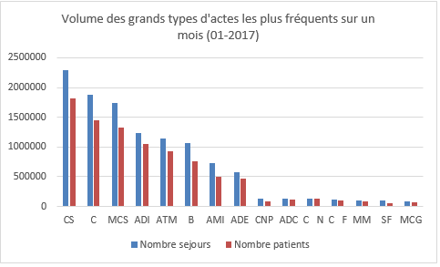
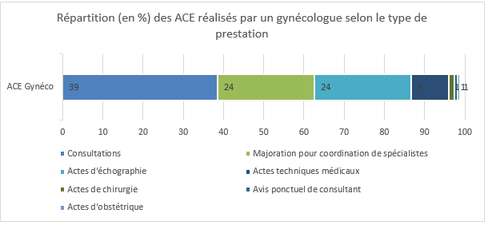
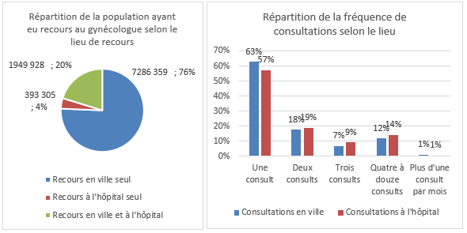

# Actes et consultations externes
<!-- SPDX-License-Identifier: MPL-2.0 -->

## Que regroupent les actes et consultations externes ?

Les actes et consultations externes (ACE) sont réalisés par les praticiens exerçant dans les établissements de santé et sont imputés sur les enveloppes de dépenses hospitalières.   
Ils comprennent non seulement les actes et consultations réalisées dans le cadre de l’**activité externe de l’établissement de santé** mais également l’ensemble des **prestations hospitalières sans hospitalisation**.   

Cette activité est de même nature que celle réalisée par les praticiens libéraux en cabinet de ville. 
Elle ne concerne que les **hôpitaux publics** et les **établissements de santé privés d’intérêt collectif** (ESPIC), puisque dans les établissements de santé privés lucratifs, l’activité externe relève du champ libéral. On retrouve donc cette dernière dans le DCIR (SNIIRAM).

Plus concrètement, les prestations réalisées dans ce cadre sont principalement :
-	des **consultations** (spécialistes, 39 millions d’actes et 14% du total des dépenses  ; généralistes, 24 millions, 14%) [^1], 
-	des **actes d’imagerie** (15 millions, 14%) ou de **biologie** (77 millions, 12%), 
-	des **forfaits techniques de radiologie**,
-	des **actes techniques médicaux**, 
-	ainsi que les ACE réalisées lors de **passage aux urgences** non suivis d’hospitalisation.


## Les tables du PMSI (version SNDS) pour les ACE
### En MCO

Dans toutes les tables, un passage à l’hôpital est identifié par le couple ETA_NUM||SEQ_NUM, qui permet la jointure entre les tables. En 2017, il y a 77 millions de passages (calculs DREES pour cette fiche).

Dans la suite de cette fiche, le terme *séjour* pourra être utilisé pour renvoyer à un passage par l'hôpital, même si celui-ci ne dure pas plus d'un jour.

|    Table              |    Libellé                                                 |    Clé unique                    |
|-----------------------|------------------------------------------------------------|----------------------------------|
|    T_MCOAACSTC        |    Patients                                                |    Séjour ETA_NUM|SEQ_NUM        |
|    T_MCOAAFASTC       |    Factures (infos   complémentaires sur les patients)     |    Séjour ETA_NUM|SEQ_NUM        |
|    T_MCOAAFBSTC       |    Prestations   hospitalières et valorisation             |    Séjour*Prestation             |
|    T_MCOAAFCSTC       |    Honoraires des actes et   valorisation                  |    Séjour*Acte                   |
|    T_MCOAAVALOACE     |    Valorisation des actes   et consultations externes      |    Séjour ETA_NUM|SEQ_NUM        |
|    T_MCOAAFHSTC       |    Médicaments onéreux                                     |    Séjour *Médicament            |
|    T_MCOAAFLSTC       |    Biologie                                                |    Séjour*Examen   biologique    |
|    T_MCOAAFMSTC       |    Actes CCAM                                              |    Séjour*Acte CCAM              |


La table **patients** (CSTC) permet d’obtenir l’identifiant PMSI du patient NIR_ANO_17, et les dates d’entrées et de sortie.   
La table **facture** (FASTC) permet d’obtenir des informations supplémentaires sur le patient (âge AGE_ANN, sexe COD_SEX, code géographique BDI_COD, code civilité COD_CIV, nature de l’assurance, code du grand régime, motif d’exonération du ticket modérateur etc.) qui sont des informations déclaratives et non vérifiées par l’ATIH.   
La table **prestations hospitalières** (FBSTC) contient le détail des prestations hospitalières facturées (type de prestation ACT_COD, spécialité de l’exécutant, quantité, taux de remboursement, et le prix unitaire).   
La table des **actes et honoraires** (FCSTC) contient le détail des prestations et actes réalisées par les professionnels de santé (code de prestation ACT_COD, spécialité de l’exécutant, quantité, coefficient NGAP ACT_COE, prix, et le taux de remboursement). Étant donnée la grande diversité d’actes et prestations possibles, celles-ci sont réunies en grands groupes dont les contours sont un peu flous (voir annexe). Pour le détail, on peut utiliser les tables plus détaillées (biologie, actes CCAM, etc.).   
La table **médicaments** (FHSTC) contient le détail du prix (ACH_PRU_TTC) et des codes UCD des médicaments de la liste en sus délivrés lors du séjour (UCD_COD).   
La table **biologie** (FLSTC) contient le code des examens de biologie réalisés lors du séjour (NABM_COD).   
La table **actes CCAM** (FMSTC) contient le détail des actes de la nomenclature CCAM (CCAM_COD).   

Les tables des **prestations hospitalières** (FBSTC) et des **actes** (FCSTC) ne sont pas complétées pour chacun des séjours et sont **complémentaires**. En effet, l’activité ici étudiée regroupe deux types de prestations.   
On distingue les *actes et consultations externes au sens strict du terme* et les *prestations hospitalières sans hospitalisation* :
 1. Les actes et consultations externes correspondent à l’ensemble des prestations référencées dans :
-	la nomenclature générale des actes professionnels (NGAP) : consultations, biologie, soins infirmiers ainsi que les éventuelles majorations (nuit et jours fériés) qui peuvent s’appliquer ;
-	la classification commune des actes médicaux (CCAM) : imagerie, échographies, actes techniques médicaux, chirurgie… 
-	les forfaits techniques de radiologie (FTN). 
2. Les prestations hospitalières sans hospitalisation correspondent quant à elles : 
-	aux passages aux urgences non suivis d’une hospitalisation (forfait « accueil et traitement des urgences » ou ATU) ; 
-	aux soins nécessitant la consommation de matériel de petite chirurgie ou d’immobilisation qui sont délivrés dans les établissements de santé qui ne sont pas autorisés à exercer l’activité de médecine d’urgence (forfaits « petits matériels » ou FFM) ; 
-	aux soins réalisés sans hospitalisation mais nécessitant le recours à un secteur opératoire ou à une mise en observation du patient dans un environnement hospitalier (forfaits « sécurité environnement hospitalier » ou SE) ; 
-	à l’administration de produits et prestations en environnement hospitalier (forfaits APE ou « DMI externe » y compris les dispositifs médicaux utilisés) ; 
-	à l’ensemble des forfaits correspondant aux alternatives à la dialyse en centre (autodialyse, dialyse à domicile et dialyse péritonéale).
   
La variable **ACT_COD**, présente dans les deux tables, donne donc la nature de la prestation effectuée. Le champ des modalités regroupe donc différentes nomenclatures (voir *Annexe*).

::: tip ATTENTION 

Dans les tables annuelles du PMSI MCO mis à disposition par la CNAM, il faut retirer une partie des séjours des hôpitaux de Paris, (AP-HP), Marseille (AP-HM), et Lyon (HCL) puisqu’ils sont remontés en doublon, via le FINESS juridique et via le FINESS géographique (on retire donc l’un ou l’autre des codes FINESS). 
Dans l'EGB, il n'y a pas ce problème de doubles remontées pour les tables annuelles du PMSI MCO.

**Pour les actes et consultations externes, que ce soit dans le DCIR ou l'EGB, les séjours de l'AP-HP et de l'AP-HM sont remontés via les deux FINESS et sont donc en doublons, les séjours des HCL ne sont pas remontés via le FINESS géographique et ne posent pas de problèmes de doublons.**
:::


::: tip ATTENTION

La spécialité de l'exécutant pour les consultations externes est remplie uniquement de façon déclarative. La variable n'est pas forcément de bonne qualité. Notamment, les internes sont connus pour être codés par défaut en Médecine Générale (1).
:::


## Exemple de requêtes pour analyse 

### Description des ACE les plus fréquents (hors prestations)
Cette requête vise à obtenir une distribution des actes les plus fréquents parmi les ACE au sens strict, en janvier 2017.
```sql
PROC SQL ; CREATE TABLE ace AS
    SELECT a.*,b.*, c.* 
        FROM oravue.t_mco17cstc a
            LEFT JOIN oravue.t_mco17fastc c 
            ON a.eta_num=c.eta_num AND a.seq_num=c.seq_num
                LEFT JOIN  oravue.t_mco17fcstc b 
                ON a.eta_num=b.eta_num AND a.seq_num=b.seq_num
            WHERE a.exe_soi_amd="201701";
QUIT;

PROC SQL ; CREATE TABLE actes_code_decompte AS
    SELECT act_cod, 
            count(distinct(eta_num||seq_num)) as nombre_sejour,
            count(distinct(nir_ano_17)) as nb_patients 
        FROM ace
    GROUP BY act_cod
    ORDER BY nombre_sejour desc;
QUIT;

PROC SQL ; CREATE TABLE actes_spe_decompte AS
    SELECT exe_spe, 
            count(distinct(eta_num||seq_num)) as nombre_sejour,
            count(distinct(nir_ano_17)) as nb_patients
        FROM ace
    GROUP BY exe_spe
    ORDER BY nombre_sejour desc;
QUIT;
```
#### Résultats illustrés
   
*Répartition du nombre de séjours et de patients en ACE en janvier 2017 selon le type d'actes effectués*


   
*Répartition du nombre de séjours et de patients en ACE en janvier 2017 selon la spécialité du professionnel ayant effectué l'acte*


### Complémentarité du recours au gynécologue en ville et en ACE
Cette requête vise à calculer le recours à un ou une gynécologue en ville et à l'hôpital.

```sql
/* 1.a. Actes et consultations externes 2017 spé gynécologue*/
PROC SQL ; CREATE TABLE ace_gyn AS
    SELECT a.*,b.*,c.*
        FROM oravue.t_mco17fcstc a
            LEFT JOIN  oravue.t_mco17cstc b 
            ON a.eta_num=b.eta_num AND a.seq_num=b.seq_num
                LEFT JOIN  oravue.t_mco17fastc c 
                ON a.eta_num=c.eta_num AND a.seq_num=c.seq_num
    WHERE (a.exe_spe="07" OR a.exe_spe LIKE "7%") 
    AND a.eta_num not in ('130786049', '750712184');
QUIT;

PROC FREQ DATA=ace_gyn order=freq;
    TABLE act_cod ;
RUN;
    /*34% de consults (+5% de consults codées "non spécialiste"), 
    24% de majoration pour coordination, 
    23% d'actes d'échographie,
    9% d'actes techniques*/

/* 1.b. Constitution d’une table d’individus ayant eu recours aux ACE gynéco*/ 
PROC SQL; CREATE TABLE ace_gyn_ind AS
SELECT DISTINCT nir_ano_17, cod_sex, max(age_ann) as age_ann, count(distinct(exe_soi_dtd)) as nb_visites
		FROM ace_gyn
		GROUP BY nir_ano_17, cod_sex;
QUIT;
/*2,3 millions d’individus*/ 

/* 2. Prestations en ville gynécologue : table individus*/ 
PROC SQL ; CREATE TABLE prs_gyn AS
	SELECT ben_nir_psa,ben_rng_gem,ben_nai_ann,max(ben_res_dpt) as ben_res_dpt, ben_sex_cod,count(distinct(exe_soi_dtd)) as nb_consults_ville,ben_nai_ann, ben_sex_cod 
		FROM oravue.er_prs_f 
		WHERE flx_trt_dtd between '01jan2017:0:0:0'dt and '01jul2018:0:0:0'dt
		AND exe_soi_amd like "2017%"
		AND pse_spe_cod in (7,70,77,79)
	GROUP BY ben_nir_psa,ben_rng_gem,ben_nai_ann,ben_sex_cod;
QUIT;

DATA prs_gyn;
	SET prs_gyn;
	RENAME ben_nir_psa=nir_ano_17;
RUN;
PROC SORT DATA=prs_gyn;
	BY nir_ano_17;
RUN;

/* 3. Jointure des prestations villes et ACE */ 
DATA gyn_tot;
    MERGE ace_gyn_ind (in=a) prs_gyn(in=b);
    BY nir_ano_17;
    IF A or B;
RUN;
```

#### Résultats illustrés
   
*Répartition des ACE effectués par un gynécologue en 2017 selon le type de prestations*

   
*Répartition des patients ayant vu un gynécologue en 2017 selon le type de recours*


## Annexe


### Table de valeur de la variable ACT\_COD [^2]

|    Code        |    Libellé                                                                              |
|----------------|-----------------------------------------------------------------------------------------|
|    ACO         |    actes d'obstétrique                                                                  |
|    ACTESF      |    Sage-Femme Soins spécialisés                                                         |
|    ADA         |    actes d'anesthésie                                                                   |
|    ADC         |    Actes de chirurgie                                                                   |
|    ADE         |    Acte d'échographie                                                                   |
|    ADI         |    Actes d'imagerie (hors échographie)                                                  |
|    AIS         |    Acte Infirmiers Spécialisés                                                          |
|    AMC         |    Actes Masseurs Kinésithérapeute                                                      |
|    AMI         |    Acte Infirmiers                                                                      |
|    AMK         |    Actes Masseurs Kinésithérapeute                                                      |
|    AMO         |    Actes Orthophonistes                                                                 |
|    AMP         |    Actes Pédicure                                                                       |
|    AMS         |    Actes Masseurs Kinésithérapeute                                                      |
|    AMY         |    Actes Orthoptistes                                                                   |
|    APC         |    Avis ponctuel de consultant                                                          |
|    APU         |    Avis ponctuel de consultant professeur   des universités                             |
|    APV         |    Avis ponctuel de consultant (visite)                                                 |
|    APY         |    Avis ponctuel de consultant psychiatre,   neuro-psychiatre ou neurologue             |
|    ATM         |    actes techniques (hors imagerie)                                                     |
|    ATU         |    Accueil et traitement des urgences                                                   |
|    AVY         |    Avis ponctuel de consultant psychiatre,   neuro-psychiatre ou neurologue (visite)    |
|    B           |    Actes d'analyse                                                                      |
|    C           |    Consultation Médecin Omnipraticien                                                   |
|    CALD        |    Consultation approfondie au   cabinet                                                |
|    CD          |    Consultation Chirurgien - Dentiste   Omnipraticien                                   |
|    CNP         |    Consultation Médecin   Neuro-Psychiatre                                              |
|    CS          |    Consultation Médecin Spécialiste                                                     |
|    CSC         |    Consultation Spécialisée de   Cardiologie                                            |
|    CSD         |    Consultation Chirurgien - Dentiste   Spécialiste                                     |
|    CSF         |    Consultation Sage-Femme                                                              |
|    D           |    Acte chirurgien-dentiste                                                             |
|    DC          |    Certains actes dentaires                                                             |
|    FFM         |    Forfaits petit matériel                                                              |
|    FPE         |    majoration CS forfait pédiatrique enfant   de 0 à 24 mois                            |
|    FTN         |    Forfaits techniques de radiologie                                                    |
|    FTR         |    Forfaits techniques de radiologie   réduits                                          |
|    G           |    Consultation du généraliste                                                          |
|    K           |    Actes chirurgie et spécialités                                                       |
|    KB          |    Actes Biologie Chirugie                                                              |
|    KC          |    Certains actes chirurgicaux                                                          |
|    KCC         |    Actes chirurgie et de spécialité   réalisée par un médecin spécialisé                |
|    KE          |    Certains actes chirurgicaux réalisés en   echographie                                |
|    MAJAMYD     |    Majoration orthodontiste dimanche                                                    |
|    MAJAMYN     |    Majoration nuit orthoptiste                                                          |
|    MAJDDENT    |    Majoration Dentiste Dimanche                                                         |
|    MAJDLDF     |    Majoration directeur de laboratoire   Dimanche ou jours fériés                       |
|    MAJDLN      |    Majoration directeur de laboratoire   Nuit                                           |
|    MAJDM       |    Consultation Majoration Dimanche   Médecin-Dentiste                                  |
|    MAJINFD     |    Acte Infirmier Majoration Dimanche                                                   |
|    MAJINFN1    |    Acte Infirmier Majoration Nuit 20h à 24h   et 6h à 8h                                |
|    MAJINFN2    |    Acte Infirmier Majoration Nuit 0h à   6h                                             |
|    MAJKID      |    Actes Kiné Majoration Dimanche                                                       |
|    MAJKIN      |    Actes Kiné Majoration Nuit                                                           |
|    MAJMSAO     |    Majoration médecin spécialiste astreinte   opérationnelle                            |
|    MAJMSGP     |    Majoration médecin spécialiste garde sur   place                                     |
|    MAJNC1      |    Consultation Majoration Nuit   Médecin-Dentiste 20h à 24h et 6h à 8h                 |
|    MAJNC2      |    Consultation Majoration Nuit   Médecin-Dentiste 0h à 6h                              |
|    MAJNCS      |    Consultation Majoration Nuit Médecin   Spéc-Dentiste sauf pédiatres                  |
|    MAJNDENT    |    Majoration de nuit dentiste                                                          |
|    MAJNPED1    |    Consultation Majoration Nuit Pédiatre   20h à 24h et 6h à 8h                         |
|    MAJNPED2    |    Consultation Majoration Nuit Pédiatre 0h   à 6h                                      |
|    MAJPPD      |    Majoration pédicure-podologue   Dimanche                                             |
|    MAJPPN      |    Majoration pédicure-podologue Nuit                                                   |
|    MAJSFD      |    Consultation Majoration Dimanche Sage-Femme                                          |
|    MAJSFN1     |    Consultation Majoration Nuit Sage-Femme   20h à 24h et 6h à 8h                       |
|    MAJSFN2     |    Consultation Majoration Nuit Sage-Femme   0h à 6h                                    |
|    MAJSISFD    |    Sage-Femme Soins Majoration   Dimanche                                               |
|    MAJSISIN    |    Sage-Femme Soins Majoration Nuit                                                     |
|    MAJURG      |    maj soins d'urgences au cabinet                                                      |
|    MCPCNPSY    |    majoration CNPSY                                                                     |
|    MCPCS       |    majoration CS pour spécialités                                                       |
|    MCS         |    Majoration coordination de spécialistes                                              |
|    MEG         |    Majoration enfants généraliste                                                       |
|    ORT         |    Orthodontie                                                                          |
|    P           |    Actes Anapath-Cytologie                                                              |
|    PB          |    Prélévement direct non médecin   Laboratoire                                         |
|    PRA         |    Produits radio-actifs                                                                |
|    PRO         |    Prothèses                                                                            |
|    SC          |    Soins Dentaires conservateur                                                         |
|    SCM         |    Soins conservateurs médecins                                                         |
|    SFI         |    Sage-Femme Soins Infirmiers                                                          |
|    SPR         |    Soins Dentaires prothétiques                                                         |
|    SE          |    Forfaits "sécurité environnement hospitalier"                                        |
|    TB          |    Prélévement Technicien Laboratoire                                                   |
|    TO          |    Traitement Orthodontique dentaire                                                    |
|    Z1          |    Actes en Z                                                                           |
|    Z2          |    Actes en Z Rhumatologue,   Pneumo-Phtisio                                            |
|    Z3          |    Actes en Z Autre Médecin                                                             |
|    Z4          |    Actes en Z - Spécialiste en   radiothérapie                                          |
|    ZD          |    Actes en Z Chirurgien - Dentiste                                                     |
|    ZM          |    Actes de mammographie pratiqué par le   médecin                                      |
|    ZN          |    Actes en Z utilisant des   radio-éléments                                            |

## Références

- Fiche partagée dans la publication *Les comptes de la sécurité sociale* publiée sur le portail de la Sécurité Sociale sur les
[actes et consultations externes à l'hôpital](https://www.securite-sociale.fr/files/live/sites/SSFR/files/medias/CCSS/2015/FICHE_ECLAIRAGE/CCSS-FICHE_ECLAIRAGE-2015-LES_ACTES_ET_CONSULTATIONS_EXTERNES_A_L-HOPITAK.pdf)

::: tip Crédits
Le contenu original de cette fiche provient du document *Les actes et consultations externes dans le SNDS* rédigé par Claire-Lise DUBOST en avril 2019.

Cette fiche s'appuie fortement sur les slides de la formation proposée par la CNAM sur les données du PMSI dans le SNDS.
:::

[^1]: Chiffres tirés de l’éclairage « Les actes et consultations externes à l’hôpital » dans le rapport Les Comptes de la Sécurité Sociale publié par la DSS en 2015   

[^2]: Cette table a été reconstituée à partir de différentes sources dont principalement la page suivante sur le site de l’ATIH [https://www.atih.sante.fr/codes-prestations-actes-externes](https://www.atih.sante.fr/codes-prestations-actes-externes), ainsi que différents documents renseignant sur les tarifs des actes des médecins, à partir de recherches effectués sur les modalités possibles de la variable ACT_COD. En l’état, la table n’est pas exhaustive.

