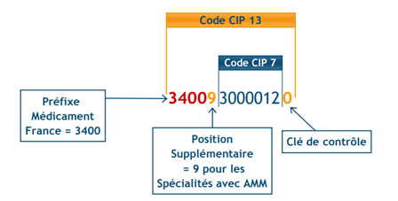

# Cibler selon les médicaments
<!-- SPDX-License-Identifier: MPL-2.0 -->

## Définition

Un médicament est répertorié par un code CIP sur 7 ou 13 caractères. 
Chaque médicament est répertorié par classe. Cette classe s’appelle classe ATC. 
Elle possède différentes formes (ATC3, ATC5, ATC7) correspondant à une catégorie de médicament plus ou moins affinée permettant de regrouper les médicaments correspondant aux organes (ou systèmes d'organes) cibles, et aux propriétés thérapeutiques, pharmacologiques et chimiques des différents produits.
Le CIP 13 commence toujours par 3400. 
Lorsqu’un CIP 7 existait, il était alors transformé en CIP 13 de la manière suivante :



Le calendrier de  mise en place du CIP13 est le suivant :


Le code CIP13 peut donc être présent dans les bases dès 2007, alors que le CIP7 est présent au moins jusque 2014. 
Une période de transition, où les 2 codes se chevauchent existe donc.

## Cibler des patients sur un code CIP

**Principe :** Sortir une liste de patients qui ont consommé un médicament précis.  

**Table(s) concernée(s) :** [ER_PRS_F](../tables/DCIR/ER_PRS_F.md), [ER_PHA_F](../tables/DCIR/ER_PHA_F.md), table contenant le(s) code(s) CIP concernés par l’extraction (appelée TAB_MED ici, contenant le code CIP13 sous sa forme standard ou le CIP07 sous la forme 000000XXXXXXX dans une variable nommée COD_MED, table située sous ORAUSER). 
Dans l’exemple suivant, l’extraction se fera sur l’année 2017.

**Il faut bien faire attention sur le lien entre le code CIP de la table TAB_MED et celui de ER_PHA_F (CIP sur 7 ou 13 caractères).**


``` sql
proc sql;
%connectora;
create table liste_patients as select * from connection to oracle
(select distinct a.BEN_NIR_PSA
from ER_PRS_F a,
ER_PHA_F b,
TAB_MED c
where a.FLX_DIS_DTD = b.FLX_DIS_DTD
and a.FLX_TRT_DTD = b.FLX_TRT_DTD
and a.FLX_EMT_TYP = b.FLX_EMT_TYP
and a.FLX_EMT_NUM = b.FLX_EMT_NUM
and a.FLX_EMT_ORD = b.FLX_EMT_ORD
and a.ORG_CLE_NUM = b.ORG_CLE_NUM
and a.DCT_ORD_NUM = b.DCT_ORD_NUM
and a.PRS_ORD_NUM = b.PRS_ORD_NUM
and a.REM_TYP_AFF = b.REM_TYP_AFF
and trim(c.COD_MED) = trim(b.PHA_PRS_C13) (SI CIP SUR 13 caractères)
and trim(c.COD_MED) = trim(b.PHA_PRS_IDE) (SI CIP SUR 7 caractères)
and a.EXE_SOI_DTD between to_date('01012017','ddmmyyyy') and to_date('31122017','ddmmyyyy')
);
disconnect from oracle;
quit;

```

## Cibler des patients sur une classe ATC

**Principe :** Sortir une liste de patients qui ont consommé au moins un médicament d’une classe ATC5 précise. 
Il existe deux méthodes pour obtenir le résultat attendu. 
La première consiste à sélectionner les médicaments concernés par le ciblage directement dans IR_PHA_R, mettre ces médicaments (via les codes CIP) dans une table puis utiliser la technique du point 1. 
La deuxième méthode consiste à cibler directement sur la classe ATC. 
Il faudra le faire en plusieurs étapes (CIP07, CIP13).  

**Table(s) concernée(s) :** [ER_PRS_F](../tables/DCIR/ER_PRS_F.md), [ER_PHA_F](../tables/DCIR/ER_PHA_F.md), [IR_PHA_R](../tables/DCIR/IR_PHA_R.md)

*  METHODE 1
``` sql
proc sql;
%connectora;
create table TAB_CIP as select * from connection to oracle
(select distinct a.*
from IR_PHA_R a  where substr(a.PHA_ATC_C07,1,5)=’XXXXX’ /*A PARAMETRER*/
);
disconnect from oracle;
quit;

proc delete data=orauser.TAB_CIP;
run;

data orauser.TAB_CIP;
set TAB_CIP;
run;

---> Programme du point 2 avec nom de la variable COD_CIP
```

*  METHODE 2

``` sql
proc sql;
%connectora;
create table liste_patients as select * from connection to oracle
(select distinct a.BEN_NIR_PSA
from ER_PRS_F a,
ER_PHA_F b,
IR_PHA_R d
where a.FLX_DIS_DTD = b.FLX_DIS_DTD
and a.FLX_TRT_DTD = b.FLX_TRT_DTD
and a.FLX_EMT_TYP = b.FLX_EMT_TYP
and a.FLX_EMT_NUM = b.FLX_EMT_NUM
and a.FLX_EMT_ORD = b.FLX_EMT_ORD
and a.ORG_CLE_NUM = b.ORG_CLE_NUM
and a.DCT_ORD_NUM = b.DCT_ORD_NUM
and a.PRS_ORD_NUM = b.PRS_ORD_NUM
and a.REM_TYP_AFF = b.REM_TYP_AFF
/*Choisir un lien sur CIP13 ou CIP7, mettre le 2e en commentaire*/
and trim(d.PHA_CIP_C13) = trim(b.PHA_PRS_C13) (SI CIP SUR 13 caractères)
and trim(d.PHA_PRS_IDE) = trim(b.PHA_PRS_IDE) (SI CIP SUR 7 caractères)
and a.EXE_SOI_DTD between to_date('01012017','ddmmyyyy') and to_date('31122017','ddmmyyyy')
and substr(d.PHA_ATC_C07,1,5)=’XXXXX’ /*A PARAMETRER*/
);
disconnect from oracle;
quit;

```

## Récapitulatif


## Références

::: tip Crédits
Cette fiche provient d'un [document publié](../files/Cnam/2019-10_Cnam_Programmes-SAS-Medicaments_MPL-2.0.doc) créé par la Cnam en octobre 2019.
:::
