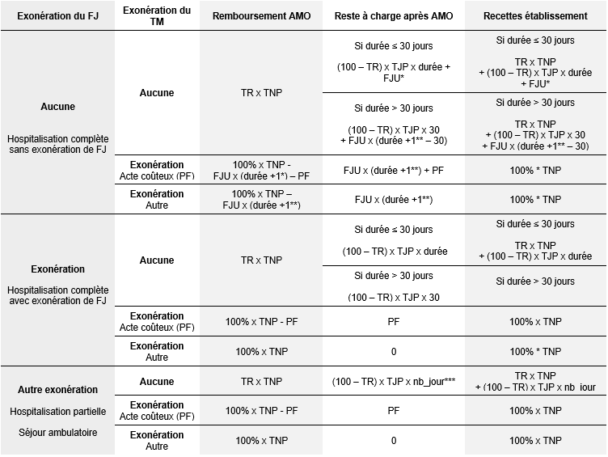

# Reste à charge après AMO en établissements de santé publics

Cette fiche explique comment calculer le montant du reste à charge pour un séjour en établissement de santé public à partir du PMSI.

Les explications sont déclinées par spécialité hospitalière :

* [MCO](../glossaire/MCO.md) : médecine chirurgie obstétrique et odontologie
* [SSR](../glossaire/MCO.md) : soins de suite et de réadaptation
* [HAD](../glossaire/HAD.md) : hospitalisation à domicile

Nous ne traitons pas ici le calcul du reste à charge en psychiatrie pour lequel nous ne disposons pas de suffisamment d'information.  

L'ensemble des dépenses associées à un séjour en établissement public comprend :

* le **montant appelé "AMO"**, qui comprend la part prise en charge par l'assurance maladie obligatoire (AMO) et les parts supplémentaires prises en charge par le public (CMU-C, Aide Médicale d'Etat, soins urgents, détenus, etc.)
* le **reste à charge après AMO** (payé par le patient et / ou son organisme complémentaire)

Pour plus d'informations sur ce montant AMO, se référer à la fiche sur "les dépenses des établissements de santé publics dans le PMSI".

::: warning ATTENTION
Nous partageons l’information que nous sommes parvenus à recueillir sur le calcul du reste à charge.  
Celle-ci n’est pas exhaustive et doit être traitée avec précaution.  
:::

## Composantes et modalités de calcul du reste à charge 

Généralement, le reste à charge hospitalier est composé :
- d'un **ticket modérateur** ou d'une **participation forfaitaire**
- d'un **forfait hospitalier**

Avec d'éventuelles exonérations en fonction du profil des patients, du type d’actes et de séjours, de la durée de séjour, etc.  

Nous allons détailler ces différentes composantes et leurs règles d'imputation, afin de calculer le reste à charge du patient après AMO. 

### Les différents composants du reste à charge

#### Le forfait journalier et le forfait journalier de sortie 

Le **forfait journalier hospitalier** représente la participation financière du patient aux frais d'hébergement et d'entretien entraînés par son hospitalisation. 

Il est dû pour chaque journée d'hospitalisation, pour tout séjour supérieur à 24 heures dans un établissement hospitalier public ou privé, y compris le jour de sortie.  
Il est également dû en cas de séjour inférieur à 24 heures, si celui-ci est à cheval sur 2 journées calendaires.  
Dans ce cas-là, on compte le jour d'entrée et le jour de sortie, soit deux jours (règle de "présence à minuit" même si la présence réelle est inférieure à 24 heures).

Le montant du forfait hospitalier est fixé par arrêté ministériel.

Depuis le [1er janvier 2018](https://www.legifrance.gouv.fr/affichTexte.do?cidTexte=JORFTEXT000036251896&categorieLien=id), il est de :
- 20 €  par jour en hôpital ou en clinique (18 € avant 2018)
- 15 € par jour dans le service psychiatrique d'un établissement de santé (13,5 € avant 2018)

Le forfait hospitalier **n'est pas remboursé par l'assurance maladie**. 
Il peut éventuellement être pris en charge par les organismes complémentaires en santé.

Il existe des [motifs d'exonération](https://www.ameli.fr/assure/remboursements/reste-charge/forfait-hospitalier) pour le forfait journalier : 
- femme enceinte hospitalisée pendant les quatre derniers mois de grossesse, ou pour l'accouchement ou pendant les 12 jours après l'accouchement
- bénéficiaire de la couverture maladie universelle (CMU) complémentaire ou de l'aide médicale d'Etat
- bénéficiaire de l'aide au paiement d'une complémentaire santé (ACS), couvert par un des contrats de complémentaire santé sélectionnés au titre de l'ACS
- assuré dont l'enfant est hospitalisé dans les 30 jours suivant sa naissance
- hospitalisation due à un accident du travail ou à une maladie professionnelle (lorsque l'hospitalisation est imputable à l'accident du travail ou à la maladie professionnelle)
- hospitalisation à domicile
- assuré dont l'enfant handicapé de moins de 20 ans est hébergé dans un établissement d'éducation spéciale ou professionnelle
- bénéficiaire du régime d'Alsace-Moselle
- titulaire d'une pension militaire
- victime d'un acte de terrorisme et bénéficiaire d'une prise en charge intégrale pour les soins en rapport avec cet évènement si possesseur d'une attestation en cours de validité.

Il existe également des cas où le forfait journalier (FJ) n'est pas applicable :  
- Séances sauf radiothérapie
- Explorations nocturnes et apparentées (GHM 23K02Z), IVG (GHM 14Z08Z)
- Radiothérapie des nouveau-nés, prélèvements d'organe, forfaits innovation 

#### Le ticket modérateur

Dans le cas général, l'assurance maladie rembourse 80 % du montant de la base de remboursement des frais d'hospitalisation, calculée à partir des **tarifs nationaux de prestations**.  
La part à la charge du patient représente, elle, 20 % du montant de la base de remboursement, calculée à partir des **tarifs journaliers de prestations** : c'est le ticket modérateur.  
Le taux de remboursement varie généralement entre 80 et 100 % du montant de la base de remboursement calculée à partir des tarifs nationaux de prestations en fonction du profil du patient, du type d'acte et de la nature de l'assurance.

Dans le secteur public, on distingue deux bases de remboursement :  
- **La base de remboursement de l'assurance maladie (AM)**  
Depuis la mise en place de la T2A, chaque séjour se voit attribuer un tarif déterminant le montant de remboursement par l'AM.  
On parle de groupe homogène de séjour ([GHS](../glossaire/GHS.html) en MCO, de groupe homogène de tarif ([GHT](../glossaire/GHT.html)) en HAD et le groupe médico-économique ([GMT](../glossaire/GMT.html)) en SSR.    

- **La base de remboursement de l'établissement**  
Elle est calculée à partir du tarif journalier de prestation propre à chaque catégorie tarifaire (TJP), multiplié par la durée de séjour (cette durée ne pouvant dépasser 30 jours). 
Le TJP est défini à l’échelle d’un établissement par arrêté de l’agence régionale de santé (ARS) et doit être représentatif du coût réel du séjour. 
Il repose sur une estimation des charges d'exploitations et de l'activité prévisionnelles de l'établissement, en fonction des soins effectués. Les charges prises en compte sont : les dépenses de personnel, les dépenses médicales, les dépenses hôtelières, les frais de gestion et autres charges d’exploitation qui ne sont pas couvertes par des ressources propres. 
La base de remboursement calculée par l'établissement est généralement plus élevée que celle de l'assurance maladie.

*Point réglementaire :*  
Lors de la mise en œuvre de la T2A dans les établissements de santé, un dispositif transitoire a été mis en place permettant aux hôpitaux publics et aux établissements privés à but non lucratif de continuer à calculer le ticket modérateur sur la base des tarifs journaliers de prestations (TJP), initialement définis à partir du coût de revient prévisionnel des différentes catégories de soins de chaque établissement et non sur les tarifs nationaux de prestations (GHS, GHT, GMT).   
L'[article 26 du PLFSS de 2020](http://www.assemblee-nationale.fr/15/projets/pl2296.asp) vise à mettre fin à cette situation transitoire, qui à terme aurait conduit à opérer d’importants transferts de recettes entre secteurs, entre établissements, et entre assurance maladie obligatoire et complémentaire :  
- D’une part, en pérennisant le système du calcul du ticket modérateur sur la base des tarifs journaliers de prestations pour les établissements concernés ;
- D’autre part en le rationalisant en introduisant une nomenclature simplifiée et nationale des TJP, afin de s’assurer que ceux-ci reflètent davantage le coût effectif du service.

Cette réforme entrera progressivement en vigueur à partir de 2021.

#### Imputabilité du FJ et du TM : cas particuliers 

Le forfait journalier hospitalier ne se cumule pas avec le ticket modérateur.
- Le reste à charge d’un assuré de droit commun est égal **au montant le plus élevé** entre le ticket modérateur et le forfait journalier hospitalier.   
- Le forfait dû pour le jour de sortie est toujours facturé en complément sauf en cas de décès ou de transfert. 
- Pour le séjour d'un assuré de droit commun de plus de 30 jours, le TM n'est facturé que pour les 30 premiers jours. Au-delà, le patient ne paie que le FJ.  

Cette durée de 30 jours se cumule entre séjours contigus, y compris entre différentes spécialités hospitalières.   

*Exemple :* si un patient reste 10 jours en MCO puis 25 jours en SSR, il sera exonéra de ticket modérateur 30 jours après son admission à l'hôpital. Ainsi, il ne paiera plus que le forfait journalier à partir du 21ème jour d'hospitalisation en SSR.

#### La participation forfaitaire des assurés pour les actes lourds 

Un ticket modérateur forfaitaire sur les actes lourds a été instauré par la [Loi de Financement de la Sécurité Sociale pour 2006](https://www.legifrance.gouv.fr/affichTexte.do?cidTexte=JORFTEXT000000815414) 
et le [Décret N° 2006-707 du 19 juin 2006](https://www.legifrance.gouv.fr/affichTexte.do?cidTexte=JORFTEXT000000792524) paru au JO du 20 juin 2006.  
Cette mesure prévoit que les patients, jusqu’ici exonérés en raison de la valeur des actes réalisés, acquittent une participation minimale sur les actes médicaux dont le montant est supérieur ou égal à 120 euros ou sur les actes affectés d’un coefficient supérieur ou égal à 60 euros.  
Il s'agit de la "participation assuré".

Le ticket modérateur est dans ce cas remplacé par cette participation forfaitaire.   
Sa valeur dépend de l'année dans laquelle on se situe, elle est fixée par décret.  
Elle est passée de 18 à 24 euros au [1er janvier 2019](https://www.legifrance.gouv.fr/affichTexte.do?cidTexte=JORFTEXT000037864770&categorieLien=id).

Les cas particuliers sont les [suivants](https://www.ameli.fr/assure/remboursements/reste-charge/forfait-24-euros) :
- Lorsque plusieurs actes sont effectués par le même praticien au cours d'une même consultation, leurs tarifs et/ou leurs coefficients peuvent se cumuler. 
La participation forfaitaire s'appliquera dès lors que le tarif résultant de ce cumul est supérieur ou égal à 120 euros ou que le coefficient résultant de ce cumul est supérieur ou égal à 60.
- Lorsque plusieurs actes d'un tarif supérieur ou égal à 120 euros, ou ayant un coefficient supérieur ou égal à 60, sont effectués par le même praticien au
cours d'une même consultation, la participation forfaitaire  ne s'applique qu'une seule fois.
- En cas d'hospitalisation (à l'hôpital ou en clinique), lorsque un ou plusieurs actes d'un tarif supérieur ou égal à 120 euros, ou ayant un coefficient supérieur ou 
égal à 60, sont effectués pendant le séjour, la participation forfaitaire ne s'applique qu'une seule fois par séjour, pour l'ensemble des frais d'hospitalisation.

*Dans les données* : dès lors qu'il y a un acte coûteux, il y a exonération du ticket modérateur qui est remplacé par une participation forfaitaire et l'établissement reçoit 100 % du tarif national de prestation de la part de l'assurance maladie.    
Le patient s'acquitte de la participation forfaitaire et du forfait journalier (sauf cas particuliers avec exonération).  

#### Les actes pris en charge à 100 %

Certains actes et certains frais ne rentrent pas dans le champ d'application de la participation forfaitaire et sont pris en charge à 100 %.  
Ils font donc l'objet d'une exonération de ticket modérateur et de participation forfaitaire.

Il s'agit notamment :
- des actes de radiodiagnostic, d'imagerie par résonance magnétique, de scanographie, de scintigraphie ou de tomographie à émission de positons, d'un tarif supérieur ou égal à 120 euros, ou ayant un coefficient supérieur ou égal à 60
- des frais de transport d'urgence, en cas d'hospitalisation au cours de laquelle est effectué un acte au tarif supérieur ou égal à 120 euros, ou ayant un coefficient supérieur ou égal à 60, ainsi que les frais de transport en cas d'hospitalisation consécutive et en lien direct avec la première hospitalisation au cours de laquelle a été effectuée un acte au tarif supérieur ou égal à 120 euros, ou ayant un coefficient supérieur ou égal à 60
- des frais de transport entre les deux établissements ou, en cas d'hospitalisation à domicile, entre l'établissement et le domicile
- des frais d'hospitalisation à partir du 31e jour d'hospitalisation consécutif.

Les personnes exonérées sont [les suivantes](https://www.ameli.fr/assure/remboursements/reste-charge/forfait-24-euros): 
- les personnes titulaires d'une pension d'invalidité ou d'une pension de vieillesse substituée à une pension d'invalidité
- les personnes titulaires d'une pension de réversion, atteintes d'une invalidité permanente et qui remplissent les conditions d'ouverture de droit à une pension d'invalidité
- les personnes titulaires d'une pension d'invalidité et âgées de plus de 60 ans qui continuent d'exercer une activité professionnelle et ont refusé la transformation de leur pension d'invalidité en pension vieillesse
- les personnes titulaires d'une pension militaire (malades ou blessés de guerre)
- les personnes titulaires d'une allocation de solidarité aux personnes âgées
- les personnes titulaires d'une rente accident du travail - maladie professionnelle d'un taux égal ou supérieur à 66,66 % et leurs ayants droit
- les personnes prises en charge au titre d'un accident du travail ou d'une maladie professionnelle, pour les actes, soins et traitements en rapport avec l'accident du travail ou la maladie professionnelle
- les femmes enceintes à partir du sixième mois de grossesse jusqu'à 12 jours après leur accouchement
- les nouveau-nés, pour les frais d'hospitalisation ou les soins en établissement de santé pendant les 30 jours qui suivent leur naissance
- les personnes hospitalisées, pour les frais d'hospitalisation à partir du 31e jour d'hospitalisation consécutif ;
- les enfants et adolescents mineurs victimes de sévices sexuels, pour les actes, soins et traitements consécutifs aux sévices sexuels dont ils ont été victimes
- les personnes prises en charge au titre d'une affection de longue durée exonérante, pour les actes, soins et traitements en rapport avec cette affection et qui sont mentionnés sur le protocole de soins
- les personnes prises en charge au titre du diagnostic et du traitement de la stérilité, pour les actes, soins et traitements nécessaires, y compris l'insémination artificielle.

### Résumé des règles de calcul de la participation du patient 

Nous commençons par décrire le cas général avant d'entrer dans le détail pour les PMSI MCO, SSR et HAD.  

Les principales règles de calcul du RAC figurent dans le tableau ci-dessous.    
  

Voici la signification des sigles utilisés dans le schéma :  
FJU : forfait journalier unitaire (par journée d’hospitalisation)  
nb_jour : nombre de jours de présence  
PF : participation forfaitaire  
TNP : tarif national de prestation (*i.e.* GHS en MCO, GMT en SSR et GHT en HAD)  
TR : taux de remboursement (%)  
  

( * ) facturation du FJU pour le jour de sortie si le mode de sortie est autre que transfert ou décès, 0 sinon  
( ** ) « durée + 1 » si le mode de sortie est autre que transfert ou décès, « durée » sinon  
( *** ) en cas d’hospitalisation à temps partiel ou de séjour en ambulatoire, on ne parle plus de durée mais de nombre de jours de présence  

*ATTENTION > dans ce tableau, n’est pas représenté le cas (a priori très rare) où le forfait journalier des 30 premiers jours est supérieur au ticket modérateur ((100 – TR) x TJP x durée < FJU x durée). Dans ce cas-là, le patient ne s’acquitte pas du ticket modérateur mais du forfait journalier.*

*Note >*  
Le tableau ci-dessus couvre le cas général, à partir de l'exemple du MCO, mais n'est pas exhaustif.  Nous reviendrons sur les particularités par PMSI dans le reste de la fiche.
En voici les principales différences :  
- Il n'y a pas de forfait journalier en HAD (on est donc systématiquement dans le cas de figure avec exonération de FJ)
- En MCO, on appelle "hospitalisation partielle" un séjour de moins de 24 heures sans nuitée. Si un même patient revient plusieurs fois à la journée, il y aura autant de séjours que de journées d'hospitalisation.  
- En SSR, on appelle hospitalisation partielle un séjour sans nuitée, sans limite de durée totale. 
  Il faudra donc distinguer les séjours en hospitalisation complète et partielle. 
  À noter qu'il n'y a qu'un type d'hospitalisation (complète / partielle) par séjour. Tout changement de type d'hospitalisation donnera lieu à un nouveau séjour. 
- Lors de séjours en hospitalisation partielle en SSR, il n'y a pas de FJ facturé. Le temps passé à l'hôpital est indiqué par le nombre de jours de présence.    
- Lors de séjours en hospitalisation complète en SSR, le patient peut bénéficier de permissions. Ainsi, pour connaître le temps passé à l'hôpital, il ne faut pas compter la durée de séjour (*i.e.* le nombre de jours entre le début et la fin du séjour), mais le nombre de jours de présence.    

**[A CREUSER]** : Est-ce que la règle d’exonération du TM au-delà de 30 jours s’applique uniquement en cas d’hospitalisation complète ? 

### Catégories de séjours pour le calcul du reste à charge (RAC)

- Les **séjours avec un ticket modérateur** (TM) sont identifiés à partir du motif d’exonération du TM, du taux de remboursement et éventuellement de la nature du séjour (AME, SU, détenu). 

- Les **séjours avec acte coûteux** sont identifiés à partir du motif d’exonération du TM, du taux de remboursement et de la facturation ou non de la participation forfaitaire.

- Les **séjours exonérés du ticket modérateur et du forfait journalier** sont identifiés à partir du motif d’exonération du FJ et éventuellement de la nature du séjour (AME, SU, détenu). 

- En complément, le **type d'hospitalisation** (complète / partielle / ambulatoire) et la **durée de séjour** permettent de multiplier les cas au sein de chaque catégorie de séjour.

## En pratique : calcul des restes à charge hospitaliers à partir du SNDS

Les données nous permettent de retracer le reste à charge (RAC) facturable mais pas le RAC effectivement facturé par l'établissement.  
L'ATIH conseille en effet de calculer le RAC facturable.

### MCO

Nous décrivons ci-dessous les modalités de calcul du reste à charge à partir des données du PMSI MCO de 2016.  

#### Les tables et variables mobilisées

Pour plus d'informations sur les tables et variables utilisées, se référer à la [fiche sur les dépenses](../fiches/depense_hopital_public.md).

La clef de chaînage entre les tables mentionnées ci-dessous est le couple (`ETA_NUM`, `RSA_NUM`) où `ETA_NUM` est le numéro FINESS de l'établissement et `RSA_NUM` est le numéro séquentiel du séjour. 

Dans la **table de chaînage patients** `T_MCOaaC`, nous considérons les variables :
- `NIR_ANO_17` : identifiant du bénéficiaire 
- `EXE_SOI_DTD` et `EXE_SOI_DTF` qui indiquent les dates d'entrée et de sortie à l'hôpital respectivement  

Dans la table `T_MCOaaVALO`, qui est la **table de valorisation des séjours** (données retraitées par l'ATIH), nous considérons les variables:

- `MNT_18` : montant de la participation forfaitaire de 18 euros (en 2016) pour les actes exonérants
À noter qu’il s’agit d’une variable renseignée par l’établissement (elle n’est pas recalculée).
- `MNT_FJ2` : montant du forfait journalier (FJ). 
La variable a été corrigée par l’ATIH qui a notamment forcé à zéro le FJ dans le cas où il n’est pas applicable 
(*cf.* manuel d'utilisation du logiciel VisualValoSej)
- `MNT_GHS_AM` : valorisation AM du [GHS](../glossaire/GHS.html)  
- `MNT_TOT_AM` : coût pour l’assurance maladie obligatoire (GHS + suppléments journaliers en sus du GHS)
  Ce montant ne tient cependant pas compte du paiement des médicaments et dispositifs médicaux de la liste en sus.  Pour retrouver ces montants, se référer à la fiche sur "les dépenses des établissements de santé publics dans le PMSI".  

- `TAUX2` : taux de remboursement du séjour 
- `VALO` : valorisation du séjour, prenant les valeurs suivantes :
  * 0 : si le séjour n’est pas valorisé 
  * 1 : si le séjour est valorisé 
  * 2 : dans le cas d’un séjour non valorisé avec prélèvement d’organes. Dans ce cas, seuls les prélèvements d’organe sont valorisés pour le séjour. 
  * 3 : si le séjour est en AME (Aide Médicale d'Etat)
  * 4 : si le séjour est en Soins urgents (SU)
  * 5 : si le patient est un détenu

Dans la table `T_MCOaaSTC`, qui est la **table de prise en charge des séjours dans le public** (données brutes renseignées par l'établissement) :
- `REM_BAS_MNT` : coût du séjour calculé par l'établissement (sert de base de remboursement pour le ticket modérateur) 
- `TOT_MNT_AM` : coût du séjour facturé à l'AM selon les règles de calcul de l'établissement (différent du montant remboursé par l'AM qui sera calculé sur la base du GHS, *cf.* [fiche sur les dépenses de santé](../fiches/depense_hopital_public.md)) 
- `FAC_MNT_TM` : montant à facturer au titre du ticket modérateur (TM)
- `FAC_MNT_FJ` : montant à facturer au titre du forfait journalier (FJ)
- `NAT_ASS` : nature d’assurance, qui prend les valeurs suivantes (d'après la norme B2) : 
  - 10 : maladie
  - 13 : maladie régime local (Alsace – Moselle)
  - 30 : maternité
  - 41 : accident du travail
  - 90 : prévention maladie
  - XX : non applicable ou sans objet  
- `EXO_TM` : code justification d’exonération du ticket modérateur qui prend les valeurs suivantes (d'après l'annexe 9 du cahier des charges de la norme B2):
  - 0 : pas d’exonération
  - 1 : soins en rapport avec un K ou un KC >= 50 (NGAP) (à compter du 01/01/2004, les actes en rapport avec un acte "K ou Z >= 50" non présents sur la facture ne sont plus exonérés)
  - 2 : soins relatifs à un séjour >30 jours (réservé à un établissement)
  - 3 : soins particuliers exonérés (traitement de la stérilité, soins aux prématurés, actes exonérants, soins en établissements des nourrissons dans les 30 premiers jours, dépistage du VIH)
  - 4 : soins conformes au protocole ALD
  - 5 : assuré ou bénéficiaire exonéré (régime exonérant)
  - 6 : réservé SESAm-VITALE pour les régimes spéciaux SNCF
  - 7 : soins dispensés en risque maladie et exonérés dans le cadre d'un dispositif de prévention
  - 8 : réservé régime général
  - 9 : FSV ou FSI (ancien FNS)
  - C : soins exonérés en codage CCAM du fait de la nature de l'acte, du dépassement du seuil
  - X : non applicable ou manquant
- `FJ_COD_PEC` : code de prise en charge du forfait journalier, prenant les valeurs suivantes (d'après l'annexe 16 du cahier des charges de la norme B2) :
  * A : si à la charge de l’assuré
  * X : si pas d’information sur le forfait journalier
  * R : si à la charge du régime obligatoire
  * L : si à la charge du régime Alsace-Moselle
- `FAC_18E` : facturation (1) ou non (0) de la participation forfaitaire de 18 € (2016)
- `REM_TAU`: taux de remboursement du séjour

Dans la table `T_MCOaaB`, qui est la **table de description du séjour**, nous considérons la variable:
- `ENT_MOD` : mode d'entrée dans le champ PMSI MCO 
- `SOR_MOD` : mode de sortie du champ PMSI MCO qui peut prendre les valeurs suivantes :
  * -1  Valeur inconnue
  * -2  Sans objet
  * 0   Transfert pour ou après réalisation d'un acte
  * 6   Mutation (transfert au sein du même établissement vs entre établissements).
  * 7   Transfert normal
  * 8   Domicile
  * 9   Décès
- `GRG_GHM`: groupe homogène de malades attribué au séjour
- `TYP_GEN_RSA` : type de génération automatique du résumé de sortie anonyme

#### Filtres à ajouter

Les filtres à poser pour extraire les informations sur les dépenses et le reste à 
charge lors de séjours en établissments publics sont détaillées dans la [fiche sur les dépenses à l'hôpital public](../fiches/depense_hopital_public.md)) .

#### Méthodologie d'exploitation du PMSI MCO pour le calcul du reste à charge

##### Nettoyage des taux de remboursement

Deux variables renseignent le taux de remboursement :
- Variable `REM_TAU` (table `T_MCOaaSTC`) fournie par l'établissement
- Variable `TAUX2` (table `T_MCOAaaVALO`), qui est la version de `REM_TAU` corrigée par l'ATIH

Dans les cas où la variable `TAUX2` est manquante, il est possible de le reconstruire comme indiqué dans la documentation de l'ATIH à partir du code d'exonération du TM (`EXO_TM`) et de la nature de l'assurance (`NAT_ASS`).  
La variable `tx_ATIH` peut être calculée comme suit :  
  - Si `EXO_TM` est dans [0,2] et `NAT_ASS` est dans [10,13] alors `tx_ATIH` prend la valeur de 80%
  - Si `EXO_TM` est dans [0,2] et `NAT_ASS` n'est pas dans [10,13] alors `tx_ATIH` prend la valeur de 100%
  - Si `EXO_TM` est dans [9] et `NAT_ASS` est dans [10] alors `tx_ATIH` prend la valeur de 90%
  - Si `EXO_TM` ou `NAT_ASS` est manquant `tx_ATIH` est manquant
  - Dans les autres cas `tx_ATIH` prend la valeur de 100%
L'ATIH suggère aussi de supprimer les lignes pour lesquelles `tx_ATIH` ne peut être calculé du fait de valeurs manquantes pour `EXO_TM` ou `NAT_ASS`.
*Suggestion :* 

Nous suggérons la création de la variable corrigée `TAUX_C` comme suit :

1. `TAUX_C` est égal à `TAUX2` (sauf si manquant ou nul hors prélèvement d’organe)
2. Si prélèvement d’organe, attribuer à `TAUX_C` la valeur de 0 % (code VALO=2)  
3. Si `TAUX2` manquant ou nul (hors prélèvement d’organe) : `TAUX_C` est égal à `tx_ATIH`
4. Si `TAUX2` et `tx_ATIH` sont manquant, supprimer la ligne

##### Nettoyage du forfait journalier

Deux variables renseignent le montant du forfait journalier :
- Variable `FAC_MNT_FJ` (table `T_MCOaaSTC`)
- Variable `MNT_FJ2` (table `T_MCOaaVALO`), qui est la version de `FAC_MNT_FJ` corrigée par l'ATIH

*Suggestion :* 
Il est également possible de recalculer le montant du forfait journalier à partir de la durée de séjour (variable `duree_sej` calculée à partir des dates d'entrée et de sortie), du code d'exonération du forfait journalier (`FJ_COD_PEC`), des frais d'hébergement par journée d’hospitalisation (18€ en 2016) et du mode de sortie (`SOR_MOD`), comme suit : 
- `FJ_C`= 0 en cas de séjour en ambulatoire (entrée / sortie le même jour)
- `FJ_C`= 0 en cas d'exonération du forfait journalier (*i.e.* si `FJ_COD_PEC`="R" et si les conditions d'exonération listées dans la partie intitulée "Le forfait journalier et le forfait journalier de sortie" sont remplies)
- `FJ_C`= 18 * `duree_sej`, si transfert ou décès 
- `FJ_C` = 18 * (`duree_sej` + 1), sinon

On peut également créer une variable corrigée appelée `FJ_C2` qui prend la valeur du forfait journalier effectivement facturé : 
- `FJ_C2` = 0 € si séjour en ambulatoire ou si exonération du FJ
- `FJ_C2` = 18 € (= valeur du FJ du jour de sortie en 2016) si séjour sans exonération de TM ni de FJ, de moins de 30 jours, sans transfert ni décès
- `FJ_C2` = 0 € si séjour sans exonération de TM ni de FJ, de moins de 30 jours, avec transfert ou décès
- `FJ_C2` = `FJ_C` - 30*18 (= valeur du FJ au-delà du 30ème jour d'hospitalisation) si séjour sans exonération de TM ni de FJ, de plus de 30 jours, sans transfert ni décès 
- `FJ_C2` = `FJ_C` - 29*18 (= valeur du FJ au-delà du 30ème jour d'hospitalisation + FJ du jour de sortie) si séjour sans exonération de TM ni de FJ, de plus de 30 jours, avec transfert ou décès 
- `FJ_C2` = `FJ_C` sinon (=valeur du FJ pour l'ensemble du séjour)

*ATTENTION > en cas de séjours contigüs, la limite des 30 jours s'applique à la durée d'hospitalisation cumulée. Pour plus de rigueur, il faudrait chaîner les séjours pour calculer la durée de séjour, non pas pas PMSI, mais depuis l'entrée à l'hôpital.*

##### Nettoyage de la participation forfaitaire

Il existe deux façons de renseigner la facturation ou non de la participation forfaitaire (qui était encore de 18 € en 2016) :
- Variable `FAC_18E` (table `T_MCOaaSTC`), renseignée par l'établissement
- Variable `MNT_18` (table `T_MCOaaVALO`), censée être strictement identique à `FAC_18E` mais multipliée par 18 

*Suggestion :* 
- Privilégier `FAC_18E` qui a moins de valeurs manquantes.
- Dans les cas où la participation forfaitaire s'applique, remplacer les taux de remboursement de 80 ou 90% (0.2% des cas) par 100% (on considère que les taux <100% sont des erreurs)
On attribue donc la valeur de 100% au taux de remboursement corrigé (`TAUX_C`).
- Penser à remplacer les valeurs manquantes, s'il y en a, pas des 0.

##### Autres valeurs manquantes 

Pour faciliter le calcul du RAC, penser à remplacer d'éventuelles valeurs manquantes de `FAC_MNT_TM` par des 0.

##### Calcul du RAC

On utilise les variables suivantes :  
- `TAUX_C`: taux de remboursement du séjour (corrigé)
- `FJ_C`: montant du forfait journalier pour l'ensemble du séjour (corrigé)
- `FJ_C2`: montant du forfait journalier facturé (en fonction de la durée de séjour, de l'imputation du FJ sur le TM)
- `FAC_18E`: montant à facturer au titre de la participation forfaitaire de 18€ (table `T_MCOAAstc`)
- `FAC_MNT_TM`: montant à facturer au titre du ticket modérateur (table `T_MCOAAstc`)
- `FJ_COD_PEC`: code de prise en charge du forfait journalier (table `T_MCOAAstc`)
- `VALO` : valorisation du séjour (table `T_MCOAAstc`)

Calcul de la variable `rac` dans les différents cas de figure :
1. `rac` = 0 si `VALO` %in% c(3,4,5) (bénéficiaires de l'AME, SU et détenus)  
2. `rac` = 0 si `FJ_COD_PEC`==R & `TAUX_C`==100 (exonération de TM et de FJ)
3. `rac` = `FAC_18`*18  + `FJ_C2` si `FJ_COD_PEC`!=R & `TAUX_C`==100 (exonération de TM mais pas de FJ)
4. `rac` = `FAC_MNT_TM` si `FJ_COD_PEC`==R & `TAUX_C`!=100 (exonération de FJ mais pas de TM)
5. `rac` = `FAC_MNT_TM`+`FJ_C2` si `FJ_COD_PEC`!=R & `TAUX_C`!=100 & `FAC_MNT_TM` > `FJ_C` (aucune exonération, TM>FJ)
6. `rac` = `FJ_C` si `FJ_COD_PEC`!=R & `TAUX_C`!=100 & `FAC_MNT_TM` < `FJ_C` (aucune exonération, FJ>TM)

Le coût total du séjour correspond au montant pris en charge par l’assurance maladie (variable `MNT_TOT_AM` de la table `T_MCOaaVALO`) auquel on ajoute le reste à charge. 

Il est ensuite possible de calculer un reste à charge après AMO **par bénéficiaire** en agrégeant les RAC pour les différents séjours d'un même bénéficiaire (en utilisant le `NIR_ANO_17` de la table `T_MCOaaC`).

### SSR

Nous décrivons ci-dessous les modalités de calcul du reste à charge à partir des données du PMSI SSR de 2016.  

#### Les tables et variables mobilisées

Pour joindre les tables mentionnées ci-dessous, il faut passer par la **table de chaînage patients** (`T_SSRaaC`).  
La clef de chaînage est le couple (`RHA_NUM`, `ETA_NUM`) où `RHA_NUM` est le numéro séquentiel du séjour et `ETA_NUM` le numéro FINESS de l'établissement.   
Dans la table de chaînage patients, on trouve l'identifiant du bénéficiaire `NIR_ANO_17` (*cf.* fiche Identifiant des bénéficiaires pour plus d'informations).

Dans la table `T_SSRaaC`, nous considérons également les variables :
- `EXE_SOI_DTD` et `EXE_SOI_DTF` qui indiquent les dates d'entrée et de sortie à l'hôpital respectivement 

Avant 2017, la table `T_SSRaaValo` de valorisation des séjours (données retraitées par l'ATIH) n'était pas disponible. Pour 2016, nous ne disposons que des données de facturation "brutes" transmises par l'établissement.  

Dans la table `T_SSRaaSTC`, qui est la **table de prise en charge des séjours dans le public** (données brutes renseignées par l'établissement), on s'intéresse aux variables suivantes :  
- `REM_BAS_MNT` : coût du séjour calculé par l'établissement (sert de base de remboursement pour le TM) 
- `TOT_MNT_AM` : coût du séjour facturé à l'AM selon les règles de calcul de l'établissement (différent du montant remboursé par l'AM qui sera calculé sur la base du GHS) 
- `FAC_MNT_TM` : montant à facturer au titre du ticket modérateur (TM)
- `FAC_MNT_FJ` : montant à facturer au titre du forfait journalier (FJ)
- `NAT_ASS` : nature d’assurance (mêmes modalités que décrites pour le MCO) 
- `EXO_TM` : code justification d’exonération du ticket modérateur (mêmes modalités que décrites pour le MCO) 
- `FJ_COD_PEC` : code de prise en charge du forfait journalier (mêmes modalités que décrites pour le MCO) 
- `FAC_18E` : facturation (1) ou non (0) de la participation forfaitaire de 18 € (2016)
- `REM_TAU`: taux de remboursement du séjour

Dans la table `T_SSRaaS`, qui est la **table de synthèse du séjour**, nous considérons les variables :
- `ENT_MOD` : mode d'entrée dans le champ PMSI SSR
- `SOR_MOD` : mode de sortie du champ PMSI SSR (mêmes modalités que décrites pour le MCO) 
- `PRE_JOU_NBR` : nombre de jours de presence
- `SEJ_NBJ` : duree (totale) du sejour

Dans la table `T_SSRaaB`, qui est la **table de description du séjour**, nous considérons les variables :
- `HOS_TYP_UM` : type d'hospitalisation UM, qui permet de séparer les hospitalisations complètes et partielles, sachant qu'il y a un unique mode d'hospitatalisation par séjour. 
Cette variable prend les valeurs suivantes :
  * code 1 : hospitalisation complete 
  * code 2 : hospitalisation partielle de jour 
  * code 3 : hospitalisation partielle de nuit
  * code 4 : hospitalisation partielle de séances  
- `GRG_GME` : groupe médico-économique attribué au séjour

#### Filtres à ajouter

Les filtres sur les séjours en SSR sont les suivants :
- Exclusion des FINESS géographiques (et non juridiques) APHP/APHM/HCL pour éviter les doublons (jusqu'en 2017) (en utilisant la variable `ETA_NUM`)
- Exclusion des séjours en erreur (en utilisant la variable `GRG_GME`)
- Exclusion des prestations inter établissement (en utilisant les variables `ENT_MOD` et `SOR_MOD`)
- Exclusion des séjours hors période d'étude (variables `EXE_SOI_DTD` et `EXE_SOI_DTF`)
- Exclusion des séjours non valorisés (variable `FAC_SEJ_AM` dans `T_SSRaaSTC`)  

Pour plus de détails sur les filtres à appliquer, se référer à la fiche sur les dépenses à l'hôpital public.

#### Méthodologie d'exploitation du PMSI SSR pour le calcul du reste à charge

##### Nettoyage des taux de remboursement

Le taux de remboursement est indiqué par la variable `REM_TAU` (table `T_SSRaaSTC`) fournie par l'établissement (sans avoir été corrigée par l'ATIH).  

Il est possible de reconstruire ce taux comme indiqué dans la documentation de l'ATIH à partir du code d'exonération du TM (`EXO_TM`) et de la nature de l'assurance (`NAT_ASS`).  
La variable `tx_ATIH` peut être calculée comme suit :  
  - Si `EXO_TM` est dans [0,2] et `NAT_ASS` est dans [10,13] alors `tx_ATIH` prend la valeur de 80%
  - Si `EXO_TM` est dans [0,2] et `NAT_ASS` n'est pas dans [10,13] alors `tx_ATIH` prend la valeur de 100%
  - Si `EXO_TM` est dans [9] et `NAT_ASS` est dans [10] alors `tx_ATIH` prend la valeur de 90%
  - Si `EXO_TM` ou `NAT_ASS` est manquant `tx_ATIH` est manquant
  - Dans les autres cas `tx_ATIH` prend la valeur de 100%
L'ATIH suggère aussi de supprimer les lignes pour lesquelles `tx_ATIH` ne peut être calculé du fait de valeurs manquantes pour `EXO_TM` ou `NAT_ASS`.

*Suggestion :* 

Nous suggérons la création de la variable corrigée `TAUX_C` comme suit :
1. `TAUX_C` est égal à `tx_ATIH` (sauf si manquant) 
2. Si `tx_ATIH` manquant et `REM_TAU` non nul ni manquant : `TAUX_C` est égal à `REM_TAU`
3. Si `REM_TAU` nul ou manquant, supprimer la ligne

On peut également attribuer un taux de remboursement corrigé (`TAUX_C`) de 100% dans les cas où la participation forfaitaire s'applique.  

##### Nettoyage du forfait journalier

Le montant du forfait journalier est renseigné par la variable `FAC_MNT_FJ` (table `T_SSRaaSTC`).  

*Suggestion :* 
Il est également possible de recalculer le montant du forfait journalier à partir du nombre de jours de présence (variable `PRE_JOU_NBR`), du type d'hospitalisation (`HOS_TYP_UM`), du code d'exonération du forfait journalier (`FJ_COD_PEC`), des frais d'hébergement par journée d’hospitalisation (18€ en 2016) et du mode de sortie (`SOR_MOD`), comme suit : 
- `FJ_C`= 0 en cas de séjour en ambulatoire (entrée / sortie le même jour)
- `FJ_C`= 0 en cas de séjour en hospitalisation partielle
- `FJ_C`= 0 en cas d'exonération du forfait journalier (*i.e.* si `FJ_COD_PEC`="R" et si les conditions d'exonération listées dans la partie intitulée "Le forfait journalier et le forfait journalier de sortie" sont remplies)
- `FJ_C`= 18 * `PRE_JOU_NBR`-1, si transfert ou décès (on ne compte pas le jour de sortie)
- `FJ_C` = 18 * (`PRE_JOU_NBR`), sinon

On peut également créer une variable corrigée appelée `FJ_C2` qui prend la valeur du forfait journalier effectivement facturé : 
- `FJ_C2` = 0 € si séjour en ambulatoire, en hospitalisation partielle ou si exonération du FJ
- `FJ_C2` = 18 € (= valeur du FJ du jour de sortie en 2016) si séjour sans exonération de TM ni de FJ, avec moins de 30 jours de présence, sans transfert ni décès
- `FJ_C2` = 0 € si séjour sans exonération de TM ni de FJ, avec moins de 30 jours de présence, avec transfert ou décès
- `FJ_C2` = `FJ_C` - 30*18 (= valeur du FJ au-delà du 30ème jour de présence) si séjour sans exonération de TM ni de FJ, avec plus de 30 jours de présence, sans transfert ni décès 
- `FJ_C2` = `FJ_C` - 29*18 (= valeur du FJ au-delà du 30ème jour de présence + FJ du jour de sortie) si séjour sans exonération de TM ni de FJ, avec plus de 30 jours de présence, avec transfert ou décès 
- `FJ_C2` = `FJ_C` sinon (=valeur du FJ pour l'ensemble du séjour)

*ATTENTION > en cas de séjours contigüs, la limite des 30 jours s'applique à la durée d'hospitalisation cumulée. Pour plus de rigueur, il faudrait chaîner les séjours pour calculer la durée de séjour, non pas pas PMSI, mais depuis l'entrée à l'hôpital.*  

##### Autres valeurs manquantes 

Pour faciliter le calcul du RAC, penser à remplacer d'éventuelles valeurs manquantes de `FAC_18E` et `FAC_MNT_TM` par des 0.

##### Calcul du RAC

On utilise les variables suivantes :  
- `TAUX_C`: taux de remboursement du séjour (corrigé)
- `FJ_C`: montant du forfait journalier pour l'ensemble du séjour (corrigé)
- `FJ_C2`: montant du forfait journalier facturé (en fonction de la durée de séjour, de l'imputation du FJ sur le TM)
- `FAC_18E`: montant à facturer au titre de la participation forfaitaire de 18 € (table `T_SSRaaSTC`)
- `FAC_MNT_TM`: montant à facturer au titre du ticket modérateur (table `T_SSRaaSTC`)
- `FJ_COD_PEC`: code de prise en charge du forfait journalier (table `T_SSRaaSTC`)

Calcul de la variable `rac` dans les différents cas de figure :
1. `rac` = 0 si `FJ_COD_PEC`==R & `TAUX_C`==100 (exonération de TM et de FJ)
2. `rac` = `FAC_18`*18 + `FJ_C2` si `FJ_COD_PEC`!=R & `TAUX_C`==100 (exonération de TM mais pas de FJ)
3. `rac` = `FAC_MNT_TM` si `FJ_COD_PEC`==R & `TAUX_C`!=100 (exonération de FJ mais pas de TM)
4. `rac` = `FAC_MNT_TM`+`FJ_C2` si `FJ_COD_PEC`!=R & `TAUX_C`!=100 & `FAC_MNT_TM` > `FJ_C` (aucune exonération, TM>FJ)
5. `rac` = `FJ_C` si `FJ_COD_PEC`!=R & `TAUX_C`!=100 & `FAC_MNT_TM` < `FJ_C` (aucune exonération, FJ>TM)

Le coût total du séjour correspond au montant pris en charge par l’assurance maladie (*cf.* fiche sur les dépenses à l'hôpital public) auquel on ajoute le reste à charge. 

Il est ensuite possible de calculer un reste à charge après AMO **par bénéficiaire** en agrégeant les RAC pour les différents séjours d'un même bénéficiaire (en utilisant le `NIR_ANO_17` de la table `T_SSRaaC`).

### HAD

Nous décrivons ci-dessous les modalités de calcul du reste à charge à partir des données du PMSI HAD de 2016.  

#### Les tables et variables mobilisées

Pour joindre les tables mentionnées ci-dessous, il faut passer par la **table de chaînage patients** (`T_HADaaC`).  
La clef de chaînage est le couple (`RHAD_NUM`, `ETA_NUM_EPMSI`) où `RHA_NUM` est le numéro séquentiel du séjour et `ETA_NUM_EPMSI` le numéro FINESS de l'établissement.   
Dans la table de chaînage patients, on trouve l'identifiant du bénéficiaire `NIR_ANO_17` (*cf.* fiche Identifiant des bénéficiaires pour plus d'informations).

Dans la table `T_HADaaC`, nous considérons également les variables :
- `EXE_SOI_DTD` et `EXE_SOI_DTF` qui indiquent respectivement le début et la fin de la prise en charge à domicile

Avant 2017, la table `T_HADaaValo` de valorisation des séjours (données retraitées par l'ATIH) n'était pas disponible. Pour 2016, nous ne disposons que des données de facturation "brutes" transmises par l'établissement.  

Dans la table `T_HADaaSTC`, qui est la **table de prise en charge des séjours dans le public** (données brutes renseignées par l'établissement), on s'intéresse aux variables suivantes :  
- `REM_BAS_MNT` : coût du séjour calculé par l'établissement (sert de base de remboursement pour le TM) 
- `TOT_MNT_AM` : coût du séjour facturé à l'AM selon les règles de calcul de l'établissement (différent du montant remboursé par l'AM qui sera calculé sur la base du GHS) 
- `FAC_MNT_TM` : montant à facturer au titre du ticket modérateur (TM)
- `NAT_ASS` : nature d’assurance (mêmes modalités que décrites pour le MCO) 
- `EXO_TM` : code justification d’exonération du ticket modérateur (mêmes modalités que décrites pour le MCO) 
- `FAC_18E` : facturation (1) ou non (0) de la participation forfaitaire de 18 € (2016)
- `REM_TAU`: taux de remboursement du séjour

Dans la table `T_HADaaS`, qui est la table de synthèse des résumés anonymes par sous-séquence, nous considérons les variables :
- `HAD_DUREE` : durée couverte par les séquences
- `SEJ_NBJ` : nombre de journées dans le séjour

Dans la table `T_HADaaGRP`, qui est la table de groupage, nous considérons les variables :
- `GHT_NUM` : groupe homogène de tarif 
- `PAP_GRP_GHPC` : groupe homogène de prise en charge

#### Filtres à ajouter

Les filtres sur les séjours en HAD sont les suivants :
- Exclusion des FINESS géographiques (et non juridiques) APHP/APHM/HCL pour éviter les doublons (jusqu'en 2017) (en utilisant la variable `ETA_NUM_EPMSI`)
- Exclusion des séjours en erreur (en utilisant la variable `PAP_GRP_GHPC`)
- Exclusion des séjours hors période d'étude (variables `EXE_SOI_DTD` et `EXE_SOI_DTF`)
- Exclusion des séjours non valorisés (variable `FAC_SEJ_AM` dans `T_HADaaSTC`) 

Pour plus de détails sur les filtres à appliquer, se référer à la fiche sur les dépenses à l'hôpital public.

#### Méthodologie d'exploitation du PMSI HAD pour le calcul du reste à charge

##### Nettoyage des taux de remboursement

Le taux de remboursement est indiqué par la variable `REM_TAU` (table `T_HADaaSTC`) fournie par l'établissement (sans avoir été corrigée par l'ATIH).  

Il est possible de reconstruire ce taux comme indiqué dans la documentation de l'ATIH à partir du code d'exonération du TM (`EXO_TM`) et de la nature de l'assurance (`NAT_ASS`).  
La variable `tx_ATIH` peut être calculée comme suit :  
  - Si `EXO_TM` est dans [0,2] et `NAT_ASS` est dans [10,13] alors `tx_ATIH` prend la valeur de 80%
  - Si `EXO_TM` est dans [0,2] et `NAT_ASS` n'est pas dans [10,13] alors `tx_ATIH` prend la valeur de 100%
  - Si `EXO_TM` est dans [9] et `NAT_ASS` est dans [10] alors `tx_ATIH` prend la valeur de 90%
  - Si `EXO_TM` ou `NAT_ASS` est manquant `tx_ATIH` est manquant
  - Dans les autres cas `tx_ATIH` prend la valeur de 100%
L'ATIH suggère aussi de supprimer les lignes pour lesquelles `tx_ATIH` ne peut être calculé du fait de valeurs manquantes pour `EXO_TM` ou `NAT_ASS`.

*Suggestion :* 

Tout comme en SSR, nous suggérons la création de la variable corrigée `TAUX_C` comme suit :
1. `TAUX_C` est égal à `tx_ATIH` (sauf si manquant) 
2. Si `tx_ATIH` manquant et `REM_TAU` non nul ni manquant : `TAUX_C` est égal à `REM_TAU`
3. Si `REM_TAU` nul ou manquant, supprimer la ligne

On peut également attribuer un taux de remboursement corrigé (`TAUX_C`) de 100% dans les cas où la participation forfaitaire s'applique.  

##### Autres valeurs manquantes 

Pour faciliter le calcul du RAC, penser à remplacer d'éventuelles valeurs manquantes de `FAC_18E` et `FAC_MNT_TM` par des 0.

##### Calcul du RAC

Par définition, il n'y a pas de forfait journalier en hospitalisation *à domicile*, ce qui simplifie le calcul du reste à charge.  

On utilise les variables suivantes :  
- `TAUX_C`: taux de remboursement du séjour (corrigé)
- `FAC_18E`: montant à facturer au titre de la participation forfaitaire de 18 € (table `T_HADaaSTC`)
- `FAC_MNT_TM`: montant à facturer au titre du ticket modérateur (table `T_HADaaSTC`)

Calcul de la variable `rac` dans les différents cas de figure :
1. `rac` = `FAC_18`*18 si `TAUX_C`==100 (pas de TM, éventuellement PF si `FAC_18` == 1)
2. `rac` = `FAC_MNT_TM` si `TAUX_C`!=100 (pas d'exonération de TM)

Le coût total du séjour correspond au montant pris en charge par l’assurance maladie (*cf.* fiche sur les dépenses à l'hôpital public) auquel on ajoute le reste à charge du séjour.

Il est ensuite possible de calculer un reste à charge après AMO **par bénéficiaire** en agrégeant les RAC pour les différents séjours d'un même bénéficiaire (en utilisant le `NIR_ANO_17` de la table `T_HADaaC`). 

## Références

::: tip Crédits

Cette fiche a été rédigée par Noémie Courtejoie (DREES), Raphaële Adjerad (DREES) et Kristel Jacquier (DSS)
:::

*Sources :*  
- Code de la sécurité sociale : articles L174-4, L.322-2 et L.322-3, L325-1, D 325-1, D 325-6, L 861-3, R 174-5, R 174-5-1 et R 174-5-2
- Fiche du Ministère de la santé sur la facturation du forfait journalier hospitalier (https://solidarites-sante.gouv.fr/professionnels/gerer-un-etablissement-de-sante-medico-social/financement/regles-de-facturation/article/la-facturation-les-regles)
- Fiche du Ministère de la santé sur les tarifs de prestation (https://solidarites-sante.gouv.fr/IMG/pdf/tarifs_de_prestations-3.pdf)
- Fiche du Ministère de la santé sur la facturation du ticket modérateur forfaitaire  
(https://solidarites-sante.gouv.fr/IMG/pdf/ticket_moderateur_forfaitaire_de_18eur.pdf)
- Projet de loi de financement de la sécurité sociale pour 2020 (http://www.assemblee-nationale.fr/15/projets/pl2296.asp)
- ATIH - Manuel d'utilisation du logiciel VisualValoSej (PMSI MCO)
(https://www.google.com/url?sa=t&rct=j&q=&esrc=s&source=web&cd=3&ved=2ahUKEwiRm-798-TlAhUPFRQKHQHkBi8QFjACegQIABAH&url=https%3A%2F%2Fwww.atih.sante.fr%2Fplateformes-de-transmission-et-logiciels%2Flogiciels-espace-de-telechargement%2Ftelecharger%2Fgratuit%2F8758%2F1745&usg=AOvVaw3nx5ugXpZiyo3SBrv_M4is)
- ATIH - Manuel d'utilisation du logiciel VisualValo SSR
(https://www.google.com/url?sa=t&rct=j&q=&esrc=s&source=web&cd=1&ved=2ahUKEwj2rJaj-OTlAhU2D2MBHWvqAHMQFjAAegQIABAH&url=https%3A%2F%2Fwww.atih.sante.fr%2Fplateformes-de-transmission-et-logiciels%2Flogiciels-espace-de-telechargement%2Ftelecharger%2Fgratuit%2F9797%2F2100&usg=AOvVaw3JFAfMc9byZDL3-VO5C0Yj)
- Supports de formation de la CNAM sur le DCIRS et le PMSI
