# Guide accès sur projet
<!-- SPDX-License-Identifier: MPL-2.0 -->

::: Ressources
Ce document a été rédigé par la Cnam et a été converti en Markdown pour être publié ici, et servir plus facilement de ressources. Il est [téléchargeable ici](../../../files/Cnam/2019-07_Cnam_Guide_pedagogique_SNDS_acces_projet_MPL-2.0.docx) dans sa version d'origine.

Il a été initialement publié sur le portail SNDS de la Cnam en XX.

Il a été mis à jour en décembre 2021 (version 3.0) avec le décret de juin 2021 faisant suite à la loi OTSS de 2019.
:::

## Préambule 

Ce guide pédagogique sous forme de fiches pratiques a été rédigé **pour tous les utilisateurs du SNDS porteurs d’un projet et demandant une extraction de données SNDS** pour rappeler de manière succincte les procédures, les conditions et les modalités pratiques d’accès aux données. 
Il s’adresse également **au Délégué à la Protection des Données des organismes** afin de préciser leur rôle et les conditions de sécurité des données SNDS à respecter.
Ce guide sera incrémenté au fur et à mesure des évolutions de procédures.

## Quelques définitions

- **Autorité d’Enregistrement** (AE) : personne désignée pour habiliter les utilisateurs à accéder au portail et à ses données.

- **Délégué à la Protection des Données** (DPD) : personne chargée de la protection des données au sein de son organisation et du respect au RGPD.

- **Portail** : interface d’accès aux données du SNDS et services associés (outils d’exploration, documentation…).

- **Responsable de traitement (RT)** : Personne morale équivalant au « promoteur ». Le RT détermine l’objectif du projet et les moyens de l’atteindre. Il est juridiquement responsable du projet et l’autorisation CNIL est établie à son attention. 

- **Responsable de mise en œuvre (RMO)** : Également personne morale, le RMO est le responsable scientifique du projet, il est aussi appelé « l’investigateur coordonnateur ». Généralement, son représentant rédige le protocole scientifique et supervise la manipulation des données. 

- **SNDS** : ensemble des données qui constituent le Système National des Données de Santé mentionné à l’*Article 1461-1-1 de la loi de modernisation du système de santé du 26 janvier 2016*.

- **Système-fils** : système du SNDS élargi, mettant à disposition tout ou partie du SNDS à des fins de recherche, d’études ou d’évaluation et répondant aux mêmes critères de sécurité que ceux du portail SNDS.

- **Utilisateur** : toute personne qui dispose d’un droit d’accès aux données du SNDS.

## Qu’est-ce que le Système National des Données de Santé SNDS ? 

Le **Système National d’Information Inter-Régime de l’Assurance Maladie (SNIIRAM)**, créé par la **loi de financement de la sécurité sociale du 23 décembre 1998, article L.161-28-1 du code de la Sécurité Sociale**, est un entrepôt national de données médico-administratives anonymes regroupant les informations issues des remboursements effectués par l’ensemble des régimes d’assurance maladie pour les soins du secteur libéral dont les objectifs sont de contribuer à une meilleure gestion de l’Assurance maladie et des politiques de santé, d’améliorer la qualité des soins et de transmettre aux professionnels de santé les informations pertinentes sur leur activité.

**La loi du 26 janvier 2016 de modernisation de notre système de santé** instaure d’une part, **en son article 193**, le **Système national des données de santé (SNDS)** qui constitue dans la continuité du SNIIRAM, une base de données unique relevant du code de la Santé Publique et, d’autre part, revoit le circuit pour accéder aux données. 

Géré par la **CNAM**, le **SNDS** permet de chaîner :

- les **données de l’assurance maladie** (base SNIIRAM),
- les **données des hôpitaux** (base PMSI),
- les **causes médicales de décès** (base du CepiDC de l’Inserm),
- les **données relatives au handicap** (en provenance des MDPH - données de la CNSA),
- un **échantillon de données** en provenance des organismes complémentaires.

Les deux premières catégories de données sont déjà disponibles et constituent la première version du SNDS. 
Les causes médicales de décès alimentent le SNDS depuis le deuxième semestre 2017. Les données du handicap sont prévues pour fin 2022. 

Le SNDS a pour finalité la **mise disposition de ces données afin de favoriser les études, recherches ou évaluation présentant un caractère d’intérêt public et contribuant à l’une des finalités suivantes :

- Information sur la santé, l’offre de soins, la prise en charge médico-sociale et leur qualité, 
- Définition, mise en œuvre et évaluation des politiques de santé et de protection sociale,
- Connaissance des dépenses de santé, d’assurance maladie et médico-sociales,
- Information des professionnels, des structures et des établissements sanitaires et médico-sociaux sur leur activité,
- Surveillance, veille et sécurité sanitaires,
- **Recherche, études, évaluation, innovation dans les domaines de la santé et de la prise en charge médico-sociale**.

**Il est interdit de procéder à un traitement qui aurait comme finalité :**

- la **promotion des produits de santé** en direction des professionnels de santé et des établissements,
- l’**exclusion de garanties** des contrats d’assurance ou modification de cotisations ou primes d’assurance.

Pour garantir et protéger la confidentialité de ces données, un pseudonyme, code non signifiant obtenu par un procédé cryptographique irréversible du NIR, est associé aux données se rapportant à chaque personne. 
Ce procédé permet de relier, pour une même personne, l’ensemble de ses données au sein du SNDS. 
Il permet également d’apparier, pour une même personne, des données en provenance du SNDS et des données figurant dans d’autres systèmes, avec l’autorisation de la CNIL. 
Les données du SNDS sont conservées pendant une durée de dix-neuf ans, en plus de l’année au cours de laquelle elles ont été recueillies. 
Passé ce délai, ces données sont archivées pour une durée de dix ans.

L’accès aux données du SNDS et leur utilisation ne peut se faire que dans **des conditions respectant le référentiel de sécurité** (Cf. 3. Quelle est la sécurité au sein du SNDS ?), visant à garantir la confidentialité et l’intégrité des données et la traçabilité des accès et autres traitements.

Toutes les personnes traitant des données du SNDS sont soumises au secret professionnel dans les conditions et sous les peines prévues à l’*article 226-13 du code pénal*.

Par ailleurs, le SNDS étant constitué de données de santé à caractère personnel, les traitements de données qui en sont issues sont soumis aux dispositions du *chapitre IX de la loi n° 78-17 du 6 janvier 1978 relative à l'informatique, aux fichiers et aux libertés*, notamment dans sa dimension pénale.

**Enfin, l’article 41, de la loi du 24 juillet 2019 relative à l'organisation et à la  transformation du système de santé (OTSS), fait évoluer les conditions d’accès aux données, et élargit le périmètre historique du SNDS aux données destinées aux professionnels et organismes de santé, aux données relatives à  la perte d’autonomie, aux données issues des enquêtes dans le domaine de la santé, de la médecine scolaire, de la protection maternelle et infantile, et de la médecine du travail ; **

**Il crée la Plateforme des Données de Santé (ou Health Data Hub)**, structure constituée sous la forme d’un groupement d’intérêt public (GIP) prenant la suite de l’Institut National des Données de Santé, guichet unique des porteurs de projet, **et précise les rôles et responsabilités des acteurs du SNDS**.

**Le Décret du 29 juin 2021** consacre le catalogue qui enrichit ainsi les bases du SNDS. Ce catalogue rassemble des copies de bases déjà existantes pour la plupart, jugées les plus pertinentes pour la recherche et l’innovation : 
-	**La Cnam est chargée de la constitution, du stockage et de la mise à disposition de la base principale, sur le périmètre initial du SNDS, et pourra ajouter  les bases exhaustives du catalogue suite à un arrêté ministériel**,
- **Le Health Data Hub est chargé de l’enrichissement du  catalogue  par les données ajoutées au périmètre SNDS ; il met à disposition sur sa plateforme technologique les données du catalogue et les données de la base principale**.

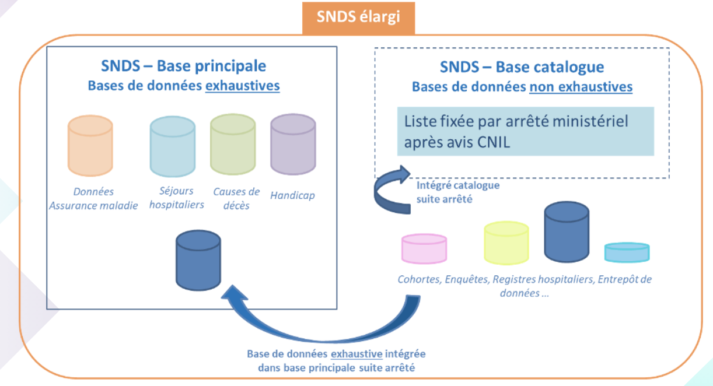

## Qui a accès au SNDS et à quelles données ?
Le SNDS assure la mise à disposition des données selon la nature des données et le risque de ré-identification des patients, en deux modalités distinctes :

- Les **données pour lesquelles aucune ré-identification n’est possible** sont accessibles et réutilisables par tous, en [open data :](http://open-data-assurance-maladie.ameli.fr/) 

- Les **données potentiellement ré-idenfiantes** sont accessibles en environnement maîtrisé, respectant le référentiel de sécurité, avec des accès aux données SNDS régulés :

    -  **Sur autorisation pérenne**, pour l’Etat et ses agences, des établissements publics et des organismes **chargés d’une mission de service public** (recherches, sphère santé, …) listés dans le décret du 26 décembre 2016 puis modifié par le décret du 29 juin 2021 :  **accès aux données du SNDS en déclinant les accès selon les niveaux d’agrégation des données** (individuelles/agrégées bénéficiaires, …) **et les historiques accessibles**,

    -  Ou **accès par projet**, via des accès standards après avis favorables ou favorables avec recommandation de la Plateforme des données de Santé (ou Health Data Hub - HDH) et du CESREES (Comité Ethique et Scientifique pour les recherches, les études et les évaluations dans le domaine de la santé), et sur autorisation de la CNIL, ou via des accès simplifiés, **à des fins de recherche, d’étude et d’évaluation d’intérêt public dans le domaine de la santé, pour les demandeurs publics et privés** (intermédiaires nécessaires dans certains cas pour respecter les 2 finalités interdites qui sont la promotion des produits, et la modification des contrats d’assurance) :  **accès à une partie du SNDS (EGB) ou à des extractions de données du SNDS restituées dans des conditions de sécurité équivalente**.

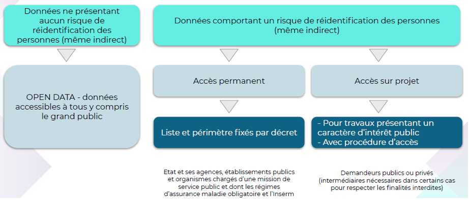

**La procédure d’accès standard sur projet à une extraction de données du SNDS est la suivante :**

1. Déposer une demande auprès du HDH qui assure le secrétariat unique de dépôt des recherches et **évalue l'intérêt public du projet** (au cas par cas) dans les délais impartis par la loi (7 jours) ;

2. puis le **CESREES** (Comité Ethique et Scientifique pour les recherches, les études et les évaluations dans le domaine de la santé) **se charge d’émettre un avis** (sous un délai d’un mois) sur la **méthodologie retenue**, sur la nécessité du recours à des données à caractère personnel, sur la pertinence de celles-ci par rapport à la finalité du traitement, sur le périmètre demandé des données et, s'il y a lieu, sur la qualité scientifique du projet ;

3. par la suite, La **Commission Nationale de l’Informatique et des Libertés (CNIL)**, dont l’instruction est facilitée par l’avis du CESREES et l’évaluation du HDH, **donne expressément une autorisation sous un délai de 2 mois renouvelable** ;

4. enfin, en fonction de l’autorisation de la CNIL, **une convention est signée entre la Cnam et le responsable du traitement des données** afin de mettre en œuvre l’extraction des données sur le périmètre autorisé.

**La procédure d’accès simplifiée à l’EGB (Echantillon de données individuelles de consommation de soins) est la suivante :** 

La CNIL donne compétence aau HDH pour approuver l’accès à l’EGB après examen des 5 conditions cumulatives :

- la **finalité́ d'intérêt public** de la recherche, de l’étude ou de l’évaluation dans le domaine de la santé,

- la **justification** apportée par le responsable de traitement pour démontrer la **pertinence scientifique du projet**,

- l’**absence de croisement d’identifiants potentiels**,

- la **durée de l'accès au portail** pour le traitement envisagé qui doit être limitée à̀ celle nécessaire à la réalisation de la recherche, l’étude ou l’évaluation,
  
- le **respect des exigences** applicables au SNDS (notamment référentiel de sécurité́).

La responsabilité de s’engager dans une procédure simplifiée ou standard sera portée par le responsable de traitement. 
Le HDH devra sous 15 jours soit notifier l’approbation, soit l’informer de la transmission de son dossier vers la procédure classique (CESREES – CNIL) auquel cas les délais de cette procédure s’appliqueront. 

**L’accès aux données de santé sur projet est règlementé par des obligations règlementaires** : le responsable de traitement doit protéger les données des personnes concernées tout au long de la durée de la recherche, notamment en traitant les données sur un environnement conforme au référentiel de sécurité du SNDS.

À des fins de transparence, le responsable de traitement doit :
**➔ enregistrer son étude sur le répertoire public des projets tenu par le Health Data Hub
➔ transmettre les résultats de sa recherche au Health Data Hub à des fins de publication par ce dernier.**

Des dispositions particulières sont applicables aux industriels et assureurs de santé. Pour accéder aux données, ils doivent :
➔ apporter des garanties démontrant l’absence de poursuite des finalités interdites
➔ ou recourir à un bureau d’études ou laboratoire de recherche indépendant, s’étant déclaré conforme au référentiel du 17 juillet 2017 déterminant les critères de confidentialité, d'expertise et d'indépendance

## Quelle est la sécurité au sein du SNDS ?

Le SNDS étant principalement constitué de données personnelles de santé, les traitements de données qui en sont issues doivent être strictement encadrés afin de protéger les libertés et droits fondamentaux des personnes. 
A ce titre, **ces traitements sont soumis aux dispositions** :

- de la Loi Informatique et Libertés ;

- du règlement européen sur la protection des données (à compter du 25 mai 2018) ;

- du code de la santé publique.

La **Commission Nationale de l'Informatique et des Libertés (CNIL)** est chargée de surveiller l’application de ces textes. 
En cas de méconnaissance de leurs dispositions, les responsables de traitement peuvent faire l’objet de sanctions administratives importantes.

Conformément à la *loi n° 2016-41 du 26 janvier 2016 de modernisation de notre système de santé*, les accès aux données du SNDS doivent s’effectuer dans « des conditions assurant la confidentialité et l'intégrité des données et la traçabilité des accès et des autres traitements ». 
**Un référentiel précise ces conditions en édictant les règles de sécurité que tout système utilisant des données du SNDS se doit de mettre en place. 
Les modalités d’application de ce référentiel sont indiquées dans l’arrêté du 22 mars 2017.**

En premier lieu, la sécurité des données est garantie par l’obligation pour chaque gestionnaire de système de réaliser une analyse de risque. 
C’est cette analyse qui permet au gestionnaire de s’assurer que les données sont correctement protégées par des mesures de sécurité adéquates.

Le référentiel s’appuie notamment sur les mesures techniques et organisationnelles suivantes pour garantir la sécurité des traitements, en imposant :

- **la pseudonymisation** : pour chaque individu, l’ensemble des informations permettant de facilement l’identifier (NIR, …) doit être remplacé par un pseudonyme, c’est-à-dire par un code alphanumérique irréversible ne permettant pas le rattachement à son identité ; **La pseudonymisation systématique des données constitue une des mesures fondamentales du dispositif dans le but de conserver la confidentialité des données manipulées.**

**La pseudonymisation des identifiants des patients ne rend pas les données du SNDS anonymes strictement ; le croisement de certaines variables, appelées « identifiants potentiels », peut permettre de ré-identifier les patients.** 
**Ce sont les données suivantes :**

1.  **Commune de résidence du bénéficiaire**
2.  **Année et mois de naissance**
3.  **Date de soins en jour, mois, année (et dérivés : date d’entrée, date de prescription …)**
4.  **Date de décès en jour, mois, année**
5.  **Commune de décès**

Ainsi, des **profils d’accès aux données ont été mis en place** afin de n’autoriser l’accès qu’à un seul identifiant potentiel à la fois ou selon un périmètre bien défini, **selon les autorisations décrites dans le décret**.

- **l’authentification** : elle permet d’une part de contrôler les accès et d’autre part d’imputer les actions effectuées sur le système à une personne désignée. Une authentification forte sur le portail SNDS sera donc mise en place dès mars 2019 à travers la concaténation d’au moins deux facteurs d’authentification ; 

- **la traçabilité** : l’ensemble des événements relatifs à la sécurité du système doit être tracé. Cette traçabilité (entrées, sorties, utilisateurs….) permet de contrôler l’utilisation de données et de disposer de preuves pouvant être instruites en justice ;

- **le contrôle** : il permet de s’assurer d’une utilisation des données conforme à la loi et au référentiel. Effectué a posteriori par le biais d’audits, de la revue annuelle des habilitations et de contrôles de la CNIL a posteriori, il est notamment rendu possible par l’utilisation conjointe de la traçabilité et de l’authentification. 
Le SNDS élargi (données déposées dans des systèmes fils hors portail SNDS) sera périodiquement contrôlé par la CNIL et le comité d’audit (mais également Cour des comptes, ANSSI, IGAS …). 
**En cas de non-respect des conditions d’utilisation des données, des sanctions adéquates peuvent être prononcées, notamment la suspension de l’accès aux données pour tout l’organisme.**

- **la sensibilisation et la formation des utilisateurs**  avec la mise en place d’un dispositif de formation aux données, certains modules rendus obligatoires, notamment ceux présentant le référentiel de sécurité du SNDS ainsi que ceux permettant l’accès aux données individuelles bénéficiaires (Cf fiche 6 : Quels sont les différents parcours de formation ?).

-  **Les Conditions Générales d’Utilisation** (CGU) qui formalisent l’engagement individuel au respect des conditions d’accès aux données doivent être signées en ligne dès la première utilisation du portail SNDS (Cf. fiche 4 : Quelles sont les conditions d’ouverture d’un compte ?).

**Hors portail d’accès aux données du SNDS, des systèmes fils autorisés et homologués au référentiel de sécurité peuvent accueillir des données du SNDS.**

En plus de ces règles spécifiques, les traitements de données du SNDS sont soumis à l’ensemble des référentiels généraux applicables aux systèmes d’information du Ministère des Affaires sociales et de la santé, à savoir : la Politique Générale de Sécurité des Systèmes d’Information en Santé (PGSSI-S), la Politique de Sécurité des Systèmes d’Information pour les ministères chargés des affaires sociales (PSSI MCAS), et le Référentiel Général de Sécurité (RGS).

## Quelles sont les conditions d’ouverture d’un compte ?

1. **Pour obtenir l’ouverture d’un compte SNDS sur le portail de la Cnam, l’utilisateur doit avoir suivi les formations pré-requises** préalablement à l’attribution de droits d’accès aux données du SNDS :

**- pour les utilisateurs d’extractions de données sur projet :**
Le module « Données d’extraction DCIR pour les accès sur projet » (réf. Institut 4.10 REQ-256-AM) est un prérequis obligatoire pour être habilité à accéder aux données du SNDS sur le portail SNDS.
Cette formation est accessible dès lors que le CESREES a formulé un avis favorable ou favorable avec recommandation sur le projet.

**-	pour les utilisateurs de l’EGB sur projet :**
Les modules « Architecture et données du SNIIRAM/SNDS » (réf. Institut 4.10 REQ-054-AM) suivi du module « EGB » (réf. Institut 4.10 REQ-086-AM) produit de restitutions de données de consommation individuelles bénéficiaires échantillonnées sont des prérequis obligatoires pour accéder aux données du SNDS. Ces formations sont accessibles dès lors que le CESREES a formulé un avis favorable ou favorables avec recommandation ou que le HDH a autorisé l’accès simplifié (Cf. 6. QUELS SONT LES DIFFERENTS PARCOURS DE FORMATION ?).

2. **L’utilisateur doit ensuite obtenir une ouverture de compte SNDS par l’intermédiaire de l’Autorité d’Enregistrement (AE)** : dans le cadre d’un accès sur projet cet AE est le Directeur de la Stratégie, des Etudes et des Statistiques de la Cnam.
Ce processus de création d’un compte utilisateur génère la création d’une calculette par projet et par utilisateur afin de permettre au porteur de projet d’être habilités à accéder au portail.
L’AE vérifie que l’utilisateur est bien désigné nominativement dans la convention passée entre le responsable du traitement du projet et la Cnam.

3. **L’utilisateur doit signer les Conditions Générales d’Utilisation (CGU)** du SNDS, à la première connexion au portail d’accès aux données, qui formalisent : 
  - l’engagement individuel de l’utilisateur au respect des conditions d’accès aux données :
    - le respect des finalités d’utilisation autorisées et interdites du SNDS,
    - l’absence d’action visant la ré-identification,
    - l’obligation de ne diffuser que des données anonymes,
    - l’engagement du respect du référentiel de sécurité.
    
  -  les conditions d’utilisation du portail et des services associés :

L’utilisateur a interdiction d’exporter du portail SNDS des données non anonymes du SNDS, sauf cas particulier d’exports de données dans un système-fils (SNDS élargi) respectant le même référentiel de sécurité : il ne doit pas être possible, à partir des données, de déduire ou revenir à une information personnelle sur un individu.

L’utilisateur est informé que ses actions font l’objet de traces qui seront exploitées pour détecter tout comportement considéré comme anormal (dont non-respect des engagements pris).

Pour les données SNDS des systèmes-fils, ces CGU sont également signées lors de la convention passée avec la Cnam et annexée à celle-ci.

4. **L’utilisateur doit utiliser les données du SNDS dans un cadre sécurisé** qui respecte le référentiel de sécurité, dans le portail ou dans un système fils (Cf. 3. QUELLE EST LA SECURITE AU SEIN DU SNDS ?).

## Quel est le rôle de l’Autorité d’Enregistrement ?

Dans le cas des **accès aux données du SNDS sur projet, l’habilitation temporaire est délivrée par la Cnam**, représentée par le directeur de la Stratégie, des Etudes et des Statistiques. 

**La Cnam délivre un compte pour les utilisateurs demandant une extraction de données du SNDS ou un accès à une partie du SNDS (EGB), sous réserve qu’ils aient suivi les formations obligatoires adéquates (Cf. 6. QUELS SONT LES DIFFERENTS PARCOURS DE FORMATION ?)

.** 

**Ces comptes sont ouverts pour les seuls utilisateurs inscrits dans la convention passée entre la Cnam et le responsable du projet.** 
Un compte est ouvert par projet et par utilisateur.

Cet accès se formalise :

-  pour les **utilisateurs d’extractions de données**, par un numéro de profil de connexion au portail (117) donnant accès à un espace projet permettant d’accéder aux données du projet ;

-  pour les **utilisateurs ayant un accès ponctuel à l’EGB**, cet accès se formalise par un numéro de profil de connexion au portail (38, 39, 40, 53 ou 104) donnant accès à l’EGB

(Cf 7. QUELLES SONT LES MODALITES DE CONNEXION SUR LE PORTAIL ?)

**L’AE procède, en temps voulu, à la clôture des comptes des utilisateurs** (la date de fin de droit correspondant à la fin du projet, établi par la convention passée entre la Cnam et le responsable du traitement).

## Quel est le parcours de formation ? 

Dans le cadre d’un accès sur projet aux données du SNDS sur le portail de la Cnam, un schéma de formations a été mis en place au travers de plusieurs modules indispensables. Ces formations sont ouvertes dès lors que le CESREES a formulé un avis favorable ou favorable avec recommandation sur le projet d’étude ou que le HDH a autorisé l’accès simplifié pour un accès sur projet à l’EGB.

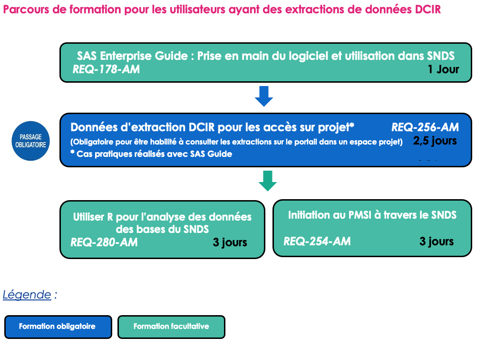

Pour être habilité à consulter les extractions de données du SNDS sur le portail, le futur utilisateur doit obligatoirement suivre le module de formation « Données d’extraction pour les accès sur projet » (réf. Institut 4.10 REQ-256-AM).

En complément, une formation sur les données du PMSI accessibles dans le SNDS « initiation au PMSI à travers le SNDS » (réf. Institut 4.10 REQ-254-AM) peut être suivie.

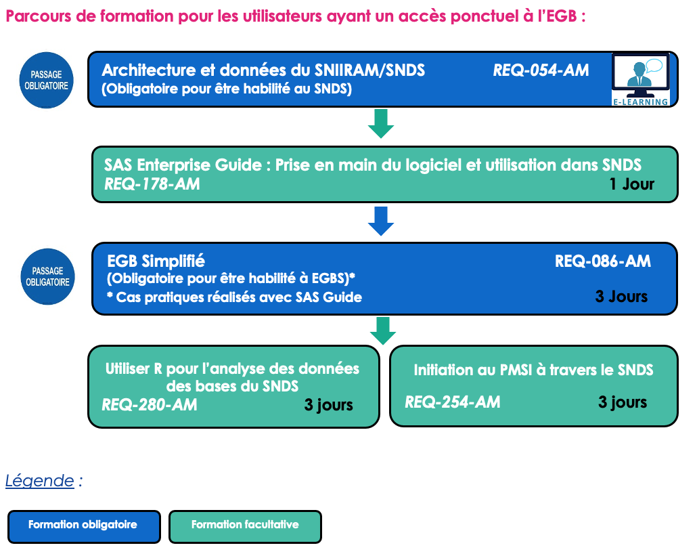 

Pour être habilité à consulter l’EGB sur projet, en procédure standard ou simplifiée autorisée par le HDH, le futur utilisateur doit obligatoirement suivre le module de formation « Architecture et données du SNIIRAM/SNDS » (réf. Institut 4.10 REQ-054-AM) suivi du module de formation  « EGB » (réf. Institut 4.10 REQ-086-AM).

En complément, une formation sur les données du PMSI accessibles dans le SNDS « initiation au PMSI à travers le SNDS » (réf. Institut 4.10 REQ-254-AM) peut être suivie.

Les formations se déroulent en partenariat avec l’Institut 4.10, sur les sites de Paris et Tours. Pour choisir les formations et connaitre les modalités d’inscription l’utilisateur doit consulter le fichier «Formations SNIIRAM/SNDS – Planning et descriptif - version Jour Mois Année » situé sur l’accueil du portail SNDS ou consulter le planning directement [le site de l’Institut 4.10.](https://catalogue-quatredix.valsoftware.cloud/CATALOGUE/default.aspx) 

## Quelles sont les modalités de connexion sur le portail ?

Après avoir été habilité par l’AE, l’utilisateur dispose :
1.	 d’un **compte identifiant** qui est transmis par messagerie,
2.	 et d’une **calculette** qui lui est adressée par courrier.
**Ces éléments sont personnels et ne doivent pas être utilisés par un tiers. Un compte et une calculette sont délivrés par projet.**

Les droits d’un utilisateur sur les données du SNDS se traduisent par un numéro de profil de connexion au portail, tels qu’ils sont demandés par l’AE. **Ce numéro de profil de connexion au portail est** :

- le n°**117** pour les utilisateurs ayant un **accès sur projet à une extraction de données DCIR**,
-	le n°**38**, **39**, **40**, **53** ou **104** pour les utilisateurs ayant un **accès ponctuel à l’EGB**.

Tous ces profils permettent d’accéder :

-	aux données de l’extraction dans un espace projet accessible via SAS/Guide, ou à l’EGB,
-	à l’ensemble de la documentation SNDS, 
-	au dictionnaire de données SNDS, 
-	aux forums dédiés à chacun des produits du SNDS, et en particulier au forum DCIR. 

L’adresse de connexion au portail est la suivante : [**https://portail.sniiram.ameli.fr**](https://portail.sniiram.ameli.fr). Les données d’extraction ainsi que le produit EGB se situent dans l’onglet STATISTIQUES du portail SNDS où les tables autorisées sont accessibles et interrogeables par SAS guide.

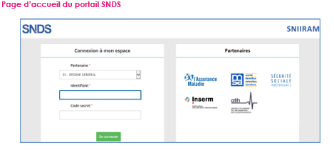 

1. Saisir son identifiant
2. Saisir le code d’accès généré par la calculette
3. Cliquer sur Se connecter

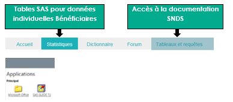 

Le **guide d’utilisation** du portail et la **procédure d’installation** de certains modules (certificats, citrix) sont disponibles sur la **page d'accueil** du portail.
  

## Quelles données du SNDS peuvent être exportées et importées ?

**Le référentiel de sécurité du SNDS impose l’interdiction de :**

- Exporter des données individuelles bénéficiaires et Professionnel de Santé non anonymes du portail SNDS

→ Le Référentiel Sécurité impose de ne pas de sortir de données tant que l’on n’a pas la certitude qu’elles sont anonymes : c’est à dire qu’il ne doit pas être possible à partir de ces données de déduire une information personnelle sur un individu, bénéficiaire ou professionnel de santé.

:::tip **Quelques bonnes pratiques** :

1. ne pas restituer de petits effectifs,
2. une information de santé sur un individu ne doit pas pouvoir être déduite à partir d'autres attributs, en particulier les données médicales (ALD, CIM10, GHS …)
3. ne pas sortir les identifiants potentiels (le croisement des identifiants potentiels peut permettre de ré-identifier un individu) 
4. ne pas sortir d’identifiants de personnes bénéficiaires ou professionnels de santé. Pour ces derniers, l’export n’est pas autorisé même avec un identifiant Professionnel de Santé crypté.
:::

- Importer dans le portail SNDS des données potentiellement identifiantes

→ L’import de données dans le portail SNIIRAM/SNDS n’est autorisé que pour des données anonymes.

→ En cas de besoin d’import de données non anonymes (par exemple ajout de données d’une cohorte), une autorisation CNIL est nécessaire.

**Une exigence de traçabilité de ces actions d’import / export de données permet d’identifier et d’agir contre les comportements frauduleux.**

Aussi, l’utilisateur doit-il changer ses habitudes de travail et traiter les données de détail dans le portail SNDS, puis exporter du portail des données agrégées.

Par ailleurs, pour éviter les imports des mêmes tables par de nombreux utilisateurs, une mise à disposition de tables dans RFCOMMUN est possible (si vous souhaitez mutualiser des tables utiles à tous les utilisateurs, contacter par mail : snds.cnam@assurance-maladie.fr)

Une solution d’import/export est proposée sur le portail dans la rubrique `TELECHARGEMENT DES FICHIERS DANS LE REPERTOIRE DOWNLOAD` de l’onglet `STATISTIQUE` du portail SNDS avec création d’un encart dédié :

### Télechargement des fichiers

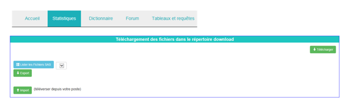

#### Le processus d’import de fichiers

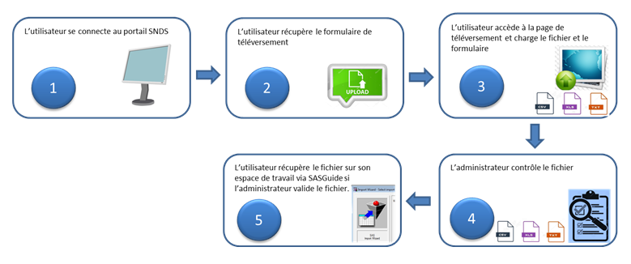

#### Le processus d’export de fichiers

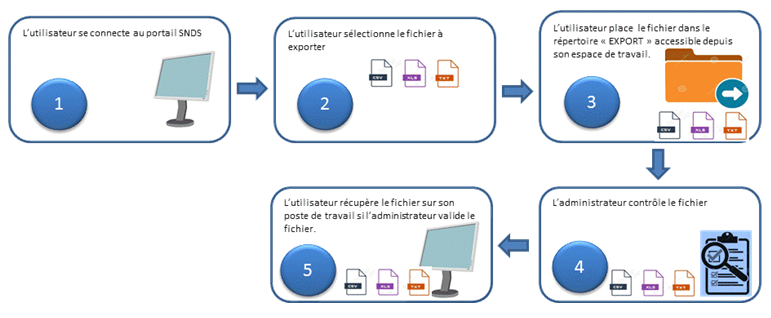

## Comment le Délégué à la Protection des Données doit-il remplir le document décrivant les caractéristiques des traitements portant sur les données individuelles ?

Conformément à **l’arrêté du 6 avril 2017**, un document-type est porté en modèle afin que le **Délégué à la Protection des Données (DPD)**, présent dans chaque organisme, puisse tenir un **registre précisant les caractéristiques des traitements** portant sur des données individuelles du SNDS.
Le DPD doit veiller à la traçabilité des traitements réalisés par la tenue de ces registres (enregistrement des utilisateurs, des projets).

Ce dernier doit comporter a minima les informations suivantes, sur l’utilisation des données individuelles bénéficiaires, professionnels de santé ou établissements ainsi que les identifiants potentiels utilisés (Cf. 3. QUELLE EST LA SECURITE AU SEIN DU SNDS ?) et pourra faire l’objet d’un contrôle par la CNIL :

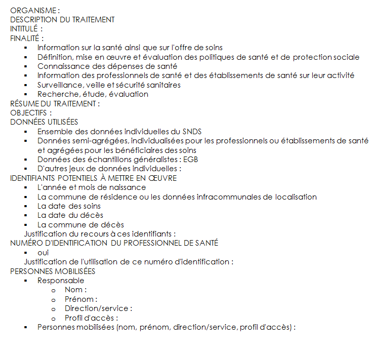

## Quel accompagnement autour du SNDS ? 

La Cnam propose le **dispositif d’accompagnement** suivant en se connectant sur le portail SNDS et en se référant aux différents onglets et espaces. 
L’ensemble des profils permet d’interroger la documentation.

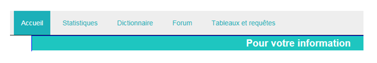

### Le Support sur les données

Pour vous aider dans l'exploitation des données du SNDS, un Support d'aide aux utilisateurs est proposé 

- **Dictionnaire des données** : l’onglet DICTIONNAIRE du portail SNDS de la Cnam vous permet d’ouvrir le Dictionnaire des données du SNDS en version WEB et **d’interroger les informations et définition** sur la donnée par produit, table ou variable.

-	**Le fichier Excel Kwikly**, accessible directement sur la page d’accueil du portail, permet de connaitre le format, la définition et l’historique de toutes les tables individuelles bénéficiaires (DCIR, PMSI, Causes de décès, etc…)

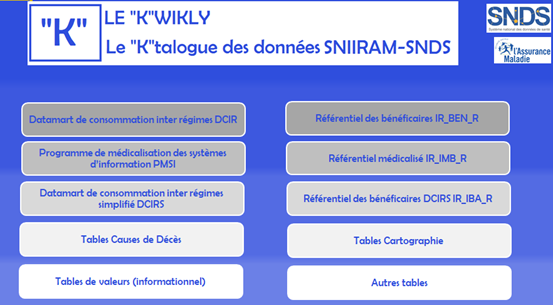 

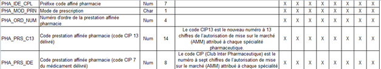 

- **L’assistance aux utilisateurs** : différente en fonction du type d’aide souhaitée : une aide fonctionnelle ou une aide technique.

|TYPE DE DEMANDE | OU TROUVER L’INFORMATION SUR LE PORTAIL SNDS DE LA CNAM ? | 
|----|----|
|**Aide fonctionnelle** sur la donnée, le contenu des bases, l’explication d’une méthode, d’une requête|L’onglet **FORUM** du portail SNDS de la Cnam propose **des forums sur chaque produit du SNDS** (DCIR-PMSI, EGB, datamarts AMOS, DAMIR…) ; ils permettent aux utilisateurs de trouver des réponses à leurs interrogations, d’échanger sur un **sujet d’ordre fonctionnel avec la communauté des utilisateurs**. Des experts-métiers y répondent également. Ces forums sont accessibles en se connectant sur le portail du SNDS, quel que soit le profil.|
|**Problème technique** d’accès aux données, ou une suspicion d’anomalie des données|**Le Portail du Support National www.support-national.cnamts.fr** pour le régime général de l’Assurance Maladie ou l’envoi d’un message à l’adresse **support-national@assurance-maladie.fr** pour les partenaires et organismes des autres régimes d’assurance maladie permet de déposer un **Ticket de support**. L’objet du message doit impérativement comporter les mots « Création – SNIIRAM/SNDS – Suivi du nom du produit » car un automate traite dans un premier temps les messages reçus. Il est indispensable de préciser dans le corps du message son identifiant, son organisme, région et profil de connexion, le produit SNDS exploité. Un modèle de mail est proposé sur la page d’accueil du portail dans la rubrique « Pour votre Information ».|
|**Demandes diverses** : les parcours de formations, les demandes d’extractions ponctuelles sur des données agrégées, ….|Contacter l’adresse suivante : snds.cnam@assurance-maladie.fr|
|**Questions sur les habilitations**|suivi.demsi.pose.cnam@assurance-maladie.fr |

### La Documentation du portail SNDS de la Cnam :
-	Vous retrouverez toute la documentation essentielle sur la page d’accueil du portail SNDS, dans la rubrique **POUR VOTRE INFORMATION**, entre autres : 

→ Le **catalogue offre de service d’accompagnement** qui résume tout l’accompagnement proposé autour des produits du SNIIRAM/SNDS : formations et comités utilisateurs, selon le profil des utilisateurs et les objectifs suivis.
→ Le **planning des formations**
→ Le **récapitulatif des anomalies recensées** sur les produits de restitution du SNIIRAM/SNDS et leur statut de résolution.
→ Les **bonnes pratiques SAS et BO**.
→ Et **divers documents d’actualité forte** (pallier de pseudonymisation par exemple)

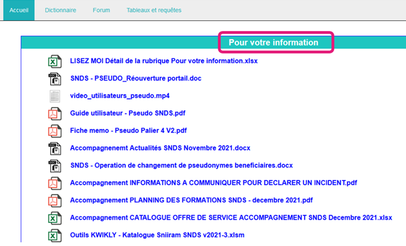 

**Pour recevoir régulièrement par courriel une communication sur les actualités des bases SNDS pour être informer plus rapidement vous pouvez vous inscrire à l’adresse suivante : 
https://framaforms.org/actualites-snds-1606908539 **

-	En cliquant sur l’onglet **TABLEAUX ET REQUETES**, vous accédez à une arborescence de documentations insérées dans Business Object.

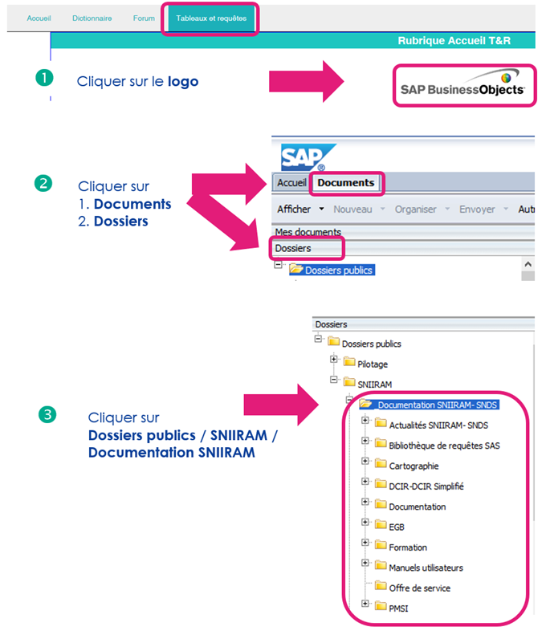 

| Dans ce dossier | Vous trouverez | 
|----|----|
|**Actualités SNIIRAM-SNDS** |	Tous les **communiqués d’information** sur le SNDS (nouveau produit, alerte sur une anomalie, …) |
|**Bibliothèque de requêtes SAS** |	Toutes les **requêtes SAS élaborées sur DCIR et PMSI**|
|**Cartographie** |	La **méthodologie**, la **description des tables** disponibles sur ORAVUE |
**DCIR - DCIR simplifié** |	Toute la **documentation relative aux applications DCIR et DCIR simplifié** : les informations, la liste des variables par table, les supports de formation et des comités utilisateurs, le niveau de chargement des tables, les profils pour accéder à DCIR-DCIRS, la liste des données sensibles et médicales dans DCIR-DCIRS et une bibliothèque de requêtes. Vous y trouverez également la FAQ DCIR-PMSI*. |
**Documentation** |	Toute la **documentation générale du SNIIRAM-SNDS** : la liste et objectifs des produits de restitution, le Kwikly ‘K’atalgue des données du SNDS, les diaporamas des différents comités utilisateurs et amphis SNDS, des FICHES BEST PRACTICE sur différents sujets, les profils pour accéder au portail/produits, les textes officiels  SNIIRAM-SNDS et les mises en œuvre du référentiel sécurité… |
**EGB**	| Toute la **documentation relative à l’EGB et aux tables simplifiées de l’EGB** : les informations spécifiques, la liste des variables par table, la documentation pour les tables du PMSI et BGNA intégrées, le niveau de chargement des tables, les profils pour accéder à l’EGB, la liste des données sensibles et médicales dans l’EGB. Vous y trouverez également la FAQ EGB*. |
**Formation** |	Le **planning des formations SNIIRAM** / SNDS et les **supports de cours et exercices** des formations SNIIRAM / SNDS |
**Manuels utilisateurs* |	Les *manuels utilisateurs de tous les produits SNIIRAM / SNDS** en dehors de DCIR, DCIR simplifié, EGB et PMSI (par exemple les datamarts, les dénombrement des bénéficiaires et PS, les tables EHPAD, les Causes médicales de décès …) |
**Offre de service** |	Le **fichier informant du niveau de chargement des produits agrégés** bénéficiaires accessibles via BO WebI. |
**PMSI** |	Toute la **documentation relative aux tables du PMSI** : liste des variables, liste des profils pour y accéder, liste des données médicales et sensibles dans le PMSI…. |
	
*Les foires aux questions permettent de récapituler les demandes d’assistance

### La documentation collaborative du Health Data Hub 

Le [site public collaboratif du Health Data Hub](https://documentation-snds.health-data-hub.fr) met à disposition des utilisateurs de la documentation alimentée par des contributeurs qui utilisent la technologie du GitHub. 

Le [Health Data Hub (HDH)]( https://www.health-data-hub.fr), premier contact des porteurs de projets sur les données du SNDS, répond aux questions des utilisateurs en quête d’information sur le processus d’accès aux données ou sur des questions d’ordre fonctionnel et méthodologiques.

Il modère le [Forum d’entraide sur le site du Health Data Hub]https://entraide.health-data-hub.fr et répond aux [questions]https://www.health-data-hub.fr/contact

## Comment signer une convention d’extraction des données SNDS avec la Cnam ?

**L’accès sur projet à des données de santé** potentiellement ré-idenfiantes est possible pour les **demandeurs publics et privés**, en environnement maîtrisé, respectant le référentiel de sécurité. 

Le projet doit suivre **une finalité de recherche, d’étude et d’évaluation d’intérêt public** dans le domaine de la santé : 

- pour accéder à une partie du SNDS (Echantillon EGB) sans croisement d’identifiants potentiels, après avis favorables du HDH dans le cadre d’une procédure d’accès simplifiée.
- pour accéder à des extractions de données du SNDS (données DCIR chainées aux données PMSI et CépiDC) après avis favorable ou favorable avec recommandation du CESREES et sur autorisation de la CNIL.

Le porteur de projet dépose un dossier dématérialisé sur la plateforme de dépôt du HDH qui a 7 jours pour rendre un avis sur l’intérêt public du projet. Le dossier est constitué des éléments suivants : 

- **le protocole scientifique** il doit être précis sur la méthodologie de l’étude et doit mentionner clairement les données nécessaires et leur circuit. Il doit justifier notamment l’utilité des identifiants potentiels et des causes de décès. Par défaut, l’extraction des données ne concerne que les données DCIR, PMSI et leurs référentiels, ou EGB le cas échéant.
- **la grille-résumé CESREES**
- **les déclarations publiques d’intérêt** des Responsable de traitement et Responsable de mise en œuvre
- **la demande d’autorisation CNIL** pré-remplie signée par le Responsable de traitement. 
 

**Le CESREES émet un avis dans un délai de 1 mois** sur la méthodologie retenue, sur la nécessité du recours à des données à caractère personnel, sur la pertinence de celles-ci par rapport à la finalité du traitement et, s'il y a lieu, sur la qualité scientifique du projet.

Une fois l’accord CNIL obtenu, après 2 mois renouvelable une fois (une absence de réponse vaut autorisation), **la Cnam prend contact avec le responsable de traitement et recueille les éléments nécessaires à la rédaction de la convention**.

**La convention de mise à disposition des données est à valider et à signer entre le responsable de traitement** (Commanditaire) **et la Cnam** (Directeur Général ou son délégué) et éventuellement le responsable de mise en œuvre du traitement. 

La convention précise :
- le **périmètre des données** transmises en adéquation avec l’autorisation CNIL
- les **modalités de ciblage et/ou d’appariement** des patients (direct/indirect)
- les **modalités de mise à disposition des données** (espace projet / EGB dans le portail ou système fils)
- les **conditions de sécurité** de transmission des données
- le **cadre d’utilisation et de conservation** conformément à l’autorisation de la CNIL et les engagements pris par le destinataire : propriété des données, publication des données (obligation de transparence)
- La **liste des utilisateurs** accédant aux données sur le portail SNDS (annexe 2)

Afin de signer la convention, le porteur de projet doit avoir bien rempli tous les documents et précisé si le projet correspond à un : 
•	Type de données exhaustives sur le portail SNDS et mise à disposition des données sur un Espace projet ; 
•	Type de données non exhaustives et mise à disposition des données par un accès à l’EGB ; 
Alors les utilisateurs des données du projet devront suivre des formations adéquates  pour accéder au portail du SNDS afin d’être sensibilisés à la sécurité. Cette étape est requise afin de valider la création d’un espace projet et/ou d’un accès au portail.

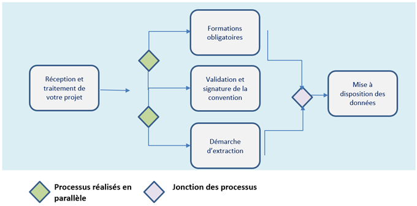 

## Quels sont les différents types d’extraction de données du SNDS ?

Dès lors que le projet a reçu un accord de la CNIL, le HDH qui assure un rôle de facilitateur dans les échanges entre tous les interlocuteurs, transmet à la Cnam le protocole scientifique, son résumé et l’avis CESREES.

La CNAM prend contact avec le responsable de traitement de l’extraction et recueille les éléments nécessaires à la rédaction de la convention (Cf. 11. COMMENT SIGNER UNE CONVENTION D’EXTRACTION DES DONNEES AVEC LA CNAM ?). 

En parallèle de l’élaboration de la convention, la Cellule DEMEX de la CNAM met en œuvre le ciblage des patients **pour réaliser l’extraction des données du SNDS** et la mettre à disposition du responsable de traitement.

### Lorsque le projet fait appel aux données exhaustives du SNDS, il existe trois types d’extraction de données afin d’accéder aux données souhaitées pour le projet :

-	**L’appariement direct** : on cherche à pseudonymiser le NIR des individus pour retrouver les identifiants connus dans les bases du SNDS. C’est un appariement avec les données du SNDS sur la base du numéro d’inscription au répertoire national des personnes physiques (NIR) ; le fichier normé contenant les NIR devra être transmis via une plateforme de dépôt au Pôle DEMEX par le référent technique. 

-	**L’appariement indirect** : on cherche à trouver les individus ayant les mêmes caractéristiques individuelles que celles initialement connues par le responsable de traitement. L’appariement indirect peut s’effectuer soit par le Pôle DEMEX soit par le responsable de traitement  si défini et autorisé dans le protocole ; un fichier devra être transmis au Pôle DEMEX contenant les variables nécessaires à la réalisation de l’appariement et les éventuelles données complémentaires prévus dans le cadre de l’autorisation de la CNIL pour la réalisation de l’étude.

-	**Le ciblage d’une population** : on recherche un groupe de population par rapport à des caractéristiques globales (consommations de médicaments, diagnostics codés) ; les critères de ciblage seront à communiquer à travers l’expression de besoin demandée suite au mail de premier contact que le porteur de projet aura avec la Cnam. Plus les critères de ciblage seront précis, plus les délais de traitement seront réduits.

### Lorsque le projet fait appel aux données de l’EGB (échantillon de bénéficiaires consommants ou non) alors l’extraction des données consiste à un accès global à l’échantillon directement sur le portail SNDS de la Cnam.

Aucune démarche d’extraction n’est nécessaire

### Procédure de pseudonymisation des NIR dans le cas d’un appariement direct : 

Lorsqu’il y a un appariement direct entre les NIR du SNDS et les NIR dont dispose le porteur de projet, il faut procéder à une **pseudonymisation** avant extraction : 

Le porteur de projet transmet les **composantes à pseudonymiser** (NIR des assurés (13C), date de naissance (AAAAMMJJ), sexe (1C) et NIR du bénéficiaire (13C via une **application sécurisée SAFE** ; chaque NIR est associé à un Numéro de Sujet (nombre aléatoire associé au nom du projet).

Un **traitement de pseudonymisation** sur les composantes à pseudonymiser fournies par le porteur du projet est réalisé pour obtenir le **NIR pseudonymisé** correspondant à celui du SNDS : **l’extraction des données du DCIR, PMSI et causes de décès peut alors être effectuée par le Pole DEMEX de la Cnam sur l’ensemble des consommations pouvant être reliées à ce NIR pseudonymisé**.

C’est le **Numéro de Sujet affecté au NIR pseudonymisé qui est alors transmis au porteur de projet** qui a une autorisation de la CNIL pour disposer à la fois du numéro de sujet et du fichier de ses NIR initiaux dans une **table de correspondance**. 
Le porteur de projet et les signataires de la convention peuvent accéder aux données d’extractions du SNDS dans un **espace projet** dédié sur le portail SNDS de la Cnam. Les données peuvent également être livrées (transfert sécurisé) par le Pole DEMEX dans une bulle sécurisée (système fils propre au porteur de projet respectant les mêmes conditions de sécurité que le portail).

Le porteur de projet peut de façon autonome ajouter des données externes à son extraction SNDS, uniquement si elles ont été **listées au préalable dans le protocole scientifique**. Pour cela il utilise la procédure d’importation des données du portail  convention (Cf. 8. QUELLES DONNEES DU SNDS PEUVENT ETRE EXPORTEES ET IMPORTEES ?).

###  Recommandations dans le cas d’un appariement indirect : 

L’appariement indirect s’effectue à l’aide d’un fichier contenant les caractéristiques individuelles des personnes à apparier : le porteur de projet transmet à la Cnam le **Numéro de Sujet du projet** et le plus possible de **variables d’appariement**, notamment sur les caractéristiques des patients (Sexe, Année et mois de naissance, Date de décès, Département ou Commune de résidence, etc…). 
Il est préconisé de fournir un nombre important de séjours ou de soins par patient (actes CCAM, établissement avec hospitalisation,…), de privilégier les variables très discriminantes telles que Date de décès, Codes CIM10 très spécifiques, Diagnostics associé, relié et/ou principal, et de minimiser les valeurs manquantes et le nombre d’erreur de saisie. 
Compléter avec un dictionnaire de variables est un plus pour réaliser l’appariement.

