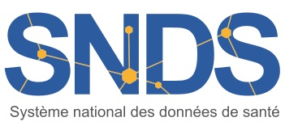

# Introduction au SNDS
<!-- SPDX-License-Identifier: MPL-2.0 -->

## Qu'est-ce que le SNDS ?

### Le SNDS en deux coups de pinceau

### À quoi ça peut servir ?

### La création et l'évolution

### Les composantes du SNDS et le circuit de production des données

### Les données présentes et absentes

### Les finalités autorisées et interdites

### La sécurité et la confidentialité

 

## Les bases du SNDS et la restitution des données

### Les bases avec des données indivduelles

#### DCIR : Les soins de ville

#### PMSI : Les soins à l'hôpital

#### CépiDC : Les causes médicales de décès

#### EGB : L'échantillon représentatif des personnes protégées

### Les datamarts BO : des bases thématiques avec des données agrégées

### Les bases en Open Data

 

## Comment accéder au SNDS ?

### Les accès permanents

### Les accès sur projet

#### La procédure standard

#### Les méthodologies de référence

#### La procédure simplifiée d'accès à l'EGB

#### Les assureurs et industriels de santé

### Les différents portails d'accès

 

## La recherche avec le SNDS

### Les appariements

### Quelques exemples

#### Accès permanents

#### Accès sur projet