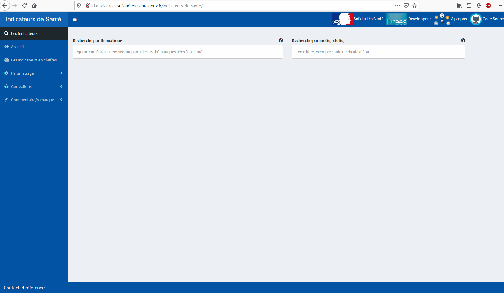

# Cartographie des indicateurs de santé
<!-- SPDX-License-Identifier: MPL-2.0 -->

La cartographie des indicateurs de santé recense et facilite la recherche des indicateurs statistiques de santé produits par les acteurs institutionnels. 

Elle est accessible à l'adresse [http://dataviz.drees.solidarites-sante.gouv.fr/indicateurs_de_sante/](http://dataviz.drees.solidarites-sante.gouv.fr/indicateurs_de_sante/).

## Aperçu de l'application

L'application est encore en cours de développement. 
Un formulaire dans le menu latéral est disponible pour reccueillir des suggestions ou répondre à des questions.

## Pourquoi cette application ?

De nombreux acteurs institutionnels produisent des indicateurs de santé. 
Cette diversité d'indicateurs peut être difficile à retrouver, d'autant qu'ils ne sont pas tous bien référencés par les moteurs de recherche standards.

Afin de valoriser les productions de nombreux départements statistiques, une phase de concertation a débouché sur le recensement de près de 20,000 indicateurs de santé.

## Améliorer la qualité des données

L'application offre une fonctionnalité d'édition contrôlée par une clef d'identification qu'il convient de demander via le formulaire de contact de l'application.

Si vous souhaitez corriger une coquille, compléter une information ou mettre à jour des instructions pour retrouver l'indicateur sur le site du producteur, nous serions ravis de recevoir votre aide.

## Producteurs d'indicateurs

La carthographie des indicateurs de santé a été développé à la DREES, grâce aux contributions des producteurs d'indicateurs suivant :
- la [Cnam](../glossaire/Cnam.md) (site [Ameli](https://www.ameli.fr/)); 
- [Santé Publique France](../glossaire/SpF.md); 
- les [ARS](../glossaire/ARS.md), notamment 
[C@RTOSanté](https://www.hauts-de-france.ars.sante.fr/crtosante-2),
[ATLASANTE](https://www.atlasante.fr/accueil);
- l'[ATIH](../glossaire/ATIH.md), notamment [ScanSanté](https://scansante.fr/);
- les [ORS](../glossaire/ORS.md), notamment
[SCORE Santé](https://www.scoresante.org/), 
[BALISES](http://www.balises-auvergne-rhone-alpes.org/update.php), 
[SIRSé](http://www.sirsepaca.org/); 
- l'[DARES](https://dares.travail-emploi.gouv.fr/dares-etudes-et-statistiques/); 
- l'[OFDT](https://www.ofdt.fr/), notamment [ESCAPAD](https://www.ofdt.fr/enquetes-et-dispositifs/escapad/); 
- la [HAS](https://www.has-sante.fr/), notamment [SCOPE Santé]https://www.scopesante.fr/#/); 
- l'[INCa](https://www.e-cancer.fr/); 
- l'[INSERM](https://www.inserm.fr/); 
- l'[Observatoires des fragilités](http://www2.observatoiredesfragilites.fr/sites_I2G/prod/app/www/index.php?cont=ctl_home); 
- [SISE-eaux](https://solidarites-sante.gouv.fr/sante-et-environnement/eaux/); 
- l'enquête [SUMER](https://dares.travail-emploi.gouv.fr/dares-etudes-et-statistiques/enquetes/article/surveillance-medicale-des-expositions-aux-risques-professionnels-sumer-edition-118967).

