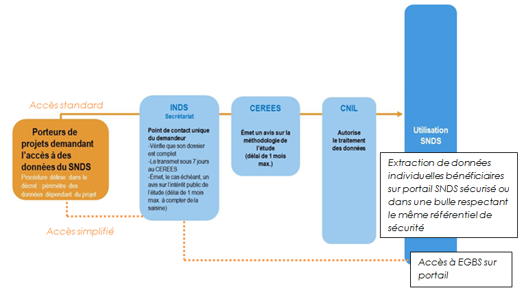

# Guide pédagogique SNDS pour accès sur projet
<!-- SPDX-License-Identifier: MPL-2.0 -->

::: tip
Cette fiche provient du guide pour les [accès sur projet](../../files/Cnam/2019-07_Cnam_Guide_pedagogique_SNDS_acces_projet_MPL-2.0.docx) publié par la Cnam, sous licence MPL 2.0

:::

## Préambule et définitions

Ce guide pédagogique sous forme de fiches pratiques a été rédigé **pour tous les utilisateurs du SNDS porteurs d’un projet et demandant une extraction de données SNDS** pour rappeler de manière succincte les procédures, les conditions et les modalités pratiques d’accès aux données. 
Il s’adresse également **au Délégué à la Protection des Données des organismes** afin de préciser leur rôle et les conditions de sécurité des données SNDS à respecter.
Ce guide sera incrémenté au fur et à mesure des évolutions de procédures.

Voici quelques définitions pour la suite :

*  **Autorité d’Enregistrement** (AE) : personne désignée pour habiliter les utilisateurs à accéder au portail et à ses données.

*  **Délégué à la Protection des Données** (DPD) : personne chargée de la protection des données au sein de son organisation et du respect au RGPD.

*  **Portail** : interface d’accès aux données du SNDS et services associés (outils d’exploration, documentation…).

*  **SNDS** : ensemble des données qui constituent le Système National des Données de Santé mentionné à l’*Article 1461-1-1 de la loi de modernisation du système de santé du 26 janvier 2016*.

* **Système-fils** : système du SNDS élargi, mettant à disposition tout ou partie du SNDS à des fins de recherche, d’études ou d’évaluation et répondant aux mêmes critères de sécurité que ceux du portail SNDS.

*  **Utilisateur** : toute personne qui dispose d’un droit d’accès aux données du SNDS.
  

*  **Responsable de traitement** (RT) : Personne morale équivalant au « promoteur ». Le RT détermine l’objectif du projet et les moyens de l’atteindre. Il est juridiquement responsable du projet et l’autorisation CNIL est établie à son attention. 

*  **Responsable de mise en œuvre** (RMO) : Également personne morale, le RMO est le responsable scientifique du projet, il est aussi appelé « l’investigateur coordonnateur ». Généralement, son représentant rédige le protocole scientifique et supervise la manipulation des données. 

## Qu’est-ce que le Système National des Données de Santé SNDS ? 

*Le SNIIRAM, créé par la loi de financement de la sécurité sociale du 23 décembre 1998, article L.161-28-1 du code de la Sécurité Sociale, est un entrepôt national de données médico-administratives anonymes regroupant les informations issues des remboursements effectués par l’ensemble des régimes d’assurance maladie pour les soins du secteur libéral dont les objectifs sont de contribuer à une meilleure gestion de l’Assurance maladie et des politiques de santé, d’améliorer la qualité des soins et de transmettre aux professionnels de santé les informations pertinentes sur leur activité.*

La loi du 26 janvier 2016 de modernisation de notre système de santé instaure d’une part, en son article 193, le Système national des données de santé (SNDS) qui constitue dans la continuité du Système national d’information inter-régime de l’Assurance Maladie (SNIIRAM), une base de données unique relevant du code de la Santé Publique et, d’autre part, revoit le circuit pour accéder aux données. 

Géré par la CNAM, le SNDS permet de chaîner :

*  les données de l’assurance maladie (base SNIIRAM),
*  les données des hôpitaux (base PMSI),
*  les causes médicales de décès (base du CepiDC de l’Inserm),
*  les données relatives au handicap (en provenance des MDPH - données de la CNSA),
*  un échantillon de données en provenance des organismes complémentaires.

Les deux premières catégories de données sont déjà disponibles et constituent la première version du SNDS. Les causes médicales de décès alimentent le SNDS depuis le deuxième semestre 2017. 
Le SNDS a pour finalité la mise disposition de ces données afin de favoriser les études, recherches ou évaluation présentant un caractère d’intérêt public et contribuant à l’une des finalités suivantes :

*  l’information sur la santé ainsi que sur l’offre de soins, la prise en charge médico-sociale et leur qualité, 
*  la définition, à la mise en œuvre et à l’évaluation des politiques de santé et de protection sociale,
*  la connaissance des dépenses de santé, des dépenses d’assurance maladie et des dépenses médico-sociales,
*  l’information des professionnels, des structures et des établissements de santé ou médico-sociaux sur leur activité,
*  la surveillance, à la veille et à la sécurité sanitaires,
*  la recherche, aux études, à l’évaluation et à l’innovation dans les domaines de la santé et de la prise en charge médico-sociale.

Il est interdit de procéder à un traitement qui aurait comme finalité :

*  la promotion en direction des professionnels de santé ou des établissements des produits de santé ;
*  l’exclusion de garanties des contrats d’assurance ou la modification de cotisations ou de primes d’assurance pour un individu ou un groupe d’individus.

Pour garantir et protéger la confidentialité de ces données, un pseudonyme, code non signifiant obtenu par un procédé cryptographique irréversible du NIR, est associé aux données se rapportant à chaque personne. 

Ce procédé permet de relier, pour une même personne, l’ensemble de ses données au sein du SNDS. 
Il permet également d’apparier, pour une même personne, des données en provenance du SNDS et des données figurant dans d’autres systèmes, avec l’autorisation de la CNIL. 

Les données du SNDS sont conservées pendant une durée de dix-neuf ans, en plus de l’année au cours de laquelle elles ont été recueillies. 
Passé ce délai, ces données sont archivées pour une durée de dix ans.

L’accès aux données du SNDS et leur utilisation ne peut se faire que dans **des conditions respectant le référentiel de sécurité**, visant à garantir la confidentialité et l’intégrité des données et la traçabilité des accès et autres traitements.

Toutes les personnes traitant des données du SNDS sont soumises au secret professionnel dans les conditions et sous les peines prévues à l’*article 226-13 du code pénal*.

Par ailleurs, le SNDS étant constitué de données de santé à caractère personnel, les traitements de données qui en sont issues sont soumis aux dispositions du *chapitre IX de la loi n° 78-17 du 6 janvier 1978 relative à l'informatique, aux fichiers et aux libertés*, notamment dans sa dimension pénale.

## Qui a accès au SNDS et à quelles données ?
Le SNDS assure la mise à disposition des données selon la nature des données et le risque de ré-identification des patients, en deux modalités distinctes :

*  Les données pour lesquelles aucune ré-identification n’est possible sont accessibles et réutilisables par tous, en [open data :](http://open-data-assurance-maladie.ameli.fr/) 

*  Les **données potentiellement ré-idenfiantes** sont accessibles en environnement maîtrisé, respectant le référentiel de sécurité, avec des accès aux données SNDS régulés :

* [ ]  **Sur autorisation pérenne**, pour l’Etat et ses agences, des établissements publics et des organismes **chargés d’une mission de service public** (recherches, sphère santé,…) listés dans le décret n°2016-1871 du 26 décembre 2016 : **accès aux données du SNDS en déclinant les accès selon les niveaux d’agrégation des données** (individuelles/agrégées bénéficiaires, …) **et les historiques accessibles**,

* [ ]  **Sur projet**, via des accès standards après avis favorables ou favorables avec recommandation de l’INDS (Institut National des Données de Santé) et du CEREES (Comité d’Expertise pour les Recherches, les Etudes et les Evaluations), et sur autorisation de la CNIL, ou via des accès simplifiés, **à des fins de recherche, d’étude et d’évaluation d’intérêt public dans le domaine de la santé, pour les demandeurs publics et privés** (intermédiaires nécessaires dans certains cas pour respecter les 2 finalités interdites qui sont la promotion des produits, et la modification des contrats d’assurance) :  **accès à une partie du SNDS (EGB) ou à des extractions de données du SNDS restituées dans des conditions de sécurité équivalente**.

**La procédure d’accès standard sur projet à une extraction de données du SNDS est la suivante :**

1. Déposer une demande auprès de l’Institut National des Données de Santé (INDS), qui assure le secrétariat unique de dépôt des recherches et **évalue l'intérêt public du projet** (au cas par cas) dans les délais impartis par la loi (7 jours) ;

2. Le Comité d'Expertise pour les Recherches, les Etudes et les Evaluations dans le domaine de la Santé (CEREES) se charge d’émettre un avis (sous un délai d’un mois) sur la **méthodologie retenue**, sur la nécessité du recours à des données à caractère personnel, sur la pertinence de celles-ci par rapport à la finalité du traitement, sur le périmètre demandé des données et, s'il y a lieu, sur la qualité scientifique du projet ;

3. La Commission Nationale de l’Informatique et des Libertés (CNIL), dont l’instruction est facilitée par l’avis du CEREES et l’évaluation de l’INDS, donne expressément **une autorisation sous un délai de 2 mois renouvelable** ;

4. En fonction de l’autorisation de la CNIL, une **convention** est signée entre la Cnam et le responsable du traitement des données afin de mettre en œuvre l’extraction des données sur le périmètre autorisé.

**La procédure d’accès simplifiée à l’EGB (Echantillon de données individuelles de consommation de soins) est la suivante :** 

La CNIL donne compétence à l’INDS pour approuver l’accès à l’EGB après examen des 5 conditions cumulatives :

*  la finalité́ d'intérêt public de la recherche, de l’étude ou de l’évaluation dans le domaine de la santé,

*  la justification apportée par le responsable de traitement pour démontrer la pertinence scientifique du projet,

*  l’absence de croisement d’identifiants potentiels,

*  la durée de l'accès au portail pour le traitement envisagé qui doit être limitée à̀ celle nécessaire à la réalisation de la recherche, l’étude ou l’évaluation,
  

*  le respect des exigences applicables au SNDS (notamment référentiel de sécurité́).

La responsabilité de s’engager dans une procédure simplifiée ou standard sera portée par le responsable de traitement. 
L’INDS devra sous 15 jours soit notifier l’approbation, soit l’informer de la transmission de son dossier vers la procédure classique (CEREES – CNIL) auquel cas les délais de cette procédure s’appliqueront. 

**Pour les acteurs soumis à des dispositions spécifiques : l’accès des entreprises productrices de produits de santé (industriels de santé) et des assureurs en santé est plus fortement encadré.** 
**Ils doivent :**

*	soit passer par un bureau d’études ou un organisme de recherche indépendant : l’INDS vérifie que le bureau d’études choisi a fait un engagement de conformité au référentiel sur la transparence des bureaux d’études,

*   soit démontrer que les modalités techniques d’accès ne permettent en aucun cas d’utiliser le SNDS pour des finalités interdites identifiées dans la loi par un audit préalable du responsable de traitement.  

## Quelle est la sécurité au sein du SNDS ?

Le SNDS étant principalement constitué de données personnelles de santé, les traitements de données qui en sont issues doivent être strictement encadrés afin de protéger les libertés et droits fondamentaux des personnes. 
A ce titre, ces traitements sont soumis aux dispositions :

*  de la Loi Informatique et Libertés ;

*  du règlement européen sur la protection des données (à compter du 25 mai 2018) ;

*  du code de la santé publique.

La Commission Nationale de l'Informatique et des Libertés (CNIL) est chargée de surveiller l’application de ces textes. 
En cas de méconnaissance de leurs dispositions, les responsables de traitement peuvent faire l’objet de sanctions administratives importantes.

Conformément à la loi n° 2016-41 du 26 janvier 2016 de modernisation de notre système de santé, les accès aux données du SNDS doivent s’effectuer dans « des conditions assurant la confidentialité et l'intégrité des données et la traçabilité des accès et des autres traitements ». 
**Un référentiel précise ces conditions en édictant les règles de sécurité que tout système utilisant des données du SNDS se doit de mettre en place. 
Les modalités d’application de ce référentiel sont indiquées dans l’arrêté du 22 mars 2017.**

En premier lieu, la sécurité des données est garantie par l’obligation pour chaque gestionnaire de système de réaliser une analyse de risque. 
C’est cette analyse qui permet au gestionnaire de s’assurer que les données sont correctement protégées par des mesures de sécurité adéquates.

Le référentiel s’appuie notamment sur les mesures techniques et organisationnelles suivantes pour garantir la sécurité des traitements, en imposant :

*  **la pseudonymisation** : pour chaque individu, l’ensemble des informations permettant de facilement l’identifier (NIR, …) doit être remplacé par un pseudonyme, c’est-à-dire par un code alphanumérique irréversible ne permettant pas le rattachement à son identité ; La pseudonymisation systématique des données constitue une des mesures fondamentales du dispositif dans le but de conserver la confidentialité des données manipulées.

**La pseudonymisation des identifiants des patients ne rend pas les données du SNDS anonymes strictement ; le croisement de certaines variables, appelées « identifiants potentiels », peut permettre de ré-identifier les patients.** 
**Ce sont les données suivantes :**

1.  **Commune de résidence du bénéficiaire**
2.  **Année et mois de naissance**
3.  **Date de soins en jour, mois, année (et dérivés : date d’entrée, date de prescription …)**
4.  **Date de décès en jour, mois, année**
5.  **Commune de décès**

Ainsi, des **profils d’accès aux données ont été mis en place** afin de n’autoriser l’accès qu’à un seul identifiant potentiel à la fois **selon les autorisations décrites dans le décret**.

*  **l’authentification** : elle permet d’une part de contrôler les accès et d’autre part d’imputer les actions effectuées sur le système à une personne désignée. Une authentification forte sur le portail SNDS sera donc mise en place dès mars 2019 à travers la concaténation d’au moins deux facteurs d’authentification ; 

*  **la traçabilité** : l’ensemble des événements relatifs à la sécurité du système doit être tracé. Cette traçabilité (entrées, sorties, utilisateurs….) permet de contrôler l’utilisation de données et de disposer de preuves pouvant être instruites en justice ;

*  **le contrôle** : il permet de s’assurer d’une utilisation des données conforme à la loi et au référentiel. Effectué a posteriori par le biais d’audits, de la revue annuelle des habilitations et de contrôles de la CNIL a posteriori, il est notamment rendu possible par l’utilisation conjointe de la traçabilité et de l’authentification. En cas de non-respect des conditions d’utilisation des données, des sanctions adéquates peuvent être prononcées, notamment la suspension de l’accès aux données pour tout l’organisme.

*  **la sensibilisation et la formation des utilisateurs**  avec la mise en place d’un dispositif de formation aux données, certains modules rendus obligatoires, notamment ceux présentant le référentiel de sécurité du SNDS ainsi que ceux permettant l’accès aux données individuelles bénéficiaires (Cf fiche 6 : Quels sont les différents parcours de formation ?).

*  **Les Conditions Générales d’Utilisation** (CGU) qui formalisent l’engagement individuel au respect des conditions d’accès aux données doivent être signées en ligne dès la première utilisation du portail SNDS (Cf. fiche 4 : Quelles sont les conditions d’ouverture d’un compte ?).

**Hors portail d’accès aux données du SNDS, des systèmes fils autorisés et homologués au référentiel de sécurité peuvent accueillir des données du SNDS.**

En plus de ces règles spécifiques, les traitements de données du SNDS sont soumis à l’ensemble des référentiels généraux applicables aux systèmes d’information du Ministère des Affaires sociales et de la santé, à savoir : la Politique Générale de Sécurité des Systèmes d’Information en Santé (PGSSI-S), la Politique de Sécurité des Systèmes d’Information pour les ministères chargés des affaires sociales (PSSI MCAS), et le Référentiel Général de Sécurité (RGS).

## Quelles sont les conditions d’ouverture d’un compte ?

**- Pour obtenir l’ouverture d’un compte SNDS, l’utilisateur doit avoir suivi les formations pré-requises** préalablement à l’attribution de droits d’accès aux données du SNDS :

*  Le module « **Données d’extraction DCIR pour les accès sur projet** » pour les utilisateurs d’extractions de données sur projet, ou la formation « **Architecture et données du SNIIRAM/SNDS** » pour les utilisateurs de l’EGB sur projet. C’est un prérequis **obligatoire** pour être habilité à accéder aux données du SNDS sur le portail SNDS. Cette formation est ouverte dès lors que le CEREES a formulé un avis favorable ou favorable avec recommandation sur le projet. 

*  Le module «**EGB**», produit de restitutions de données de consommation individuelles bénéficiaires échantillonnées. C’est également une formation **obligatoire** pour accéder aux données du SNDS, dès lors que le CEREES a formulé un avis favorable ou favorable avec recommandation ou que l’INDS en a autorisé l’accès simplifié ;

**- L’utilisateur doit ensuite effectuer une demande d’ouverture de compte SNDS par l’intermédiaire de l’Autorité d’Enregistrement (AE)** : la création de compte ne s’effectue pas automatiquement après avoir participé à la formation. 
L’utilisateur doit être habilité nominativement par l’AE qui est le directeur de la Stratégie, des Etudes et des Statistiques de la Cnam. 
L’AE vérifie que cet utilisateur est désigné dans la convention passée entre le responsable du traitement du projet et la Cnam.

**- L’utilisateur doit signer les Conditions Générales d’Utilisation** (CGU) du SNDS, à la première connexion au portail d’accès aux données, qui formalisent : 

*  l’engagement individuel de l’utilisateur au respect des conditions d’accès aux données :
- le respect des finalités d’utilisation autorisées et interdites du SNDS,
- l’absence d’action visant la ré-identification,
- l’obligation de ne diffuser que des données anonymes,
- l’engagement du respect du référentiel de sécurité.

*  les conditions d’utilisation du portail et des services associés :

L’utilisateur a interdiction d’exporter du portail SNDS des données non anonymes du SNDS, sauf cas particulier d’exports de données dans un système-fils (SNDS élargi) respectant le même référentiel de sécurité : Il ne doit pas être possible, à partir des données, de déduire ou revenir à une information personnelle sur un individu.

L’utilisateur est informé que ses actions font l’objet de traces qui seront exploitées pour détecter tout comportement considéré comme anormal (dont non-respect des engagements pris).

Pour les données SNDS des systèmes-fils, ces CGU sont également signées lors de la convention passée avec la Cnam et annexée à celle-ci.

**- L’utilisateur doit utiliser les données du SNDS dans un cadre sécurisé** qui respecte le référentiel de sécurité, dans le portail ou dans un système fils.

