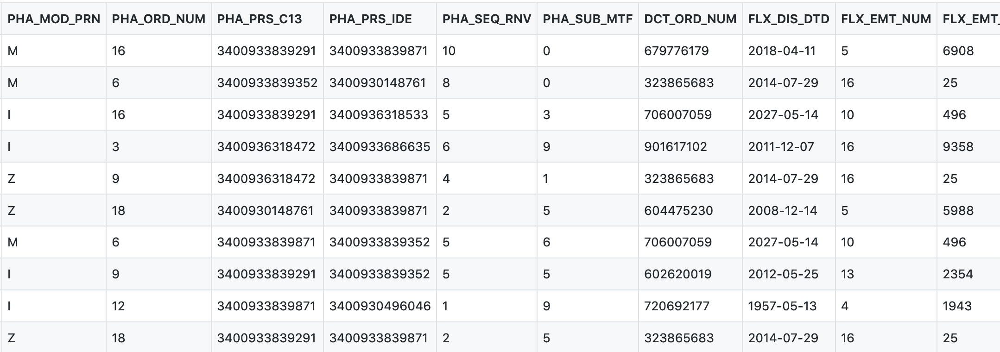

# SNDS synthétique
<!-- SPDX-License-Identifier: MPL-2.0 -->

Le SNDS synthétique est une base de données générée à partir d'une description formelle du SNDS.

Ces données sont **factices**, et ne contiennent aucune information personnelle. 
Elles sont diffusées sous [Licence Ouverte](https://www.etalab.gouv.fr/licence-ouverte-open-licence).
 
Le SNDS synthétique peut servir :
- à découvrir la forme des données, 
- de support pour des exercices de découverte,
- de données tests pour des programmes.

## Où trouver le SNDS synthétique ?

Pour visualiser les données synthétiques, le plus simple est actuellement de parcourir le dossier `schemas` du [projet GitHub SNDS synthétique](https://github.com/indsante/synthetic-snds/)[^1]. 

[^1]: Ce projet est un miroir du [projet GitLab SNDS synthétiques](https://gitlab.com/healthdatahub/synthetic-snds). 
    GitHub a l'intérêt de formater les fichiers csv sous la forme de tables.  

Voici par exemple 10 lignes synthétiques de la [table ER_PHA_F du DCIR](https://github.com/indsante/synthetic-snds/blob/master/schemas/DCIR/ER_PHA_F.csv).

Vous pouvez également [télécharger une archive zip du projet](https://github.com/indsante/synthetic-snds/archive/master.zip).

## Génération des données

Les données synthétiques sont générées à partir du [schéma formel du SNDS](https://gitlab.com/healthdatahub/schema-snds), avec la librairie Python [tsfaker](https://gitlab.com/healthdatahub/tsfaker)[^2].

[^2]: La librairie `tsfaker` a été développé pour le SNDS synthétiques. 
    Sa spécificité par rapport à d'autres libraires équivalente est de s'appuyer sur le standard [Table-Schema](../glossaire/table-schema.md), et de bien gérer un grand nombre de clés étrangères. 

À chaque modification du schéma, de nouvelles données synthétiques sont automatiquement générées sur le projet [SNDS synthétique](https://github.com/indsante/synthetic-snds/). 

Seulement 10 lignes sont générées pour chaque table, de façon à limiter la taille du projet. 
Il est possible de générer plus de lignes par table en suivant les instructions en fin du README du projet. 

## Intérêts

Le SNDS synthétique a pour principal intérêt d'être libre de réutilisation, car il ne contient aucune donnée personnelle.

Les données respectent 
- la **structure** des tables, 
- les **jointures** entre tables,
- le **type** des variables,  
- les valeurs des variables associées à des **nomenclatures**,
- des **contraintes simples** sur les variables (min, max, longueur).

## Limites

### Absence d'informations statistiques 

Les données synthétiques ne contiennent pas d'information statistiques. 
Il est donc impossible de réaliser des analyses à partir de ces données.

::: tip Note
Il serait facile d'ajouter des distributions univariés sur les variables, en ajoutant leur fréquence d'apparition dans les nomenclatures. Une petite évolution de la librairie `tsfaker` serait alors nécessaire (cf [issue 5](https://gitlab.com/healthdatahub/tsfaker/issues/5)).
::: 

En particulier, les données ne respectent aucune règle logique entre paires de variables. 
Une date de début peut par exemple être postérieure à une date de fin. 
Il serait possible d'ajouter de telles contraintes par un traitement _a posteriori_.

### Pas de version par année

Le schéma des tables évolue chaque année, avec l'ajout ou la suppression de tables et variables.  
Ces informations sont actuellement présentent dans le schéma SNDS, mais de façon trop incomplète pour générer un SNDS synthétiques pour chaque année.

### Erreurs dans le schéma

Le schéma des tables est imparfait et incomplet. 
Ces erreurs sont directement visibles dans les données synthétiques.

Il manque en particulier de nombreuses tables de nomenclatures, qui indiquent les valeurs prises par les variables, avec les libellés correspondant aux codes employés. 

## Amélioration des données synthétiques

Vous pouvez contribuer à améliorer les données synthétiques en améliorant le schéma formel du SNDS, via des Merge-Request sur le [projet schema-snds](https://gitlab.com/healthdatahub/schema-snds). 

Des liens directs vers les schémas sont disponibles sur le [dictionnaire interactif](https://drees.shinyapps.io/dico-snds), ainsi que sur les pages de la [section table](../tables/README.md) de cette documentation.  

Si vous souhaitez proposer d'autres types d'améliorations, vous pouvez ouvrir des issues sur le projet schema-snds, ou sur le [projet tsfaker](https://gitlab.com/healthdatahub/tsfaker/issues/) si cela concerne la procédure de génération.
  
