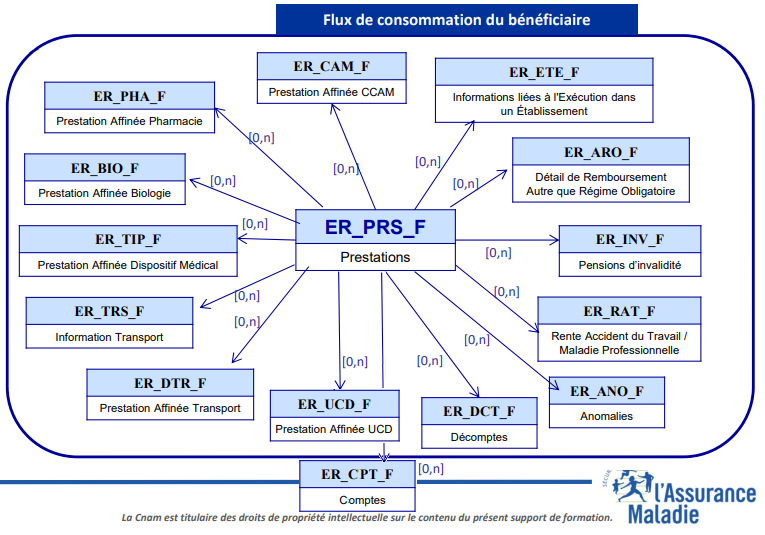
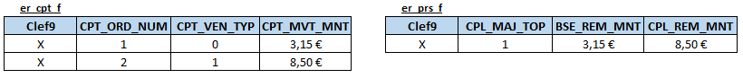
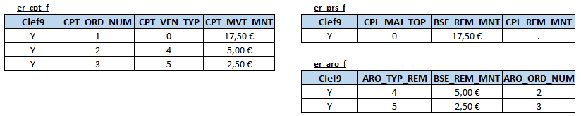
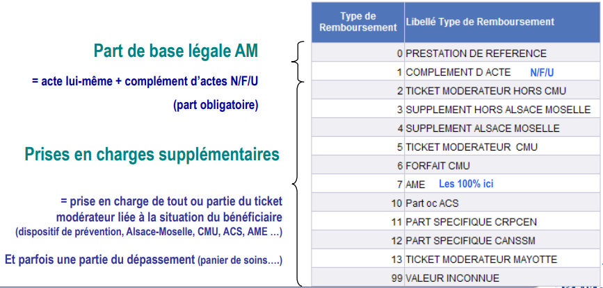
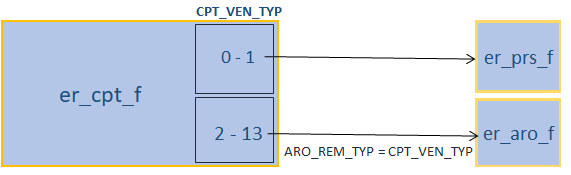

---
tags:
  - Dépenses
  - Prestations
  - DCIR/DCIRS
---

# Table de données comptables du DCIR (ER\_CPT\_F)
<!-- SPDX-License-Identifier: MPL-2.0 -->

Cette fiche a pour but de décrire la table de données comptables du DCIR, **ER_CPT_F**. Cette table retrace l'ensemble des dépenses engagées par les caisses d'assurance maladie et inscrites à leur comptabilité. Son champ est toutefois restreint, coïncidant avec celui du DCIR : par exemple, les montants de séjours en hôpital public (qui transitent uniquement par le PMSI) ne sont pas inclus. 

Les montants de la table comptable ER_CPT_F cumulent les *montants remboursés* trouvés dans les tables ER_CPT_F (pour la part dite "légale" ou "commune") et ER_ARO_F (pour les parts "supplémentaires" accordés aux bénéficiaires de la Complémentaire santé solidaire ou du régime d'Alsace-Moselle).

Dans le schéma en étoile des tables du DCIR, la table de données comptables est l'une des tables dimensionnelles reliées à la table centrale ER_PRS_F :



Ce schéma est tiré du diaporama de la formation *Données Individuelles Bénéficiaires* (décembre 2022), mais la table ER_CPT_F a été ajoutée. Très spécifique, la table de données comptables n'est en effet pas mentionnée dans cette formation, ni décrite au dictionnaire *KWIKLY* (décembre 2022).

Comme le suggère ce schéma, la table ER_CPT_F contient les 9 variables de jointure du DCIR, ce qui permet une jointure avec les autres tables du DCIR. 

À part ces variables de jointure, elle compte **12 variables** que l’on classe ici en 6 groupes. 

1. Clef technique d’identification de la ligne
- `CPT_ORD_NUM` : N° ordre ventilation comptable
2. Montant versé
- `CPT_MVT_MNT` : Montant (signé) du mouvement comptable
- `CPT_MVT_SGN` : Signe du mouvement comptable
- `CPT_MVT_SNS` : Sens du mouvement comptable
3. Numéro de compte comptable
- `CPT_MIR_NUM` : N° compte MIRCOSS
- `CPT_TRM_RGM` : N° de compte régime
4. Type de mouvement
- `CPT_VEN_TYP` : Type de ventilation
- `GES_CPT_COD` : Code gestion comptable mnémonique
5. Période
- `CPT_DEP_PER` : Période comptable
- `CPT_EXC_RTC` : Exercice de rattachement
6. Organisme concerné
- `GES_GRG_COD` : Grand régime de gestion comptable
- `ORG_CLE_NEW` : Code de l’organisme de liquidation

## Quelques éléments de contexte

Les mouvements comptables trouvés dans le DCIR s'inscrivent dans le cadre d'un plan comptable commun à l’ensemble des organismes de sécurité sociale, toutes branches confondues. Ce plan a été mis en place en 2001 et s'appelle le **PCUOSS** (plan comptable unique des organismes de sécurité sociale). Il s’inscrit depuis 2022 dans le cadre d’un [Recueil des normes comptables pour les organismes de sécurité sociale](https://www.economie.gouv.fr/cnocp/recueil-normes-organismes-securite-sociale) géré par le Conseil de normalisation des comptes publics.

Comme dans toute comptabilité, chaque mouvement comptable est imputé à un compte et les comptes sont numérotés. Le plan de comptes (la version actuelle est annexée à l'[arrêté du 1er août 2022](https://www.legifrance.gouv.fr/jorf/id/JORFTEXT000046221530)) prend la forme d’une nomenclature emboîtée. Pour le compte 656 qui comptabilise les prestations sociales versées, les premiers numéros de compte rencontrés sont ainsi :

656 : Prestations sociales

6561 : Prestations légales

65611 : Prestations légales « maladie - maternité »

656111 : Prestations maladie

6561111 : Exécutées en ville

65611111 : Honoraires

656111111 : des omnipraticiens

La nomenclature est relativement détaillée en ce qui concerne les prestations d'assurance maladie, mais pas à un point qui permette d'établir des statistiques très parlantes. Par exemple, l'ensemble des dépenses d'honoraires de médecins spécialistes sont regroupés dans un compte unique, quelle que soit leur spécialité.

Le chapitre 10 du [manuel de comptabilité des organismes de Sécurité sociale](https://en3s.fr/articles-regards/Publication/2020-Manuel-compta.pdf) donne d'intéressantes précisions à ce sujet.

### Compte 656

Le compte 656 regroupe la majorité des prestations du DCIR.

Ses principales subdivisions sont :

- 6561 Prestations légales
- 6562 Prestations d’action sociale (ou extra-légales)
- 6563 Actions de prévention

Dans les flux du DCIR, la grande majorité des flux est imputée au compte 6561 dont les subdivisions indiquent la couverture au titre de laquelle la prestation a été versée :

- 656**111** pour le risque maladie
- 656**122** pour le risque maternité
- 656**121** pour le risque AT-MP, concernant les prestations d’incapacité temporaire
- 656**122** pour le risque AT-MP, concernant les prestations d’incapacité permanente (il ne s’agit alors pas de remboursements de soins mais de rentes, d’indemnités en capital, ...)

À partir du 7e caractère, les subdivisions indiquent la **nature de la prestation**. Par exemple, 656111**114** correspond aux honoraires des professions paramédicales. La numérotation est identique dans les comptes 656111, 656112 et 656121, ce qui est très pratique. Par exemple, les comptes dont le numéro est en 656___131 correspondent aux médicaments délivrés en officine de ville :

- 656**111**131 dépenses de médicaments délivrés en officine de ville couverts par le risque maladie,
- 656**112**131 dépenses de médicaments délivrés en officine de ville couverts par le risque maternité,
- 656**121**131 dépenses de médicaments délivrés en officine de ville couverts par le risque AT-MP.

Enfin, le dernier caractère est 0 ou 9, et correspond à l’exercice de rattachement (respectivement exercice courant ou exercice précédent), c'est-à-dire l'année durant laquelle les soins ont été réalisés (la comptabilité est ainsi "en date de soins"). À l'époque de la mise en place du PCUOSS, l’un des enjeux (outre les objectifs d'harmonisation et de normalisation) était en effet de pouvoir suivre la comptabilité en **date de soins** (voir notamment la [circulaire CNAMTS du 23/11/2001](http://www.mediam.ext.cnamts.fr/ameli/cons/CIRCC/CC0111/011123-A.PDF)). L’une des innovations du nouveau plan comptable était la création de comptes distincts pour les prestations versées au titre de l’année courante ou de l’année précédente. On a donc dans l'exemple des honoraires dentaires (couverts par le risque maladie) deux comptes comptables :

- 656111115**0** : Honoraires dentaires - exercice courant,
- 656111115**9** : Honoraires dentaires - exercice précédents.

### Compte 45

Dans la table ER_CPT_F, on trouve des mouvements comptables afférents à des prestations versées par les organismes d'Assurance maladie mais financées par des tiers (État, régime d’Alsace-Moselle, ...). Ils sont imputés au compte 4 (COMPTES DE TIERS), et très majoritairement au compte 45 (Autres organismes de sécurité sociale) même si on rencontre aussi le compte 44 (État) pour les versements d'allocation supplémentaire d'invalidité.

Il s'agit d'abord des prestations versées au titre du **régime local d'assurance Maladie d’Alsace-Moselle**, auquel le compte 45644 est dédié. Ses subdivisions indiquent le régime d'affiliation :

- 45644**1** pour le régime général,
- 45644**2** pour le régime agricole,
- 45644**6** pour les autres régimes.

Cette nomenclature ne permet pas de suivre les dépenses par nature : l'ensemble des versements sont imputés au compte numéroté 18 (exemple 456441**18** pour le régime général) excepté les prises en charges hospitalières légales (11, exemple 456441**11**) et le forfait de prise en charge hospitalière local (nature de prestation PJL)[2, exemple 456441**12**].

Ensuite, il y a les dépenses d’**Aide Médicale d’Etat** (AME) qui sont imputées au compte 457312. Une quinzaine de subdivisions distinguent plusieurs catégories de soins de ville (commençant par 1) et d'hospitalisations (2) :

- 457312**11** Prestations IVG
- 45731212 Honoraires dentaires
- 457312**13** Honoraires paramédicaux
- 457312**14** Médicaments et dispositifs médicaux
- 457312**15** Frais d’analyse de biologie médicale
- 457312**16** Frais de transport
- 457312**18** Actes et consultations externes Secteur public
- 457312**21** Etablissements privés
- 457312**22** Etablissements médico-sociaux
- 457312**23** Etablissements publics-Autres frais d’hospitalisation
- 457312**24** Etablissements publics-Honoraires
- 457312**25** Etablissements publics-forfaits journaliers
- 457312**26** Etablissements-IVG

Enfin, les dépenses de **Complémentaire santé solidaire** (CSS) gérée par les organismes complémentaires sont imputés au compte 45737 : 457376 principalement et 457372 de façon marginale. Il n'y a pas de subdivisions permettant de distinguer la nature des prestations versées. Ces comptes n'étaient pas utilisés avant la création de la CSS en novembre 2019.

On trouve aussi dans le SNDS des numéros comptables en 451, notamment pour des prestations spécifiques crées pour le financement de prestations exceptionnelles de la pandémie de Covid-19.

## Description

Dans cette partie, on décrit plus précisément les 6 groupes de variables.

### 1. **Clef technique d'identification de la ligne**

- `CPT_ORD_NUM` : N° ordre ventilation comptable

Par la suite, on appelle "clef9" la combinaison des 9 variables de jointure du DCIR. Pour rappel, une valeur de *clef9* identifie de façon unique une ligne de la table ER_PRS_F. Autrement dit, la combinaison de variables *clef9* est une **clef unique** de la table ER_PRS_F : chaque combinaison de valeurs ne se retrouve que dans une seule ligne de cette table.

Une ligne de la table ER_PRS_F peut correspondre à plusieurs dépenses comptables. Par exemple, certaines lignes correspondent au remboursement d'une prestation avec complément (`CPL_MAJ_TOP = 1`) : les variables `BSE_REM_MNT` et `CPL_REM_MNT` sont alors toutes deux renseignées et on va trouver deux lignes avec la même *clef9* dans la table ER_CPT_F, pour le remboursement de la prestation et de son complément. Un autre cas très fréquent est celui du versement d'une part supplémentaire : le remboursement de la prestation se fait via deux mouvements comptables, pour la part légale commune à tous les assurés et l'autre pour la part supplémentaire.

La variable `CPT_ORD_NUM` est donc un compteur qui permet de distinguer plusieurs versements comptables afférents à la même clef9. La **clef unique** de la table ER_CPT_F est ainsi la combinaison des 9 variables de jointures du DCIR **et** de la variable `CPT_ORD_NUM`.

Plus concrètement, la variable `CPT_ORD_NUM` *numérote* les lignes de ER_CPT_F correspondant à la même clef9. La numérotation commence par les parts légales des remboursements et continue par les parts supplémentaires. On trouve ainsi la valeur `CPT_ORD_NUM = 1` pour les dépenses comptables que l'on retrouve dans la table ER_PRS_F (variables `BSE_REM_MNT` et `CPL_REM_MNT`). Puis les valeurs `CPT_ORD_NUM ≥ 2` correspondent aux remboursements supplémentaires : le montant du versement se retrouve alors dans la table ER_ARO_F (variable `ARO_REM_MNT`). Dans les tables ER_CPT_F et ER_ARO_F, le même numéro d'ordre est identique (c'est-à-dire que `ARO_ORD_NUM = CPT_ORD_NUM`), ce qui permet de faire le lien.

Dans l'exemple qui suit, le remboursement d'un acte technique d'infirmière avec complément pour dimanche ou jour férié donne lieu à deux lignes dans la table ER_CPT_F et à une ligne unique dans la table ER_PRS_F. La combinaison de variables *clef9* est la même (valeur "X"), ce qui fait le lien entre les tables.



Dans l'exemple suivant, une consultation de médecin généraliste donne lieu à trois remboursements : une part légale (70% des 25€ dépensés soit 17,50€), une part supplémentaire grâce au régime d'Alsace-Moselle (20% soit 5€) et enfin une part supplémentaire grâce à la CSS (10% soit 2,5€) qui annule le ticket modérateur. Les trois lignes dans la table ER_CPT_F ont la même combinaison de variables *clef9* (valeur "Y"), ce qui fait aussi le lien avec la table ER_PRS_F et la table ER_ARO_F. 



Malheureusement, il y a quelques exceptions à la marge. C'est le cas notamment pour les forfaits journaliers hospitaliers. C'est le cas aussi quand le montant remboursé est nul dans ER_PRS_F : dans ce cas, ce montant nul n'apparaît pas dans ER_CPT_F (absence de ligne dédiée dans la table ER_CPT_F). La numérotation de `CPT_ORD_NUM` commence alors par les parts supplémentaires et la valeur `CPT_ORD_NUM = 1` correspond au versement d'une part supplémentaire trouvée dans ER_ARO_F. Il y a un décalage car dans la table ER_ARO_F la numérotation de `ARO_ORD_NUM` commence tout de même par 2.

Enfin, on peut vérifier empiriquement que la combinaison de 10 variables *clef9 + CPT_ORD_NUM* identifie de façon unique les lignes de la table. Dans la requête suivante, la variable NbRows vaut uniformément 1 (ainsi, chaque combinaison de 10 variables rencontrée n’apparaît que dans 1 ligne) :

```
%let clef9 = FLX_DIS_DTD, FLX_EMT_NUM, FLX_EMT_ORD, FLX_EMT_TYP, FLX_TRT_DTD, ORG_CLE_NUM, DCT_ORD_NUM, PRS_ORD_NUM, REM_TYP_AFF;
proc sql;
select distinct NbRows, count(*) from
    (
    select distinct &clef_9., CPT_ORD_NUM, count(*) as NbRows
    from orameps.ESND_er_cpt_f
    where flx_dis_dtd = '01JAN2022:00:00:00'dt
    group by        &clef_9., CPT_ORD_NUM 
    )
group by        NbRows;
```

### 2. **Montant versé**

- `CPT_MVT_MNT` : Montant (signé) du mouvement comptable

La variable **CPT_MVT_MNT** est simplement le montant de dépense versé lors du mouvement comptable. Le terme "signé" veut dire que le signe du mouvement comptable (+ ou -) est directement contenu dans la variable. Cette notion n’a pas de lien avec la signature du directeur comptable et financier de l’organisme. Comme écrit plus haut, chaque montant comptable trouvé dans `CPT_MVT_MNT` se retrouve soit dans la table ER_PRS_F (variables `BSE_REM_MNT` et `CPT_REM_MNT`) soit dans la table ER_ARO_F (variable `ARO_REM_MNT`).

- `CPT_MVT_SGN` : Signe du mouvement comptable
- `CPT_MVT_SNS` : Sens du mouvement comptable

Comme la variable `CPT_MVT_MNT` est "signée", les variables `CPT_MVT_SGN` (signe du mouvement comptable) et `CPT_MVT_SNS` (sens du mouvement comptable) sont redondantes. Le "sens" (c'est-à-dire débit ou crédit) des opérations comptables est une notion incontournable en comptabilité, ce qui explique peut-être la présence de la variable `CPT_MVT_SNS` dans la table.

La requête suivante ne renvoie presque aucune incohérence entre le signe des 3 variables (uniquement pour des régimes utilisant la norme NTEIR, et à hauteur d'une centaine sur des millions de lignes) :

```
proc format; 
value signe 
low - < 0  = '-'
0          = '0'
0 < - high = '+'; 
run;
proc freq data=orameps.ESND_er_cpt_f;
tables CPT_MVT_MNT * CPT_MVT_SGN * CPT_MVT_SNS / nocol norow nocum nopercent;
where flx_dis_dtd = '01DEC2021:00:00:00'dt;
format CPT_MVT_MNT signe.;
run;
```

### 3. **Numéro de compte comptable**

- `CPT_MIR_NUM` : N° compte MIRCOSS
- `CPT_TRM_RGM` : N° de compte régime

Deux variables indiquent le compte auquel le mouvement comptable est imputé :

- **CPT_MIR_NUM** (numéro de compte MIRCOSS) pour les régimes en norme d'échanges NEC et Noémie.
  - Cette variable omet le dernier numéro du compte (0 ou 9 pour l'exercice). Il faut donc recomposer ce dernier par jointure gauche avec la table ER_PRS_F, grâce à la variable `EXE_SOI_DTD` (date de début des soins). Si l'année de `EXE_SOI_DTD` est identique à l'année du mouvement comptable, le dernier numéro du compte est 0 et sinon 9.
  - Pour les régimes en norme d'échanges NTEIR, elle est valorisée à 99999999999999999999 .
- **CPT_TRM_RGM** (numéro de compte régime) pour les régimes en norme d'échanges NTEIR.
  - Cette variable comprend bien le dernier numéro du compte (0 ou 9 pour l'exercice). 
  - Pour les régimes en norme d'échanges NEC ou Noémie, elle est valorisée à 9 en guise de valeur manquante.

Dans le SNDS, trois tables référentielles indiquent les libellés des numéros de compte :

- oraval.IR_MIR_V ("Comptes comptables MIRCOSS") donne la liste des numéros et leurs libellés à un niveau fin,
- oraval.IR_COP_V ("Comptes COPERNIC") les donne à un niveau un peu plus agrégé,
- oraval.IR_MIR_D ("Table des Comptes Comptables MIRCOSS dénormalisée") correspond à une jointure de ces deux tables. Elle est "dénormalisée" au sens de la théorie de la normalisation des bases de données relationnelles, mais tout à fait "normale" au sens courant.

Les noms MIRCOSS et COPERNIC viennent de l'histoire du PCUOSS : historiquement, ce plan comptable est a élaboré par la *mission interministérielle de réforme de la comptabilité des organismes de sécurité sociale (MIRCOSS)*, entre 1998 et 2000. Cette mission allait de pair avec le projet *Copernic* qui rénovait, entre autres, la gestion opérationnelle de la comptabilité des organismes.

### 4. **Type de mouvement**

- `CPT_VEN_TYP` : Type de ventilation

La variable CPT_VEN_TYP est un véritable pivot de la table er_cpt_f. **Pour les régimes en norme d'échanges NTEIR, elle est malheureusement valorisée à 99**. 

Cette notion est identique à la notion de *Type de remboursement* que l'on retrouve dans l'ensemble des univers AMOS. Les modalités de l'axe d'analyse *Type de remboursement* des univers AMOS sont les suivantes (support de formation « Univers AMOS », partie 3.4, version d'août 2020) : 



Elle permet, d'abord, de distinguer au sein de ER_CPT_F les deux grands types de remboursements :

- valeurs de **0 à 1** pour la part "légale" des prestations versées aux assurés et les rémunérations des professionnels de santé, que l’on va retrouver dans la table **er_prs_f**.
  
  - la valeur 1 identifie les dépenses de compléments *jour férié*, *nuit* et *urgence*. Dans la table ER_PRS_F, on retrouve alors le montant dans la variable `CPL_REM_MNT` dans une ligne vérifiant `CPL_MAJ_TOP = 1` (cette ligne vérifie aussi `CPL_AFF_COD in (1, 2, 3)`). 
  - la valeur 0 identifie les toutes autres dépenses, que ce soit des prestations de base ou des majorations. Dans la table ER_PRS_F, on retrouve alors le montant :
    - dans la variable `CPL_REM_MNT` si c'est une majoration (`CPL_MAJ_TOP = 2`) 
    - dans la variable `BSE_REM_MNT` si c'est une prestation de base, qu'elle soit accompagnée d'un complément (`CPL_MAJ_TOP = 1`) ou non (`CPL_MAJ_TOP = 0`)

- valeurs de **2 à 13** pour les parts "supplémentaires" des prestations versées aux assurés, que l’on va retrouver dans la table **er_aro_f**. Une prestation peut donner lieu à plusieurs remboursements supplémentaires, notamment pour les bénéficiaires de la CSS résidant en Alsace-Moselle. Pour `CPT_VEN_TYP` permet de distinguer ces différents remboursements : 5 pour une dépense prise en charge par la CSS, 4 par le régime d'Alsace-Moselle, ... 
  
Dans ER_ARO_F, la variable `ARO_REM_TYP` correspond au même concept. Les modalités communes à `ARO_REM_TYP` et `CPT_VEN_TYP` se trouvent dans la table oraval.IR_TYR_V. Dans le DCIR, il y a une correspondance ligne à ligne entre la valeur de `CPT_VEN_TYP` et celle de `ARO_REM_TYP` (par exemple 7 dans les deux variables s'il s'agit d'une dépense d'AME). 



- `GES_CPT_COD` : Code gestion comptable mnémonique

Notion propre à la comptabilité des organismes de sécurité sociale, les « gestions comptables » identifient la grande destination de chaque mouvement comptable, c'est-à-dire principalement le fonds national qui la finance. La CNAM gère, et comptabilise séparément, plusieurs fonds nationaux : le fonds national de l’assurance maladie, le fonds national des accidents du travail, le fonds de financement de la complémentaire santé solidaire, le fonds national de prévention des accidents du travail et des maladies professionnelles, ... 

On peut trouver plus de précisions sur les *gestions comptables* dans le [manuel de comptabilité et de gestion de l'EN3S](https://en3s.fr/articles-regards/Publication/2020-Manuel-compta.pdf#p=49) ou dans la [publication des comptes de la Cnam](https://assurance-maladie.ameli.fr/sites/default/files/Comptes%20Cnam%20-%20Exercice%202021.pdf#p=49) (note 2 de l'annexe).

Chaque gestion comptable et ses sections éventuelles sont identifiées par un code en quelques lettres. Ce code se retrouve dans la variable `GES_CPT_COD`, dont les modalités sont listées dans la table oraval.IR_GES_V.

Les codes suivants sont particulièrement intéressants : 

- AN, AI1 et AI2 correspondent au risque AT-MP, dont les prestations sont imputées dans le compte 656121 ou 656122.

- MF5 et MF6 pour les prestations versées aux bénéficiaires de CSS en cas de gestion par les organismes de Sécurité sociale : 
  
  - MF5 pour la part légale (voir plus haut) ;
  
  - MF6 : pour la part supplémentaire (voir plus haut).
  
  Ces mouvements comptables ont une valeur de CPT_VEN_TYP parmi 5 ou 6.

- TM ("trésorerie Assurance maladie") pour, entre autres, les prestations versées pour le compte de tiers, que l'on retrouve dans des numéros comptables commençant par 45 (voir plus haut). Le code CPT_VEN_TYP peut alors valoir 4 (Alsace-Moselle), 5 ou 6 (CSS) ou 7 (AME), ou parfois 0 (par exemple pour les versements d'allocation supplémentaire d'invalidité, qui sont versés pour le compte de l'Etat et imputés au compte 44).

-  SM ("action sanitaire et sociale") correspond dans le DCIR aux prestations versées par le [Fonds National d'Action Sanitaire et Sociale (FNASS)](https://assurance-maladie.ameli.fr/qui-sommes-nous/notre-fonctionnement/financement/fonds-d-action-sans-appel-projet) et imputées au compte 6562.
	
- PM ("prévention, éducation et information sanitaire) correspond dans le DCIR majoritairement à des vaccinations financées par le fonds national de prévention, d’éducation et d’information sanitaire et imputées au compte 6563.

### 5. **Période**

- `CPT_DEP_PER` : Période comptable
- `CPT_EXC_RTC` : Exercice de rattachement

Les deux variables `CPT_DEP_PER` ("Période comptable") et `CPT_EXC_RTC` ("Exercice de rattachement comptable") ne sont pas liés à la date de soins et n'indiquent donc pas l'exercice comptable auquel le mouvement comptable se rattache. 

- La variable `CPT_DEP_PER` correspond à 99.9% à la date de versement (mois avant `FLX_DIS_DTD`) en format mmaaaa. Dans le reste des cas, elle prend la valeur 000000 (c''est alors afférent au risque AT-MP incapacité permanente) ou bien plus rarement à un mois antérieur. 

- La variable `CPT_EXC_RTC` indique une année : l'année en cours sauf si la date de traitement est dans les premiers jours de janvier (en 2021 par exemple, `CPT_EXC_RTC = 2020` pour les `FLX_TRT_DTD` du 1er au 10 janvier 2021 environ, puis ensuite `CPT_EXC_RTC = 2021`).

### 6. **Organisme de liquidation**

- `GES_GRG_COD` : Grand régime de gestion comptable
- `ORG_CLE_NEW` : Code de l’organisme de liquidation

Deux variables sont afférentes à l'organisme de liquidation. Leur principal intérêt est d'être présente dans la table (pas besoin de jointure) mais elles n'indiquent pas spécifiquement d'information comptable.

La variable `GES_GRG_COD` (grand régime de gestion comptable) est égale au grand régime de liquidation du bénéficiaire (notion retrouvée classiquement dans er_prs_f.RGM_GRG_COD). L’identité entre `GES_GRG_COD` et `RGM_GRG_COD` est stricte, ce qui fait que la requête suivante ne renvoie aucune ligne :

```
%macro critere_jointure(a, b, liste_var);
            &a..%scan(&liste_var., 01) = &b..%scan(&liste_var., 01)
%if %sysfunc(countw(&liste_var.)) > 1 %then %do;
    %do k=2 %to %sysfunc(countw(&liste_var.));
        and &a..%scan(&liste_var.,&k.) = &b..%scan(&liste_var.,&k.)
    %end;
%end;
%mend;
%let clef9 = FLX_DIS_DTD FLX_EMT_NUM FLX_EMT_ORD FLX_EMT_TYP FLX_TRT_DTD ORG_CLE_NUM DCT_ORD_NUM PRS_ORD_NUM REM_TYP_AFF ;
Proc sql;
select count(*)
from         orameps.ESND_er_cpt_f cpt 
left join    orameps.ESND_er_prs_f prs on %critere_jointure(prs, cpt, %nrQuote(&clef9.)) 
where cpt.flx_dis_dtd = '01DEC2021:00:00:00'dt and (GES_GRG_COD ne RGM_GRG_COD);
quit;
```

La variable `ORG_CLE_NEW` (code de l’organisme de liquidation) se retrouve dans les 16 tables du DCIR, on ne la commente pas ici. 

### **Cas particulier de la variable REM_TYP_AFF dans la table er_cpt_f**

Pour rappel, la variable REM_AFF_TYP fait partie de la combinaison de variables *clef9*. Elle a :

- une valeur entre 2 et 9 si la ligne de DCIR est afférente à un [ticket modérateur forfaitaire](https://www.ameli.fr/assure/remboursements/reste-charge/forfait-24-euros) (code nature de prestation 1956 pour les actes techniques ambulatoires ou 2285 pour les séjours). Dans ce cas, le montant remboursé BSE_REM_MNT est égal à -18€ (jusqu'à fin 2018) ou -24€ (depuis 2019). 
  
  On retrouve la prestation (l'acte technique ambulatoire ou le séjour auquel ce ticket modérateur forfaitaire s'applique) dans une autre ligne de DCIR ayant **les mêmes valeurs pour toutes les variables de clef9 excepté REM_TYP_AFF**.

- une valeur 1 dans les autres cas.

Dans la table er_cpt_f, la variable REM_AFF_TYP vaut toujours 1, même lorsque le mouvement comptable est un ticket modérateur forfaitaire. Dans ce cas, on voit bien un montant de dépense comptable de -18€ (jusqu'à fin 2018) ou -24€ (depuis 2019) : la variable CPT_MVT_MNT vaut -18 ou -24. 

Cette anomalie rend un peu plus compliquée l'appariement entre les tables er_cpt_f et er_prs_f, car la valeur de REM_TYP_AFF doit être adaptée avant de faire la jointure grâce à la combinaison de variables *clef9*.

## Requête de recalcul des TCDC

A un niveau macroscopique, la table ER_CPT_F est cohérente avec les tableaux comptables annuels établis par la Caisse nationale d'Assurance maladie, plus précisément avec les tableaux de centralisation des données comptables (TCDC).

Les TCDC retracent les dépenses de l'ensemble des comptes de classes 6 et 7 des organismes, déclinées par compte comptable à un niveau fin. Grosso modo, il y en a un par grand régime (régime général, régime agricole, ...) et un spécifique pour Mayotte.

Cette cohérence ne veut pas dire coïncidence parfaite, il y a des écarts (ici non listés). Par définition, la qualité des TCDC est plus fiable que celle des extractions dans le SNDS car les tableaux comptables font foi. 

La requête suivante permet de recalculer avec un grand degré de précision les dépenses indiquées par les TCDC :

```
%macro critere_jointure(a, b, liste_var);
            &a..%scan(&liste_var., 01) = &b..%scan(&liste_var., 01)
%if %sysfunc(countw(&liste_var.)) > 1 %then %do;
    %do k=2 %to %sysfunc(countw(&liste_var.));
        and &a..%scan(&liste_var.,&k.) = &b..%scan(&liste_var.,&k.)
    %end;
%end;
%mend;
%let clef9 = FLX_DIS_DTD FLX_EMT_NUM FLX_EMT_ORD FLX_EMT_TYP FLX_TRT_DTD ORG_CLE_NUM DCT_ORD_NUM PRS_ORD_NUM REM_TYP_AFF ;

%let EXERCICE = case 
when exe_soi_amf = '000101' then /* Cas où soin réalisé sur une journée (exe_soi_dtf non renseigné) */ 
    case when to_char(exe_soi_dtd, 'yyyy') = '2021' then '0' else '9' end
 else /* Cas où soin sur plusieurs journées (exe_soi_dtf renseigné) */
    case when to_char(exe_soi_dtf, 'yyyy') = '2021' then '0' else '9' end
end;
%let COMPTE = case when cpt.FLX_EMT_TYP in (2, 4, 5) then cpt.CPT_TRM_RGM else cpt.CPT_MIR_NUM || &EXERCICE. end ;
%let TABLEAU = case 
    when cpt.GES_CPT_COD = 'MF6' then 'BAL MF6'    /* Montants CSS gérée par les organismes de Sécu : exclus des TCDC, chercher dans la  Balance comptable MF6, */
    when cpt.FLX_EMT_NUM = 28 and cpt.FLX_EMT_TYP = 1 then 'CSSM'  /* CSSM : ORG_CLE_NEW 01M976501 01C976000. La CSSM n’est pas dans le périmètre des comptes du régime général. */
    else to_char(cpt.GES_GRG_COD, '000')
end;

proc sql ;
%connectora;
create table SNDS as
select * from connection to Oracle
(
    SELECT DISTINCT  &COMPTE. as COMPTE, &TABLEAU. as TABLEAU 
        , sum(cpt.cpt_mvt_mnt) as cpt_mvt_mnt

    FROM     er_cpt_f cpt

 LEFT JOIN   er_prs_f prs on %critere_jointure(cpt, prs, %nrQuote(&liste_var_join.))

 WHERE     cpt.flx_dis_dtd between to_date('01/02/2021','dd/mm/yyyy') and to_date('01/01/2022','dd/mm/yyyy')
       AND prs.flx_dis_dtd between to_date('01/02/2021','dd/mm/yyyy') and to_date('01/01/2022','dd/mm/yyyy')

    GROUP BY         &COMPTE.           , &TABLEAU.

);
disconnect from oracle;
quit;
```

>Cette fiche a été rédigée par Vincent Reduron (DREES).

