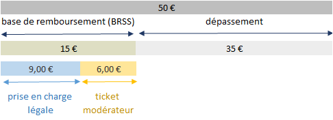
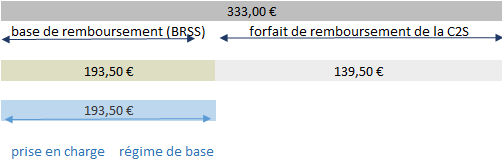
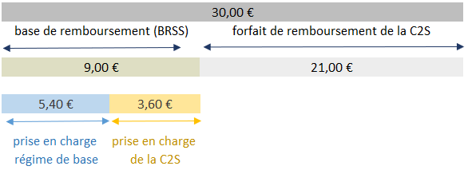

---
tags:
  - Bénéficiaires
  - Prestations
  - Dépenses
  - DCIR/DCIRS
---


# Forfaits de remboursement de la complémentaire santé solidaire (C2S)

<!-- SPDX-License-Identifier: MPL-2.0 -->

<TagLinks />

::: tip Crédits

Cette fiche a été rédigée par la DREES (Vincent Reduron) dans le cadre des travaux sur les [comptes de la santé](https://drees.solidarites-sante.gouv.fr/sources-outils-et-enquetes/les-comptes-de-la-sante) (septembre 2024).

*A savoir : Des références peuvent être données à la fin de la fiche. La dernière date de modification se situe tout en bas à droite.*  

:::

> La fiche intitulée [CSS Complémentaire Santé Solidaire (C2S)](../fiches/complementaire_sante_solidaire.md) décrit les variables permettant de repérer les bénéficiaires ayant la C2S dans le SNDS.  


## Une prise en charge au delà de la BRSS 

La complémentaire santé solidaire ([C2S](../glossaire/C2S.md)) a pour objectif de limiter les **restes à charge** en santé de ses bénéficiaires.

Dans le système français, les restes à charges en santé peuvent être de plusieurs types :
   - tickets modérateurs,
   - participations spécifiques demandées aux assurés (franchises, participations forfaitaires de 2 euros, forfaits journaliers hospitaliers, forfaits patients urgences),
   - dépassements : dépassements d'honoraires et part de liberté tarifiaire sur les dispositifs médicaux et sur certains soins dentaires ;
   - soins non remboursables par l'Assurance maladie.

On utilise les définitions suivantes dans cette fiche :
  - Le "ticket modérateur" est le reste à charge jusqu'à hauteur de la BRSS. 
  - Le "dépassement" est le reste à charge sur la dépense dépassant la BRSS.
La base de remboursement de la Sécurité sociale (BRSS) correspond au montant reconnu par l'Assurance maladie comme remboursable, sur lequel s'applique éventuellement un taux de remboursement.

Exemple de décomposition du prix de vente en BRSS et dépassement (verre de lunette vendu 50 euros avec une BRSS à 15 euros) :  

<p align="center">



</p>  

La C2S prend en charge le ticket modérateur de ses bénéficiaires, qui sont aussi exonérés de participations forfaitaires de franchises médicales sur l’achat de médicaments. Les médecins et auxiliaires médicaux ne peuvent pas leur appliquer de dépassements d'honoraires.

La vocation des **forfaits de remboursement** de la C2S est de prendre en charge la **part de liberté tarifiaire sur les dispositifs médicaux et sur certains soins dentaires** :
  - les soins dentaires prothétiques, 
  - l’orthopédie dento-faciale (orthodontie), 
  - l’optique médicale,
  - les aides auditives (audioprothèses),

Lors de l'achat par un bénéficiaire d'un de ces soins, un forfait de remboursement lui est versé pour compléter la prise en charge sur la partie de dépense dépassant la BRSS. En effet, la BRSS est inférieure au prix de vente réel payé par les patients : la part de « dépassement » liée à la liberté tarifaire est plus importante que pour d’autres soins.

Cette part de « dépassement » liée à la liberté tarifaire est prise en charge de façon « forfaitaire » : les montants ne sont pas proportionnels à la dépense, mais fixés par arrêté :
  - l’[arrêté du 23 février 2024](https://www.legifrance.gouv.fr/loda/id/LEGIARTI000049194469/2024-02-25/) pour les soins dentaires prothétiques et l’orthopédie dento-faciale (orthodontie), 
  - l’[arrêté du 29 octobre 2019](https://www.legifrance.gouv.fr/loda/id/JORFTEXT000039296524/) pour l’optique médicale,
  - l’[arrêté du 27 décembre 2018](https://www.legifrance.gouv.fr/loda/id/JORFTEXT000037880126) pour les aides auditives.

Avant 2019, ces forfaits faisaient partie des garanties de la couverture maladie universelle complémentaire ([CMU-C](../glossaire/CMUC.md)). En 2019, la C2S s’est substituée à la CMU-C (et à l’Aide à la complémentaire santé) et le « 100 % santé » a été instauré. Les forfaits de remboursement se sont adaptés au cadre instauré par le 100 % santé (offre structurée par paniers pour les soins dentaires prothétiques, l’optique et les audioprothèses). A cette occasion, ils ont aussi été étendus et revalorisés (voir le [rapport de la Cour des comptes](https://www.vie-publique.fr/files/rapport/pdf/285961.pdf#p=20) sur le 100% santé).

La C2S rembourse aussi la part de liberté tarifaire sur d'autres dispositifs médicaux, notamment les cannes, fauteuils roulants et pansements.

## Dans le SNDS

### Des codes nature prestations spécifiques aux forfaits

Les forfaits de remboursement sont versés avec des codes nature prestation spécifiques [en norme PS5](../fiches/prestation.md) :
  - pour les soins dentaires prothétiques : 5201, 5202, 5203 et 5205,
  - pour l’orthopédie dento-faciale : 5204 et 5206,
  - pour l’optique médicale : 5125, 5126, 5128 pour les montures et 5121, 5122, 5123, 5124, 5127 et 5129 pour les verres,
  - pour les aides auditives : 5402 et 5403.

Jusqu’à fin 2019, les codes suivants étaient utilisés pour l’optique médicale : 5101 à 5120 inclus, 3523, 3530 inclus, 3536 à 3539 inclus, 3553 à 3557 inclus, 3581 à 3583 inclus.

Jusqu’à janvier 2021, le code 5401 était utilisé pour les aides auditives.

Dans le SNDS, on retrouve les forfaits de remboursement dans la table **er_aro_f** (table des remboursements supplémentaires) du DCIR, comme tous les montants de C2S. Ils sont repérables par la **modalité 6** (_forfait C2S_) dans la variable `ARO_REM_TYP` (_Type de remboursement supplémentaire_) et par les codes PS5 listés plus haut dans la variable `ARO_PRS_NAT`.

Les forfaits de remboursement de la C2S sont donc traités comme une prestation spécifique, versée en supplément de la prestation de base. Par exemple, lorsqu’un bénéficiaire de C2S reçoit un soin dentaire prothétique et que les conditions sont réunies, deux prestations sont versées par l’Assurance maladie : 
  - la prestation de base, pour la dépense jusqu’à hauteur de la BRSS, 
  - un forfait pour la dépense au-delà de la BRSS.


### Soins dentaires prothétiques

Les forfaits de remboursement de la C2S s’appliquent aux deux [paniers de soins sur les soins dentaires prothétiques](https://www.ameli.fr/val-de-marne/assure/remboursements/rembourse/soins-protheses-dentaires-optique-audition/soins-dentaires-comprendre-le-100-sante#text_133080) : le panier 100 % Santé et le panier à tarifs maîtrisés. Si le bénéficiaire opte pour un de ces deux paniers, un forfait de remboursement annule (panier 100 % Santé) ou limite (panier à tarifs maîtrisés) son reste à charge.  

<p align="center">


</p>  

Dans le DCIR, on trouve deux prestations :
  - l’une pour la prestation de base, avec une nature de prestation de soins dentaires prothétiques (1412 par exemple en norme PS5) 
  - l’autre pour le forfait de remboursement, avec une nature de prestation 5201, 5202, 5203 ou 5205 en norme PS5.

Chacune des deux prestations se retrouve à la fois dans la table **er_prs_f** (table des prestations de base) pour les remboursements du régime de base, et dans la table **er_aro_f** (table des remboursements supplémentaires) pour les remboursements de la C2S. La clef de jointure à 9 variables du DCIR permet de faire le lien. 

Les deux prestations se retrouvent sur le même **décompte** : elles ont une valeur identique pour les 7 variables qui identifient un décompte unique dans la table **er_dct_f** (`FLX_DIS_DTD`, `FLX_EMT_NUM`, `FLX_EMT_ORD`, `FLX_EMT_TYP`, `FLX_TRT_DTD`, `ORG_CLE_NUM` et `DCT_ORD_NUM`). En effet, elles sont gérées simultanément par les caisses.

::: warning Attention 
Pour chaque prestation, la variable `PRS_PAI_MNT` n’indique pas le prix de vente payé par l’assuré (information habituelle de cette variable), mais la BRSS.  
:::

Dans l’exemple d’un soin prothétique de _pose d'une prothèse amovible définitive à châssis métallique, comportant 9 dents_ (code CCAM `HBLD435`), la BRSS est de 258 euros et le forfait de remboursement de 492 euros en 2024. Au total, 750 euros sont pris en charge.

  - dans la table **er_prs_f**, on trouve les deux lignes suivantes :

    |PRS_NAT_REF|BSE_REM_BSE|BSE_REM_MNT|PRS_PAI_MNT|
    |----|----|----|----|
    |1412|258,00 €|180,60 € |258,00 €|
    |5201|492,00 €|0,00 €|492,00 €|

    Le régime de base prend en charge 180,60 euros (70 % de la BRSS).

  - dans la table **er_aro_f**, on trouve les deux lignes suivantes :

    |ARO_PRS_NAT|ARO_REM_MNT|
    |----|----|
    |1412|77,40 €|
    |5201|492,00 €|

  Les 77,40 euros couvrent le ticket modérateur associé à la prestation 1412 (30 % de la BRSS). La ligne correspondant à ce montant a la même clef de jointure à 9 variables que la ligne de nature 1412 de la table **er_prs_f**.

  Les 492 euros correspondent au barème du forfait. La ligne correspondant à ce montant a la même clef de jointure à 9 variables que la ligne de nature 5201 de la table **er_prs_f**.

Le code R suivant montre que la dépense de forfaits de remboursement C2S en soins dentaires prothétiques en 2023 s’élève à 550 millions d’euros France entière. La part afférente aux deux paniers possibles (100 % Santé et tarifs maîtrisés) pourrait être calculée grâce aux codes CCAM, par jointure avec la table **er_cam_f**.

```
# (1) Chargement packages 
#*----------------------------

library(odbc)  ; library(DBI)
library(dplyr) ; library(dbplyr)
library(tidyr) ; library(stringr) ; library(purrr)


# (2) Connexion au serveur Oracle   
#*-------------------------------

#drv <- dbDriver("Oracle")
#conn <- dbConnect(drv, dbname = "IPIAMPR2.WORLD")
conn <- dbConnect(odbc::odbc(), dsn = "IPIAMPR2")
Sys.setenv(TZ = "Europe/Paris")
Sys.setenv(ORA_SDTZ = "Europe/Paris")
user_id <- dbGetQuery(conn, "SELECT user FROM dual;")[1, 1]


# (3) Statistiques forfaits de remboursement C2S année 2023
#*---------------------------------------------------------

# référentiel des natures de prestation
IR_NAT_V <- tbl(conn, "IR_NAT_V") %>% select(PRS_NAT, PRS_NAT_CB2, PRS_NAT_LIB) 

calcul_montants <- function(prestas)
{
# versant er_aro_f 
aro_2023 <- tbl(conn, 'ER_ARO_F') %>% 
  filter(between(FLX_DIS_DTD, to_date('2023-02-01', 'YYYY-MM-DD'), to_date('2024-01-01', 'YYYY-MM-DD'))) %>%
  filter(ARO_PRS_NAT %in% prestas, ARO_REM_TYP %in% c(5, 6))  %>% 
  mutate(TABLE = 'er_aro_f', PRS_NAT = ARO_PRS_NAT) %>% 
  group_by(TABLE, PRS_NAT, ARO_REM_TYP) %>% summarize(mnt_2023 = sum(ARO_REM_MNT, na.rm = T)) %>% 
  left_join(IR_NAT_V, by = "PRS_NAT") %>% 
  collect

# versant er_prs_f 
prs_2023 <- tbl(conn, 'ER_PRS_F') %>% 
  filter(between(FLX_DIS_DTD, to_date('2023-02-01', 'YYYY-MM-DD'), to_date('2024-01-01', 'YYYY-MM-DD'))) %>%
  filter(BSE_PRS_NAT %in% prestas)  %>% 
  mutate(TABLE = 'er_prs_f', PRS_NAT = BSE_PRS_NAT, ARO_REM_TYP = 0) %>% 
  group_by(TABLE, PRS_NAT, ARO_REM_TYP) %>% summarize(brss_2023 = sum(BSE_REM_BSE, na.rm = T)) %>% 
  left_join(IR_NAT_V, by = "PRS_NAT") %>% 
  collect

# conclusion
return(rbind(aro_2023, prs_2023))
}


# (4) Montant forfaits de remboursement C2S soins prothétiques
#*--------------------------------------------------------------

prestas <- c(5201, 5202, 5203, 5205)
calcul_montants(prestas)

```

### Orthopédie dento-faciale

Les forfaits de remboursement de la C2S s’appliquent aux **semestres de traitements d’orthodontie**. 

Pour l'ensemble des assurés de manière générale, les honoraires de traitements d’orthodontie sont libres et la BRSS ne les couvre que partiellement ([193,50 euros par semestre](https://www.ameli.fr/val-de-marne/assure/remboursements/rembourse/soins-protheses-dentaires-optique-audition/consultations-soins-protheses-dentaires/remboursement-traitements-orthodontie), en 2024). 

Pour les bénéficiaires de C2S, le forfait de remboursement vient compléter la BRSS. Dans l'exemple d'un semestre de traitement avec multiattaches, il est en 2024 de 270,50 euros. Ce montant peut être versé en deux fois (par trimestre), comme pour les remboursements des régimes de base.  

<p align="center">



</p>  

Comme pour les soins prothétiques, on trouve systématiquement deux prestations dans le DCIR, pour le traitement avec la nature de prestation 1424 (TO) et pour le forfait avec la nature de prestation 5204 ou 5206. Les montants des deux prestations doivent être additionnés pour obtenir la dépense de traitement d’orthodontie prise en charge. 

Ces deux prestations n’ont pas la même clef de jointure à 9 variables, mais sont dans le même **décompte** (voir plus haut).

::: Attention
Pour chaque prestation, la variable `PRS_PAI_MNT` n’indique pas le prix de vente payé par l’assuré (information habituelle de cette variable), mais la BRSS.  
:::

Par exemple, on peut typiquement voir les lignes suivantes dans les tables du DCIR :

  - dans la table **er_prs_f** :
    |PRS_NAT_REF|BSE_REM_BSE|BSE_REM_MNT|PRS_PAI_MNT|
    |----|----|----|----|
    |1424|193,50 €|193,50 €|193,50 €|
    |5204|270,50 €|0,00 €|270,50 €|

  - dans la table **er_aro_f** :
    |ARO_PRS_NAT|ARO_REM_MNT
    |----|----|
    |5204|270,50 €|

Dans cet exemple, le montant total remboursé à l’assuré est de 464 euros. Le remboursement se fait par le versement des deux prestations distinctes, le remboursement classique et le forfait, chacune ayant son tarif propre. 

Le code R suivant (exécuter d'abord le code plus haut pour charger les packages et fonctions) montre que la dépense de forfaits de remboursement C2S en orthodontie en 2023 s’élève à 95 millions d’euros France entière :

```
prestas <- c(5204, 5206)
calcul_montants(prestas)
```

### Aides auditives

Les forfaits de remboursement de la C2S s’appliquent aux aides auditives de **classe I (100 % Santé)** et de **classe II (prix libres)**. 

La Complémentaire santé solidaire a une réglementation spécifique, transverse aux deux classes d’aides auditives. En effet, depuis 2021, les audioprothésistes doivent proposer aux bénéficiaires de C2S des équipements à un prix maximal de vente spécifique (par exemple 800 € pour les 20 ans et plus en 2024). Si le bénéficiaire opte pour un autre équipement, il est remboursé à la même hauteur (par exemple 800 € pour les 20 ans et plus) mais doit financer un reste à charge car l'équipement peut être plus cher.  

<p align="center">


</p>  

Le forfait de remboursement est versé avec les natures de prestation 5402 (oreille gauche) et 5403 (oreille droite). Malheureusement, ces natures de prestation globalisent les classes I et II sans distinction. A priori, on pourrait trouver la classe de l'équipement par jointure avec la table **er_tip_f**, ce qui est plus compliqué.

On trouve cette fois une seule prestation dans le DCIR (une unique clef de jointure à 9 variables). La prestation de base se retrouve dans la table **er_prs_f**, la prise en charge du ticket modérateur et le forfait dans la table **er_aro_f**, avec la même clef de jointure à 9 variables, par exemple :

  - dans la table **er_prs_f** :

    |PRS_NAT_REF|BSE_REM_BSE|BSE_REM_MNT|PRS_PAI_MNT|
    |----|----|----|----|
    |3588|400 €|400 €|800 €|
    |3589|400 €|400 €|800 €|

    La nature de prestation 3588 (P2G) correspond aux aides auditives d’oreille gauche et 3589 (P2D) aux aides auditives d’oreille droite. Ces natures de prestation sont utilisées [en cas d’application d’un forfait C2S](https://www.ameli.fr/val-de-marne/professionnel-de-la-lpplatm/exercice-professionnel/facturation/aide-auditive-dans-le-cadre-du-100-sante#text_140901), que l’équipement soit de classe I ou II.

   La variable PRS_PAI_MNT indique le prix de vente de l’équipement (800 €), remboursé pour la BRSS par la prestation de base (400 €) et pour le reste par le forfait (400 €). 

  - dans la table **er_aro_f** :
    |ARO_PRS_NAT|ARO_REM_MNT|
    |----|----|
    |5402|400 €|
    |5403|400 €|

Le code R suivant (exécuter d'abord le code plus haut pour charger les packages et fonctions) montre que la dépense de forfaits de remboursement de la C2S en 2023 s’élève à 43 millions d’euros France entière pour les forfaits de remboursement (natures de prestation en 54).

```
prestas <- c(5402, 5403)
calcul_montants(prestas)
```

### Optique médicale

Les forfaits de remboursement de la C2S s’appliquent uniquement aux équipements de **classe A**, qui est l’offre 100 % Santé. Il y a donc coïncidence entre forfaits de la C2S et financement prévu par le dispositif 100 % santé.  

<p align="center">



</p>  

On trouve cette fois une seule prestation dans le DCIR (une unique clef de jointure à 9 variables). La prestation de base se retrouve dans la table **er_prs_f**, la prise en charge du ticket modérateur et le forfait dans la table **er_aro_f**, avec la même clef de jointure à 9 variables.

Dans l'exemple d’un verre facturé 36 euros (verre multifocal classe A, sphère, +2,00 à +4,00, code LPP 2264884) : le forfait de remboursement de la C2S est fixé à 25,20 euros :

  - dans la table **er_prs_f** :

    |PRS_NAT_REF|BSE_REM_BSE|BSE_REM_MNT|PRS_PAI_MNT|
    |----|----|----|----|
    |3506|10,80 €|6,48 €|36 €|

    La nature de prestation 3506 correspond aux montures adultes de classe A. La prise en charge du régime de base est de 6,48 euros (60 % de la BRSS, qui s'élève à 10,80 euros).

   La variable `PRS_PAI_MNT` indique le prix de vente de l’équipement (36 €). 

  - dans la table **er_aro_f** :
    |ARO_PRS_NAT|ARO_REM_MNT|
    |----|----|
    |3506|4,32 €|
    |5125|25,20 €|
    
Dans cet exemple, la C2S prend en charge le ticket modérateur (4,32 euros) et le dépassement via un forfait de remboursement (25,20 euros). L’ensemble du prix de vente est ainsi remboursé à l’assuré, en cumulant la prise en charge de base et les remboursements de la C2S.

Le code R suivant (exécuter d'abord le code plus haut pour charger les packages et fonctions) montre que la dépense de forfaits de remboursement de la C2S en 2023 s’élève à 55 millions d’euros France entière, dont 23 millions d’euros pour les verres et 30 millions d’euros pour les montures.

```
prestas <- c(5122, 5123, 5124, 5125, 5126, 5127, 5128, 5129)
calcul_montants(prestas)
```