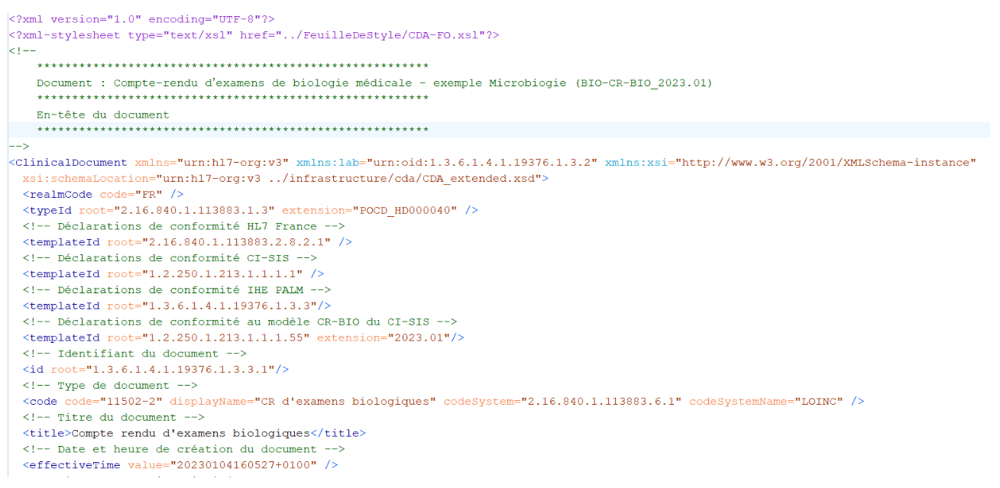
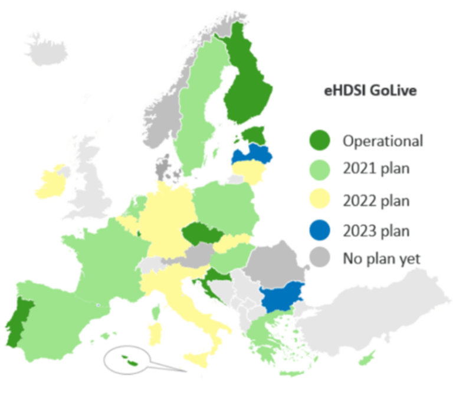
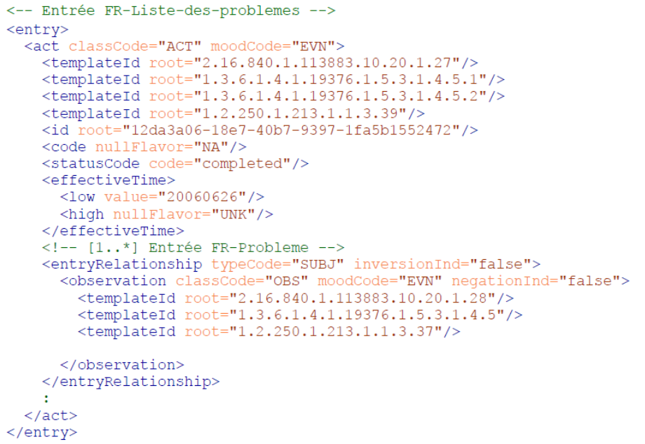
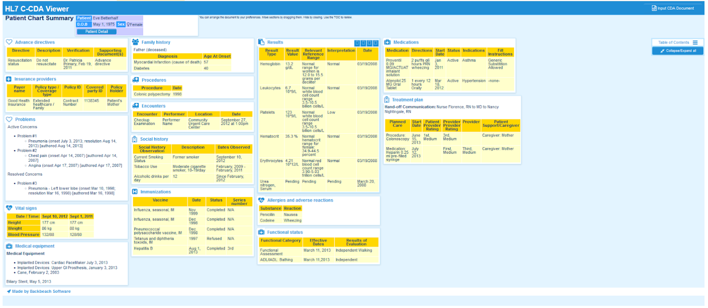

# Fiche d’identité : CDA

## SYNTHÈSE :

**Description et type de standard** : *Clinical Document Architecture* (CDA) est un standard de balisage des documents cliniques échangés entre les professionnels de santé et les patients développé par *Health Level Seven* (HL7) depuis 1997 et reconnu par l'ISO.

**Domaines d’application** : Documents cliniques (synthèse médicale, lettre de sortie, lettre de liaison, CR d'examens de biologie médicale, CR d'imagerie, etc.).

**Maturité / Utilisation** : Le standard CDA est utilisé en France dans le CI-SIS (Cadre d'Interopérabilité des Systèmes d'Information de Santé) publié par l'ANS (Agence du Numérique en Santé) notamment pour alimenter le DMP (Mon espace santé) et implémenté au niveau européen par de nombreux pays, notamment pour la standardisation de l'IPS (*International Patient Summary*, équivalent de la Synthèse Médicale) et la ePrescription/eDispensation. L'utilisation de CDA est également largement répandue dans le monde, en particulier aux États-Unis (voir l'élément « *Adoption du standard* » en partie 4. Valorisation).

## 1. Général

- **Présentation** :
  - **Pays d'origine** : États-Unis
  - **Consortium d'origine** : Health Level Seven (HL7)[^1]
  - **Type de standard** : Format de transfert
  - **Description** :
    - *Clinical Document Architecture* (CDA) est un **standard de balisage de documents qui spécifie la syntaxe et la sémantique des documents cliniques échangés entre les professionnels de santé et les patients**, développé par Health Level Seven (HL7) depuis 1997[^2].
    - Il est implémenté dans le **langage XML** (Extensible Markup Language, voir Figure 1), similaire au langage HTML (HyperText Markup Language) utilisé pour créer des pages *web*, ce qui facilite la visualisation sur un navigateur internet.
    - CDA est conforme à la spécification HL7 V3, est fondé sur le modèle HL7 RIM (*Reference Information Model*) et utilise les types de données HL7 V3[^3].
    - CDA introduit le concept d'**interopérabilité sémantique incrémentale** : la complexité du document varie selon les besoins des utilisateurs (voir les différents niveaux de documents CDA dans l'élément « *Flexibilité du standard, personnalisation* » en partie 3. Technique).
      - Le document CDA minimal (ou CDA R2 N1) contient des champs de métadonnées encodés en XML dans l'en-tête (nom du patient/usager, type et identifiant du document, etc.) et un corps de document (dans un format fréquent du type pdf, .doc, image scannée, etc.)[^1].
    - La structure générale d'un document CDA est la suivante[^4] :
      - **En-tête du document** (header) – cette partie du document est **structurée** et contient notamment :
        - Une description du document
        - Une description du contexte de production du document
        - L'identification des professionnels de santé impliqués dans la production du document ainsi que des destinataires prévus du document
        - L'identification du patient
      - **Corps du document** (body) : cette partie du document peut être structurée ou **non-structurée**. Si elle est structurée, elle contient :
        - Des **sections** : elles organisent les données en thématiques principales (problèmes actifs, antécédents médicaux, allergies, traitements médicamenteux, etc.) et contiennent une partie narrative (texte lisible par un humain) dérivant des données structurées contenues dans les entrées.
        - Des **entrées** : les données codées (problème, traitement médicamenteux, allergie, etc.).
    - Un document CDA a les caractéristiques suivantes (voir Volet Structuration minimale des documents de santé du CI-SIS) :
      - **Persistence** : Le document dématérialisé doit rester inaltérable et accessible pour une période dont la durée est fonction du cadre réglementaire et des règles mises en place par la communauté de soins
      - **Administration** : La structure émettrice du document dématérialisé doit en assurer la gestion et le suivi, en mettant à disposition les éventuelles mises à jour
      - **Responsabilité** : Le document dématérialisé doit être endossé par le responsable – personne physique assumant l’entière responsabilité du contenu du document – qui est aussi le signataire légal du document lorsque la signature électronique est mise en œuvre
      - **Cohérence** : Le document embarque le contexte (médical et de gestion) de son contenu
      - **Intégralité** : Contenu et contexte restent indissociables et l’ensemble peut être authentifié par une signature électronique.
      - **Lisibilité**: Le document dématérialisé doit pouvoir être restitué aux personnes habilitées à le lire
  - Organisme en charge de la gestion du standard : *Health Level Seven* (HL7)

[^1]: Voir : [CDA](https://www.hl7.org/implement/standards/product_brief.cfm?product_id=7)
[^2]: La première version (*draft*) s'appelait *Kona Architecture* ou *Patient Record Architecture*. Voir l’article de Dolin et *al.* (1999) : https://www.ncbi.nlm.nih.gov/pmc/articles/PMC2232652/?page=1
[^3]: Voir : [HL7 CDA | Rhapsody](https://rhapsody.health/resources/hl7-cda/)
[^4]: Voir l’article au sujet de CDA *Release 1* de Dolin RH, Alschuler L, Beebe C, Biron PV, Boyer SL, Essin D, Kimber E, Lincoln T, Mattison JE. « *The HL7 Clinical Document Architecture* ». J Am Med Inform Assoc. 2001 Nov-Dec : [The HL7 Clinical Document Architecture - PMC](https://www.ncbi.nlm.nih.gov/pmc/articles/PMC130066/)
Ainsi que les sources suivantes pour des descriptions de l’architecture CDA dans les versions les plus récentes : https://wiki.ohie.org/display/SUB/Introduction+to+Clinical+Document+Architecture (page wiki de l’initiative OpenHIE) et la présentation du *Public Health Informatics Institute* (organisation qui accompagne les établissements de santé à tirer parti des systèmes d’information pour répondre aux besoins en matière de santé publique aux États-Unis) : https://phii.org/sites/default/files/resource/files/HL7 CDA Introduction.pdf

      

_Figure 1 : Extrait d'un document CDA (Release 1), Source : CI-SIS_

- **Application** :
  - **Domaine d'application en santé : Documents cliniques** (synthèse médicale, lettre de sortie, lettre de liaison, CR d'examens de biologie médicale, CR d'imagerie, etc.)[^5].
  - **Principaux cas d’usage** :
    - **Mise en partage dans le DMP (Mon espace santé)** pour améliorer la coordination des soins.
    - Échange entre professionnels de santé dans le cadre de la prise en charge et du suivi du patient.
  - **Illustration concrète, exemple d’utilisation sur un cas simple** :
    - Direito et *al.* (2023)[^6] ont documenté l'implémentation d'une **plateforme collaborative entre les équipes cliniques et de recherche** du service pédiatrique d'un hôpital universitaire au Portugal (*University Hospital Center of Coimbra* ou CHUC), dans l'unité de Neurodéveloppement et d'Autisme.
    - Egalement, en France, l’alimentation du DMP via le site Mon Espace Santé s’appuie en partie sur l’utilisation de données au format CDA[^7]. Ce projet est un projet national stratégique pour améliorer la coordination des soins.
      - Cette solution permet de répondre à l'une des principales limitations des systèmes *EHR* actuels dans cette région du Portugal : l’**incapacité de stocker et accéder à des données cliniques** structurées et de pouvoir les utiliser dans une perspective longitudinale. L’analyse longitudinale est particulièrement importante dans le domaine pédiatrique dans lequel les données de santé changent continuellement.
      - La conception d'un format pour les documents à partir de la structure standard CDA, ainsi que l'adoption des concepts issus de la SNOMED-CT, ont permis de rendre la solution **interopérable**.
      - La mise en place de cette solution a **modifié les pratiques** entre les professionnels de santé : la communication est améliorée, en particulier entre les équipes cliniques et les équipes de recherche, et la création de documents pertinents, par exemple sur l'historique clinique des patients, est facilitée.

- **Données** :
  - **Typologie de données concernées** :
    - Les types de **données HL7 V3** peuvent être inclus dans les champs CDA.
    - Il s'agit des principaux types de données suivants[^8] : alphanumérique (caractère, texte, texte formatté), numérique (numérique, monétaire, quantité composite avec unité, ...), identifiant (codé d'après une terminologie HL7 ou bien définie par l'utilisateur, identifiant de l'entité, localisation du patient, ...), date/temps, données démographiques (adresse, nom, numéro de téléphone, ...).
    - Des données multimédias peuvent également être incluses dans le corps du document[^9].
  - **Type de granularité** :
    - Un document CDA contient des **informations cliniques sur un patient à un instant _t_**.
    - Il peut s'agir d'un document original dans sa première version, d'un ajout ou d'une révision d'un document existant (il s'agit du document « parent »).

[^5]: Voir le document « *A basic view of CDA* » : [CDA – Clinical Document Architecture – HL7 UK](https://www.hl7.org.uk/standards/hl7-standards/cda-clinical-document-architecture/) et la page suivante de l’Agence du Numérique en santé sur la lettre de liaison : [Volet IDL – Informations de liaison | Agence du Numérique en Santé](https://esante.gouv.fr/volet-idl-informations-de-liaison)
[^6]: Voir l'article de Direito B, Santos A, Mouga S, Lima J, Brás P, Oliveira G, Castelo-Branco M. « *Design and Implementation of a Collaborative Clinical Practice and Research Documentation System Using SNOMED-CT and HL7-CDA in the Context of a Pediatric Neurodevelopmental Unit* ». Healthcare. 2023 : [Design and Implementation of a Collaborative Clinical Practice and Research Documentation System Using SNOMED-CT and HL7-CDA in the Context of a Pediatric Neurodevelopmental Unit](https://www.mdpi.com/2227-9032/11/7/973)
[^7]: Voir [Transport d’un document CDA-R2 en HL7 ORU/OUL/MDM](https://esante.gouv.fr/sites/default/files/media_entity/documents/Transport%20d%E2%80%99un%20document%20CDA-R2%20en%20HL7%20ORU%20OUL%20MDM_1.pdf)
[^8]: Voir la liste complète des types données HL7 V3 : [HL7 Data Types | Rhapsody](https://rhapsody.health/resources/hl7-data-types/)
[^9]: Voir : [HL7 CDA | Rhapsody](https://rhapsody.health/resources/hl7-cda/)

- **Utilisation dans plusieurs langues** : Les balises sont en anglais mais le contenu du document XML peut être dans une autre langue.

- **Disponibilité de la documentation d'implémentation : Des guides d'implémentation de CDA sont disponibles[^10], notamment grâce aux publications des spécifications françaises des documents structurés par le du CI-SIS.**

- **Niveau de généralisation (facilité de remplissage des champs du standard)** :
  - **Note : 0,7 / 1.** Cette note combine plusieurs sous-critères. Elle s’explique par :

  a) Le fait que les terminologies ne sont pas imposées, et en particulier il n’y a pas de terminologies locales imposées (voir l’élément « *Flexibilité dans les choix des terminologies* » en partie 3. Technique).
 
  b) La flexibilité du standard (voir l’élément « *Flexibilité du standard, personnalisation* » en partie 3. Technique)
 
  c) L’absence de contraintes d’implémentation (voir l’élément « *Contraintes d'implémentation* » en partie 3. Technique)
 
  d) Une couverture relativement faible de cas d’usage (voir l’élément « *Principaux cas d’usage* » en partie 1. Général)
 
  e) Une couverture relativement faible de domaines d’application (voir l’élément « *Domaine d'application en santé* » en partie 1. Général)

  - Le standard CDA est relativement flexible en raison de la possibilité de faire varier le niveau de complexité du document et de créer des profils d'implémentation (voir l'élément « *Flexibilité du standard, personnalisation *» en partie 3. Technique). Cette flexibilité permet ainsi de faciliter la généralisation du standard.

[^10]: Voir la liste complète : https://www.hl7.org/implement/standards/product_section.cfm?section=22&ref=nav

## 2. Gouvernance

- **Modalités d'accès et distribution des solutions basées sur ce standard** :
  - CDA est disponible en **téléchargement gratuitement**[^11], publié sous licence HL7[^12].
  - Cette **licence gratuite** inclut certaines restrictions dans l'utilisation du standard. Pour un usage moins contraint, les utilisateurs peuvent adhérer à HL7.
    - Plusieurs types d’adhésions HL7 existent, chacune permettant un usage distinct : individual and student membership, organizational membership, gold membership, benefactor membership[^13].

- **Processus de prise de décision sur le standard** :
  - Les **deux groupes** suivants collaborent, notamment pour échanger sur la qualité des guides d'implémentation :
    - Le *Structured Documents Group*[^14] est responsable du développement du standard CDA ainsi que de la méthodologie des guides d'implémentation CDA. - Le CDA *Management Group* est responsable de la maintenance et du suivi de la qualité des produits CDA, du respect des principes de gouvernance établis par le *Technical Services Committee* et de l'aide à la résolution des problématiques émergeant entre les groupes de travail ou au sein de ces groupes[^15].
  - Les utilisateurs remontent leurs problématiques dans un forum[^16].

- **Maturité du standard** :
  - **Fréquence de mise à jour** :
    - La dernière version de CDA est CDA *Release 2.1[^17]* sortie en 2019
    - La version précédente (CDA *Release 2[^18]*) était sortie en 2015. Sur la page de publication de cette version, il est indiqué qu'une version CDA *Release 3* est en cours de développement. Cette information n'étant cependant pas répétée dans la page de publication de CDA *Release 2.1*, il n'est pas certain qu'elle soit à jour.
    - La première version (CDA *Release 1[^19]*) est sortie en 2000
  - NB : La France, les Etats-Unis et l’Europe ont fait le choix de se maintenir à la version CDA R2.0

  - **Maturité** :
    - **Note : 0,9 / 1.** Cette note combine plusieurs sous-critères. Elle s’explique par :

      a) La publication d’une version stable

      b) La fréquence moyenne élevée de mise à jour des versions principales

      c) L’âge élevé du standard

      d) Son utilisation dans le monde à l’échelle d’un ensemble de pays / mondiale (voir l’élément « *Adoption du standard* » en partie 4. Valorisation)

      e) Son adoption officielle par un ou plusieurs pays ou par une organisation de référence (voir l’élément « Adoption du standard » en partie 4. Valorisation)

- **Existence de financements pour standardisation** :

  *En date de mai 2023, nous n'identifions pas de financements pour la standardisation CDA.*

[^11]: Voir : http://www.hl7.org/implement/standards/nocost.cfm (un compte HL7 doit être créé pour le téléchargement)
[^12]: Voir : https://www.hl7.org/legal/ippolicy.cfm?ref=nav
[^13]: Voir les conditions d’utilisation associées à chaque type de membre ici : [HL7 Membership](https://www.hl7.org/participate/membership/) . Par exemple, les membres individuels et étudiants peuvent lire et utiliser le standard pour développer et vendre des services qui l’implémentent mais ne l'incorporent pas directement.
[^14]: Voir : https://www.hl7.org/Special/committees/structure/overview.cfm
[^15]: Voir : [CDA Management Group](https://confluence.hl7.org/display/CDA)
[^16]: Voir : [[CDA-20307] Remove provenance author - Jira](https://jira.hl7.org/projects/CDA/issues/CDA-20307?filter=allopenissues)
[^17]: Voir : http://www.hl7.org/implement/standards/product_brief.cfm?product_id=515
[^18]: Voir : [CDA](https://www.hl7.org/implement/standards/product_brief.cfm?product_id=7)
[^19]: Voir : [HL7 Standards Product Brief - CDA® Release 1](https://www.hl7.org/implement/standards/product_brief.cfm?product_id=120)

## 3. Technique

- *Capacité de traduction vers un autre standard (intra types de standards)* :
  - Correspondance entre *CDA* et *FHIR* :
    - CDA et FHIR sont deux formats de transfert publiés par HL7 mais ils présentent cependant des différences : en particulier, les documents FHIR n'ont pas de limitation dans leur contenu et peuvent concerner d'autres sujets que les patients. Des correspondances entre les standards FHIR et CDA ont été établies, le *mapping* pouvant se faire dans les deux sens[^20] :
      - FHIR peut être utilisé pour échanger des documents CDA R2 en utilisant la ressource *DocumentReference* : il s'agit de *CDA* on *FHIR[^21]*.
      - Un document FHIR peut également être transformé en document CDA.
  - Dans la spécification CDA, des *mappings* existent avec **HL7 v2, HL7 v3** et **FHIR** pour décrire les normes de transfert (voir l'élément « *Existence de normes de transfert* » ci-dessous).

- **Communication avec d'autres standards (inter-typologies de standards)** :
  - Communication entre **CDA et OMOP-CDM** :
    - Ji et *al.* (2020)[^22] ont converti des documents CDA utilisés pour renvoyer des patients vers un autre professionnel de santé (« *referral CDA documents* ») au standard OMOP-CDM. Leur étude utilise des documents CDA stockés depuis 10 ans dans un hôpital de Corée du Sud.
      - Les correspondances entre les éléments des documents CDA contenus dans l’en-tête et dans le corps du document[^23] vers la structure d’OMOP-CDM sont établies : 9 tables OMOP-CDM ont pu être complétées avec les éléments des documents CDA.
      - Le *mapping* des vocabulaires CDA vers les vocabulaires standardisés d’OMOP-CDM a été effectué : les données ont pu être mappées à 98,6 % pour l’état de santé, 68,8 % pour les médicaments, 35,7 % pour les mesures, 100 % pour les observations et 56,4 % pour les procédures. Les taux relativement faibles observés pour les mesures, les procédures et les médicaments s’expliquent par la faible qualité des données initiales dans les documents CDA ainsi que par l’utilisation de vocabulaires locaux.
    - Abedtash et Duke ont démontré dans une série d’études[^24] la faisabilité et la bonne performance de la conversion de documents CCD basés sur C-CDA vers OMOP-CDM.
  - Communication entre **C-CDA et i2b2** :
    - Klann et *al.* (2015)[^25] ont construit une extension d'i2b2 permettant d'importer des documents C-CDA dans i2b2. Les auteurs testent cette extension à partir des données de *Partners Healthcare* (aujourd'hui *Mass General Brigham*) :
      - Cette extension i2b2 peut s'adapter aux formats C-CDA spécifiques à d'autres établissements.
      - 17 000 observations cliniques de 145 patients ont pu être intégrées à i2b2 en 24 minutes
      - Des requêtes d'identification de cohortes et une visualisation des données des patients provenant des documents C-CDA ont pu être effectués avec des SMART Apps.
  - Communication entre **DICOM et CDA** :
    - DICOM SR (Structured Reporting) permet de standardiser, structurer et d'échanger les données et les observations cliniques en imagerie médicale[^26].
    - Les documents DICOM SR (rapport d'imagerie complet ou parties du rapport) peuvent être mappés à des documents CDA R2[^27]. Le *mapping DICOM SR to CDA* est unidirectionnel.

[^20]: Voir : [GitHub - hl7ch/cda-fhir-maps: Maps (FHIR Mapping Language) to transform documents from CDA to FHIR and back](https://github.com/hl7ch/cda-fhir-maps)
[^21]: Voir : [Cda-intro - FHIR v6.0.0-cibuild](https://build.fhir.org/cda-intro.html)
[^22]: Voir l’article de Ji H, Kim S, Yi S, Hwang H, Kim JW, Yoo S. « *Converting clinical document architecture documents to the common data model for incorporating health information exchange data in observational health studies: CDA to CDM* ». J Biomed Inform. 2020 Jul : [Converting clinical document architecture documents to the common data model for incorporating health information exchange data in observational health studies: CDA to CDM](https://pubmed.ncbi.nlm.nih.gov/32470694/)
[^23]: À savoir les caractéristiques du patient et de la visite d’une part ; le diagnostic, les médicaments administrés, les résultats de tests et la raison pour laquelle le professionnel de santé a envoyé ce patient vers un autre professionnel d’autre part.  
[^24]: Voir l’article de H. Abedtash, J.D. Duke, « *CCD2OMOP: An Interoperable Extract-Transform-Load Package to Support the Implementation of OHDSI Software Tools Across Non-OMOP- based Electronic Health Records* », OHDSI Symp., 2016. ([Converting clinical document architecture documents to the common data model for incorporating health information exchange data in observational health studies: CDA to CDM - ScienceDirect](https://www.sciencedirect.com/science/article/pii/S1532046420300873)), H. Abedtash, « An interoperable electronic medical record-based platform for personalized predictive analytics », 2017. (https://www.proquest.com/openview/12559a6b4b653b4a5f0a9c6dee43009c/1?pq-origsite=gscholar&cbl=18750) 
[^25]: Voir l’article de Klann JG, Mendis M, Phillips LC, Goodson AP, Rocha BH, Goldberg HS, Wattanasin N, Murphy SN. « *Taking advantage of continuity of care documents to populate a research repository* ». J Am Med Inform Assoc. 2015 : [Taking advantage of continuity of care documents to populate a research repository](https://pubmed.ncbi.nlm.nih.gov/25352566/) 
[^26]: Voir : [Deep dive into SR:](https://www.dicomstandard.org/docs/librariesprovider2/dicomdocuments/wp-cotent/uploads/2018/10/day2_s1-solomon-deep-dive-into-sr.pdf?sfvrsn=45f072fb_4)
[^27]: Voir : [7.7 Transformation of DICOM SR to CDA](https://dicom.nema.org/medical/dicom/current/output/chtml/part02/sect_7.7.html)

- **Flexibilité dans les choix des terminologies** :
  - Le *clinicalDocument.code* présent dans chaque document CDA, pour décrire le type du document, doit prioritairement être codé avec des valeurs issues de la **nomenclature LOINC**[^28], s’il **existe**. Néanmoins, en France, s’il n’existe pas de code LOINC l’ANS crée un code spécifique dans une de ses terminologies.
  - D'après Dolin et *al.* (2006)[^29] , CDA est **très flexible dans le choix des terminologies** : les champs CDA sont notamment conçus pour pouvoir intégrer des codes de nomenclatures standard (LOINC, CIM, EMDN, SNOMED-CT, etc.)
    - Pour spécifier la terminologie utilisée, il suffit de l'identifier par son code OID (*Object Identifier*)[^30].
 
        Par exemple pour mesurer les signaux vitaux, il est possible d'utiliser la syntaxe suivante[^31] : "*<code code="8716-3" codeSystem="2.16.840.1.113883.6.1" codeSystemName="LOINC" displayName="Vital signs"/>*"
 
      - Le code LOINC « 8716-3 » désigne les signes vitaux « *Vital signs* »[^32].
      - « 2.16.840.1.113883.6.1 » est l'OID de la terminologie LOINC[^33].

[^28]: Voir : [LOINC Document Ontology](https://loinc.org/document-ontology/)
[^29]: Voir l’article de Dolin RH, Alschuler L, Boyer S, Beebe C, Behlen FM, Biron PV, Shabo Shvo A. HL7 « *Clinical Document Architecture* », Release 2. J Am Med Inform Assoc. 2006 : [HL7 Clinical Document Architecture, Release 2 - PMC](https://www.ncbi.nlm.nih.gov/pmc/articles/PMC1380194/)
[^30]: Voir : http://www.hl7.org/oid/index.cfm?ref=nav
[^31]: Voir : [Panel of Vital Signs in Metric Units](https://cdasearch.hl7.org/examples/view/Vital%20Signs/Panel%20of%20Vital%20Signs%20in%20Metric%20Units)
[^32]: Voir : [LOINC 8716-3 Vital signs](https://loinc.org/8716-3)
[^33]: Voir : [OIDs Archive – LOINC](https://loinc.org/oids/) et [2.16.840.1.113883.6.1 – LOINC](https://loinc.org/oids/2.16.840.1.113883.6.1/)
[^34]: Voir : [HL7 CDA | Rhapsody](https://rhapsody.health/resources/hl7-cda/) et [What is HL7® CDA™? – iEHR.eu](http://iehr.eu/knowledge/what-is-hl7-cda/) et https://wiki.ohie.org/display/SUB/Introduction+to+Clinical+Document+Architecture

- **Flexibilité du standard, personnalisation** :
  - Deux **niveaux de structuration** des documents existent en France, en fonction des besoins des utilisateurs[^34] :
    - **Niveau 1 (CDA R2 N1)** : l'en-tête est structuré et le corps du document n'est pas structuré (*nonXmlBody*). Il peut contenir uniquement une image, un pdf, etc. Un exemple de contrainte de niveau 1 serait un « résumé de sortie » ne comportant que des instructions textuelles.
    - **Niveau 2 (CDA R2 N3)** : l'en-tête et le corps du document sont structurés, le corps du document (*StructuredBody*) contenant des « Sections » obligatoires dans lesquelles les données contenues dans les « Entrées » sont contraintes. Un exemple de contrainte de niveau 3 serait un « Résumé de sortie » avec une section « Médicaments » et des valeurs RxNORM pour chaque médicament.

      

_Figure 2 : Les composants des 3 niveaux d'implémentation du standard, Source : [What is HL7® CDA™?](http://iehr.eu/knowledge/what-is-hl7-cda/)– iEHR.eu_

  - Ainsi, il existe une **grande variété de documents CDA**, depuis la simple image jusqu'à des documents beaucoup plus complexes. Pour limiter cette variété de documents, il est possible de créer des profils : à partir des éléments de base du standard, les profils définissent et contraignent les options (éléments requis et optionnels, nomenclatures à utiliser, etc.). Les profils CDA sont définis dans les guides d'implémentation[^35] (voir l'élément « *Existence d'extensions certifiées* » en partie 5. Utilisation et l'exemple de C-CDA).

- **Complexité du modèle** :
  - CDA se fonde sur le modèle RIM (*Reference Information Model*) publié par HL7 qui est un **modèle complexe et abstrait**[^36]. Cela permet de pouvoir décrire, en théorie, l'ensemble des concepts cliniques existants, quel que soit le degré de granularité. Cette abstraction complexifie toutefois l'usage de la spécification CDA (voir l'élément « *Simplicité d'usage* » en partie 5. Utilisation).

- **Contraintes d'implémentation** :

  *En mai 2023, nous n'identifions pas de contraintes pour l’implémentation de CDA.*

- **Technologie de stockage et traitement de données et niveau d'adoption de la technologie** :
  - CDA utilise le langage XML. Par conséquent, il est possible d'utiliser le langage de requête XPATH et langage de transformation XSLT pour extraire et transformer l'information.

[^35]: Voir les guides d'implémentation CDA : https://www.hl7.org/implement/standards/product_section.cfm?section=22&ref=nav
[^36]: Voir : http://www.hl7.org/implement/standards/fhir/comparison-cda.html

- **Neutralité technologique :** Oui
  - CDA est technologiquement neutre : il n'impose pas de contraintes techniques et le langage XML est supporté par l'ensemble des plateformes.

- **Compétences techniques et métier nécessaires pour utiliser le standard** :
  - Pour l'implémentation du standard :
    - Il est nécessaire de disposer de **profils qui maîtrisent le langage XML**, et en particulier le langage de transformation XSLT si Schematron est utilisé pour valider les documents CDA (voir l'élément « *Décrire les étapes nécessaires pour la standardisation* » en partie 5. Utilisation) : l'ensemble des profils IT peuvent correspondre (*Software Engineer, Data Engineer, Data Architect,*...).
    - En complément, un **spécialiste de CDA certifié par HL7** peut assurer la formation du profil IT à la spécification CDA (voir l'élément « *Accessibilité à des ressources de formation* » en partie 4. Valorisation).
    - Pour *mapper* les balises CDA avec les contenus des documents médicaux, des compétences métier sont nécessaires (professionnels de santé rédigeant les documents concernés).

- **Échange sécurisé de données** :
  - La spécification détaille les exigences en termes de sécurité[^37] :
    - Les **applications** qui envoient et reçoivent des documents CDA sont **responsables** du respect de toutes les exigences légales en matière d'authentification, de confidentialité et de conservation des documents.
    - Pour des **communications** à travers des moyens publics, des **techniques cryptographiques** pour l'authentification source/destinataire et le transport sécurisé de documents encapsulés peuvent être nécessaires et doivent être traitées avec des outils disponibles dans le commerce en dehors du domaine d'application du standard.

[^37]: Voir le fichier index.html (chapitre 1.2.5. Security, Confidentiality, and Data Integrity) dans la specification : http://www.hl7.org/documentcenter/private/standards/cda/2019CDAR2_1.zip

- **Existence de normes de transfert** :
  - Les documents CDA peuvent être transmis à l'aide de techniques différentes, par exemple à travers des messages **HL7 v2.x**, des messages **HL7 v3.0**, des **messages FHIR**, etc.
  - Des *mappings* existent entre chacun de ces standards et CDA[^38].

[^38]: Voir le fichier index.html (chapitre 3. CDA Document Exchange) de la spécification : http://www.hl7.org/documentcenter/private/standards/cda/2019CDAR2_1.zip

## 4. Valorisation

- **Accessibilité à des ressources de formation** :
  - Formations officielles HL7 à CDA (payantes) de niveau introductif et avancé[^39].
  - Certifications CDA délivrées par HL7[^40].
  - Vidéos YouTube issues de différentes institutions[^41].

- **Disponibilité de la documentation scientifique démontrant l'intérêt** :
  - En mai 2023, **environ 117 articles**[^42] traitant de CDA **entre 2000 et 2023 sont disponibles sur PubMed** (voir la requête et un extrait de la liste des publications en « *Annexe n°1* »)
  - Dolin et *al.* (2001)[^4] explicitent l’intérêt et la nouveauté de CDA à sa création, en effet :
    - La priorité de CDA est de créer un standard d’interopérabilité, centré autour des soins des patients puisqu’il **définit des documents créés par des cliniciens**, au contact direct des patients.
    - CDA permet de stocker des données sous la forme d’un **fichier indépendant sans critère de longévité**.
    - Les données peuvent être mis en partage sur une plateforme de partage comme le DMP par exemple, ou échangés via messagerie sécurisée de santé (**indépendamment** du mécanisme de transfert utilisé (messages HL7, courrier électronique, etc.).
  - De plus, Campos et al. (2015)[^43] soulignent l’**intérêt organisationnel et pratique** de CDA :
    - CDA permet une organisation plus fluide, sans dossiers papiers, puisque l’échange d’informations (entre patients, cliniciens, payeurs, etc.) est facilité par leur nature électronique.
    - Les **résultats** d’examen n’ont plus besoin d’être imprimés et peuvent directement être retrouvés dans l’*EHR* du patient, sous forme de document CDA R2.

[^39]: Voir : [Introduction to CDA 3.12.2018 | Education On Demand](https://www.pathlms.com/hl7/courses/6874) et [Advanced CDA 2018.3.14 | Education On Demand](https://www.pathlms.com/hl7/courses/6905)
[^40]: Voir : [HL7 FHIR Fundamentals Course](https://www.google.com/url?q=http://www.hl7.org/implement/courseList.cfm&sa=D&source=docs&ust=1726486551895368&usg=AOvVaw2yBqhS2LpHtBUuhj1NXJlB) et http://www.hl7.org/certification/cda.cfm
[^41]: Chaîne HL7 ([C-CDA on FHIR](https://www.youtube.com/watch?v=TSsVEMIPmEg)), *Population Health* ([Introduction to HL7 CDA](https://www.youtube.com/watch?v=hyYTG_NU1Bw)), *Health Informatics* ([Unit 5 Lecture D: Introduction to HL7 CDA®](https://www.youtube.com/watch?v=Xl4rUeINMfY))
[^42]: L’estimation du nombre d’articles traitant de CDA sur PubMed a été faite en saisissant le terme « *clinical document architecture cda* » dans la barre de recherche du site PubMed (https://pubmed.ncbi.nlm.nih.gov), (voir la requête et un extrait de la liste des publications en « *Annexe n°1* »)
[^43]: Voir l’article de Campos F, Luna D, Sittig DF, Bernaldo de Quirós FG. Design, « *Implementation and Evaluation of an Architecture based on the CDA R2 Document Repository to Provide Support to the Contingency Plan* ». Stud Health Technol Inform. 2015: [Design, Implementation and Evaluation of an Architecture based on the CDA R2 Document Repository to Provide Support to the Contingency Plan](https://pubmed.ncbi.nlm.nih.gov/26262033/)

- **Adoption du standard** :
  - *Adoptions officielles* :
    - L'ANS (Agence du Numérique en Santé) recommande l'utilisation de CDA dans le cadre du CI-SIS (Cadre d'Interopérabilité des Systèmes d'Information de Santé)[^44] et l'a décliné en « modèles de contenus » qui définissent les documents selon le cas d'usage métier[^45] (on compte aujourd’hui plus de 30 modèles de documents médicaux structurés (CDA R2 N3) publiés dans le CI-SIS[^46]). Les professionnels de santé peuvent aussi créer, via leurs logiciels, d'autres types de documents CDA R2 N1 dont les spécifications relèvent toutes du volet Structuration minimale des documents de santé.
    - Le Volet de Synthèse Médicale, qui s'appuie sur CDA R2, est progressivement aligné au standard ISO IPS (*International Patient Summary*), pour lequel des guides d'implémentation FHIR et CDA ont été publiés (voir ci-dessous)[^47].
      - En alignement avec les recommandations du CI-SIS, l'AP-HP, dans le cadre de son projet BNDMR (Banque Nationale de Données Maladies Rares)[^48] a implémenté le recueil de données dans les DPI, puis l'échange d'information par mail et la solution de messagerie MSSanté au format XML normalisé CDA R2 N3[^49]. Ce recueil permet de collecter de manière standardisée les informations sur les patients atteints de maladies rares dans les établissements en dehors de l'AP-HP.
    - CDA R2 est approuvé par l’ANSI[^50].
    - CDA R2 a été approuvée par l'Organisation Internationale de Normalisation (ISO) en 2020[^51].
  - Utilisation sur le marché :
    - De nombreux utilisateurs internationaux[^1] :
      - Au sein des systèmes de *Health Information Exchange* (HIE)[^52] :
        - Pays dans lesquels ces systèmes sont bien implantés : Finlande, Grèce, Allemagne
        - Pays dans lesquels ils viennent d'être lancés : États-Unis
        - Pays dans lesquels des projets pilotes HIE sont lancés : Canada, Japon, Corée, Mexique, Argentine
      - Dans plusieurs établissements en Amérique du Nord :
        - Aux États-Unis :
          - La *Mayo Clinic* aux États-Unis est l'établissement qui produit le plus de documents CDA (plusieurs milliers chaque semaine, avec l'objectif d'atteindre 50 000 notes par semaine)
          - *Duke Clinical Research Institute*
          - *Columbia University Irving Medical Center*
        - Au Canada : L'hôpital *Queen Elizabeth II/Université Dalhousie* utilise CDA pour de l'aide à la décision clinique
      - En Europe : plusieurs pays ont implémenté un IPS (*International Patient Summary*) CDA, ou prévoient de le faire dans les prochaines années[^53]. En octobre 2018, la plupart des pays membres de MaSanté@EU[^54] prévoyaient une implémentation de l'IPS CDA entre 2018 et 2023 (voir la Carte 1 ci-dessous).

[^44]: Voir : [Espace de publication CI-SIS | Agence du Numérique en Santé](https://esante.gouv.fr/offres-services/ci-sis/espace-publication)
[^45]: Voir : [Volet de référence - Modèles de contenus CDA (V2.7)](https://esante.gouv.fr/sites/default/files/media_entity/documents/CI-SIS_VOLET-MODELES-CONTENUS-CDA_V2.7_20211207.pdf)
[^46]: Voir https://esante.gouv.fr/offres-services/ci-sis/espace-publication
[^47]: Voir la source (publiée en janvier 2022) : https://esante.gouv.fr/sites/default/files/media_entity/documents/Doctrine_du_numerique_en%20sante%CC%81_Version%202021_Fe%CC%81vrier%2022_VF.pdf
[^48]: La BNDMR (Banque Nationale de Données Maladies Rares) est un set de données minimum (SDM) pour documenter la prise en charge et l'état de santé des patients atteints de maladies rares dans les centres experts français, et de mieux évaluer l’effet des plans nationaux : [Présentation de la BNDMR | Banque Nationale de Données Maladies Rares](https://www.bndmr.fr/le-projet/presentation/)   
[^49]: Voir : [Kit éditeurs | Banque Nationale de Données Maladies Rares](https://www.bndmr.fr/boite-a-outils/kit-editeurs/)
[^50]: Voir : [ANSI Approved Standards](https://www.google.com/url?q=https://www.hl7.org/implement/standards/ansiapproved.cfm?ref%3Dnav&sa=D&source=docs&ust=1726486849416341&usg=AOvVaw1loUkgfw3PuinHJeQJ9r46)
[^51]: Voir la norme ISO/HL7 27932:2009 : [ISO/HL7 27932:2009 - Data Exchange Standards — HL7 Clinical Document Architecture, Release 2](https://www.iso.org/standard/44429.html)
[^52]: Les systèmes de *Health Information Exchange* (HIE) ou d’échange d’informations sur la santé consiste en la mobilisation des systèmes d'information de santé au sein d'une région, communauté ou système hospitalier pour faciliter l’accès et l’échange de documents cliniques pour améliorer la prise en charge des patients et l’analyse de la santé de la population.
[^53]: Voir : [Advancing the International Patient Summary](https://blog.hl7.org/advancing-the-international-patient-summary-ips)
[^54]: Voir : [Electronic cross-border health services - European Commission](https://health.ec.europa.eu/ehealth-digital-health-and-care/electronic-cross-border-health-services_en) 

      

  

_Carte 1 : Implémentation de l'IPS CDA en date d'octobre 2018, Source : Blog HL7_

- **Fournisseurs de service ayant l'expertise en France** :
  - Plusieurs éditeurs de logiciels : Evolucare[^55], Enovacom[^56], Maincare[^57], Softway Medical[^58], etc. (tous les éditeurs du secteur de la santé devant produire des documents pour alimenter le DMP).

[^55]: Voir : [Interopérabilité - L'intéropérabilité des logiciels de santé](https://www.evolucare.com/fr/interoperabilite-logiciels-sante/)
[^56]: Voir : [Etablissements de Santé – Enovacom répond à vos besoins](https://www.enovacom.fr/etablissements-de-sante)
[^57]: Voir la conformité au Ségur du numérique : [Ségur du numérique, Maincare acteur de la démarche nationale](https://www.maincare.com/qui-sommes-nous/segur-du-numerique-35-56.html)
[^58]: Voir l’alignement avec la Doctrine du Numérique en Santé : [Softway Medical, engagée auprès du Ministère des Solidarités et de la Santé](https://www.softwaymedical.fr/softway-medical-engagee-aupres-du-ministere-des-solidarites-et-de-la-sante)

## 5. Utilisation

- **Simplicité d'usage** :
  - **Note : 0,8 / 1.** Cette note combine plusieurs sous-critères. Elle s’explique par :

      a) L’accès à des ressources officielles de formation (voir l’élément « *Accessibilité à des ressources de formation* » en partie 4. Valorisation)

      b) La lisibilité par un humain (voir l’élément « *Lisible par un humain* » en partie 5. Utilisation)

      c) Le nombre relativement élevé de profils requis pour l’implémentation et l’usage (voir l’élément « *Compétences techniques et métier nécessaires pour utiliser le standard* » en partie 3. Technique)

  - Sur le site de HL7[^40], une comparaison des formats de transfert FHIR et CDA est disponible et analyse la simplicité d'usage :
    - **L'expression du contenu** :
      - Dans CDA, le contenu du document est exprimé à l'aide d'un modèle complexe et abstrait (RIM). Ce modèle permet de décrire tous les concepts cliniques, mais présente plusieurs difficultés d'usage :
        - Bien que la complexité du modèle exige une bonne connaissance  pour pouvoir représenter certains concepts (ex : allergies, chirurgie, pression sanguine, etc.), l’ANS, qui publie les spécifications (volets) des modèles de documents CDA, assure la transposition du modèles R-MIM en sections et entrées, transposées aux cas d'usage en France, ce qui simplifie le travail des éditeurs.
        - En revanche, un même concept (problème, traitement médicamenteux, allergie, signe vital, …) est toujours modélisé de la même manière quel que soit le cas d'usage ; permettant ainsi de mutualiser les développements quel que soit le document.
      - Dans FHIR, l'ensemble du contenu d'un message (clinique et non-clinique) est traité en faisant référence à des ressources existantes. Ces ressources indiquent clairement la manière de représenter des concepts communs (allergies, pression sanguine, etc.). En contrepartie, il est toutefois nécessaire qu'une ressource adaptée ait été définie en amont pour pouvoir en partager le contenu.
    - *L'utilisation des templates et des profils* :
      - Dans CDA, comme expliqué précédemment, l'utilisation des templates permet de comprendre la signification des instances XML. C'est pourquoi la plupart des instances CDA XML contiennent un attribut *templateId* (voir Figure 3 ci-dessous).
      - Dans FHIR, la signification est directement définie par la ressource : les profils sont uniquement utilisés pour définir les extensions, mais ils ne permettent pas de définir les éléments principaux.

      

  

_Figure 3 : Exemple d'une instance CDA XML, Source : Modèles de contenus CDA (v3.2), Agence du Numérique en Santé_[^59]_

- *Existence d'une communauté en ligne et degré d'activité : Integrating the Healthcare Enterprise (IHE) a décrit des Profils dans plusieurs domaine (PCC, PALM, QRPH, etc.), spécifiant les sections et entrées de la majorité des concepts ; le CI-SIS notamment s'appuie sur les profils IHE pour les documents CDA.*

- *Outils de mapping :*

  *En mai 2023, nous n'identifions pas d'outils de mapping pour CDA.*

- **Outils compatibles** :
  - Publications de l’ANS de deux valideurs : testContenuCDA (à télécharger pour une utilisation en local) ou Gazelle (en ligne). Néanmoins d’autres outils sont également disponibles.
  - Lantana CDA *Validator*[^60] : outil de vérification de la conformité des documents CDA par rapport aux schémas XML CDA R2 et CDA_SDTC, ainsi que par rapport aux guides d'implémentation (s'ils ont un ensemble de règles Schematron, voir l'élément « *Décrire les étapes nécessaires pour la standardisation* » ci-dessous). Le *Validator* peut être utilisé en ligne (gratuitement)[^61] ou bien téléchargé en local (payant).
  - Lantana Trifolia Workbench[^62] : outil open source permettant d'explorer les guides d'implémentations et de créer des *templates* CDA.
  - HL7 C-CDA *Viewer*[^63] : outil de vérification de la mise en page d’un document CDA qui se présente sous la forme d’un navigateur en ligne (réorganisation, affichage et masquage des sections du document, etc.)

[^59]: Voir : [Volet de référence - Modèles de contenus CDA (V3.2)](https://esante.gouv.fr/sites/default/files/media_entity/documents/ci-sis_volet-modeles-contenus-cda_v3.2_20230217.pdf)  
[^60]: Voir : [Validator | Lantana Consulting Group: Transforming healthcare through health information](https://www.google.com/url?q=https://www.lantanagroup.com/our-software-products/validator/&sa=D&source=docs&ust=1726487103054528&usg=AOvVaw2EdJFUMTbaJ1bI9i9nKR0d)
[^61]: Voir : [CDA Validator](https://validator-legacy.lantanagroup.com/validator/)
[^62]: Voir : [Trifolia Workbench](https://trifolia.lantanagroup.com/)
[^63]: Voir : [HL7 C-CDA Viewer (Backbeach Software)](https://backbeachsoftware.com.au/challenge/index.htm)

      

  

_Figure 4 : Aperçu de l’interface de l’outil HL7 C-CDA Viewer, Source : HL7 C-CDA Viewer_

  - DrChrono : *EHR*, permettant l'import et l'export de documents au format C-CDA[^64].

- **Existence d'extensions certifiées** :
  - **Chaque pays produit ses propres “extensions”**:
    - **Pour la France, l’ANS est en charge de celles-ci dans le CI-SIS**
    - **Aux Etat-Unis, l’extention principale est le C-CDA** (*Consolidated Clinical Document Architecture*) : il s'agit d'un ensemble de douze guides d'implémentation qui permettent de créer des types spécifiques de documents CDA (résumés de sortie, notes de consultation, notes opératoires, etc.)[^65]. Parmi les documents contenus dans cet ensemble, on compte les documents suivants : le *Continuity of Care Document* (CCD, document de continuité des soins), la *Consultation Note* (note de consultation), le *Discharge Summary* (résumé de sortie), la *Progress Note* (note de suivi)[^66].

- **Bibliothèque de requêtes types** :

  En mai 2023, nous n'identifions pas de bibliothèque de requêtes types.

- **Lisible par un humain : Oui**
  - Un document CDA peut être lu par un humain par transformation XSLT (feuille de style)

[^64]: Voir : [Exporting / Importing Data from an EHR Using CCDA | Electronic Health Record News | DrChrono Blog](https://drchrono.com/blog/2014/12/exporting-/-importing-data-from-an-ehr-using-ccda/)
[^65]: Voir : [HL7 CCDA Companion Guide](https://www.hl7.org/ccdasearch/pdfs/Companion_Guide.pdf)
[^66]: Les onze autres documents qui constituent l’ensemble C-CDA sont les suivants : Care Plan, Dianostic Imaging Report, History and Physical, Operative Note, Procedure Note, Referral Note, Transfer Summary, Autres.

## Glossaire des acronymes

1. ANS : *Agence du Numérique en Santé*
2. ANSI : *American National Standards Institute*
3. AP-HP : Assistance Publique – Hôpitaux de Paris
4. BNDMR : Banque Nationale de Données Maladies Rares
5. CCD : *Continuity of Care Document*
6. C-CDA : *Consolidated Clinical Document Architecture*
7. CDA : *Clinical Document Architecture*
8. CDA R1 : CDA *Release 1*
9. CDA R2 N1 : CDA R2 Niveau 1
10. CHUC : *University Hospital Center of Coimbra*
11. CI-SIS : Cadre d’interopérabilité des Systèmes d’Information de Santé
12. DICOM : *Digital Imaging and Communications in Medicine*
13. DPI : Dossier Patient Informatisé
14. FHIR HL7 : *Fast Healthcare Interoperability Resource HL7*
15. EHR : *Electronic Health Record*
16. HIE : *Health Information Exchange*
17. HL7 : *Health Level 7*
18. HL7 V3 : HL7 *Version 3*
19. HTML : *HyperText Markup Language*
20. I2B2 : *Informatics for Integrating Biology & the Bedsite*
21. IETF : *Internet Engineering Task Force*
22. IHE XDS : *Integrating of Health Enterprise Cross Enterprise Document Sharing*
23. ISO : *International Organization for Standardization*
24. IPS : *International Patient Summary*
25. OID : *Object Identifier*
26. OMOP-CDM : *Observational Medical Outcomes Partnership – Common Data Model*
27. RIM : *Reference Information Model*
28. RIS : *Radiology Information System*
29. SDM : Set de Données Minimum
30. SDWG : *Structured Documents Work Groups*
31. SGL : Système de Gestion de Laboratoire  
32. SNOMED-CT : *Systematized Nomenclature of Medicine Clinical Terms*
33. SR : *Structured Reporting*
34. XHTML : *Extensible HyperText Markup Language*
35. XML : *Extensible Markup Language*
36. XSLT : *Extensible Stylesheet Language Transformation*

#3 Annexes

### Annexe n°1 : Analyse quantitative de la littérature sur CDA et extrait de la liste des publications

Sur PubMed (PubMed), on réalise une requête générale sur CDA. La recherche du mot-clé « clinical document architecture cda » renvoie 117 résultats. Voici un extrait de la liste des publications obtenues en résultat :

1 : Heitmann K. Clinical document architecture. Stud Health Technol Inform. 2003;96:279-84. PMID: 15061557.

2 : Ji H, Kim S, Yi S, Hwang H, Kim JW, Yoo S. Converting clinical document architecture documents to the common data model for incorporating health information exchange data in observational health studies: CDA to CDM. J Biomed Inform. 2020 Jul;107:103459. doi: 10.1016/j.jbi.2020.103459. Epub 2020 May 26. PMID: 32470694.

3 : Lee SH, Song JH, Kim IK, Kim JW. Clinical Document Architecture integration system to support patient referral and reply letters. Health Informatics J. 2016 Jun;22(2):160-70. doi: 10.1177/1460458214537510. Epub 2014 Jun 24. PMID: 24963075.

4 : Ayaz M, Pasha MF, Alzahrani MY, Budiarto R, Stiawan D. The Fast Health Interoperability Resources (FHIR) Standard: Systematic Literature Review of Implementations, Applications, Challenges and Opportunities. JMIR Med Inform. 2021 Jul 30;9(7):e21929. doi: 10.2196/21929. Erratum in: JMIR Med Inform. 2021 Aug 17;9(8):e32869. PMID: 34328424; PMCID: PMC8367140.

5 : Müller M, Frankewitsch T, Ganslandt T, Bürkle T, Prokosch HU. The Clinical Document Architecture (CDA) enables electronic medical records to wireless mobile computing. Stud Health Technol Inform. 2004;107(Pt 2):1448-52. PMID: 15361055.

6 : Mihara N, Ueda K, Manabe S, Takeda T, Shimai Y, Horishima H, Murata T, Fujii A, Matsumura Y. Cross-institutional document exchange system using clinical document architecture (CDA) with virtual printing method. Stud Health Technol Inform. 2015;210:444-8. PMID: 25991183.

7 : Dolin RH, Alschuler L, Beebe C, Biron PV, Boyer SL, Essin D, Kimber E, Lincoln T, Mattison JE. The HL7 Clinical Document Architecture. J Am Med Inform Assoc. 2001 Nov-Dec;8(6):552-69. doi: 10.1136/jamia.2001.0080552. PMID: 11687563; PMCID: PMC130066.

8 : Müller ML, Uckert F, Bürkle T, Prokosch HU. Cross-institutional data exchange using the clinical document architecture (CDA). Int J Med Inform. 2005 Mar;74(2-4):245-56. doi: 10.1016/j.ijmedinf.2004.09.005. PMID: 15694631.

9 : Dolin RH, Alschuler L, Boyer S, Beebe C, Behlen FM, Biron PV, Shabo Shvo A. HL7 Clinical Document Architecture, Release 2. J Am Med Inform Assoc. 2006 Jan-Feb;13(1):30-9. doi: 10.1197/jamia.M1888. Epub 2005 Oct 12. PMID: 16221939; PMCID: PMC1380194.

10 : Huang KH, Hsieh SH, Chang YJ, Lai F, Hsieh SL, Lee HH. Application of portable CDA for secure clinical-document exchange. J Med Syst. 2010 Aug;34(4):531-9. doi: 10.1007/s10916-009-9266-9. Epub 2009 Feb 25. PMID: 20703907.