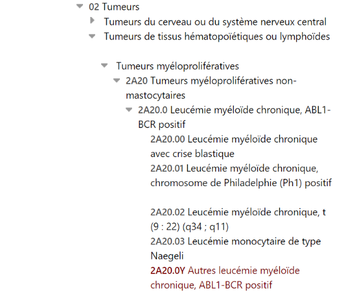

# CIM11  

### SYNTHÈSE :

**Description et type de standard** : la CIM-11 (Classification Internationale des Maladies et des problèmes de santé connexes) est une **classification des maladies** et fait partie des classifications de référence du **Réseau de la famille des classifications internationales de l'OMS** (WHO-FIC *Network*) au même titre que la CIF (Classification Internationale du Fonctionnement) et ICHI (*International Classification of Health Interventions*).

**Domaines d’application** : L'objectif de la CIM est de permettre l'enregistrement, l'analyse, l'interprétation et la comparaison systématiques des données de mortalité et de morbidité recueillies dans différents pays ou régions et à différents moments[^1]. Néanmoins, seuls quelques pays utilisent cette version de la CIM aujourd’hui.

**Maturité / Utilisation** : La version actuelle est la **CIM-11, adoptée par l'Assemblée mondiale de la Santé en 2019, et pouvant être mise en application dans les pays membres depuis 2022. En février 2023, 64 pays membres de l’OMS** sont engagés dans le processus d’implémentation de la CIM-11, mais n'ont toutefois **pas encore atteint le stade de l'adoption officielle** (parmi les implémentations précoces, initiées dès 2019 : Chine, Inde, Égypte, Tanzanie, Ouganda, Kenya, Etats-Unis, Mexique, Colombie, France, Allemagne, Pologne, Russie, etc. voir l'élément « Adoption du standard » et la Carte 1 en partie 4. Valorisation).

 A date, la France n’utilise pas encore la CIM-11 car l’implémentation en pratique n’est pas immédiate : il faut au préalable effectuer des changements dans les outils/logiciels de codage ou de recueil de l'information, un mapping entre les versions des classifications CIM, etc. Aussi aujourd'hui la CIM-10 est-elle largement plus utilisée - et ce, au moins pour les 3 ans à venir.
NB : l’incarnation française de la CIM-11 est coordonnée par l’ANS dans son rôle de Centre collaborateur de l’OMS français pour la famille des Classifications Internationales.

## 1.Général
- **Présentation** :
     - **Pays d’origine** : International
     - **Consortium d’origine** : Organisation Mondiale de la Santé (OMS)[^2]
     - **Type de standard** : Nomenclature

     - **Description** :
          - La CIM-11 est la **11ème version** de la CIM (Classification Internationale des Maladies et des problèmes de santé connexes), adoptée par l'Assemblée mondiale de la Santé en **2019**[^1]. Sa dernière mise à jour date de janvier 2024[^3]. La CIM-11 est une classification de référence de la famille des classifications de l'OMS (**WHO-FIC Network**)[^4], au même titre que la CIF[^5] (Classification Internationale du Fonctionnement) et ICHI (*International Classification of Health Interventions*)[^6]. Dans ce cadre, la CIM-11 est donc conçue pour être utilisée en alignement avec ces nomenclatures et complétées par celles-ci sur leurs domaines respectifs du fonctionnement et des interventions[^7]. La CIM-11 succède à la CIM-10[^8], entrée en vigueur en 1995 et mise en place en France à partir de 2000 pour le PMSI et les Causes médicales de Décès.

          - La Classification Internationale des Maladies et des problèmes de santé connexes (CIM) est la **norme de référence international** pour l'enregistrement, la notification, l'analyse, l'interprétation et la comparaison systématiques des **données de mortalité et de morbidité**. Elle permet aux pays de recenser les problèmes de santé et d'établir des statistiques au moyen d'un système de classification actualisé et cliniquement pertinent.

          - En France, on distingue la version CIM-10 de l’OMS, utilisée par la CNAM et le CépiDC pour décrire respectivement les affections de longue durée, et les causes médicales de décès, et la version CIM-10 FR maintenue par l’ATIH. Celle-ci est principalement la même que la CIM-10 OMS, mais contient quelques spécificités françaises.

          - Pour la première fois, dans sa 11e version, la CIM est **totalement numérique**[^9] : elle comporte des outils (interface de navigation, outil de codage, outil de traduction) et un logiciel (API[^10]) en ligne et hors ligne pour faciliter le codage et décrire précisément les événements de santé[^1]. Néanmoins, il existe d’ores et déjà des logiciels permettant de coder automatiquement en CIM-10, tel que le logiciel IRIS /MUSE maintenu par l’Iris Core group utilisé pour coder automatiquement les causes de décès, qui pourront être réutilisés pour la CIM-11.

          - La CIM-11 contient **17 000** codes uniques, voir l'élément « Flexibilité du standard, personnalisation » dans la partie 3. Technique). L'algorithme de recherche de l'outil de codage, fondé sur les termes contenus dans l'index français, interprète plus de 1,6 million de termes français[^11]

          - La CIM-11 comprend **26 chapitres + 2 sections** supplémentaires (voir Figure 1)[^12] :
             - Les 26 chapitres et la section supplémentaire « V » comportent les codes racine (stem code) décrivant **les maladies, leurs manifestations et symptômes**, reflétant l'état actuel des connaissances scientifiques
             - La section « X » est celui des **codes extensions**, permettant d'apporter des détails et de qualifier le diagnostic pour un codage de précision
             - Le nœud « *Health Devices, Equipment and Supplies* » de la section « X » contient **ICMD**[^13] (*International Classification of Medical Devices*) et la section « V » contient le **WHODAS 2.0**[^14] (*WHO Disability Assessment Schedule 2.0*) qui repose sur la CIF au niveau des concepts[^15]. En effet, Il couvre les 6 domaines suivants issus de la CIF : les fonctions cognitives, la mobilité, les soins personnels, les interactions avec d’autres personnes, les activités de la vie quotidienne et la participation

             - Les chapitres et sections suivants n'étaient pas inclus dans les précédentes versions de la CIM[^16].
        - Certains chapitres ont été nouvellement individualisés en CIM-11, mais contiennent des codes d’ores et déjà écrits en CIM-10 : chapitre 4 (Maladies du système immunitaire), Chapitre 7 (Troubles du cycle veille-sommeil), Chapitre 17 (Affections liées à la santé sexuelle) ;
        - D’autres en revanche sont entièrement innovants, contenant des codes qui n'étaient pas dans le périmètre CIM-10 : chapitre 26 (Affections de médecine traditionnelle – Module I), Section « V »  (Section supplémentaire pour l'évaluation du fonctionnement), Section « X » (Codes d'extension).

       

  **Figure 1 : Chapitres présents dans la CIM-11**

, Source : [Interface de navigation de l'OMS]()
  

 - La CIM-11 est constituée de 3 composantes[^15] (innovation structurelle principale de la CIM-11) : (1) la « **fondation** » est l'ensemble structuré et hiérarchisé (réseau relationnel) de termes (« vocabulaire ») ; (2) le **modèle conceptuel** organise ces termes ; (3) les **linéarisations** (ou *tabular lists*) sont des extraits de données (jeux de valeurs) issues de la « fondation » organisés pour décrire spécifiquement un domaine.
Par exemple, dans la fondation, l'infection par le VIH est à la fois une maladie du système immunitaire, une maladie infectieuse, une maladie sexuellement transmissible. Dans la linéarisation de morbi-mortalité[^18], le VIH est prioritairement et uniquement classée dans les maladies infectieuses

**Organisme en charge** : OMS

- **Application** :
   - **Domaine d'application en santé** : La CIM-11 permet la collecte et l'étude des statistiques sanitaires liées à la morbidité et à la mortalité ainsi que leur comparabilité internationale. Elle trouve ainsi  de nombreuses applications : recherche épidémiologique, analyse de la performance des systèmes de santé, amélioration de la qualité et de la sécurité des soins, étude des soins de santé primaires, études pour le regroupement des cas (casemix) pour déterminer le financement des établissements de santé, etc.[^8]

   - **Principaux cas d’usage** : quelques exemples de cas d'usage mis en avant par l'OMS[^19]
        - Codage des causes de décès à partir des certificats de décès
          NB : la déclaration par les médecins s’effectue invariablement en texte, i.e., ce n’est pas le médecin certifiant le décès qui choisit le code CIM approprié ; en France, cette tâche est à la main du CépiDc (travail de classification réalisé).
        - Codage et déclaration des **causes de maladie**, incluant les informations relatives aux soins primaires
        - **Regroupement des cas** selon le **casemix** et le **diagnostic** (utilisé pour l'allocation des ressources financières aux établissements de santé)
        - Évaluation et suivi de la **sécurité**, de **l'efficacité** et de la **qualité des soins** (description de la situation du patient, suivi des incidents, etc.)
        - **Registres du cancer** (type de cancer, emplacement, propagation, etc.)
        - **Définition de normes d'interopérabilité** pour les certificats de vaccination COVID-19
        - Affections de **médecine traditionnelle** (mesure du type de services, de leur fréquence, efficacité, sécurité, qualité, résultat, coût ; comparaison avec la médecine conventionnelle)
        - **Recherche** et réalisation d'**essais cliniques** et d'**études épidémiologiques**
   - **Illustration concrète : exemple d’utilisation sur un cas simple** : Ibrahim et al. (2022)[^20] décrivent l'essai pilote d’implémentation de la CIM-11 en 2021 dans un hôpital public au Koweït :
       - Au Koweït, la CIM-10 est utilisée pour le codage des diagnostics sur des formulaires papiers, traités par la suite informatiquement par le Centre National d'Information Sanitaire (NCHI) du ministère de la Santé. L'hôpital Farwaniya, hôpital public secondaire, a été sélectionné par le NCHI pour l'essai pilote d'implémentation de la CIM-11.
       - Après l'installation de **l'API hors-ligne de la CIM-11** (« *container Docker* ») **dans l'infrastructure informatique de l'hôpital**, une formation a été dispensée aux professionnels de santé pour apprendre à utiliser le nouvel outil.
       - Pour enregistrer un diagnostic à l'aide de l'API de la CIM-11 :
            - Le médecin saisit son diagnostic dans le champ principal de diagnostic (ex : « STEMI »)[^21].  
            - Ensuite, il faut relier ce diagnostic au code correspondant dans la CIM-11 à l'aide de l'outil de codage. Le médecin saisit le terme recherché (ex : « STEMI »)[^21] et l'outil renvoie une ou plusieurs propositions de codes CIM-11. Le médecin sélectionne le code le plus approprié correspondant au cas clinique (ex : « BA41.0 : *Acute ST elevation myocardial infarction* »).
            - Une fois le terme enregistré, il apparaît automatiquement dans le champ CIM-11 : le **code CIM-11 ainsi que l'URI** (*Uniform Resource Identifier*) sont **sauvegardés** dans la base de données.
      - Pour évaluer l'expérience d'utilisation de la CIM-11, un questionnaire comportant trois axes a été distribué aux médecins :
            - Les médecins ont réussi à **trouver ce qu'ils cherchent** : les réponses sont positives dans 83,6 % des cas (« oui, exactement » pour 46,5 % des médecins, « oui, partiellement » pour 37,1 % des médecins) ;
            - Le codage du diagnostic est **simple** : les réponses sont positives dans 83,4 % des cas (« assez simple » pour 47,1 %, « modéré » pour 36,3 %) ;
            - Le codage du diagnostic est **rapide** : les réponses sont positives dans 84,5 % des cas (« acceptable » pour 46,5 % des cas, « ok » pour 37,0 % des cas).

Dans l'ensemble, environ **83% des médecins ont par conséquent une expérience positive** de la CIM-11 sur ces trois critères. Seuls 2 % des questionnaires sont accompagnés d'un commentaire en texte libre, parmi lesquels 10 % d'entre eux étaient des commentaires négatifs sur la version 11.

- **Données** :
   - **Type de terminologie** : Ontologie
   - **Type de granularité** :
       - **Les codes de la CIM-11 sont des codes alphanumériques organisés selon une arborescence à plusieurs niveaux, allant du niveau d’information le plus général au plus précis.**
           - **Le niveau le plus général contient 28 chapitres, dont les 25 premiers décrivent des causes de morbidité et de mortalité (tumeurs, maladies infectieuses, maladies du sang, etc.).** **Les deux suivants sont considérés comme chapitres supplémentaires : le chapitre 26 permet de décrire des conditions de médecine traditionnelle,** **et le chapitre V permet d’évaluer et quantifier les concepts décrits dans les quatre chapitres. Le dernier chapitre : X,  contient des codes extension.**
           - **Le dernier niveau de l’arborescence contient les codes les plus précis, décrits avec au plus 6 caractères. Ils sont appelés stem codes en anglais (codes racines en français).** **Chacun des caractères du code indique les différents niveaux auxquels appartient le code racine.**
           - **Exemple avec le stem code : 2A20.0Y : Autres leucémie myéloïde chronique, ABL1-BCR positif.** Ce code appartient aux niveaux :
               - **2 : Tumeurs**
               - **2A2 : Tumeurs myéloprolifératives**
               - **2A20 : Tumeurs myéloprolifératives non mastocytaires**
               - **2A20.0 : Leucémie myéloïde chronique, ABL1-BCR positif. Ce niveau contient 4 types de leucémie (2A20.00, 2A20.01, 2A20.02, 2A20.03).**
               - **Le code 2A20.0Y (qui est un stem code) est utilisé lorsque la leucémie que l’on cherche à décrire ne correspond à aucun de ces quatre types de leucémie.**
           - **Les stem codes sont conçus pour que l’utilisateur n'ait besoin que d’un seul code pour décrire de manière précise l’affection du patient.** **Les niveaux supérieurs ne sont pas censés être utilisés pour le codage.**
               - ** En pratique pour le codage des causes de décès et la détermination de la cause initiale de décès, il faut parfois aller plus loin que le stem code (code racine), et mobiliser  des extensions, en complément. **   

       

  **Figure 2 : Niveaux et structure hiérarchique de la CIM-11**
, Source : [ Interface de navigation  ]()

  

                
- Une entité peut être classée dans différentes catégories de la CIM-11 et donc avoir plusieurs entités « parents » (voir Figure 3). Cette parentalité multiple est l'une des principales nouveautés de la CIM-11. La **classification la plus importante** est identifiée comme **classification « primaire »** et la ou les autres comme **« secondaires »**. Les classifications secondaires sont grisées dans la nomenclature.
      - Par exemple, dans l’image ci-dessous, la maladie codée « 2B70 » a pour parent primaire « Néoplasmes » et pour parent secondaire « Maladies du système digestif ». Le code apparaît deux fois mais celui correspondant au parent secondaire est grisé contrairement à l’autre. Le code 2B70 non grisé est la classification primaire.

       

  **Figure 3 : Pluri-classification d’une maladie**
, Source : [CD-11 Education Tool Unit 1 ]()

  

 - La granularité peut être encore plus précise avec l’ajout de codes d’extensions comme attributs (voir l'élément « Existence d'extensions certifiées » en partie 5. Utilisation)

- **Utilisation dans plusieurs langues** :
    - La version originale est la version anglaise ICD-11[^22] (*International Classification of Diseases and Related Health Problems*)
    - Elle a été traduite dans plusieurs langues : français{^23], arabe[^24], chinois[^25] et espagnol[^26]
    - La traduction en russe et dans **20** autres langues est en cours de développement

- **Disponibilité de la documentation d'implémentation** :
  - Guide de référence[^27] - dont la traduction française a été envoyée, et reçue par l’OMS
  - Guide de mise en œuvre ou de transition[^8]
  - Aide-mémoire[^28]
  - Guide d'utilisation du navigateur de la CIM-11 disponible en français et en anglais[^29]  

  ## 2.Gouvernance
- **Modalités d'accès et distribution des solutions basées sur ce standard** :
    - La CIM-11 est accessible à tous, via un accès gratuit en ligne ou en téléchargement[^19]
    - Elle est distribuée sous la licence « ***Creative Commons Attribution-NoDerivs 3.0 IGO*** »[^1]. Il n'est pas autorisé d'apporter des modifications à la classification[^30] :  
      - Les mappings entre la CIM-11 (et/ou ses traductions) et d’autres terminologies ne sont pas couverts par cette licence et doivent faire l’objet d’une autorisation distincte de l’OMS
L'ajout de champs à la CIM-11 n'est autorisé que dans le cas où ces ajouts sont clairement identifiés comme ne provenant pas de l'OMS
L'API (en ligne et en local) et l'outil de codage sont également distribués sous la même licence.

- **Processus de prise de décision sur le standard** :
   - Les mises à jour sont entreprises par l'OMS en collaboration avec le Réseau de la famille des classifications internationales de l'OMS. Ses membres sont principalement des représentants des pays qui supervisent les activités de classification dans leur propre pays[^8].
   - Les utilisateurs peuvent également soumettre des propositions de mise à jour :
       - Soit par une plateforme Web accessible en créant un compte sur le site[^31]
       - Soit en envoyant un mail à l’adresse icd@who.int[^1]
   - Une procédure spécifique de collecte de propositions pour assurer la maintenance de la CIM-11 en France est conduite par le Mortality Reference group de l’OMS pour les données de mortalité, au sein duquel la France est représentée par le CépiDc (référent mortalité du centre collaborateur de l’OMS)

- **Maturité du standard** :
  - **Fréquence de mise à jour** :
     - La révision actuelle est la **CIM-11**, adoptée en 2019 par l'Assemblée mondiale de la Santé et entrée en vigueur le **1er janvier 2022**.
     - La révision précédente, la **CIM-10**, **est entrée en vigueur en 1995** (elle demeure en mai 2023 la plus utilisée mais la transition vers la CIM-11 a commencé, voir l'élément « Adoption du standard » en partie 4. Valorisation).
     - La première version de la CIM révisée par l'OMS est la CIM-6 en 1948[^19]
     - L'OMS publie des modifications mineures **tous les ans** et majeures **tous les trois ans**[^15]
     - La révision actuelle de la CIM-11 a été mise à jour en janvier 2024[^2]
     - L’OMS publie la version actuelle en janvier de chaque année

- **Existence de financements pour standardisation** : L'entrée en vigueur étant encore récente, et le planning d'implémentation prévu variant selon les contextes nationaux, il n'y a pas de financements OMS pour la transition vers la CIM-11.

- **Ressources d’accès à la terminologie et liens associés** :
   - Interface de navigation (en français) pour parcourir le contenu de la classification[^12]
   - API de la CIM-11 offre un accès programmatique à la classification (hors ligne et en ligne) et s'intègre aisément dans les logiciels sanitaires locaux[^10]
   - Outil d'aide au codage[^11]

## 3.Technique
- **En France, utilisation depuis 2015 de deux versions de la CIM-10 :**
  - **CIM-10 OMS pour les causes médicales de décès et ALD**
  - **CIM-10 française pour le PMSI : [version 2015](https://www.atih.sante.fr/cim-10-fr-2015-usage-pmsi) et [version 2023](https://www.atih.sante.fr/cim-10-fr-2023-usage-pmsi)**

- **Capacité de traduction vers un autre standard (intra types de standards)** :
   - Sur la CIM-10 OMS (version utilisée par la CNAM et par le CépiDC, mais non par l’ATIH qui utilise la CIM-10 FR) :
      - La CIM-11 est **partiellement alignée avec la CIM-10*
* : elle contient la **CIM-O** (extension **oncologie**) dans le nœud « CIM-O » du chapitre « extensions » de la version accessible via les API de juin 2018 ou dans le nœud « Histopathologie » de la version en ligne d'avril 2019
      - Par ailleurs, un **mapping entre la CIM-10 et la CIM-11** a été réalisé par l'OMS
           - A ce jour, encore incomplet : l’OMS travaille à ce sujet, dans le cadre de groupes de travail spécifiques - *Task Force mapping*
           - Chaque élément de la CIM-10 se retrouve dans la CIM-11, cependant, en raison d'évolutions dans le domaine médical et de la restructuration de la nomenclature, un élément de la CIM-10 peut ne plus avoir de code unique dans la CIM-11 et peut avoir été déplacé dans de nouveaux chapitres.[^32]  

  - **L’alignement avec SNOMED-CT est plus difficile** à cause des structures et des niveaux de granularité différents. Il y a eu plusieurs efforts pour mapper SNOMED-CT et la CIM-11 (y compris en utilisant des méthodes de *machine learning*)[^33]
     - Il existe une estimation datée de 2015 qui **évalue l'alignement** entre ces deux terminologies par chapitre de la CIM-11 (voir Figure 4)[^34]

       

   **Figure 4 : Alignement entre la CIM-11 et SNOMED CT**
, Source : [Rodrigues et al. (2015)]()
   
  

- Un **mapping entre SNOMED-CT** et la **CIM-10**[^35] est disponible sur le portail Athena d'OHDSI qui permet de mapper indirectement les concepts entre CIM-11 et SNOMED-CT en utilisant un double-mapping :
        - 1) Trouver les correspondances CIM-10 pour un concept SNOMED-CT (un concept SNOMED-CT peut correspondre à plusieurs concepts CIM-10, il existe environ 1 000 concepts CIM-10 non-mappés à SNOMED-CT à ce jour)
        - 2) Utiliser le mapping CIM-10 vers CIM-11

Un outil de mapping entre **SNOMED-CT** et la **CIM-11** est en cours de développement (ICD-11 *Mapping Tool Page*[^36]) mais il n’y a pas encore d’accès public à cette ressource car elle est en cours de finalisation avant la publication.

- **Communication avec d'autres standards (inter typologies de standards)** :
  - Les codes CIM-11 peuvent être transférés par **FHIR**[^37]
  - Les codes CIM-11 sont acceptés par le ***Sentinel Common Data Model***[^38]
  - La CIM-11 n'est **pas encore considérée comme un concept standard accepté dans OMOP-CDM** (à la différence de la CIM-10).
  - **OSIRIS**[^39] et **i2b2**[^40] n'utilisent pas encore la CIM-11 (mais la CIM-10).

- **Flexibilité du standard, personnalisation** :
   - La possibilité d'utiliser des **codes extensions** permet d’apporter des précisions supplémentaires à l'information contenue dans les codes racine (*stem code*[^41]). Les codes extension ne peuvent pas être utilisés de manière indépendante sans code racine. Il existe deux types de codes extension :
      - Type 1 : Les codes extension qui permettent **d'ajouter des détails** à un code racine (en termes de sévérité, temporalité, anatomie, histopathologie, médicaments, dispositifs médicaux, etc.).
      - Type 2 : les codes extension qui indiquent **comment le diagnostic doit être interprété / utilisé** (timing du diagnostic, certitude, méthode, contexte, etc.)
   - Par exemple, le code « FA00.Z&XK8G/MG30.30 » désigne l’arthrose de la hanche gauche avec douleur chronique due à une inflammation persistante.
      - « FA00.Z » désigne l'arthrose de la hanche
      - « XK8G » désigne le côté gauche (latéralité)
      - « MG30.30 » désigne la douleur musculosquelettique secondaire chronique due à une inflammation persistante (élément supplémentaire)
   - Les codes racine peuvent être **combinés** entre eux[^42] :
      - Si un code racine se suffit à lui-même, on parle de **pré-coordination**
      - Si un code racine doit être combiné à d'autres codes racine et/ou à des codes extension, on parle de **post-coordination** (on dit que les concepts sont post-coordonnés dans un cluster).
         - Exemple de la combinaison de deux codes racine : code1/code2
         - Exemple de la combinaison d'un code racine et de deux codes extension : stem code&extension code1&extension code2
   - La CIM-11 n'est pas personnalisable (voir l'élément « *Modalités d'accès et distribution des solutions basées sur ce standard* » en partie 2. Gouvernance).

- **Contraintes d'implémentation** :
La CIM-11 ne présente pas de contrainte d'implémentation.

- **Intensité de la perte de données au mapping** :
  - Barke et al. (2018)[^43] ont réalisé une expérience pilote permettant de tester une nouvelle manière de classifier les douleurs chroniques dans la CIM-11 (1 groupe de symptômes associés à des douleurs chroniques primaires et 6 groupes associés à des douleurs secondaires). Les axes de l'évaluation sont les suivants : exhaustivité, exclusivité mutuelle des catégories, pertinence des catégories, confiance des médecins dans le codage. Les 5 centres indépendants participants répartis sur 3 continents ont dû attribuer un code CIM-11 à 507 patients de manière consécutive :
    - Seulement 3% des diagnostics de douleur chronique ne correspondent à aucune des catégories proposées : l'exhaustivité est donc de 97%.
    - 98% des diagnostics sont classifiés dans une catégorie unique, notamment grâce à l'utilisation de codes extension
    - Les médecins ont jugé les catégories pertinentes (note moyenne de 1,9 sur 3) et avaient confiance en leur codage (note moyenne de 2 sur 3).
    - Par conséquent, sur le périmètre de ce test, la classification proposée pour le traitement des douleurs chroniques dans la CIM-11 est prometteuse en termes **d'exhaustivité, d'exclusivité, de pertinence et de confiance dans le codage**.

  - Grosjean et al. (2020)[^44] évaluent le **mapping de la version française de la CIM-11 avec les terminologies incluses dans le serveur HeTOP**[^45]. Pour cette étude, des outils de traitement du langage naturel et des algorithmes de mapping en français ont été créés :
    - 144 823 mappings de la CIM-11 avec les 75 terminologies intégrées à HeTOP ont été effectués
    - SNOMED-CT, MeSH (*Medical Subject Headings*) et NCIT (*NCI Thesaurus*) sont les terminologies ayant le plus de mappings avec la CIM-11
    - La qualité du mapping est globalement très bonne :
        - **La précision atteint 98 % et le *recall 66 %* **
        - 82 % des mappings sont évalués comme « correspondances exactes »
        - Seuls 2 % des mappings sont évalués comme « faux »
  - Cependant, en raison de la précision des concepts de la CIM-11 et des limites technologiques, la couverture de l'outil de mapping est relativement faible (47,76% des codes de la CIM-11 ont été mappés à au moins un concept)

  - Même si la CIM-11 est utilisée pour les statistiques de mortalité et de morbidité par les pays membres de l'OMS dès 2022, des **versions antérieures de la CIM sont encore utilisées** dans les établissements de santé. Xu et al. (2022)[^46] donnent l'exemple de l'utilisation de la CIM-10-CM (CIM-10 avec modifications, autorisées par l'OMS) utilisée aux Etats-Unis. Un **mapping entre la CIM-10-CM et la CIM-11** est donc nécessaire pour assurer l'interopérabilité des données de santé. Deux méthodes de mapping sont possibles (voir Figure 5) :
   - Méthode 1 : Mapping de la CIM-10-CM à SNOMED CT puis à la CIM-11
   - Méthode 2 : Mapping de la CIM-10-CM à la CIM-10 puis à la CIM-11 

       

   **Figure 5 : Performances du mapping**, Source : [Xu et al.(2022)]()
   
  

  
  Les résultats montrent que la **méthode 2 est plus performante**.

- Enfin, les discussions récentes en 2023[^47] dans le cadre de l’OMS ont permis au groupe de travail sur l’alignement des terminologies de mettre en avant les avancées en termes de mapping entre ICHI et la CIM-11. Également, le groupe de travail a évoqué leurs avancées sur l’alignement entre la CIM-10 et CIM-11.

- **Existence d’un historique et accessibilité à l’historique**
  - L'historique des mises à jour de la CIM-10[^48] et la version des anciennes interfaces de navigation de la CIM-10 (pour les versions des années 2008, 2010, 2014, 2015, 2016 et 2019) sont disponibles[^19]
  - L’ATIH a utilisé la version CIM-10 OMS jusqu’à 2014 pour le codage PMSI ; puis la CIM-10 FR à partir de 2015. Au début de chaque année, l’ATIH publie une version mise à jour de la CIM-10, la version actuelle date de décembre 2023 (en mars 2024).

  ## 4.Valorisation

- **Accessibilité à des ressources de formation** :
  - Des ateliers de formation pour l’utilisation de la CIM-11 ont été organisés dans toutes les régions de l’OMS et un soutien individuel sera régulièrement fourni[^49] pour faciliter l'implémentation de la classification dans les pays membres[^8]
  - Des ressources de formation sur la CIM-11 sont disponibles en libre d’accès (12 cours accessibles)[^50]

- **Disponibilité de la documentation scientifique démontrant l'intérêt** :
  - Gaebel et al. (2018)[^51] **comparent l'utilisation de la CIM-10 et de la version bêta (draft) de la CIM-11** pour une sélection de troubles mentaux. L'étude, réalisée dans 4 établissements de santé allemands, donne les résultats suivants :
     - Dans le cas de cas **cliniques complexes**, les auteurs mettent en lumière les avantages de l'utilisation de la CIM-11 par rapport à la CIM-10 :
        - Le temps de recherche du diagnostic est plus court
        - Le nombre de diagnostics corrects est plus élevé
        - L'utilité clinique de la CIM-11 est jugée supérieure à celle de la CIM-10 par les cliniciens
     - Dans le cas de **cas cliniques plus simples** :
         - Le codage par les cliniciens utilisant la CIM-10 est plus rapide et cohérent que ceux utilisant la CIM-11
         - Ces résultats s'expliquent par une plus grande familiarité avec la CIM-10 actuellement utilisée et une plus grande complexité pratique d'utilisation de la CIM-11
         - Malgré cela, les cliniciens jugent la classification CIM-11 plus complète et utile que la CIM-10.
 - Des **exemples de transition de la CIM-10 à la CIM-11 au Koweït[^20] et au Kenya[^52]** mettent en lumière la **simplification** du codage et une amélioration de la **fiabilité** des données apportées par l'utilisation de la CIM-11.

- **Adoption du standard** :
Adoption officielle :
  - Depuis l'entrée en vigueur de la CIM-11 en 2022, les pays sont encouragés à initier son implémentation.
  - Cependant, l'OMS anticipe que la **transition** pourra prendre du temps[^53] :
      - Environ **1-2 ans** pour un pays qui n'a jamais implémenté la CIM et dispose d'un système d'information simple
      - **4-5 ans** pour un pays qui utilise déjà une version précédente de la CIM et un système d'information complexe
  - Par conséquent, de nombreux pays ont déjà commencé à implémenter partiellement la CIM-11 sur certains cas d'usage (voir ci-dessous), mais pas encore pour les statistiques nationales officielles. Les pays ayant adopté la CIM de manière officielle travaillent encore avec la version 10[^54]
  - La traduction française a été assurée par l’ATIH et l’ANS dans le cadre de leur contribution au ccOMS FR[^55]
     - Le rôle du ccOMS FR a été essentiel dans cette traduction et jouera probablement un rôle dans la transmission à l’OMS des propositions françaises d’évolution de la CIM-11

 - Perspectives d’implémentation opérationnelle en France :
  - CépiDc : codage des causes médicales de décès
  - ATIH : codage PMSI des 4 champs
  - CNAM : codage des affections longues durées (ALD)

 - Utilisation sur le marché :
    - L'implémentation de la CIM-11 parmi les pays membres de l'OMS progresse : en février 2022, l'OMS indique que la CIM-11 est utilisée par **35 pays**[^1] ; en février 2023, **64 pays** sont engagés dans le processus d’implémentation de la CIM-11[^56].
    - L'OMS ne fournit pas la liste des pays utilisant la CIM-11 mais publie une carte d'évolution de l'implémentation précoce (dès 2019)[^19]. Ainsi, à fin 2019, les pays dans lesquels les implémentations sont les plus nombreuses sont les suivants : Chine, Inde, Égypte, Tanzanie, Uganda, Kenya, Etats-Unis, Mexique, Colombie, France, Allemagne, Pologne, Russie (voir Carte 1).

       

  **Carte 1: Implémentation de la CIM-11 dans les États membres de l’OMS fin 2019**, Source : [OMS]()
   
  

- Eurostat a lancé en 2023 une *Task Force ICD 11* for mortality coding afin d’établir les marges de diffusion des données européennes de mortalité en lien avec le passage à la CIM-11 et suivre l’avancée des implémentations.
- Chaque année, Eurostat demande aux États membres leurs perspectives d’implémentation de la CIM-11 pour le codage de la mortalité
- Sur les répondants à l’enquête, seulement 3 pays prévoient d’implémenter la CIM-11 avant 2027, 8 en 2027, 5 en 2028 et 7 après

  - Lorsque la CIM-11 sera adoptée **en France de manière officielle**, les utilisateurs cibles seront les suivants[^15] :
     - L'**Assurance maladie** pour qualifier les affections de longues durées
     - L'**ATIH** et les **établissements de santé** pour coder les diagnostics dans les recueils d’information des différents champs PMSI (Programme de Médicalisation des Systèmes d’Information)
     - Le **CépiDC** de l'INSERM pour le codage et la production annuelle des statistiques des causes médicales des décès en France
         - NB : Le CépiDc ne pourra passer à la CIM-11 pour coder les causes de décès que lorsqu'un taux de codage automatique d'au moins 80% des certificats sera atteint par les outils de codage automatique (IRIS/MUSE, Doris) ; ceci afin que les certificats restant à coder manuellement puissent être codés dans les délais requis. Une première version IRIS/MUSE 11 codant en CIM-11 a été mise à disposition pour des tests en octobre 2023.
   - **La DREES** pour le rapport sur « L'État de santé de la population en France » et l'enquête « Santé mentale en population générale »
   - **L'IRDES** pour l'enquête « Santé et protection sociale »
   - **L'OCDE** pour ses profils de santé par pays
      - **Au niveau mondial, l'OMS recense 10 millions** d’accès à l’API de la CIM-11 par mois, 100 000 utilisations hors-ligne (via Docker) et **33 000** sessions mensuelles sur le navigateur[^57].

- **Fournisseurs de service ayant l'expertise en France** :
En mai 2023, nous n'avons pas identifié de fournisseurs de service[^58] ayant l'expertise. Seules les instances publiques participant à la traduction et à la préparation de l'implémentation de la classification en sont expertes : l'ATIH, l'ANS et le CépiDc (dans le cadre de sa participation pour la mortalité au CC OMS français) ; ces structures ont ainsi été sollicitées par l'OMS pour participer à la traduction de la classification en français.

## 5.Utilisation
- **Simplicité d'usage** :
   - **Complexité d’utilisation liée au mélange entre une classification statistique et un langage international, en revanche les outils sont simple à installer et consulter**
   - Le guide d'implémentation[^8] décrit la CIM-11 comme : « **facile à installer et à utiliser en ligne et hors-ligne** car elle utilise un logiciel hôte gratuit », notamment en raison du fait qu'elle est à présent entièrement numérique
   - Dans l'étude d'Ibrahim et al. (2022)[^20], **la simplicité d'usage** fait partie des trois critères utilisés pour évaluer l'expérience utilisateur des 241 médecins ayant participé au projet pilote. La simplicité d'usage a été estimée par les médecins comme étant « assez facile » dans 47,1% des cas, « modéré » dans 36,3% des cas et « difficile » dans 16,5% des cas.

- **Existence d'une communauté en ligne et degré d'activité**:
Compte tenu de sa récente entrée en vigueur, la communauté en ligne relative à la CIM-11 est encore relativement petite :
    - Forums de discussion[^59].
    - Vidéos de présentation de la CIM (ses révisions, questions / réponses, etc.) sur la chaîne YouTube de l'OMS[^60].

- **Outils d’implémentation / aide au codage**:
     - **Outil d’aide au codage** CIM-11[^11] (aide en français pour faciliter son utilisation[^61])  
     - **CoDEdit** : outil créé par l’OMS en 2014 permettant de faire des contrôles de routine pour les statistiques sur les causes de décès, codées avec la nomenclature CIM-11. Il peut signaler une mauvaise utilisation des codes, alerter sur des utilisations abusives et faire un résumé des données[^62,63].
     - ***ICD Field Implementation Tool (ICD-FIT)*** : outil de formation au codage et d'auto-évaluation en ligne pour la CIM-11 créé par l’OMS en 2019. L'utilisateur s'exerce à coder avec la nomenclature CIM-11 et obtient un retour sur la précision de son codage[^64].
     - **IRIS**[^65] : logiciel développé par Iris Institute qui permet d’identifier la cause sous-jacente de la mort parmi les maladies et affections renseignées sur le certificat de décès.
        - L’IRIS code l’ensemble des causes de décès et le module MUSE détermine la cause initiale.

- **Outils compatibles** :
3 outils sont compatibles avec la CIM-11 :
    - **ANACoD 3**[^66] (voir Figure 6) : outil en ligne mis à disposition par l'OMS permettant d’analyser des données sur la mortalité et les causes de décès (l'utilisateur peut utiliser des données d'échantillon ou ses propres données). Il génère des indicateurs qui révèlent les  
     problèmes potentiels de qualité des données et des indicateurs comme le taux de mortalité par sexe et par âge, l'espérance de vie à la naissance, etc.  

       

  **Figure 6 : Aperçu d’indicateurs générés par ANACoD 3 – Taux de mortalité par sexe pour 100 000 habitants**, Source : [anacod-cdn](https://anacod-cdn.azureedge.net/v11/#/upload/check)
   
  

  
- **DORIS**[^67] (voir Figure 7) : logiciel en ligne développé par l'OMS qui aide à trouver la cause sous-jacente du décès à partir des certificats de décès. Il se présente sous la forme d’un formulaire à remplir.

       

  **Figure 7 : Aperçu du logiciel DORIS**, Source : [DORIS](https://icd.who.int/doris/tool)
   
  

- **Bibliothèque de requêtes types** : Le guide de référence[^30] donne plusieurs exemples de codes CIM-11 et en détaille la composition.

- **Lisible par un humain : Oui**
   - Les codes de la CIM-11 ne sont pas directement compréhensibles par un être humain, mais il est possible de retrouver la signification du code en utilisant le navigateur de la CIM-11.

[^1]: Voir le guide d’implémentation : en anglais ([ICD-11 Implementation or Transition Guide - source : CIM-11](https://icd.who.int/en/docs/ICD-11%20Implementation%20or%20Transition%20Guide_v105.pdf)) et en français ([CIM-11](https://icd.who.int/fr) [Guide pour la mise en œuvre ou la transition)](https://icd.who.int/fr/docs/192190_ICD-11_Implementation_or_Transition_Guide_rev_25_10_2019-fr.pdf)
[^2]: Voir : [Publication de la CIM-11 2022](https://www.who.int/fr/news/item/11-02-2022-icd-11-2022-release)
[^3]: Voir [Catalogue des terminologies | ANS](https://smt.esante.gouv.fr/terminologie-cim11-mms/)
[^4]: Voir : [Classifications](https://www.who.int/standards/classifications). Ce réseau contient notamment trois nomenclatures de référence que sont la CIM, la CIF (Classification Internationale du Fonctionnement) et ICHI (International Classification of Health Interventions) ainsi que des nomenclatures dérivées.
[^5]: Voir : [International Classification of Functioning, Disability and Health (ICF)](https://www.who.int/classifications/international-classification-of-functioning-disability-and-health)

[^6]: Voir : [International Classification of Health Interventions (ICHI)](https://www.who.int/classifications/international-classification-of-health-interventions)
[^7]: Voir : [ICHI Beta-3 Reference Guide International Classification of Health Interventions](https://mitel.dimi.uniud.it/ichi/docs/ICHI%20Beta-3%20Reference%20Guide.pdf)
[^8]: Des nouveautés ont été apportées à la CIM-11 par rapport à la version précédente de la CIM (CIM-10). Les différents éléments sont repris au cours de la fiche. L’ensemble des nouveautés est synthétisé dans le guide de référence de la CIM-11 : voir [ICD-11 Reference Guide](https://icdcdn.who.int/icd11referenceguide/en/html/index.html#part-3-new-in-icd11)
[^9]: La CIM-11 est la première version de la CIM entièrement numérique, c’est-à-dire qu’il n’existe pas de version papier de la nomenclature, tous les outils et les plateformes associées sont numériques.
[^10]: Voir : [Home Page ICD API](https://icd.who.int/icdapi)
[^11]: Par exemple, en cherchant les termes suivants dans l’outil de codage ([Outil de Codage en CIM-11 Statistiques de mortalité et de morbidité (SMM))](https://icd.who.int/ct11/icd11_mms/fr/release) : « calcul dentaire », « tartre », « plaque dentaire » et « dépôts sur les dents », l’outil renvoie le terme clinique DA08.4 « Dépôts sur les dents », inclus dans la catégorie DA08 « Maladies des tissus durs des dents » dans la partie « Maladies ou affections du complexe orofacial » du chapitre 13 « Maladies de l’appareil digestif ».
[^12]: Pour plus de précisions sur les différents chapitres et sur les sections supplémentaires de la CIM-11 (dont un chapitre de codes extensions facultatifs qui sont utilisés pour apporter des précisions aux autres codes), voir l’interface de navigation : [CIM-11 pour les statistiques de mortalité et de morbidité](https://icd.who.int/browse11/l-m/fr)
[^13]: Voir : [Nomenclature of medical devices](https://www.who.int/teams/health-product-policy-and-standards/assistive-and-medical-technology/medical-devices/nomenclature)
[^14]: Voir : [WHO Disability Assessment Schedule (WHODAS 2.0)](https://www.who.int/classifications/international-classification-of-functioning-disability-and-health/who-disability-assessment-schedule)
[^15]: Le document « cgts_sem_cim11-mms_fiche-detaillee.pdf » disponible à l’adresse [CIM11-MMS | ANS - Serveur Multi-Terminologies](https://smt.esante.gouv.fr/terminologie-cim11-mms/) précise les liens de la CIM-11 avec d’autres terminologies.
[^16]: Voir : ICD-11 Education Tool Unit 1 : [ICD-11 Education Tool Unit 1](https://icdcdn.who.int/icd11training/ICD-11%20Education%20Tool%20Unit%201/story_html5.html)
[^17]: Voir : [WHO-FIC Foundation](https://icd.who.int/dev11/f/en#/)
[^18]: Voir : [CIM-11 pour les statistiques de mortalité et de morbidité](https://icd.who.int/browse11/l-m/fr). Il s’agit de la linéarisation internationale de référence.
[^19]: Voir : [International Classification of Diseases (ICD)](https://www.who.int/classifications/classification-of-diseases)
[^20]: Voir l'article de Ibrahim I, Alrashidi M, Al-Salamin M, Kostanjsek N, Jakob R, Azam S, Al-Mazeedi N, Al-Asoomi F. « ICD-11 Morbidity Pilot in Kuwait: Methodology and Lessons Learned for Future Implementation ». Int J Environ Res Public Health. (2022) : [ICD-11 Morbidity Pilot in Kuwait: Methodology and Lessons Learned for Future Implementation - PMC](https://www.ncbi.nlm.nih.gov/pmc/articles/PMC8910646/)
[^21]: L’exemple [ICD-11 workshop for clinicians](https://www.youtube.com/watch?v=0IyGS8y6_Dc) est cité par Ibrahim et al. (2022). Voir la vidéo de 3:20 à 4:07 pour plus de détails.
[^22]: Voir l’interface en anglais : [ICD-11 for Mortality and Morbidity Statistics](https://icd.who.int/browse11/l-m/en)
[^23]: La traduction en français est disponible depuis 2022, l'ATIH et l'ANS y ont contribué en collaboration avec l’OMS : [La CIM 11 norme médicale universelle bientôt disponible en français | ANS](https://smt.esante.gouv.fr/news/la-cim11-bientot-traduite/)
[^24]: Voir l’interface en arabe : التصنيف-11 لإحصائيات الوفيات والمرا[ضة](https://icd.who.int/browse11/l-m/ar)
[^25]: Voir l’interface en chinois : [用于死因与疾病统计的ICD-11](https://icd.who.int/browse11/l-m/zh)
[^26]: Voir l’interface en espagnol : [CIE-11 para estadísticas de mortalidad y morbilidad](https://icd.who.int/browse11/l-m/es)
[^27]: Voir : [ICD-11 Reference Guide](https://icdcdn.who.int/icd11referenceguide/en/html/index.html)
[^28]: Voir : [CIM-11 – Aide-mémoire](https://icd.who.int/fr/docs/icd11factsheet_fr.pdf)
[^29]: Voir : [Guide d'utilisation](https://icd.who.int/browse11/Help/fr)
[^30]: Voir : [Eleventh Revision of the International Statistical Classification of Diseases and Related Health Problems (ICD-11) Digital Version Terms of Use and License Agreement](https://icd.who.int/en/docs/ICD11-license.pdf)

[^31]: Voir : [Log in](https://icd.who.int/dev11/Identity/Account/Login?ReturnUrl=%2Fdev11%2Fproposals%2Ff%2Ficd%2Fen)
[^32]: Par exemple, le code « A39.8 » de la CIM-10 correspond à la catégorie « Other meningococcal infections ». Cet élément est relié à plusieurs codes de la CIM-11 : « 1C1C.Z Meningococcal disease, unspecified », « 1D00.0 Bacterial encephalitis ».L'élément « Sexual dysfunction, not caused by organic disorder or disease » (code F52), classé dans le chapitre 5 (« Troubles mentaux et du comportement ») de la CIM-10 est mappé à l'élément « HA0Z Sexual dysfunctions, unspecified » du chapitre 17 (« Affections liées à la santé sexuelle ») de la CIM-11.Pour plus d’informations, voir le mapping : https://icd.who.int/browse11/Downloads/Download?fileName=mapping.zip  

[^33]: Voir la vidéo : [Mapping Automation Case Study: SNOMED-to-ICD11 - Brian Carlsen (202035)](https://www.youtube.com/watch?v=cVFYTgQyPRA)
[^34]: Voir l’article de Rodrigues JM, Schulz S, recteur A, Spackman K, Millar J, Campbell J, Ustün B, Chute CG, Solbrig H, Della Mea V, Persson KB. « ICD-11 et SNOMED CT Common Ontology: système circulatoire. » Stud Health Technol Inform (2015) : https://www.researchgate.net/profile/Vincenzo-Della-Mea-2/publication/281449994_Semantic_Alignment_between_ICD-11_and_SNOMED_CT/links/55e83bf208ae3e121842289b/Semantic-Alignment-between-ICD-11-and-SNOMED-CT.pdf?origin=publication_detail
[^35]: Voir : https://athena.ohdsi.org/search-terms/terms?vocabulary=ICD10&page=1&pageSize=15&query= 
[^36]:  Voir : [ICD11 Mapping](https://confluence.ihtsdotools.org/display/MT/ICD11+Mapping)
[^37]: Voir :  Voir : [Terminologies - FHIR v5.0.0](https://www.hl7.org/fhir/terminologies.html) 
[^38]: https://www.sentinelinitiative.org/sites/default/files/Drugs/Assessments/Mini-Sentinel-Modular_Program_4-Documentation.pdf
[^39]: Voir : https://github.com/siric-osiris/OSIRIS/blob/v1.1.05/documentation/ModeleCliniqueOSIRIS.pdf 

[^40]: Voir :  Voir : [Ontologies 101](https://community.i2b2.org/wiki/display/IWG/Ontologies+101)
[^41]: Voir : [ICD-11 Reference Guide](https://icdcdn.who.int/icd11referenceguide/en/html/index.html#extension-codes)
[^42]: Voir : [ICD-11 Reference Guide](https://icdcdn.who.int/icd11referenceguide/en/html/index.html#precoordination-and-postcoordination) 
[^43]: Voir l’article de Barke A, Korwisi B, Casser HR, Fors EA, Geber C, Schug SA, Stubhaug A, Ushida T, Wetterling T, Rief W, Treede RD. « Pilot field testing of the chronic pain classification for ICD-11: the results of ecological coding. » BMC Public Health (2018) : [Pilot field testing of the chronic pain classification for ICD-11: the results of ecological coding](https://pubmed.ncbi.nlm.nih.gov/30404594/)
[^44]: Voir l’article de Grosjean J, Billey K, Charlet J, Darmoni SJ. « [Manual Evaluation of the Automatic Mapping of International Classification of Diseases (ICD)-11 ». Stud Health Technol Inform. 2020 Jun : Manual Evaluation of the Automatic Mapping of International Classification of Diseases (ICD)-11 (in French)](https://pubmed.ncbi.nlm.nih.gov/32570646/)
[^45]:  HeTOP inclut les principales terminologies et ontologies de santé, voir : [HeTOP](https://www.hetop.eu/hetop/) 
[^46]:Voir l’article de Xu J, Fung KW, Bodenreider O. « Sequential Mapping - A Novel Approach to Map from ICD-10-CM to ICD-11. » Stud Health Technol Inform. 2022 Jun : [Sequential Mapping - A Novel Approach to Map from ICD-10-CM to ICD-11](https://pubmed.ncbi.nlm.nih.gov/35672978/) 
[^47]:  [WHO-FIC Network Annual Meeting 2023](https://www.who.int/news-room/events/detail/2023/10/16/default-calendar/who-fic-network-annual-meeting-2023) 
[^48]: [Voir : List of Official ICD-10 updates}](https://www.who.int/standards/classifications/classification-of-diseases/list-of-official-icd-10-updates) 
[^49]: Les informations concernant la date de début et la fréquence des séances ne sont pas mentionnées.
[^50]:Voir : [ICD-11 Training Package](https://icdcdn.who.int/icd11training/index.html)
[^51]: Voir l’article de Gaebel W, Riesbeck M, Zielasek J, Kerst A, Meisenzahl-Lechner E, Köllner V, Rose M, Hofmann T, Schäfer I, Lotzin A, Briken P, Klein V, Brunner F, Keeley JW, Rebello TJ, Andrews HF, Reed GM, Kostanjsek NFI, Hasan A, Russek P, Falkai P. « Internetbasierte Untersuchungen zur diagnostischen Klassifikation und Kodierung psychischer Störungen im Vergleich von ICD-11 und ICD-10 » [Web-based field studies on diagnostic classification and code assignment of mental disorders: comparison of ICD-11 and ICD-10]. Fortschr Neurol Psychiatr. (2018) : [Web-based field studies on diagnostic classification and code assignment of mental disorders: comparison of ICD-11 and ICD-10](https://pubmed.ncbi.nlm.nih.gov/29621822/)
[^52]: Voir : [Kenya ICD-11 Transition experience](https://cdn.who.int/media/docs/default-source/classification/cat-webinars/icd-11-implementation-strategy-and-country-experiences/who-country_exp_mortalty_kenya_final.pdf?sfvrsn=ac364306_1)
[^53]: Voir : [ICD–11 Fact Sheet](https://icd.who.int/en/docs/icd11factsheet_en.pdf)
[^54]: C’est le cas notamment en France dans les données du PMSI (CIM-10 FR 2022 à usage PMSI | Publication ATIH et https://www.lespmsi.com/2023/cim-10-fr_2023_a_usage_pmsi_provisoire.pdf), au Royaume-Uni dans les données du National Health Service ([Clinical Classifications - NHS Digital](https://digital.nhs.uk/services/terminology-and-classifications/clinical-classifications)), aux États-Unis ([ICD-11: What to Expect in the U.S.A. for the Upcoming Coding Standard](https://www.rxnt.com/icd-11-what-to-expect-in-the-us-for-upcoming-coding-standard/)). Le Royaume-Uni vise une implémentation de la CIM-11 pour avril 2026 et a lancé à cette fin un projet de pré-implémentation ([For information: Preparations for the implementation of ICD-11 - NHS Digital.](https://digital.nhs.uk/about-nhs-digital/essential-information-and-alerts-for-stakeholders/essential-information-for-technology-suppliers/preparations-for-the-implementation-of-icd-11#:~:text=Our%20assumption%20is%20that%20ICD,have%20ready%20in%20April%202023)), les États-Unis prévoient une adoption entre 2025 et 2027.
[^55]: [Voir L’ANS intègre le Centre Collaborateur OMS-France et publie les terminologies CIM-10 et CIM-11 au sein de son Serveur Multi-Terminologies](https://smt.esante.gouv.fr/news/lans-integre-le-centre-collaborateur-oms-france-et-publie-les-terminologies-cim-10-et-cim-11-au-sein-de-son-serveur-multi-terminologies/)
[^56]: Voir : [ICD-11 2023 release is here](https://www.who.int/news/item/14-02-2023-icd-11-2023-release-is-here)
[^57]: Voir le webinar de l’OMS : [Webinar on ICD-11 implementation strategy and country experiences](https://cdn.who.int/media/docs/default-source/classification/cat-webinars/icd-11-implementation-strategy-and-country-experiences/webinar-on-icd-11-implementation-strategy-and-country-experiences.pdf?sfvrsn=f1fe4d00_1)
[^58]: Par exemple, IRIS Core Group et IRIS/MUSE (logiciels de codage automatique sur règles des causes de décès en CIM10, désormais en préparation en CIM-11) ; ou Doris (logiciel développé par l’OMS pour les mêmes activités)
[^59]: Voir : [Icd11 / snomed - Vocabulary Users - OHDSI Forums](https://forums.ohdsi.org/t/icd11-snomed/8180)
[^60]: Voir : https://www.youtube.com/@who/search?query=icd
[^61]: Voir : https://icd.who.int/ct11/Help?state=Release&lang=fr
[^62]: Voir : [CodEdit tool I Implementing basic checks on cause-of-death data](https://www.who.int/standards/classifications/classification-of-diseases/services/codedit-tool)
[^63]: Voir : [Performing basic checks on cause of death data (CoDEdit)](https://score.tools.who.int/tools/count-births-deaths-and-causes-of-death/tool/performing-basic-checks-on-cause-of-death-data-codedit-22/)
[^64]: Voir : [SCORE Tools O.](https://www.who.int/data/data-collection-tools/score/tools/optimize-health-service-data/) Une inscription est nécessaire pour utiliser l’outil : [ICD-FIT](https://icd.who.int/icdfit/login.php)
[^65]: Voir : [Iris Institute](https://www.bfarm.de/EN/Code-systems/Collaboration-and-projects/Iris-Institute/_node.html)
[^66]: Voir : https://anacod-cdn.azureedge.net/v11/#/upload
[^67]: Voir : [doris](https://icd.who.int/doris/) et [WHO Digital Open Rule Integrated cause of death Selection (DORIS)](https://icd.who.int/doris/tool)

### Glossaire des acronymes

1. ANACoD : ANAlysing mortality levels and Causes Of Deaths
2. ANS : Agence du Numérique en Santé
3. API : Application Programming Interface
4. ATIH : Agence Technique de l’Information sur l’Hospitalisation
5. CépiDC de l’INSERM : Centre d’épidémiologie sur les causes médicales de décès de l’Institut National de la Santé Et de la Recherche Médicale
6. CIF : Classification Internationale du Fonctionnement (International Classification of Functioning, Disability and Health (ICF) en anglais)
7. CIM : Classification Internationale des Maladies et des problèmes de santé connexes (International Classification of Diseases and Related Health Problems (ICD) en anglais)
8. CNAM : Caisse Nationale de l’Assurance Maladie
9. DORIS : Digital Open Rule Integrated cause of death Selection
10. DREES : Direction de la recherche, des études, de l’évaluation et des statistiques
11. ESPS de l’IRDES : Enquête sur la Santé et la Protection Sociale de l’Institut de Recherche et Documentation en Economie de la Santé
12. FHIR : Fast Health Interoperability Resources
13. HAS : Haute Autorité de Santé
14. HeTOP : Health Terminology / Ontology Portal
15. ICD-10-CM : International Classification of Diseases – 10 – Clinical Modification
16. ICD-FIT : International Classification of Diseases Field Implementation Tool
17. ICHI : International Classification of Health Interventions
18. ICMD : International Classification and nomenclature of Medical Devices
19. IGO : Intergovernmental organization
20. IHTSDO : International Health Terminology Standards Development Organisation
21. IMS-Health : Intercontinental Medical Statistics
22. INSEE : Institut National de la Statistique et des Etudes Economiques
23. IRDES : Institut de Recherche et de Documentation en Economie de la Santé
24. MeSH : Medical Subject Headings
25. NCHI : National Center for Health Information
26. NCIT : National Cancer Institute Thesaurus
27. OCDE : Organisation de Coopération et de Développement Économiques
28. OHDSI : Observational Health Data Sciences and Informatics
29. OMOP-CDM : Observational Medical Outcomes Partnership – Common Data Model
30. OMS : Organisation Mondiale de la Santé (World Health Organization en anglais)
31. PMSI MCO : Programme de Médicalisation des Systèmes d’Information (Médecine, Chirurgie, Obstétrique)
32. SFMG : Société Française de Médecine Générale
33. SNOMED CT : Systemized NOMenclature of MEDicine Clinical Terms
34. STEMI : ST Elevation Myocardial Infarction
35. URI : Uniform Resource Identifier (Identifiant de ressource uniforme en français)
36. WHODAS 2.0 : World Health Organization Disability Assessment Schedule 2.0
37. WHO-FIC : World Health Organization Family of International Classifications
