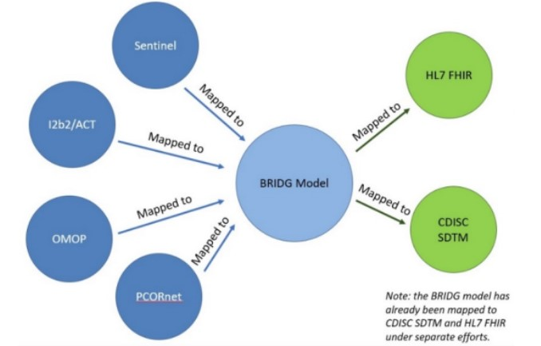
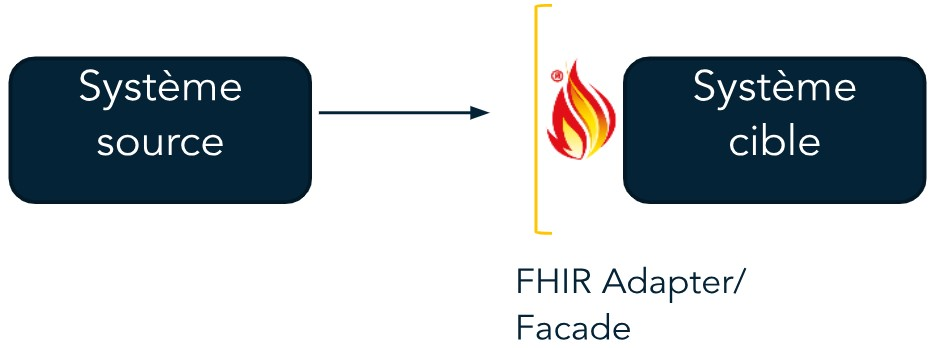
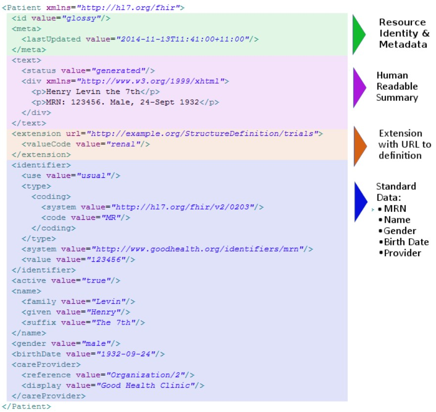

# Fiche d'identité : FHIR

### SYNTHÈSE :

**Description et type de standard** : FHIR est un standard d'interopérabilité conçu pour l’échange de données de santé développé par Health Level 7 (HL7) en 2011.

**Domaines d’application** : le standard FHIR est utilisé pour échanger des données médicales entre acteurs de l’écosystème de santé (entre professionnels de santé dans les établissements, avec le patient dans le cas d’une application de santé, avec les payeurs, etc. ; voir les exemples ci-dessous et l’élément « *Adoption du standard* » en partie 4. Valorisation).

**Maturité / Utilisation** : la version actuelle est la v5.0.0 ou **Release 5**, sortie en mars 2023. Compte tenu de sa sortie récente, elle est encore peu utilisée. La version précédente (R4B) est une variante de la version 4.0.1 (**Release 4**), dernière version majeure (voir l’élément « *Maturité du standard* » en partie 2. Gouvernance). FHIR est largement utilisé dans le monde, dans plus de 50 pays : notamment par de grands groupes pour le développement d'applications (Google, Microsoft, Apple Amazon, etc.) et également par des acteurs majeurs de la santé en France (l'AP-HP et plusieurs Centres de Lutte Contre le Cancer, Doctolib, Oracle, etc., voir l’élément « *Adoption du standard* » en partie 4. Valorisation).

## 1. Général

- **Présentation** :
  - **Pays d’origine** : États-Unis
  - **Consortium d'origine** : **Health Level 7 (HL7)**[^1], standard développé en 2011[^2]
  - **Type de standard** : Format de transfert de données
  - **Description** : FHIR (**Fast Healthcare Interoperability Resources**) est un format de transfert ayant pour objectif d’améliorer l’interopérabilité des systèmes de santé en facilitant les échanges de données médicales et administratives entre les acteurs de l’écosystème de santé.[^3]
  - La spécification FHIR s’articule autour des 4 composantes suivantes[^4]:
    - **Le modèle d’information** : permet la création des ressources FHIR et des éléments inclus dans ces ressources. Les ressources rassemblent l’ensemble des données liées à la santé, qu’elles soient cliniques ou administratives.
    - **Le modèle de conformité (ou de contraintes)** : contient les éléments liés aux contraintes et à la validité (à la fois en termes d’implémentation du serveur grâce à la ressource *CapabilityStatement*, mais aussi les contraintes et extensions associées aux profils FHIR[^5])
    - **La composante terminologie** : contient la description des terminologies cliniques et des ontologies utilisées et leurs propriétés clés (dans la ressource *CodeSystem*) ainsi que la valeur prise dans un contexte spécifique (dans la ressource *ValueSystem*)
    - **La composante usage** : concerne le déploiement de FHIR (par exemple à travers l’utilisation de REST API[^6])
    - **Organisme en charge** : *FHIR Community*[^7]

- **Application** :
  - **Domaine d’application en santé** :
    - Les ressources FHIR peuvent être divisées en 5 grandes catégories, chacune étant divisée en plusieurs sous-catégories[^8] : *foundation, base, clinical, financial, specialized*.
    - Elles concernent ainsi principalement[^9] le **domaine clinique**[^10] et en particulier celui des **diagnostics médicaux**[^11] (résultats de tests, images, génomique) et des **médicaments**[^12] (prescription, administration).
    - Un **module financier**[^13] existe également pour couvrir les besoins d'échanges de données liés aux interactions entre les différents acteurs (établissements de santé,patients, assurances, autres parties, …).
    - Le standard peut également être utilisé dans le cadre de **soins vétérinaires**[^14].

[^1]: Voir : [HL7.org](https://www.hl7.org/)
[^2]: La première version de FHIR (qui s’appelait Resources for Health ou « RfH ») a été créée en septembre 2011, voir l’historique des versions : http://hl7.org/fhir/directory.html
[^3]: Voir : [plement/standards/product_brief.cfm?product](https://www.hl7.org/implement/standards/product_brief.cfm?product_id=491) 
[^4]: Voir la présentation des composants de FHIR : https://hl7.org/fhir/overview-arch.html
[^5]: Voir [Capability Statement](https://hl7.org/fhir/capabilitystatement.html) et [Profiling FHIR](https://hl7.org/fhir/profiling.html). Le module de conformité comprend un certain nombre de règles d’utilisation liées aux profils qui seront abordées dans le reste de la fiche. Voir les éléments « *Flexibilité du standard, personnalisation* » en partie 3. Technique et « *Existence d'extensions certifiées* » en partie 5. Utilisation.
[^6]: L’utilisation d’interfaces RESTful est recommandée, bien que cela ne soit pas imposé (voir dans la présentation des composants).
[^7]: Voir : https://hl7.org/fhir/credits.html
[^8]: Voir la liste des ressources et leur regroupement par catégories : [HL7 FHIR](https://hl7.org/fhir/resourcelist.html), [Resource Guide](https://hl7.org/fhir/resourceguide.html)
[^9]: Voir la présentation de FHIR selon les différents niveaux : [HL7 FHIR](https://hl7.org/fhir/resourcelist.html)
[^10]: Voir : [Clinical](https://hl7.org/fhir/clinicalsummary-module.html)
[^11]: Voir : [Diagnostics](https://hl7.org/fhir/diagnostics-module.html)
[^12]: Voir : [FHIR Medications Module](https://hl7.org/fhir/medications-module.html)
[^13]: Voir : [FHIR Financial Module](https://hl7.org/fhir/financial-module.html)

  - **Principaux cas d’usage** :
    - **L’objectif principal de FHIR est d’assurer l’interopérabilité** à l’aide de mécanismes efficaces d’échange de données (entre établissements, avec les patients, etc.). Ces échanges de données peuvent prendre plusieurs formes[^15] :
      - Une **API** (RESTful en général) ;
      - Un **échange de messages** (par exemple, messagerie sécurisée sur Mon espace santé[^16]) ;
      - Un **échange de documents** (même exemple que précédemment) ;
      - Un **service** (les exemples précédents sont également des services, mais FHIR peut aussi être utilisé dans une architecture plus large, par exemple une SOA ou *Service-Oriented Architecture*)
      - Une **base de données** : les ressources FHIR peuvent être stockées dans une base de données qui sera utilisée par des applications dans leur processus d’implémentation
      - **Souscription** auprès d’une application FHIR : l’application FHIR peut notifier proactivement un autre système

  - **Illustration concrète, exemple d’utilisation sur un cas simple** :
    - « Mon espace santé »[^17] est un espace numérique individuel de santé, ouvert pour tous les usagers en France, qui permet de stocker et de partager des données de santé avec des professionnels de santé. Cet espace est composé d’un dossier médical, d’un service de messagerie pour échanger des informations avec des professionnels de santé, d’un catalogue d’applications (services numériques référencés par l’État) et prochainement d’un agenda (pour la centralisation des rendez-vous) ;
    - L’application _**Withings Health Mate**_[^18] permet la collecte d’informations médicales (poids, activité physique, qualité du sommeil, …) _**via des objets connectés**_(téléphones portables, montres, balances, …).
      - L’application permet le partage de ces informations à des professionnels de santé *via* « **Mon espace santé** » :
        - Après un processus d’authentification et de demande de consentement, un appariement utilisant des APIs sécurisées a lieu entre l’application *Withings* et « Mon espace santé ». Ainsi, les données se synchronisent de manière automatique, selon des modalités d’accès et d’échange fixées par l’utilisateur.
        - Par exemple, l'utilisateur pourra choisir de partager dans « Mon espace santé » un ECG (enregistré par le biais de la montre *Withings Scan Watch*) ou un agenda du sommeil (enregistré par le biais du capteur de sommeil sous matelas *Withings Sleep Analyzer*)[^19].
      - L'application utilise la spécification **SMART** on **FHIR** (voir l'élément « *Capacité de traduction vers un autre standard (intra types de standards)*  » en partie 3.Technique) qui établit un protocole d’échange de données. En particulier :
        - L’API « Mesures », permettant la consultation et la transmission des mesures de santé, utilise plusieurs ressources **FHIR** (*Device[^20], Observation[^21], Bundle[^22]*)
        - L’API « Documents », permettant le partage de documents de l’application à « Mon espace santé », utilise l’interaction create de l’**API REST**[^23]

[^14]: Voir : [FHIR](https://hl7.org/fhir/overview-clinical.html)
[^15]: Voir la présentation de FHIR en tant qu’interface d’échanges : https://hl7.org/fhir/exchange-module.html
[^16]: Voir : [Mon espace santé | Carnet de santé numérique sécurisé](https://esante.gouv.fr/strategie-nationale/mon-espace-sante)  
[^17]: Voir la présentation du cas d’usage « Mon espace santé » au Meetup FHIR France #11 du 28/09/2022 : [Meetup FHIR France #11 - Mon Espace Santé](https://www.youtube.com/watch?v=9amv0PYwkno&list=PL9Yt7VhZ9hlABrgTmk0NNHVMmVq7U45I5)
[^18]: Voir : [Balances, montres et appareils de suivi de santé connectés | Withings](https://www.withings.com/fr/fr/health-mate)
[^19]: Les documents ainsi partagés dans « Mon espace santé » sont enregistrés dans le Dossier Médical Partagé (DMP) du patient auquel les professionnels de santé auront accès.

- **Données** :
  - **Typologie de données concernées** :
    - Les ressources FHIR sont composées de différents types de données.
    - Il existe 5 types de données définis dans la spécification[^24] :
      - **Basiques** : ils constituent la base utilisée par tous les autres types de données ;
      - **Simples / primitifs** : ces types de données correspondent aux éléments simples prenant une valeur primitive et sans éléments additionnels (booléen, date, heure, nombre entier, nombre décimal, chaîne de caractères, etc.) ;
      - **Complexes** : ces types de données sont des clusters d’éléments réutilisables (ratio, intervalle, quantité, période, durée, distance, valeur monétaire, code issu d’une nomenclature, adresse, signature, etc.) ;
      - **Métadonnées** : elles sont utilisées pour les ressources de métadonnées (informations de contact, données requises, etc.)
    - **Autres types ayant un usage spécifique** : *Reference* (à une ressource), *Meta* (métadonnée), *Narrative* (résumé d’une ressource), *Extension, xhtml, ElementDefinition, Dosage*
 
  - **Type de granularité** :

  Une ressource est la plus petite entité pouvant être maintenue indépendamment.

  - **Utilisation dans plusieurs langues** :
    - La spécification du standard FHIR est en **anglais**[^25]. Les noms des éléments (ex : élément « *use* », élément « *value* », élément « *language* », ...) à l'intérieur d'une ressource sont en anglais.
    - Chaque ressource contient un élément optionnel « *language* » qui permet de spécifier la langue du contenu de la ressource. Il est également possible d'ajouter une traduction à un contenu d'une ressource en utilisant l'extension « *translation* ».
    - Un **glossaire multilingue** propose des traductions des termes anglais utilisés dans la spécification[^26].
 
- **Disponibilité de la documentation d'implémentation** :
  - L'implémentation du standard FHIR est décrite dans les « **Guides d'implémentation** »[^27] publiés par la communauté FHIR. Ces guides décrivent des « Profils », qui définissent l'usage des ressources dans un contexte spécifique, et les règles associées.
  - En effet, les ressources décrites dans la spécification FHIR sont génériques. Afin qu'elles puissent être utilisées dans de nombreux pays et dans des contextes différents, FHIR permet d'ajouter des extensions ou des contraintes aux ressources et de créer des « Profils » correspondant à des situations spécifiques (par exemple, à un contexte national).

  NB : pour plus d'informations sur les profils FHIR, voir l'élément « *Flexibilité du standard, personnalisation* » en partie 3. Technique

[^20]: La ressource *Device* permet d’enregistrer le dispositif médical ou non médical utilisé : voir [HL7 FHIR® Device](https://www.hl7.org/fhir/device.html).
[^21]: La ressource *Observation* permet d’enregistrer des mesures (poids, pression artérielle, température, glycémie, …) et des évaluations subjectives (sensibilité abdominale, soutien familial, …) : voir [Observation](https://www.hl7.org/fhir/observation.html)
[^22]: La ressource *Bundle* permet de regrouper plusieurs ressources en une instance unique (par exemple pour regrouper un ensemble de ressources contenu dans un document clinique) : voir [Bundle](https://www.hl7.org/fhir/bundle.html)
[^23]: L’interaction *create* de l’API REST permet de créer une nouvelle ressource. Pour plus de détails, consulter la documentation officielle : [RESTful API FHIR](https://hl7.org/fhir/http.html)
[^24]: Voir la liste des types de données : [Datatypes - FHIR v6.0.0-cibuild](https://build.fhir.org/datatypes.html)
[^25]: Voir : [Languages - FHIR v6.0.0-cibuild](https://build.fhir.org/languages.html)  
[^26]: En avril 2023, le glossaire est peu étayé, et contient principalement des traductions vers le portugais (selon les besoins exprimés par les utilisateurs) : voir [Glossary - FHIR v6.0.0-cibuild](https://build.fhir.org/glossary.html)
[^27]: Voir le registre des Guides d’implémentation (*Implementation Guides ou IG*) : [Implementation Guide Registry](https://fhir.org/guides/registry/). Pour un exemple de Guide d’implémentation, voir l’élément « *Flexibilité du standard, personnalisation* » en partie 3. Technique.

- **Niveau de généralisation (facilité de remplissage des champs du standard)** :
  - **Note : 0,9 / 1**
  - Cette note combine plusieurs sous-critères. Elle s’explique par :
    - 1) Le fait que les terminologies ne sont pas imposées, et en particulier il n’y a pas de terminologies locales imposées (voir l’élément « Flexibilité dans les choix des terminologies » en partie 3. Technique).
    - 2) La flexibilité du standard (voir l’élément « *Flexibilité du standard, personnalisation*  » en partie 3. Technique)
    - 3) L’absence de contraintes d’implémentation (voir l’élément « *Contraintes d'implémentation*  » en partie 3. Technique)
    - 4) Une couverture relativement élevée de cas d’usage (voir l’élément « *Principaux cas d’usage* » en partie 1. Général)
    - 5) Une couverture moyenne des domaines d’application (voir l’élément « *Domaine d’application en santé* » en partie 1.

  - FHIR est un standard **flexible** et **modulable**, notamment en raison de la possibilité d'ajouter des extensions et de créer des profils (voir l’élément « *Flexibilité du standard, personnalisation* » en partie 3. Technique). En effet, il n'impose **pas de contrainte d'implémentation** (voir l’élément « *Contraintes d'implémentation* » en partie 3. Technique). Cela le rend facile à implémenter et à adapter au cas d'usage concerné.

## 2. Gouvernance

- **Modalités d'accès et distribution des solutions basées sur ce standard** :
 - Libre d’usage et gratuit (open source) : **licence CC0**[^28] « *No Rights Reserved* »
 - Des **solutions** ou **services basés sur FHIR** ainsi que des spécifications dérivées peuvent être créées[^28]. Cependant l'utilisation de FHIR ne signifie pas l'approbation du produit par HL7.
 
- **Processus de prise de décision sur le standard** :
  - La gouvernance de FHIR est gérée par deux groupes[^29] :    
    - Le _**FHIR Management Group**_ (FMG), qui s'occupe de la gestion de FHIR : évaluation des propositions de ressources, gestion des processus de vote, échanges avec les groupes de travail HL7 et création de contenu FHIR, organisation des *Connectathons*, etc. Les membres de ce groupe sont nommés par le *Technical Steering Committee* de HL7 d'après l'avis du *FHIR Governance Board* (FGB)
    - Le _**Modeling and Methodology Work Group**_(MnM), qui s'occupe de la méthodologie de FHIR : rédaction des règles et des recommandations (sur le nommage, sur la granularité des éléments, sur les terminologies, etc.)
  - Ces deux groupes sont sous la responsabilité du _**Technical Steering Committee**_ de HL7 qui a la charge des processus de développement des standards HL7.

- **Maturité du standard** :
  - **Fréquence de mise à jour** :
    - HL7 utilise **5 termes pour décrire le niveau de stabilité et de maturité des aspects de la spécification**[^30] : **normative** (approuvé par l'American National Standards Institute ou ANSI), **trial use** (approuvé par les auteurs mais encore peu utilisé en production), **draft** (incomplet), informative (utilisé à titre informatif pour aider l'utilisateur), **deprecated** (obsolète)
    - L'historique des principales versions de FHIR est le suivant[^31] :
      - La **version actuelle** est la **version R5** (Release 5, v5.0.0) sortie le 26 mars 2023 : cette version est *trial use*, c'est un développement de la version R4 (qui incorpore également les changements de la version 4B). Il est prévu que la prochaine version soit *normative*. L’ANS (Agence du Numérique en Santé) ne recommande pas l’utilisation de R5, sauf sur un sujet ou R5 apporte de nombreuses améliorations, afin de ne pas compromettre l’interopérabilité au sein de l’écosystème qui utilise actuellement principalement la version R4.
      - La version **précédente** est la version **R4B** (Release 4B, v4.3.0) sortie le 28 mai 2022 : cette version comporte des changements pour quelques modules seulement de la R4, mais demeure compatible avec le reste de la spécification. Les utilisateurs qui n'utilisent pas ces modules peuvent donc continuer à utiliser la version R4.
      - La version antérieure est la version **R4** (Release 4, v4.0.1) sortie le 27 décembre 2018 : il s'agit de la dernière version *normative*, son utilisation est recommandée par l'ANS[^32]. C’est la version la plus utilisée en France et en Europe.
      - Entre 2014 et 2017, on observe qu'en moyenne, une version majeure sortait tous les ans. À partir de la R3, **le délai de mise à jour s'allonge** : 2 ans entre la R3 et la R4, plus de 4 ans entre la R4 et la R5.

- **Maturité** :
  - **Note : 0,9 / 1.**
  - Cette note combine plusieurs sous-critères. Elle s’explique par :
    - 1) La publication d’une version stable
    - 2) La fréquence moyenne relativement élevée de mise à jour des versions principales
    - 3) L’âge élevé du standard
    - 4) Son utilisation dans le monde à l’échelle d’un ensemble de pays / mondiale (voir l’élément « *Adoption du standard* » en partie 4. Valorisation)
    - 5) Son adoption officielle par un ou plusieurs pays ou par une organisation de référence (voir l’élément « *Adoption du standard* » en partie 4. Valorisation)

- **Existence de financements pour standardisation** :
  - FHIR n'a **pas fait l'objet d'appels à projets dédiés** permettant de financer la standardisation des données[^33].

[^28]: Voir : [FHIR License](https://hl7.org/fhir/license.html)
[^29]: Voir la description du processus de gouvernance : [Governance Process](https://confluence.hl7.org/display/FHIR/Governance+Process)
[^30]: Voir : [Versions - FHIR v6.0.0-cibuild](https://build.fhir.org/versions.html#std-process)
[^31]: Voir l’historique des principales versions de FHIR et les changements introduits entre les différentes versions dans la documentation suivante : [History - FHIR v6.0.0-cibuild](https://build.fhir.org/history.html)
[^32]: Le 20 mars 2023, l’ANS recommande l’usage de FHIR version R4 pour le « Partage de documents de santé en mobilité » : voir [ANS.FHIR.FR.PDSM\Accueil - FHIR v4.0.1](https://interop.esante.gouv.fr/ig/fhir/pdsm/)
[^33]: À la différence d'OMOP-CDM, pour lequel plusieurs appels à projets EHDEN (*European Health Data Evidence Network*) ont permis de financer la standardisation des données dans de nombreux pays d’Europe.

## 3. Technique

- **Capacité de traduction vers un autre standard (intra types de standards)** :
  - **CDA** on **FHIR** : CDA (*Clinical Document Architecture*) est un standard créé par HL7[^34] qui définit les métadonnées et le contenu des documents cliniques qui concernent les patients. CDA et FHIR présentent des similarités et des différences : en particulier, les documents FHIR n'ont pas de limitation dans leur contenu et peuvent concerner d'autres sujets que les patients.
  - Des correspondances entre les standards FHIR et CDA ont été établies :
    - FHIR peut être utilisé pour échanger des documents CDA R2 en utilisant la ressource *DocumentReference* : il s'agit de *CDA* on *FHIR*[^35]
    - Un document FHIR peut également être transformé en document CDA, le *mapping* existe donc dans les deux sens[^36]

- **Communication avec d'autres standards (inter typologies de standards) :**
  - Communication entre **OMOP-CDM** et FHIR par deux processus : OMOP-CDM vers FHIR (OMOPonFHIR) et FHIR vers OMOP-CDM (FHIR to OMOP)[^37] :
    - **OMOPonFHIR** permet de récupérer les données stockées dans OMOP-CDM sous la forme de ressources FHIR
    - **FHIR to OMOP** permet de convertir les ressources FHIR en tables du modèle OMOP-CDM. FHIR to OMOP est utilisé par exemple pour l’échange de données d’oncologie pour des études.
  - Le schéma de données OSIRIS a été implémenté en FHIR par la société Arkhn.[^38]
  - Le projet **Common Data Model Harmonization** (CDMH)[^39] vise à **harmoniser 4 schémas de données** (PCORnet, OMOP-CDM, i2b2 et Sentinel) et à les *mapper* à FHIR et CDISC.
    - Les 4 schémas de données sont *mappés* vers le modèle intermédiaire BRIDG v3.2[^40] (voir Figure 1 ci-dessous). Ce modèle a été choisi comme modèle intermédiaire car il a été *mappé* dans une première étape à FHIR et CDISC SDTM. Il permet donc de déduire un *mapping* indirect entre les 4 schémas de données et FHIR.[^41]

[^34]: C'est un standard de la spécification HL7 v3. Pour plus de détails sur la comparaison de FHIR avec les autres standards HL7, voir : [Comparison - FHIR v6.0.0-cibuild](https://build.fhir.org/comparison.html) et en particulier pour CDA [Comparison-cda - FHIR v6.0.0-cibuild](https://build.fhir.org/comparison-cda.html)
[^35]: Voir : [Cda-intro - FHIR v6.0.0-cibuild](https://build.fhir.org/cda-intro.html)
[^36]: Voir : [GitHub - hl7ch/cda-fhir-maps: Maps (FHIR Mapping Language) to transform documents from CDA to FHIR and back](https://github.com/hl7ch/cda-fhir-maps)
[^37]: Voir la page internet : [OMOPonFHIR](https://omoponfhir.org/)
[^38]: Le schéma de données OSIRIS dédié aux données d’oncologie a été principalement développé par l’Institut Curie, l’Institut Bergonié et le Centre Léon Bérard. Voir le guide d’implémentation FHIR : https://fhir.arkhn.com/osiris/
[^39]: Voir la page HL7 décrivant le projet : [HL7.FHIR.US.CDMH\IG Home Page](https://build.fhir.org/ig/HL7/cdmh/) et le rapport final « *Common Data Model Harmonization (CDMH) and Open Standards for Evidence Generation* », *U.S Food & Drug Administration*, NIH, *The Office of the National Coordinator for Health Information Technology*, 2020 : [Common Data Model Harmonization (CDMH) and Open Standards for Evidence Generation](https://aspe.hhs.gov/sites/default/files/private/pdf/259016/CDMH-Final-Report-14August2020.pdf)
[^40]: Voir la page d’implémentation : [Reference Implementations | Biomedical Research Integrated Domain Group](https://bridgmodel.nci.nih.gov/implementation)
[^41]: Voir : https://github.com/data2health/data-harmonization/wiki/CDM-FHIR-Transformation.

  

    

_Figure 1 : Procédure de mapping, Source : Rapport final CDMH (2020)_

  - Wagholikar et *al.*[^42] (2017) ont développé une interface permettant d'implémenter SMART *on* FHIR à partir d'une plateforme i2b2 :
    - La plateforme i2b2 est utilisée dans une **approche « sidecar »** : le logiciel stocke une copie des données patient issues de l'*EHR* et exécute des requêtes sur ces données pour un usage secondaire de recherche (en parallèle de l'*EHR* qui continue d'être utilisé pour un usage clinique)
    - SMART *on* FHIR permet de transformer un *EHR* (ou bien son « *sidecar* » dans le cas d'i2b2) en une plateforme de type « *App store* pour la santé » où les utilisateurs ont accès à de nombreuses applications (voir l'élément « *Capacité de traduction vers un autre standard (intra types de standards)* » ci-dessus)
    - L'implémentation de SMART *on* FHIR à partir d'i2b2 permet ainsi (1) de faciliter le déploiement d'applications SMART, (2) d'avoir un mécanisme additionnel d'accès et de requêtage de la plateforme i2b2 et (3) de migrer les données depuis l'*EHR*, en passant par la réplication dans i2b2 jusqu'à une base FHIR-compatible

- **Flexibilité dans les choix des terminologies** :
  - FHIR n’**impose pas l’utilisation d’une terminologie**, cependant, pour des raisons d'interopérabilité, il est préférable d'utiliser les **terminologies standards** lorsque cela est possible.[^43]
  - HL7 a produit une **liste de terminologies** largement utilisées dont l'utilisation est **recommandée** dans FHIR, telles que SNOMED-CT, LOINC, CIM-10 et RxNorm[^44] :
    - Il existe un *Terminology Service*[^45] qui permet de structurer une nomenclature dans une API au standard FHIR que l'utilisateur pourra directement requêter. Il existe par exemple un serveur qui utilise ce service de terminologie pour accéder à LOINC[^46]. Cela permet de faciliter l'usage de LOINC dans l'écosystème FHIR.
    - Le module de terminologie[^47] de FHIR inclut une ressource *ConceptMap*[^48] permettant de *mapper* différentes nomenclatures entre elles (par exemple de traduire une nomenclature nationale vers une nomenclature standard)
    - **SNOMED-CT** : Un guide pour l'implémentation de SNOMED-CT dans FHIR est disponible[^49]

[^42]: Voir l'article de Wagholikar KB, Mandel JC, Klann JG, Wattanasin N, Mendis M, Chute CG, Mandl KD, Murphy SN. « *SMART-on-FHIR implemented over i2b2* ». J Am Med Inform Assoc. 2017 Mar 1 : [SMART-on-FHIR implemented over i2b2](https://pubmed.ncbi.nlm.nih.gov/27274012/)
[^43]: Voir : [Profiling FHIR](https://hl7.org/fhir/profiling.html)
[^44]: Voir : [External Code Systems - HL7 Terminology (THO) v5.4.0](https://terminology.hl7.org/external_terminologies.html)
[^45]: Voir : [FHIR Terminology Service](https://www.hl7.org/fhir/terminology-service.html)
[^46]: Voir : [LOINC Terminology Service using HL7® FHIR](https://loinc.org/fhir/)
[^47]: Voir : [Terminology-module - FHIR v6.0.0-cibuild](https://build.fhir.org/terminology-module.html#uses)
[^48]: La ressource *ConceptMap* définit les *mappings* entre différentes nomenclatures (par exemple : LOINC et RxNorm, LOINC et SNOMED-CT, ou bien depuis une nomenclature locale vers une nomenclature standard, etc.). La ressource *CodeSystem* décrit un système de codes et ses propriétés (lien vers la nomenclature, métadonnées, propriétés principales, etc.), la ressource *ValueSet* utilise l’un de ces codes dans un contexte particulier, voir la description de ces ressources : [CodeSystem](https://www.hl7.org/fhir/codesystem.html), [ValueSet](https://www.hl7.org/fhir/valueset.html) et [ConceptMap - FHIR v6.0.0-cibuild](https://build.fhir.org/conceptmap.html)
[^49]: Voir : [Introduction - SNOMED CT Implementation Guide for FHIR v0.0.1](https://build.fhir.org/ig/IHTSDO/snomed-ig/introduction.html)

- **Flexibilité du standard, personnalisation** :
  - FHIR est flexible car il permet aux utilisateurs de définir des *extensions* ou des *contraintes* sur les ressources, et ainsi de créer des « *Profils* » correspondant à certains *contextes spécifiques* (nationaux ou liés à un usage).[^50]
  - En France, il existe des profils adaptés au contexte français : il s’agit par exemple des profils « FrPatient », « FrPractitioner » et « FrOrganization » publiés par HL7 France et Interop’Santé, qui sont notamment utilisés dans le guide d’implémentation dédié aux spécifications techniques du volet « Partage de documents de santé en mobilité » (PDSm)[^51]. Ces profils contiennent les identifiants utilisés en France pour les patients, pour les professionnels de santé et pour les établissements de santé.
  - Autre exemple d’adaptation au contexte national : il existe un guide d'implémentation FHIR pour les États-Unis qui définit les extensions et les contraintes associées aux profils nationaux contenus dans le _**US Core Profile**_[^52]. Dans ce profil, la ressource *Patient* contient les éléments essentiels définis par la spécification FHIR mais également une extension liée à l'ethnie du patient[^53]. Concernant les contraintes, elles permettent par exemple de fixer le standard national à utiliser pour certains éléments (médicaments, etc.).

- **Complexité du modèle** :
  - Il existe 157 ressources organisées en **catégories**[^8] :    
    - **Foundation** : ressources liées à l'implémentation de FHIR (propriétés du FHIR *Server*, guide d'implémentation utilisé, etc.), aux terminologies utilisées, à la sécurité, etc.
    - **Base** : il s'agit des ressources liées à la description du patient, des professionnels de santé, des établissements, etc.
    - Clinical : ressources liées aux données cliniques (allergies, diagnostics, médicaments, antécédents familiaux, etc.)
    - **Financial** : ressources liées à la couverture du patient, aux demandes de remboursement, etc.
    - **Specialized** : ressources liées à la santé publique, à l'évaluation de la qualité, etc.
  - Les ressources sont liées entre elles par des liens (plus de 1 400 relations au total[^54]) : la description de chaque ressource inclut les références à d'autres ressources ainsi que les ressources qui font référence à la ressource concernée.
    - Par exemple, la ressource *Patient*[^55] fait référence aux ressources *Organization, Practitioner* et *RelatedPerson* : la ressource Patient est également référencée par de nombreuses autres ressources, dont la ressource _**Observation**_ ; par conséquent, les liens entre les ressources peuvent être complexes, à double sens ou à sens unique. La ressource *Patient* est référencée dans la ressource *Observation*, mais la ressource *Observation* n'est pas référencée dans la ressource *Patient*. Cela permet d'optimiser le modèle dans le cas où la double référence n’est pas nécessaire : la ressource *Patient* ne sera pas mise à jour à chaque ajout d'une ressource *Observation*[^56].

[^50]: Voir [Profiling FHIR](https://hl7.org/fhir/profiling.html) et l’élément « *Disponibilité de la documentation d'implémentation* » en partie 1. Général qui présente les Profils et les Guides d’implémentation.  
[^51]: Voir : https://interop.esante.gouv.fr/ig/fhir/pdsm/3.0.0/index.html
[^52]: Voir le Guide d’implémentation US Core : [US Core](https://hl7.org/fhir/us/core/)
[^53]: Voir la section *Patient* du Guide d’implémentation US Code : [US Core Patient](https://hl7.org/fhir/us/core/StructureDefinition-us-core-patient.html)
[^54]: Pour obtenir cette quantification, nous avons *scrappé* le site [HL7 FHIR](https://www.hl7.org/fhir/) pour collecter l’ensemble des références et nous avons compté le nombre de relations.
[^55]: Voir le contenu de la ressource Patient : [Patient](https://www.hl7.org/fhir/patient.html) 
[^56]: Voir : [Patient with References tutorial](https://fhir-drills.github.io/patient-with-references.html)

- **Contraintes d'implémentation** :
  - FHIR n'impose **pas de contrainte d'implémentation** : l'implémentation d'une API RESTful est recommandée mais n'est pas obligatoire[^6]. Par ailleurs, le fonctionnement de FHIR à partir de ressources modulables (éléments de base, extensions possibles, voir l'élément « *Flexibilité du standard, personnalisation*  » ci-dessus) est non contraignant.
  - Cependant, selon la manière dont FHIR[^57] est implémenté, la contrainte peut consister en l'implémentation d'un ou plusieurs profils FHIR, ce qui peut engendrer une incompatibilité dans le cas de certains échanges de données[^58].

- **Technologie de stockage et traitement de données et niveau d'adoption de la technologie** :
FHIR ne définit pas de **technologie de stockage ni de traitement de données**.

- **Neutralité technologique** : Oui.
  - FHIR est **neutre** technologiquement : les formats de données et les **protocoles standardisés suivants sont utilisés**, et parfois uniquement **recommandés** :
    - Les formats JSON et XML (au choix)
    - Les protocoles HTTP/ HTTPS (recommandé)
    - La norme d'authentification OAuth 2.0 (recommandée)
  - Ces standards sont largement utilisés dans l'industrie des technologies de l'information et peuvent être implémentés dans une grande variété de langages de programmation et de plateformes.

- **Sécurité des outils d'exploitation (y compris la compatibilité HDS)** :

**Oui, si les outils respectent les recommandations FHIR pour la sécurité**[^59]. Par exemple, il est recommandé que les outils utilisent HTTPS pour transférer les données et qu'ils ne permettent pas d’accéder aux données sans authentification.
  - **Exemple d'implémentation n°1** : FHIR Azure *Health Data Service*[^60] est conforme aux recommandations de sécurité :
    - Il utilise HTTPS et TLS
    - Il permet de configurer RBAC (Role-Based Access Control)
    - Il est conforme au RGPD, HIPAA et CCPA
  - **Exemple d'implémentation n°2** : SMART *on* FHIR (voir l’élément « *Outils compatibles* » en partie 5. Utilisation) est conforme aux recommandations de sécurité :
    - Il utilise HTTPS
    - Il utilise OAuth et OpenID pour l'authentification
    - En particulier, **SMART** *on* **FHIR** présente l'intérêt majeur de proposer des protocoles d'autorisation et d'authentification prêts à l'emploi (à la différence de FHIR pour lequel les protocoles de sécurité doivent être implémentés par l'utilisateur[^59])

[^57]: Si c'est le cas, l'utilisation du *FHIR Validator* permet d’identifier les ressources qui ne sont pas conformes aux profils concernés, voir : [Using the FHIR Validator](https://confluence.hl7.org/display/FHIR/Using+the+FHIR+Validator)
[^58]: Kramer et *al.* (2023) montrent que dans certains cas, l’échange de données entre des serveurs qui utilisent différentes versions de FHIR ou différents profils FHIR peut conduire à des incompatibilités. Ils proposent une méthode d’évaluation de ces incompatibilités. Voir l’article de Kramer MA, Moesel C. « *Interoperability with multiple Fast Healthcare Interoperability Resources (FHIR®) profiles and versions* ». JAMIA Open. 2023 Feb 7: [Interoperability with multiple Fast Healthcare Interoperability Resources (FHIR®) profiles and versions - PMC](https://www.ncbi.nlm.nih.gov/pmc/articles/PMC9904180/)
[^59]: Voir : [Security - FHIR v6.0.0-cibuild](https://build.fhir.org/security.html)
[^60]: Voir : [Qu’est-ce que le service FHIR dans Azure Health Data Services ? | Microsoft Learn](https://learn.microsoft.com/fr-fr/azure/healthcare-apis/fhir/overview)

- **Compétences techniques et métier nécessaires pour utiliser le standard** :
  - Pour **implémenter** le standard, un profil technique est nécessaire : *Software Engineer* (REST) ou *Data Engineer* pour développer des pipelines ETL (REST)
  - Pour mettre en place le standard : un _**System Engineer**_ pour configurer les HTTPS, OAuth, etc.
  - L’utilisation de FHIR est transparente pour l’utilisateur (médecins de ville, praticiens hospitaliers, etc.) : une fois que le serveur FHIR a été installé et configuré, son utilisation ne nécessite pas de compétence technique.

- **Échange sécurisé de données** :
  - FHIR n'est pas un protocole de sécurité et **ne définit pas de règles de sécurité**[^59]. Il se trouve sur la 7ème couche de modèle OSI (*application-level standard*), ce qui signifie que l'échange sécurisé doit être implémenté par les couches en amont (HTTPS, TLS, SSL, etc.).
  - Cependant, FHIR énonce des **recommandations pour inciter à l'adoption de protocoles qui permettront un échange sécurisé des données**[^59]. Les recommandations concernent en particulier les éléments suivants : synchronisation des horloges (NTP/ SNTP), communication (HTTPS, TLS), authentification (OAuth, SMART on FHIR), autorisation et contrôle des accès, audit des ressources, signatures électroniques, politiques de management des données (RGPD, HIPAA).

-  **Existence de normes de transfert** :
  - Le **transfert des données** peut être réalisé de deux manières différentes (voir l’élément « *Principaux cas d’usage* » en partie 1. Général) :
    - Transfert par les **messages**[^61]
    - Transfert par une **API** (RESTful si possible)[^62]
  - Ces deux approches utilisent les mêmes ressources FHIR mais les protocoles de transfert sont distincts :
    - **Transfert par message** : FHIR ne définit pas de protocole de transfert (il est possible d'utiliser FTP, Apache Kafka, MQTT, etc.)
    - **Transfert par API** : s'il s'agit d'une API RESTful, FHIR utilise le protocole http/https ; sinon il n'y a pas de norme de transfert

[^61]: Voir : [FHIR Messaging](https://www.hl7.org/fhir/messaging.html)
[^62]: Voir : [FHIR API](https://www.hl7.org/fhir/http.html)

## 4. Valorisation

- **Accessibilité à des ressources de formation** :
  - Formation NIH (National Institutes of Health)[^63] :
    - Formation FHIR pour les chercheurs (exercices d’application des méthodes d’extraction et de manipulation des données de santé FHIR en R et Python)
    - Enregistrement d’ateliers et webinars en R et Python
  - Formation HL7 International : Formation individuelle FHIR (niveau simple ou intermédiaire)[^64]
  - GitHub de HL7 International[^65]
  - Vidéos YouTube de la chaîne FHIR France[^66]

- **Disponibilité de la documentation scientifique démontrant l'intérêt** :
  - En avril 2023, **446 articles**[^67] traitant de FHIR **entre 2013 et 2023 sont disponibles sur PubMed** (voir la requête et un extrait de la liste des publications en « *Annexe n°1* »).
  - À partir de 80 articles de recherche, Ayaz et *al.* (2021)[^68] proposent une revue de littérature des usages de FHIR, ainsi que des défis et des opportunités qu'ils ont permis d'identifier. Les auteurs soulignent le **rôle important de FHIR dans le domaine des soins de santé** :
    - La popularité et l'adoption de FHIR pour l'échange des données de santé sont croissantes (flexibilité du standard, interfaçage entre les applications de santé et les *EHR*, etc.)
    - Par conséquent, les praticiens et les prestataires de soins de santé s'attendent à ce que FHIR devienne la **norme pour l'échange des données de santé**.

[^63]: Voir : [FHIR for Researchers Training | Data Science at NIH](https://datascience.nih.gov/fhir-initiatives/researchers-training)  
[^64]: Voir : https://www.hl7.org/training/individual.cfm
[^65]: Voir : [Health Level Seven International · GitHub](https://github.com/HL7)
[^66]: Voir : [FHIR France - YouTube](https://www.youtube.com/@fhirfrance4558)
[^67]: L’estimation du nombre d’articles traitant de FHIR sur PubMed a été faite en saisissant le terme « FHIR » dans la barre de recherche du site PubMed. Voir : https://pubmed.ncbi.nlm.nih.gov/?term=FHIR
[^68]: Voir l’article de Ayaz M, Pasha MF, Alzahrani MY, Budiarto R, Stiawan D. « *The Fast Health Interoperability Resources (FHIR) Standard: Systematic Literature Review of Implementations, Applications, Challenges and Opportunities* ». JMIR Med Inform. 2021 Jul : [The Fast Health Interoperability Resources (FHIR) Standard: Systematic Literature Review of Implementations, Applications, Challenges and Opportunities](https://pubmed.ncbi.nlm.nih.gov/34328424/)

- **Adoption du standard** :
  - Adoptions officielles : les recommandations d'**usage de FHIR** par pays sont détaillées dans la documentation officielle de HL7 International[^27] :
    - Plusieurs organisations recommandent l'usage de FHIR : l'**ANS** (Agence du Numérique en Santé) en France, le **FOPH** (Federal Office of Public Health) en Suisse, le **MOHW** (Ministry of Health and Welfare) à Taiwan, ...
    - Certains pays adoptent ou prévoient d'adopter le standard FHIR pour **exploiter leurs bases nationales** : c'est le cas des Etats-Unis (pour la base *US Core*), de l'Australie (pour *AU Base*) et de la Nouvelle-Zélande (pour *NZ Base*), du Danemark, de la Suisse, de l'Allemagne, de l'Italie, de la Norvège, du Canada et de la Belgique
    - Certains pays recommandent l'utilisation du standard FHIR pour des usages plus spécifiques (ex : partage de documents de santé numérique[^16], certificats digitaux de vaccination contre la COVID-19[^69]...)
  - Utilisation sur le marché :
    - **Plus de 50 pays**[^70] participent au déploiement et à l'implémentation du standard FHIR (Etats-Unis, Canada, Australie, Nouvelle-Zélande, Brésil, Royaume-Uni, Japon, France, Allemagne, Pologne, Italie, ...)
    - Des **grands groupes** utilisent le standard FHIR :
      - **Google** (*API Cloud Healthcare*[^71])
      - **Microsoft** (*API Azure pour FHIR*[^72])
      - **Apple** (application Santé / *Healthcare*[^73])
      - **Amazon** (*FHIR Works on AWS*[^74])
      - **IBM** (*Merative*[^75] anciennement *IBM Watson Health*[^76])
    - En France, des acteurs majeurs de la santé utilisent le format de transfert FHIR. C'est le cas d'éditeurs comme Doctolib[^77], Oracle[^78], Enovacom[^79] et Vidal[^80], d'établissements comme l'AP-HP[^81], l’Institut Curie, le centre Léon Bérard, l'Institut Bergonié et l'INCa[^38)[^82].

- *Fournisseurs de service ayant l'expertise en France* (voir l'élément « **Adoption du standard** » en partie 4. Valorisation) :
  - *Les éditeurs de logiciels* suivants : Doctolib[^77], Oracle[^78], Enovacom[^79], Vidal[^80]

[^69]: Dans le cadre de l’épidémie de COVID-19, le MOHW (*Ministry of Health and Welfare*) de Taïwan, recommande l’utilisation de FHIR pour la création de certificats de vaccination digitaux. Voir : [IG Home](https://dccfhirig.mohw.gov.tw/ig/index.html)  
[^70]: Voir la présentation de HL7 International et d'AMDIS (*Association of Medical Directors of Information Systems*) de juin 2022 : [HL7 FHIR in the Real World - Reducing Physician Burden & Enabling Patient Engagement](https://amdis.org/wp-content/uploads/2022/06/HL7-Update_Jaffe.pdf)
[^71]: L’*API Cloud Healthcare* permet un échange de données entre les applications médicales et les solutions qui utilisent Google Cloud : Voir [API Cloud Healthcare](https://cloud.google.com/healthcare-api?hl=fr)
[^72]: L’API Azure pour FHIR permet le transfert et le stockage des informations médicales dans le Cloud en garantissant leur protection : Voir [Qu’est-ce que l’API Azure pour FHIR](https://learn.microsoft.com/fr-fr/azure/healthcare-apis/azure-api-for-fhir/overview)
[^73]: Voir : [Healthcare - Health Records - Apple](https://www.apple.com/healthcare/health-records/)
[^74]: Voir : [Présentation de FHIR Works on AWS](https://aws.amazon.com/fr/about-aws/whats-new/2020/12/introducing-fhir-works-on-aws/)
[^75]: *Merative* a pour ambition de faciliter les décisions cliniques en créant un système Cloud de données cliniques : voir [Merative](https://www.merative.com/)
[^76]: Voir : [IBM Products](https://www.ibm.com/products)
[^77]: Voir la page Doctolib détaillant les connecteurs d’interopérabilité (FHIR, …) utilisés : [Interopérabilité | Doctolib Hôpital](https://info.doctolib.fr/hopital/interoperabilite/)
[^78]: Voir : [Getting Started](https://docs.oracle.com/health-sciences/health-hdr-81/HDRFG/getsstart.htm)
[^79]: Voir : [Guide HL7 FHIR : un changement de paradigme pour faciliter l’échange de données patient](https://www.enovacom.com/expertise/interoperabilite-lexpertise-enovacom/)
[^80]: Voir la présentation de Vidal au *Meetup* FHIR France #3 : [Meetup FHIR France #3 - CDS (Clinical Decision Support) - Vidal](https://www.youtube.com/watch?v=cxkri1i30mw)  
[^81]: Voir la présentation de l’AP-HP au *Meetup* FHIR France #3 : [Meetup FHIR France #3 - FHIR à l'APHP](https://www.youtube.com/watch?v=gSdYQXmX5LM)
[^82]: Voir la présentation d’*OSIRIS* on *FHIR* par l’Institut Curie au [Meetup FHIR France #8 Meetup FHIR France #8 - Osiris on FHIR - Institut Curie & Arkhn](https://www.youtube.com/watch?v=dAJ-Qbqj7Tk)

## 5. Utilisation

- **Simplicité d'usage** :
  - **Note : 0,9 / 1**
  - Cette note combine plusieurs sous-critères. Elle s’explique par :
    - 1) L’accès à des ressources officielles de formation (voir l’élément « *Accessibilité à des ressources de formation* » en partie 4. Valorisation)
    - 2) La lisibilité par un humain (voir l’élément « *Lisible par un humain* » en partie 5. Utilisation)
    - 3) Le nombre relativement faible de profils requis pour l’implémentation et l’usage (voir l’élément « *Compétences techniques et métier nécessaires pour utiliser le standard* » en partie 3. Technique)
  - FHIR a été initialement conçu, d'après Grahame Grieve, pour permettre au secteur de la santé de disposer d'une API simple et facile à implémenter et à utiliser[^83]. Dans un article qui compare ISO/IEEE 11073, IHE PCD-01 et FHIR, Lee et Do (2018)[^84] montrent que, parmi les 3 standards, FHIR est le plus facile à prendre en main pour les développeurs, pour les raisons suivantes :
    - Les ressources FHIR sont représentées dans un **format XML** ou **JSON** qui sont largement utilisés par la communauté des développeurs web
    - Les ressources FHIR contiennent une information complète (par exemple, la ressource *Observation* contient les URLs qui renvoient vers les ressources *Patient* et *Device* par le biais des références)
    - Les ressources peuvent être réutilisées avec des URLs

- **Existence d'une communauté en ligne et degré d'activité** :
  - La communauté FHIR en ligne est **active** :
    - **FHIR Community Forum**[^85] : fermé depuis mars 2023 (l'historique des conversations reste accessible) et remplacé par le **_Chat_ FHIR**[^86]
    - Groupe _**Meetup**_ « FHIR France »[^87] ouvert à tous (présentations de cas d’usages, de best practices, rencontres avec des experts de FHIR, ...)
    - Nombreux *blogs* qui traitent de FHIR[^88]
    - **Chaînes vidéo** sur Vimeo, YouTube[^89]
  - Activité sur les **réseaux sociaux** (hashtag #FHIR[^90] sur Twitter, canal Slack FHIR France[^91])

[^83]:  Voir l’article publié par Grahame Grieve le 18/08/2011 au sujet de Resources for Health (RfH) qui constituait la première version de FHIR : [Resources For Health: A Fresh Look Proposal](https://www.google.com/url?q=http://www.healthintersections.com.au/?p%3D502&sa=D&source=docs&ust=1726570662976309&usg=AOvVaw2vdJ7BE2W1p0OoBjOKTutr). Il y explique son objectif initial lorsqu’il a commencé à développer RfH :    « *Many people pointed me at the highrise specification as state of the art – simple and easy to implement and manage. So I started there. I took that and wrote « Resources For Health»* ».  
[^84]: Voir l’article de Sungkee Lee, PhD, Hyoungho Do, MS. « *Comparison and Analysis of ISO/IEEE 11073, IHE PCD-01, and HL7 FHIR Messages for Personal Health Devices* ». Healthc Inform Res. 2018 Jan : [Comparison and Analysis of ISO/IEEE 11073, IHE PCD-01, and HL7 FHIR Messages for Personal Health Devices - PMC](https://www.ncbi.nlm.nih.gov/pmc/articles/PMC5820086/)
[^85]: Voir : [FHIR Community](http://community.fhir.org/)
[^86]: Voir : https://chat.fhir.org/
[^87]: Voir : https://www.meetup.com/fr-FR/FHIR-France/
[^88]: Voir la liste ici : [Blogs that cover FHIR](https://confluence.hl7.org/display/FHIR/Blogs)  
[^89]: Voir : [HL7 FHIR on Vimeo](https://vimeo.com/channels/hl7fhir) et [FHIR France - YouTube](https://www.youtube.com/@fhirfrance4558)
[^90]: Voir : https://twitter.com/search?q=%23fhir
[^91]: Voir : https://fhir-france.slack.com/join/shared_invite/zt-8echeuua-f9whtd7pXuCd5IuQpvRWzA#/shared-invite/email 

- **Outils de _mapping_** :
  - HL7 a développé un *mapping* **FHIR** qui permet la traduction depuis une source de données vers une autre (exemple : *mapping* entre différentes versions de FHIR, de C-CDA[^92] vers FHIR, de HL7 V2 vers FHIR, etc.)[^93]
  - L'implémentation de ce *mapping* est possible dans plusieurs langages (ex : Java, Pascal, C#). HL7 illustre différentes solutions de mapping dans son tutoriel[^94]

- **Outils compatibles** :
  - **SMART** *on* **FHIR** :
    - La plateforme SMART permet de **créer des applications pouvant s'exécuter dans l'ensemble du système de santé**[^95]. Ces applications peuvent **se connecter à des EHRs (Electronics Health Records) ou à des entrepôts de données** et peuvent ensuite être utilisées par des professionnels de santé pour améliorer les soins cliniques ou développer la recherche[^96].
      - L'objectif est de créer une plateforme avec des applications substituables les unes aux autres afin de favoriser l'innovation et **la qualité des applications par le biais de la concurrence**.
      - Ce besoin de substituabilité et de cohérence avec le système de santé présuppose une **interopérabilité sémantique** entre les applications et les systèmes de santé. Pour cela, SMART fournit un ensemble de **spécifications** (pour le développement des applications) **basées sur le standard FHIR**[^97]. SMART est par conséquent communément appelé « SMART *on* FHIR » du fait de l'utilisation du standard FHIR par les applications SMART.
      - L'API « SMART *on* FHIR » permet aux applications tierces de s'**authentifier et d'accéder aux systèmes de données** (en utilisant le standard FHIR) de **manière sécurisée**. L'inclusion de protocoles d'autorisation et d'authentification prêts à l'emploi est l'un des intérêts majeurs de l'utilisation de SMART *on* FHIR plutôt que FHIR uniquement. Deux cas sont possibles :
        - « SMART *App Launch* »[^98] est utilisé dans le cas des applications destinées aux utilisateurs se connectant aux *EHR* ou aux portails de santé
        - « *Backend Services* »[^99] est utilisé dans le cas des connexions FHIR de serveur à serveur (ex : une collecte de données en masse depuis les *EHR* des patients)
      - SMART recense dans sa **galerie d'applications**[^100] les applications utilisant « SMART *on* FHIR » et promeut ainsi un modèle « _**App Store pour la santé**_ ».
  - **Microsoft Power BI**[^101] : Microsoft Power BI FHIR Connector permet la connexion à un serveur FHIR à partir de Power Query. Il est possible de récupérer le contenu de ressources et de créer des *dashboards* ou des visuels. Azure Active Directory[^102] permet une authentification unique et sécurisée, grâce à l'API Azure for FHIR.
  - *Google Big Query*[^103] permet également d'analyser les ressources FHIR, grâce à l'*API Cloud Healthcare*[^104].
  - *FHIR SQL Builder*[^105] est un outil développé par InterSystems permettant de projeter des ressources FHIR sous forme de tableau puis de les analyser avec des requêtes SQL.

[^92]: C-CDA (Consolidated CDA) est un standard de données de santé créé par HL7 qui contient une librairie de templates de documents CDA. Pour une explication sur CDA, voir l'élément « *Capacité de traduction vers un autre standard (intra types de standards)* » en partie 3. Technique.  
[^93]: Voir : [FHIR Mapping Language](https://hl7.org/fhir/mapping-language.html) et [Using the FHIR Mapping Language](https://confluence.hl7.org/display/FHIR/Using+the+FHIR+Mapping+Language)
[^94]: Voir : [Mapping-tutorial - FHIR v6.0.0-cibuild](https://build.fhir.org/mapping-tutorial.html)
[^95]: Voir : [SMART on FHIR API](https://smarthealthit.org/smart-on-fhir-api/)
[^96]: Voir : [What Is SMART?](https://smarthealthit.org/an-app-platform-for-healthcare/about/)
[^97]: Initialement, l’objectif du développement de la plateforme SMART était d’établir un standard d’interopérabilité. Cependant, ce projet est né au début des années 2010, soit au moment de la sortie des premières versions de FHIR qui gagnait déjà du terrain. Les équipes de SMART ont ainsi décidé de changer leur approche et d’aider l’équipe en charge du développement de FHIR pour concevoir les ressources, l’infrastructure, les outils, etc. Voir l’article de Mandel JC, Kreda DA, Mandl KD, Kohane IS, Ramoni RB. SMART on FHIR : « *A standards-based, interoperable apps platform for electronic health records.* » J Am Med Inform Assoc. 2016 Feb : [SMART on FHIR: a standards-based, interoperable apps platform for electronic health records](https://pubmed.ncbi.nlm.nih.gov/26911829/).    
[^98]: Voir : [SMART App Launch](https://hl7.org/fhir/smart-app-launch/app-launch.html)
[^99]: Voir : [SMART Backend Services: Authorization Guide](https://hl7.org/fhir/uv/bulkdata/authorization/index.html)
[^100]: En avril 2023, la galerie d’applications référencée par SMART comprend 103 applications. Par exemple, l’application « *ASCVD Risk Calculator* » développée par « *Cerner Corporation* » permet d’évaluer le risque cardiovasculaire à 10 ans. Voir [All Apps](https://apps.smarthealthit.org/apps?sort=name-asc) pour davantage d’exemples d’applications
[^101]: Voir : [Power Query connector for FHIR](https://learn.microsoft.com/en-us/power-query/connectors/fhir/fhir)
[^102]: Voir : [Microsoft Entra ID (anciennement Azure Active Directory) | Sécurité Microsoft](https://www.google.com/url?q=https://azure.microsoft.com/fr-fr/products/active-directory&sa=D&source=docs&ust=1726571431137529&usg=AOvVaw3wsMEsXsRJ7TfTVLh6_B-Z)
[^103]: Voir : [Analyser des données FHIR dans BigQuery | Centre d'architecture Cloud](https://cloud.google.com/architecture/analyzing-fhir-data-in-bigquery?hl=fr#using_bigquery)
[^104]: Voir : [API Cloud Healthcare](https://cloud.google.com/healthcare-api?hl=fr)
[^105]: Voir : [The FHIR SQL Builder | InterSystems Components and Tools](https://docs.intersystems.com/components/csp/docbook/DocBook.UI.Page.cls?KEY=AFSB) pour la présentation de l’outil. Voir GitHub The FHIR SQL Builder | InterSystems Components and Tools pour une démonstration du fonctionnement et des exemples d’utilisation. FHIR SQL Builder est également compatible avec des outils de *data visualisation* comme *Tableau*.

- **Décrire les étapes nécessaires pour la standardisation** :
  - **Étape 1** : Définir les **exigences fonctionnelles et techniques** pour l'implémentation de FHIR en termes de **sécurité, de confidentialité, de contrôle des accès, de gestion des identités, de stockage et de récupération de données, ainsi que de gestion des exceptions et des erreurs** ;
  - **Étape 2** : Choisir et concevoir l’**architecture**. En fonction des besoins, plusieurs d’architecture sont possibles. Les principaux types d’architecture sont les suivants (mais ils ne sont pas exhaustifs et la combinaison d’architectures reste possible)[^106] :
    - **Exemple d’architecture n°1** : **Utilisation d’un FHIR Adapter** ou **FHIR Facade**[^107] qui peut n’implémenter qu’une partie de l’API et/ou contenir seulement une partie des ressources (voir Figures 2 et 3). Par exemple, dans le cas d’un établissement de santé qui dispose déjà d’une base de données constituée (ex : dans un *EHR*), le FHIR Adapter ou FHIR Facade peut être utilisé pour partager une sélection d’informations (ex : les rendez-vous médicaux).

[^106]: Voir la vidéo [Integrating a FHIR Server in Your Architecture](https://www.youtube.com/watch?v=ILOR3givjr4) pour la présentation détaillée des architectures citées en exemple.
[^107]: Quelques solutions populaires : CureLogix (https://curelogix.com/fhir-adapter/) et Firely ([FHIR Facade | FHIR integrations for existing systems](https://fire.ly/products/fhir-facade/)). L’utilisateur peut aussi construire son propre Adapter/Facade FHIR.

  

_Figure 2 : Le système cible initie la demande d’information (exemple a), Source : vidéo HL7 de la présentation de Christiaan Knaap (Firely)[^106], schéma Veltys_

*Dans cet exemple, on suppose que le système cible choisit d’implémenter les actions GET et POST mais de ne pas implémenter les actions qui modifient les ressources (il s’agit d’une architecture en écriture seule).*

  

_Figure 3 : Le système source partage l’information (exemple b)_

  *Dans cet exemple, le système source partage l’information et le système cible s’occupe des opérations de stockage, de modification et de résolution des conflits.*
    - **Exemple d’architecture n°2 : Mise en place d’un serveur FHIR générique** qui implémente l’ensemble des fonctionnalités FHIR (API, stockage des ressources, gestion de stockage, support de tous les ressources, voir Figure 4).

  

 
 _Figure 4 : Serveur FHIR générique (exemple c)_

  *Dans cet exemple, le serveur FHIR générique s’occupe de l’ensemble des opérations (stockage, résolution de conflits, contrôle d’accès, etc.). Il peut aussi router l’information entre différents systèmes.*

  - **Etape 3** : Concevoir et développer le **processus de mapping** entre les formats natifs (ex : un SGBDR) et les ressources FHIR. Pour réaliser cette étape, l’utilisateur peut utiliser un FHIR Adapter/Facade ou bien développer sa propre solution de mapping.
  - **Étape 4** :
    - Architecture avec FHIR Adapter/ Facade : Développer et intégrer les *API*
    - *Architecture avec serveur FHIR générique* : Il n’est pas utile de développer et d’intégrer les API car le serveur implémente déjà toutes les opérations API. L’utilisateur doit *mettre en place le serveur* qui implémente la spécification FHIR.
  - **Étape 5 : Tester l’interopérabilité**
    - Une fois que les API ont été développées et intégrées, il est important de tester leur interopérabilité. Les tests d'interopérabilité doivent inclure l'**échange de données entre différents systèmes de santé** pour vérifier la conformité aux normes FHIR.
  - **Étape 6** : Mettre en place la sécurité selon les recommandations FHIR[^59]

- **Existence d'extensions certifiées** :
  - Chaque élément d'une ressource FHIR peut avoir des **extensions** (on parle d'extensions « **enfants** ») afin d'intégrer des informations additionnelles qui ne font pas partie de la définition basique de la ressource[^108].
  - Une extension peut être « **simple** » (si elle contient uniquement une valeur) ou « **complexe** » (si elle contient elle-même des extensions).
    - Par exemple, pour la ressource *Patient*, il est possible d'ajouter plusieurs extensions concernant la nationalité : le code de la nationalité, la date de début de validité, le numéro de passeport, etc.
  - Les **profils** permettent de définir la manière dont les extensions doivent être utilisées (mais il est également possible de définir des extensions en dehors des profils)[^109]. Pour faciliter l'implémentation du standard, HL7 a établi la **liste des profils les plus importants ou les plus utiles** (en termes de cas d'usage)[^110].

- **Bibliothèque de requêtes types** :
  - La documentation officielle de FHIR est très riche et contient notamment de nombreux **exemples commentés de requêtes FHIR XML et JSON**, en particulier dans la page dédiée aux développeurs[^11][^112],  (voir Figure 5). Une comparaison des formats XML et JSON (éléments, syntaxes, etc.) est également accessible[^113].

  

_Figure 5 : Exemple de ressource FHIR en langage XML (ressource Patient),Source : https://hl7.org/fhir/summary.html_

- **Lisible par un humain : Oui**
  - Chaque ressource peut contenir un **résumé** lisible par un humain en format XHTML[^114]. Ce résumé, s'il est rempli, contient les informations cliniques et *business* essentielles de la ressource. Par exemple, pour la ressource *MedicationRequest*, le résumé peut inclure des informations sur le patient, le prescripteur et le médicament.
  - Par ailleurs, dans la syntaxe HTML, la présence de balises similaires au langage naturel facilite la lisibilité pour les humains. C'est pourquoi Lee et Do (2018)[^84] jugent que FHIR est facilement lisible par un humain, contrairement aux standards ISO/IEEE 11073 et IHE PCD-01.

[^108]: Voir : [FHIR Extensions](https://www.hl7.org/fhir/extensibility.html) 
[^109]: Voir l’élément « *Flexibilité du standard, personnalisation* » en partie 3. Technique
[^110]: Voir la liste : [Profilelist - FHIR v6.0.0-cibuild](https://build.fhir.org/profilelist.html)
[^111]: Voir : [FHIR](https://hl7.org/fhir/overview-dev.html)
[^112]: Voir : [FHIR](https://hl7.org/fhir/summary.html)
[^113]: Voir : [XML](https://hl7.org/fhir/xml.html)    
[^114]: Voir : [Narrative](https://hl7.org/fhir/narrative.html)

## Glossaire des acronymes

1. ANS : Agence du Numérique en Santé
2. AP-HP : Assistance Publique – Hôpitaux de Paris
3. API : *Application Programming Interface*
4. CC0 : *Creative Commons Zero*
5. CCPA : *California Consumer Privacy Act*
6. C-CDA / CDA : *(Consolidated) Clinical Document Architecture*
7. CIM : *Classification Internationale des Maladies*
8. CDMH : *Common Data Model Harmonization*
9. ECG : électrocardiogramme
10. EHDEN : *European Health Data Evidence Network*
11. EHR : *Electronic Health Record*
12. ETL : *Extract, Transform, Load*
13. FEDER : Fonds Européen de Développement Régional
14. FGB : FHIR *Governance Board*
15. FHIR : *Fast Healthcare Interoperability Resources*
16. FMG : FHIR *Management Group*
17. FOPH : *Federal Office of Public Health*
18. FTP : *File Transfer Protocol*
19. HIPAA : *Health Insurance Portability and Accountability Act*
20. HL7 : *Health Level 7*
21. HTML : *Hypertext Markup Language*
22. HTTP : *HyperText Transfer Protocol*
23. I2B2 : *Informatics for Integrating Biology and the Bedside*
24. JSON : *JavaScript Object Notation*
25. LOINC : *Logical Observation Identifiers Names and Codes*
26. MnM : *Modeling and Methodology Work Group*
27. MOHW : *Ministry Of Health and Wealth*
28. MQTT : *Message Queuing Telemetry Transport*
29. NIH : *National Institutes of Health*
30. OAuth : *Open Authorization*
31. OMOP-CDM : *Observational Medical Outcomes Partnership Common Data Model*
32. OpenID : *Open Identification*
33. PDF : *Portable Document Format*
34. REST API : *REpresentational State Transfer Application Programming Interface*
35. RGPD : Règlement Général sur la Protection des Données
36. RxNorm : *Prescription Normalized*
37. SGBD : Système de Gestion de Base de Données
38. SMART : *Substitutable Medical Applications and Reusable Technologies*
39. SNOMED-CT : *Systematized NOMenclature of MEDicine Clinical Terms*
40. SNTP/ NTP : *Simple Network Time Protocol*
41. SOA : *Service-Oriented Architecture*
42. SQL : *Structured Query Language*
43. SST : *Secure Sockets Layer*
44. TLS : *Transport Layer Security*
45. URL : *Uniform Resource Locator*
46. XHTML : *Extensible Hypertext Markup Language*
47. XML : *Extensible Markup Language*

## Annexes

### Annexe n°1 : Analyse quantitative de la littérature sur FHIR et extrait de la liste des publications

Sur PubMed (https://pubmed.ncbi.nlm.nih.gov/), on réalise une requête générale sur FHIR. La recherche du mot-clé « FHIR » renvoie 446 résultats. Voici ci-dessous un extrait de la liste des publications obtenues en résultat :

1: Duda SN, Kennedy N, Conway D, Cheng AC, Nguyen V, Zayas-Cabán T, Harris PA. HL7 FHIR-based tools and initiatives to support clinical research: a scoping review. J Am Med Inform Assoc. 2022 Aug 16;29(9):1642-1653. doi: 10.1093/jamia/ocac105. PMID: 35818340; PMCID: PMC9382376.

2: Ayaz M, Pasha MF, Alzahrani MY, Budiarto R, Stiawan D. The Fast Health Interoperability Resources (FHIR) Standard: Systematic Literature Review of Implementations, Applications, Challenges and Opportunities. JMIR Med Inform. 2021 Jul 30;9(7):e21929. doi: 10.2196/21929. Erratum in: JMIR Med Inform. 2021 Aug 17;9(8):e32869. PMID: 34328424; PMCID: PMC8367140.

3: Huber L, Honeder T, Hackl WO. FHIR Analytics - Pragmatic Review of Recent Studies. Stud Health Technol Inform. 2020 Jun 23;271:110-112. doi: 10.3233/SHTI200083. PMID: 32578550.

4: Saripalle R, Runyan C, Russell M. Using HL7 FHIR to achieve interoperability in patient health record. J Biomed Inform. 2019 Jun;94:103188. doi: 10.1016/j.jbi.2019.103188. Epub 2019 May 4. PMID: 31063828.

5: Vorisek CN, Lehne M, Klopfenstein SAI, Mayer PJ, Bartschke A, Haese T, Thun S. Fast Healthcare Interoperability Resources (FHIR) for Interoperability in Health Research: Systematic Review. JMIR Med Inform. 2022 Jul 19;10(7):e35724. doi: 10.2196/35724. PMID: 35852842; PMCID: PMC9346559.

6: Monteiro SC, Cruz Correia RJ. FHIR Based Interoperability of Medical Devices. Stud Health Technol Inform. 2022 Jun 6;290:37-41. doi: 10.3233/SHTI220027. PMID: 35672966.

7: Grimes J, Szul P, Metke-Jimenez A, Lawley M, Loi K. Pathling: analytics on FHIR. J Biomed Semantics. 2022 Sep 8;13(1):23. doi: 10.1186/s13326-022-00277-1. PMID: 36076268; PMCID: PMC9455941.

8: Lehne M, Luijten S, Vom Felde Genannt Imbusch P, Thun S. The Use of FHIR in Digital Health - A Review of the Scientific Literature. Stud Health Technol Inform. 2019 Sep 3;267:52-58. doi: 10.3233/SHTI190805. PMID: 31483254.

9: Tyndall T, Tyndall A. FHIR Healthcare Directories: Adopting Shared Interfaces to Achieve Interoperable Medical Device Data Integration. Stud Health Technol Inform. 2018;249:181-184. PMID: 29866978.

10: Kimaina A, Dick J, Sadjad B. OpenMRS Analytics Engine: A FHIR Based Approach. Stud Health Technol Inform. 2022 Jun 6;290:314-315. doi: 10.3233/SHTI220086. PMID: 35673025.