# I2B2

### SYNTHÈSE :

**Description et type de standard :** i2b2 (_Informatics for Integrating Biology & the Bedside_) est une plateforme de recherche clinique qui contient un schéma de données, une couche d'application et des APIs. Elle a été créée en 2004 par la _Harvard Medical School_ et financée par le NIH (_National Institutes of Health_).

**Domaines d’application :** i2b2 est utilisée dans les domaines cliniques ainsi qu'en génomique dans le cadre de recherches cliniques et translationnelles, en particulier pour l’exploration et l’identification de cohortes de patients.

**Maturité / Utilisation :** La version actuelle d’i2b2 est la v1.7.13 sortie en 2022 et est utilisée par plus de 250 institutions dans le monde (aux États-Unis dans de nombreuses universités, en France dans plusieurs établissements de santé, par des entreprises privées, etc. voir l'élément _« Utilisation sur le marché »_ en partie 4. Valorisation).

## 1. Général

### Présentation :  

  - **Pays d'origine :** États-Unis
  - **Consortium d’origine :** NIH (_National Institutes of Health_)[^1]  
  - **Type de standard :** Schéma de données  
  - **Description :**  
    - i2b2 (_Informatics for Integrating Biology & the Bedside_), créée en 2004 par la _Harvard Medical School_, est une plateforme de recherche clinique[^2] qui permet d'organiser et de transformer des données cliniques orientées patient[^3]. Elle est optimisée pour la recherche génomique clinique. La plateforme i2b2, ou logiciel (_« i2b2 Software »_), est constituée de plusieurs cellules communicantes via des services web XML, qui forment le i2b2 _Hive_[^4] (voir Figure 1) :
    - Cellules centrales (i2b2 _Core Cell_) :
      - **_Project Management_**[^5] : gère la configuration et la maintenance du Hive, les projets, les utilisateurs et la sécurité
      - **_Ontology Management_**[^6] : gère les terminologies typiquement utilisées dans le schéma de données et contient les informations sur les relations entre les concepts dans l'ensemble du Hive
      - **_Data Repository (CRC : Clinical Research Chart)_**[^7] : contient les données phénotypiques et génotypiques du Hive dans un format structuré et désidentifié
      - **_Workflow Framework_**[^8] : constitue l'espace de travail des utilisateurs où les informations peuvent être partagées et peut être librement consulté par le chef de projet
    - Cellules optionnelles (i2b2 Optional Cell)
      - **_File Repository (CRC)_**[^9] : contient de gros fichiers de données (images radiologiques, séquences génétiques, ...)
      - **_Identity Management_**[^10] : gère les données sensibles des patients, en accord avec la réglementation _HIPAA (Health Insurance Portability and Accountability Act_)
    - **Une application _Web Client_**[^11] qui permet d’interroger, d’analyser et d’afficher les données du i2b2 Hive en communiquant avec les cellules i2b2 (on parle aussi du _« Query & Analysis Tool »_, voir l’élément _« Outils compatibles »_ en partie 5. Utilisation).
    - **Une application _Workbench_** qui réalise les mêmes analyses que le _Web Client_ d’une façon plus approfondie  
  - **Organisme en charge :**[^1,12] _i2b2 tranSMART Foundation_  

 [^1]: Voir :[Our History – i2b2 tranSMART Foundation](https://i2b2transmart.org/home/our-history/)
 [^2]: I2b2 est un NBCB (*National Center for Biomedical Computing*), un programme développé par le NIH (*National Institutes of Health*) aux États-Unis ayant pour objectif de participer au développement d’une infrastructure informatique universelle pour accélérer le progrès de la recherche biomédicale. 
 [^3]: Voir l’introduction à i2b2 disponible sur le site de la communauté d’i2b2 : [i2b2-workshop at AMIA Nov-2020](https://community.i2b2.org/wiki/display/docs2/i2b2-workshop+at+AMIA+Nov-2020?preview=%2F36569121%2F36569190%2FAMIA+2020+Workshop+Introduction.pdf)
 [^4]: Voir : [i2b2 Community Wiki](https://community.i2b2.org/wiki/)
 [^5]: Voir : [Project Management (PM) Cell](https://www.i2b2.org/software/files/PDF/current/Project_Management_Design.pdf)
 [^6]: Voir : [Ontology Management (ONT) Cell](https://www.i2b2.org/software/projects/ontologymgmt/Ontology_Architecture_15.pdf)
 [^7]: Voir : [i2b2 Software Architecture - Data Repository (CRC) Cell](https://www.i2b2.org/software/files/PDF/current/CRC_Architecture.pdf)
 [^8]: Voir : [Workplace Framework (WORK) Cell](https://www.i2b2.org/software/files/PDF/current/Workplace_Design.pdf)
 [^9]: Voir : [i2b2 Software Architecture - File Repository (FR) Cell](https://www.i2b2.org/software/files/PDF/current/FR_Architecture.pdf)
 [^10]: Voir : [i2b2 Software Architecture - Identity Management (IM) Cell](https://www.i2b2.org/software/files/PDF/current/IM_Architecture.pdf)
 [^11]: Voir une démonstration du web client : [i2b2 Web Client](https://www.i2b2.org/webclient/)    
 [^12]: En mai 2017, i2b2 et tranSMART Foundations ont fusionné pour intégrer les deux plateformes dominantes utilisées dans la recherche clinique et translationnelle pour faire avancer la médecine de précision dans le monde.
   

   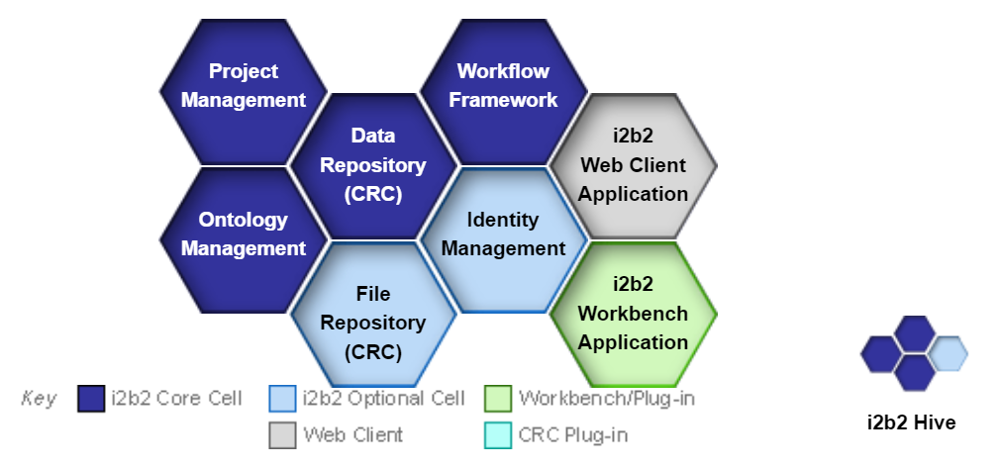    

  

_Figure 1 : Structure du i2b2 Hive, Source : [i2b2 Community Wiki](https://community.i2b2.org/wiki/)_

### Application :    
  - **Domaines d’application en santé :** La plateforme i2b2 est principalement utilisée en recherche clinique et translationnelle dans les domaines cliniques et en génomique[^13].
  - **Principaux cas d'usage :**
    - La plateforme facilite en effet la recherche à partir d'un symptôme particulier, d'une histoire médicale, d'un profil génomique, etc. ainsi que l'analyse des résultats[^4].
    - L'outil SHRINE (_Shared Health Research Information Network_) permet de constituer des réseaux fédérés de patients caractérisés et ainsi de compter par exemple le nombre agrégé de patients concernés dans les hôpitaux participants[^4].
    - La suite tranSMART d'exploration et visualisation de données, analyses génomiques et outils d'ETL a été développée par l'industrie pharmaceutique pour des études de recherche translationnelle.

  - **Illustration concrète, exemple d'utilisation sur un cas simple :**
    - Hong _et al._[^14] (2016) détaillent la création d’un entrepôt de données i2b2 (_IDRs : Integrated Data Repository_) pour la recherche sur le cancer ovarien à la Clinique Mayo aux États-Unis..
      - **Le schéma de données i2b2 a été sélectionné pour structurer les données des patients sur un modèle commun au sein de l’_IDR_ en raison principalemen** :
        - De son interface de requête facile à utiliser pour les chercheurs
        - De ses modules analytiques paramétrables
      - **Les données proviennent principalement de trois sources** :
        - Du registre du cancer ovarien (données de diagnostic, données démographiques, etc.)
        - Des données des tests de laboratoire (valeurs de tests CA-125, CBC, etc.)
        - Du système de gestion des documents (données de traitement par chimiothérapie extraites de documents au format CDM)
      - **Les étapes menant à la centralisation dans l’entrepôt i2b2 sont les suivantes** :
        - **Nettoyage et vérification** des données pour s’assurer de leur qualité
        - **Standardisation** des données (utilisation de l’ontologie d’i2b2 pour harmoniser les terminologies employées, utilisation de codes standards, etc.)
        - **Pseudonymisation** des données (génération d'ID patients aléatoires pour désidentifier les patients)
        - **Transformation** des données dans un schéma i2b2-compatible et chargement dans la base PostgreSQL
        - Au total, 286 235 observations ont pu être chargées dans la base i2b2.
    - L'outil de requêtage et d'analyse (_« Query & Analysis Tool »_) intégré à i2b2 est utilisé pour les cas d'usage suivants : identification de cohortes de patients, analyse des caractéristiques des patients.

 [^13]: Voir : https://www.i2b2.org/about/intro.html
 [^14]: Voir l’article de Hong Na, Li Zheng, Kiefer C. Richard, Robertson M., Goode E. Whang Chen, Jiang Guoqian (2016) « *Building an i2b2-Based Integrated Data Repository for Cancer Research: A Case Study of Ovarian Cancer Registry* ». DMAH@VLDB : https://www.semanticscholar.org/paper/Building-an-i2b2-Based-Integrated-Data-Repository-A-Hong-Li/d71fc7a821d22ff53ef19e3fca39a35a20f0cf3f

### Données :
  - **Typologie de données concernées : Données observationnelles** de différentes sources : il peut s'agir de données issues des dossiers de santé électroniques (_EHR : Electronic Health Record_), de demandes de remboursement, de notes, d'images, de données génomiques, de données d'essais cliniques, etc[^15].
  - **Type de granularité :**
    - Une observation correspond à un événement médical (un diagnostic, une procédure, la prescription ou l'administration d'un médicament, etc.)[^16]. Chaque ligne concerne un seul patient et une seule observation. Une visite médicale peut cependant donner lieu à plusieurs lignes dans la base pour recenser différentes observations (voir l'élément « _Description technique du schéma de données_ » ci-dessous).
    - **Les modificateurs permettent de préciser les concepts utilisés.** Lorsqu’un modificateur est associé à une observation, il peut y avoir plusieurs lignes pour une même observation (voir la description de la table de dimension « Modificateur » ainsi qu'un exemple dans l’élément « _Description technique du schéma de données_ » ci-dessous).
  - **Utilisation dans plusieurs langues :** Les concepts sont affichés en anglais. Il n’y a pas d’indications concernant la disponibilité dans une autre langue excepté un cas d'implémentation au Japon qui a conduit à devoir modifier les codes sources pour s'adapter au japonais[^17].

### Disponibilité de la documentation d'implémentation :
  - **Guide d’implémentation** disponible sur le site officiel de la communauté i2b2[^18]
  - **Documentation** sur le schéma de données i2b2[^19]
  - **Description du _Hive_** et guide d'installation de chaque cellule[^5]
  - **GitHub** d'i2b2[^20]

### Description technique du schéma de données :
  - **La structure d'i2b2 consiste en un schéma en étoile** (voir Figure 2 ci-dessous) composé d’une table de faits (qui contient les observations du modèle ; ex : diagnostics, procédures, résultats de tests, etc.) et de 6 tables de dimension (qui contiennent des informations descriptives sur les faits à travers la définition d'entités ; ex : un patient, un concept, ...).  
  - Liste des tables du schéma de données :
    - **Table de faits (observation_fact)**[^21] : Elle contient les observations sur un patient collectées lors d’une visite. Une visite peut être divisée en plusieurs lignes pour recenser différentes observations (voir l'exemple dans le Tableau 1 ci-dessous).  
    - **Table de dimension Patient (patient_dimension)**[^22] : cette table contient les informations démographiques sur les patients (identifiant du patient, sexe, âge, date de naissance, statut marital, code postal, etc.).
    - **Table de dimension Visite (visit_dimension)**[^23] : cette table contient les informations sur les différentes visites au cours desquelles les observations ont été collectées. Ces sessions peuvent impliquer le patient directement (_exemple : visite chez un médecin_) ou indirectement (_exemple : tests réalisés sur un tube sanguin_)
    - **Table de dimension Concept (concept_dimension)**[^24] : cette table contient les concepts (diagnostics, procédures, médicaments, tests de laboratoire, etc.). Tous les types de données peuvent être stockés en tant que concepts (données démographiques et génétiques)
    - **Table de dimension Prestataire (provider_dimension)**[^25] : cette table contient les informations relatives aux médecins ou prestataires de soins au sein d’une institution (position du prestataire au sein de l'institution, etc.).
    - **Table de dimension Modificateur (modifier_dimension)**[^26] : cette table contient tous les modificateurs. Un modificateur permet de préciser un concept (fréquence, voie d’administration, etc.). Par exemple, « systolique », « diastolique » et « position » sont des modificateurs pour le concept de pression artérielle.

   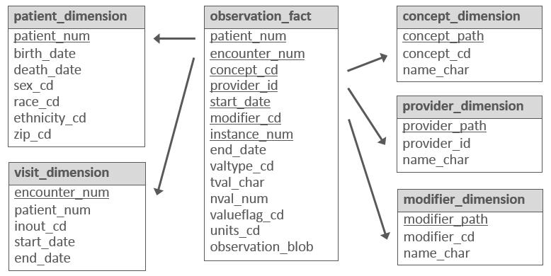    

  

*Figure 2 : Schéma en étoile d’i2b2, Source : [Documentation i2b2](https://community.i2b2.org/wiki/display/BUN/2.+Quick+Start+Guide)*

    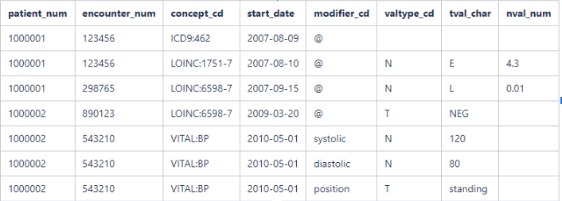    

  

*Tableau 1 : Exemple d’enregistrement dans la table observation_fact, Source : [Documentation i2b2](https://community.i2b2.org/wiki/display/BUN/2.+Quick+Start+Guide)*

 [^15]: Voir : https://community.i2b2.org/wiki/display/BUN/1.+Introduction
 [^16]: Voir : https://community.i2b2.org/wiki/display/BUN/2.+Quick+Start+Guide
 [^17]: Voir l’article de Takai-Igarashi T, Akasaka R, Suzuki K, Furukawa T, Yoshida M, Inoue K, Maruyama T, Maejima T, Bando M, Takasaki M, Sakota M, Eguchi M, Konagaya A, Matsuura H, Suzumura T, Tanaka H. « *On experiences of i2b2 (Informatics for integrating biology and the bedside) database with Japanese clinical patients' data* ». Bioinformation. 2011 Mar 26 : [On experiences of i2b2 (Informatics for integrating biology and the bedside) database with Japanese clinical patients' data](https://pubmed.ncbi.nlm.nih.gov/21544172/)
 [^18]: Voir le guide d’implémentation : [i2b2 Installation Guide](https://community.i2b2.org/wiki/display/getstarted/i2b2+Installation+Guide)
 [^19]: Voir : [i2b2 Common Data Model Documentation](https://community.i2b2.org/wiki/display/BUN/i2b2+Common+Data+Model+Documentation)
 [^20]: Voir : [i2b2 Foundation · GitHub](https://github.com/i2b2)
 [^21]: Voir : [OBSERVATION_FACT Table](https://community.i2b2.org/wiki/display/ServerSideDesign/OBSERVATION_FACT+Table)
 [^22]: Voir : [PATIENT_DIMENSION Table](https://community.i2b2.org/wiki/display/ServerSideDesign/PATIENT_DIMENSION+Table)
 [^23]: Voir : https://community.i2b2.org/wiki/display/ServerSideDesign/VISIT_DIMENSION+Table
 [^24]: Voir : [CONCEPT_DIMENSION Table](https://community.i2b2.org/wiki/display/ServerSideDesign/CONCEPT_DIMENSION+Table)

### Niveau de généralisation (facilité de remplissage des champs du standard) :
  - **Note : 0,8 / 1.** Cette note combine plusieurs sous-critères.
  - **Elle s’explique par :**

  **a)** il n’y a pas de terminologies locales imposées (voir l’élément « _Flexibilité dans les choix des terminologies_ » en partie 3. Technique).  
  **b)** La flexibilité du standard (voir l’élément « _Flexibilité du standard, personnalisation_ » en partie 3. Technique)  
  **c)** L’absence de contraintes d’implémentation (voir l’élément « _Contraintes d’implémentation_ » en partie 3. Technique)  
  **d)** Une couverture moyenne des cas d’usage (voir l’élément « _Principaux cas d'usage_ » en partie 1. Général)  
  **e)** Une couverture moyenne des domaines d’application (voir l’élément « _Domaines d’application en santé_ » en partie 1. Général)

  La facilité de remplissage des champs du standard dépend :
  - **De la disponibilité des données sources** :
    - Les tables du modèle i2b2 font référence à des données que l’on peut retrouver dans les bases de données des hôpitaux, des laboratoires, des cabinets de ville (détails des visites, des médicaments prescrits, des diagnostics, des examens ...).
    - Toutefois, en pratique plusieurs difficultés peuvent être rencontrées pour remplir ces champs :
      - Dans les établissements de santé, ces données sont rarement stockées de manière centralisée,
      - Selon les pratiques de l'établissement et des professionnels de santé, le niveau de complétude des champs ainsi que la profondeur de l'historique varient
  - De la facilité à réaliser le mapping des données sources :
    - Le concept EAV (_Entity-Attribute-Value_) permet une approche générique et une intégration simple de tous types de données source aux tables i2b2, sans modification de la structure de la base de données ou du logiciel (voir l'élément « _Flexibilité du standard, personnalisation_ » en partie 3. Technique).
    - Cependant, ce concept EAV peut conduire à des pertes de performance (voir l'élément « _Performance_ » en partie 3. Technique).

La couche applicative reste ancienne dans son architecture et les technologies implémentées. Cependant, les travaux dans le contexte de la fonctation i2b2/transmart tendent progressivement à converger vers des technologies plus à l’état de l’art.

 [^25]: Voir : [PROVIDER_DIMENSION Table](https://community.i2b2.org/wiki/display/ServerSideDesign/PROVIDER_DIMENSION+Table)
 [^26]: Voir : [MODIFIER_DIMENSION Table](https://community.i2b2.org/wiki/display/ServerSideDesign/MODIFIER_DIMENSION+Table)
 
## 2. Gouvernance

### Libre accès aux schémas de données : Oui[^27]

### Modalités d'accès et distribution des solutions basées sur ce standard :
  - Les composantes du logiciel i2b2 (« _Software_ ») sont open source publiées sous la licence libre Mozilla Public License, version 2.0[^27][^28],  : il s'agit des cellules centrales du _Hive_ i2b2, des applications _Web Client et Workbench_. Des données de démonstration ainsi que de la documentation sont également disponibles en téléchargement.
  - Les différents composants du logiciel i2b2 sont disponibles en téléchargement pour Windows ou pour Mac[^29]

### Processus de prise de décision sur le standard :
  - **Il existe trois groupes de travail, accessibles à tous** :
    - « **_ETL Working Group_** » : Il présente les meilleures pratiques pour le chargement de données dans i2b2[^30] ;
    - « **_Ontology Working Group_** » : Il présente de la documentation, des outils et des tutoriels pour aider les utilisateurs à comprendre, modifier et construire une ontologie[^31].
    - « **_User Interface Working Group_** » : Ce groupe de travail réunit à la fois les utilisateurs d'i2b2, de tranSMART et des plateformes i2b2-tranSMART. Il a pour objectif de collecter les problèmes et suggestions des utilisateurs, et de les transmettre aux concepteurs des interfaces i2b2 et tranSMART[^32].
  - Les problèmes rencontrés par les utilisateurs et les suggestions peuvent être remontés _via **i2b2 Bug Tracker**_ (une inscription est nécessaire)[^33]

### Maturité du standard :
  - **Fréquence de mise à jour :**
    - La version actuelle est la v1.7.13 sortie en juin 2022[^34], compatible avec SHRINE[^35] (voir l'élément « _Outils compatibles_ » en partie 5. Utilisation).
    - Depuis la version v1.3 sortie en 2008[^36], 4 versions principales (v1.4, v1.5, v1.6) et 31 mises à jour mineures[^37] ont été publiées.
      - Entre 2008 et 2013, une version principale est sortie presque tous les ans en moyenne, à une fréquence irrégulière : la v1.3 est sortie en 2008, la v1.4 et la v1.5 sont sorties en 2010 (janvier et juillet), la v1.6 est sortie en 2011, la v1.7 est sortie en 2013
      - Depuis 2013, il n'y a pas eu de nouvelle version principale mais uniquement des mises à jour

  - **Maturité :**
    - **Note : 0,5 / 1**
    - Cette note combine plusieurs sous-critères. Elle s’explique par :

      **a)** La publication d’une version stable  
      **b)** La fréquence moyenne faible de mise à jour des versions principales  
      **c)** L’âge élevé du standard  
      **d)** Son utilisation dans le monde restreinte à l’échelle d’institutions (voir l’élément « _Adoption du standard_ » en partie 4. Valorisation)  
      **e)** L’absence d’adoption officielle par un ou plusieurs pays ou par une organisation de référence (voir l’élément « _Adoption du standard_ » en partie 4. Valorisation)

### Existence de financements pour standardisation :

  _En mai 2023, nous n'identifions pas de financements pour la standardisation de données vers i2b2._

 [^27]: Voir : [i2b2 Software License](https://www.i2b2.org/software/i2b2_license.html)
 [^28]: Voir : [i2b2 Software](https://community.i2b2.org/wiki/display/i2b2/i2b2+Software)
 [^29]: Voir : [2.6 i2b2 Requirements](https://community.i2b2.org/wiki/display/getstarted/2.6+i2b2+Requirements)
 [^30]: Ce groupe de travail se réunit tous les deuxièmes mardis du mois de 10h EST à 11h EST. Voir : [ETL Working Group](https://community.i2b2.org/wiki/display/IWG/ETL+Working+Group)
 [^31]: Ce groupe de travail se réunit tous les troisièmes jeudis de chaque mois de 11h EST à 12h EST. Voir : [Welcome to the Ontology Working Group space!](https://community.i2b2.org/wiki/display/IWG/Ontology+Working+Group)
 [^32]: Ce groupe de travail se réunit tous les troisièmes mercredis de chaque mois de 12h EST à 13h EST. Voir : [the i2b2 tranSMART User Interface Working Group space!](https://community.i2b2.org/wiki/display/IWG/User+Interface+Working+Group)
 [^33]: Voir : [The i2b2 data repository](https://github.com/i2b2/i2b2-data) et [Log in - i2b2 JIRA]((https://community.i2b2.org/jira/secure/Dashboard.jspa)  
 [^34]: Voir : [All Releases](https://community.i2b2.org/wiki/display/i2b2/All+Releases)
 [^35]: Il existe une table de compatibilité entre les versions d’i2b2 (à partir de la v1.7.05) et les versions de SHRINE (à partir de la version v1.19.2). Voir la matrice de compatibilité d’i2b2 et de SHRINE : https://open.catalyst.harvard.edu/wiki/display/SHRINE/SHRINE-i2b2+Compatibility+Matrix
 [^36]: Voir: [1.3 Versions](https://community.i2b2.org/wiki/display/RM/1.3+Versions)
 [^37]: Liste des mises à jour mineures : 2 mises à jour pour la v1.3, 2 mises à jour pour la v1.5, 8 mises à jour pour la v1.6 et 19 mises à jour pour la v1.7. Consulter l’historique des versions d’i2b2 (v1.3 à v1.6) : https://community.i2b2.org/wiki/display/RM/1.6+and+Older+Release+Notes, [Earlier 1.7.x Release Notes](https://community.i2b2.org/wiki/display/RM/Earlier+1.7.x+Release+Notes) (v.1.7.01 à v1.7.08b) et https://community.i2b2.org/wiki/display/RM/Latest+Release+Notes (v1.7.09c à v1.7.13)

## 3. Technique

### Capacité de traduction vers un autre standard (intra types de standards) :

Le projet **_Common Data Model Harmonization_** (CDMH)[^38] vise à harmoniser les 4 schémas de données suivants : **PCORnet, OMOP-CDM, i2b2 et Sentinel**.

  - L'objectif est d'avoir un outil d'accès unifié à ces données permettant aux chercheurs d'accéder à un réseau plus large de patients et à des données variées (_EHR_, demandes de remboursement, données issues des essais cliniques, ...).
  - Le projet consiste à mapper chacun de ces schémas de données vers le modèle intermédiaire BRIDG v3.2[^39] (voir Figure 3 ci-dessous). Ce modèle a été choisi comme modèle intermédiaire car il a été mappé dans une première étape à FHIR et CDISC SDTM.  
 
Il existe un processus de transformation depuis i2b2 vers OMOP-CDM par les scripts SQL développés dans le cadre du projet ARCH-OMOP[^40][^41].

   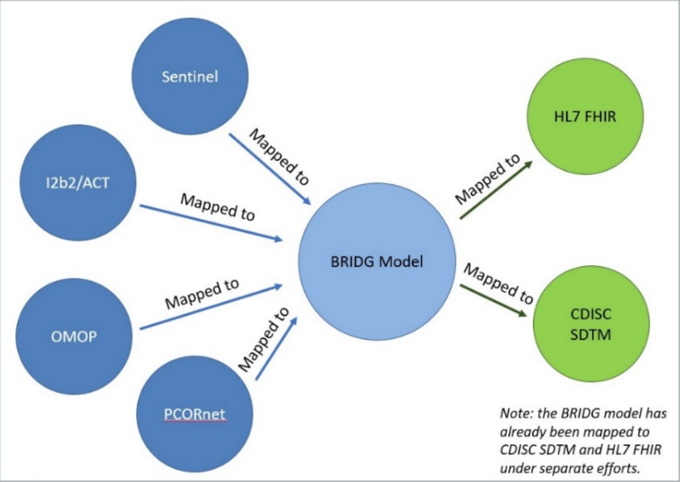    

  

_Figure 3 : Procédure de mapping, Source : [Common Data Model Harmonization (CDMH) and Open Standards for Evidence Generation](https://aspe.hhs.gov/sites/default/files/private/pdf/259016/CDMH-Final-Report-14August2020.pdf)_

### Communication avec d'autres standards (inter typologies de standards) :
  - Klann _et al._[^42] (2016) ont développé, au sein d’un réseau de 12 établissements aux États-Unis, un processus permettant de générer une base de données **PCORnet** **_CDM_** directement à partir de systèmes i2b2 déjà existants.  
    - Cette méthodologie a pu être validée par 8 des 12 sites concernés, ce qui a permis de constituer un réseau de 10 millions de patients.
    - La méthodologie est efficace : elle construit un réseau qui peut s’appuyer sur les fonctionnalités analytiques d'i2b2 et de PCORnet, sans avoir à développer un processus ETL supplémentaire. Les 8 établissements peuvent en effet :
      - Exécuter des requêtes fédérées dans SHRINE (voir « _Outils compatibles_ » en partie 4. Valorisation)
      - Participer à l’analyse distribuée réalisée au niveau national sur données rétrospectives à travers PCORnet
 
  - Dans le contexte de la réflexion sur la standardisation, il est important de préciser qu’i2b2 spécifie avant tout un modèle de données compact et abstrait pour le stockage des données qui concernent les individus.
    - Ce modèle présente plusieurs avantages :
      - Grâce à sa formalisation en étoile, il est centré sur les observations : il concentre toutes les informations concernant un patient ayant eu un contact avec une structure à une date donnée, fournie par une entité identifiable
      - Egalement, il présente très peu de contraintes, ce qui facilité l’intégration des données et lui donne un avantage concurrentiel
    - Cependant, on note un certain nombre de limites :
      - La gestion du texte libre est sous-optimale (index full text des SGBD) et nécessite souvent de mettre en place des solutions spécifiques pour ces données (solr, elastic)
      - La gestion du lien entre plusieurs observations est complexe : la modification de celles-ci permet seulement l’ajout d’un niveau de relation, ce qui peut poser problème pour certains usages
      - Enfin, dans des structures ayant une certaine masse critique, le volume des observations implique une gestion très fine des indexes, du partitionnement et des paramètres de la base de données afin de conserver des performances raisonnables lors de l’interrogation - cela est possible avec ce standard, néanmoins des compétences poussées en administration / optimisation de bases de données sont requises pour un passage à l’échelle.  
      Cette difficulté est également retrouvée avec le modèle OMOP.

### Flexibilité dans les choix des terminologies :
  - La plateforme i2b2 utilise plusieurs terminologies standards pour représenter ses concepts (voir Tableau 2 ci-dessous)[^43][^44] :
    - CIM-9 ou CIM-10 pour les maladies
    - LOINC pour les tests de laboratoire
    - NDC (_National Drug Codes_ : nomenclature des médicaments aux États-Unis) pour les médicaments  
  - Cependant, il est possible d’utiliser d’autres terminologies grâce au concept EAV[^46] (_Entity-Attribute-Value_), voir l'élément « _Flexibilité du standard, personnalisation_ » ci-après). Il est par exemple possible de combiner l'utilisation de codes SNOMED-CT et LOINC[^47]. En effet, il est relativement simple de passer d’un modèle EAV à un autre (par exemple, d’i2b2 vers OMOP) ; les enjeux concernent principalement le mapping vers les terminologies standards
  - Points d’attention :
    - Les terminologies dans i2b2, qui permettent de capturer la signification d’une observation, se trouvent dans un schéma dédié et nécessitent d’alimenter des tables de métadonnées spécifiques
    - i2b2 ne fournit pas de terminologie standard - hormis pour le jeu de données d’exemple, ou le contexte de réseaux spécifiques : c’est à l’intégrateur de données de déterminer les terminologies (locales et standards) qu’il utilisera et de les implémenter dans l’application
      - Cette implémentation est relativement simple mais nécessite une courbe d’apprentissage
      - Par ailleurs, dans le contexte d’un EDS hospitalier, les terminologies locales peuvent être de grandes dimensions, ce qui complique l’implémentation et rend la tâche de mapping vers les standards complexe et chronophage

**Tableau 2 : Quelques terminologies standard utilisées dans i2b2**

| Data Domains | Typical Standards               |
|--------------|---------------------------------|
| Demographics | HL7 Administrative              |
| Diagnoses    | ICD                             |
| Procedures   | ICD, CPT, HCPCS[^45]            |
| Medications  | RxNorm, VA Classes hierarchy, NDC|
| Labs         | LOINC                           |
| Vital Signs  | LOINC                           |

_Source : [Documentation i2b2](https://community.i2b2.org/wiki/display/BUN/i2b2+Common+Data+Model+Documentation)_

 [^38]: Voir la page HL7 décrivant le projet : [HL7.FHIR.US.CDMH\IG Home Page](https://build.fhir.org/ig/HL7/cdmh/) et le rapport final « *Common Data Model Harmonization (CDMH) and Open Standards for Evidence Generation* », U.S Food & Drug Administration, NIH, *The Office of the National Coordinator for Health Information Technology*, 2020 ([Common Data Model Harmonization (CDMH) and Open Standards for Evidence Generation](https://aspe.hhs.gov/sites/default/files/private/pdf/259016/CDMH-Final-Report-14August2020.pdf)
 [^39]: Voir la page d’implémentation : [Reference Implementations | Biomedical Research Integrated Domain Group](https://bridgmodel.nci.nih.gov/implementation)  
 [^40]:  Voir l’article de Klann JG, Joss MAH, Embree K, Murphy SN (2019) « *Data model harmonization for the All Of Us Research Program: Transforming i2b2 data into the OMOP common data model* ». PLoS ONE (2019) : [Data model harmonization for the All Of Us Research Program: Transforming i2b2 data into the OMOP common data model | PLOS ONE](https://journals.plos.org/plosone/article?id=10.1371%2Fjournal.pone.0212463)
 [^41]: Voir le GitHub :[GitHub - i2b2-omop/i2o-transform: PCORnet Ontology to OMOP - beta!](https://github.com/i2b2-omop/i2o-transform)
 [^42]: Voir l’article de Klann JG, Abend A, Raghavan VA, Mandl KD, Murphy SN. « *Data interchange using i2b2.* » J Am Med Inform Assoc. 2016 Sep : [Data interchange using i2b2](https://pubmed.ncbi.nlm.nih.gov/26911824/) 
 [^43]: Voir : [Ontologies 101](https://community.i2b2.org/wiki/display/IWG/Ontologies+101)
 [^44]: Voir : [Ontologies | i2b2](https://sites.bu.edu/bu-i2b2/intro-to-i2b2/ontologies/)
 [^45]: HCPCS (*Healthcare Common Procedure Coding System*) est une collection de codes standardisés représentant des procédures médicales, des fournitures. Ces codes sont produits par les CMS (*Centers for Medicare and Medicaid Services*) et sont utilisés pour faciliter le traitement des demandes d'assurance maladie par Medicare entre autres.
 [^46]: Voir l’explication du concept EAV (avantages et inconvénients) :[711. Background](https://community.i2b2.org/wiki/display/IDRT/711.+Background)
 [^47]: Voir : [Employing SNOMED CT and LOINC to make EHR data sensible and interoperable for clinical research](https://www.google.com/url?q=https://confluence.ihtsdotools.org/download/attachments/73368385/SnomedCtShowcase2014_Present_14025.pdf?version%3D1%26modificationDate%3D1535032031000%26api%3Dv2&sa=D&source=docs&ust=1726481557222154&usg=AOvVaw1UGmMX9z4jCSfcUaT3obzr)

### Flexibilité du standard, personnalisation :
  - Le schéma de la plateforme i2b2 est fondé sur le concept EAV(_Entity-Attribute-Value_) permettant d'ajouter un attribut qui n’existe pas dans l'ontologie[^16] par défaut d'i2b2. Pour cela, il suffit d’ajouter les valeurs de cet attribut dans la table de dimension concernée et les lignes de données dans la table de faits.
    - Par exemple, pour utiliser SNOMED CT, qui ne fait initialement pas partie des terminologies standards d'i2b2, il faut ajouter les codes SNOMED CT dans la table *concept_dimension* et ajouter les lignes d'observation dans la table *observation_fact*. Dans le cas de SNOMED CT, et plus généralement dans le cas des terminologies, le lien entre les deux tables se fait par le champ « *concept_cd* ».
  - Ainsi, de nouveaux types d'observations (concernant par exemple des symptômes, des instruments utilisés, etc.) peuvent être ajoutés à i2b2 par les institutions, en étendant simplement l'ontologie16, sans modifier la structure de la base de données ou du logiciel (voir exemple ci-dessus). Cela permet la création d'outils d'interrogation des données, de visualisation et d'analyse qui peuvent être généralisés à différents types de données (ex : codes locaux utilisés dans les établissements de santé).
  - i2b2 est un modèle performant pour l’intégration de données issues de plusieurs sources, en revanche celui-ci ne peut pas être perçu comme un standard de partage de données à l’échelle de plusieurs structures (car il ne contraint pas le vocabulaire et les terminologies nativement)
    - i2b2 peut devenir un standard dès lors que l’on définit en sus du modèle de données une ou plusieurs terminologie(s) cible(s), que l’on implémente dans i2b2/shrine sur le modèle de PCORNET et 4CE par exemple

### Performance :
  - **Note : 1 / 1** en raison du faible nombre de jointures nécessaires pour réaliser des requêtes (voir ci-dessous).
  - La plateforme i2b2 utilise le concept EAV (_Entity-Attribute-Value_) pour optimiser le schéma de données[^47].
    - Grâce à ce concept EAV :
      - Les schémas des données n'ont pas besoin d'être modifiés pour ajouter des nouveaux types d'observations (voir l'élément « _Flexibilité du standard, personnalisation_ » ci-dessus). Cela permet de restreindre le nombre de jointures nécessaires pour effectuer l’analyse des données. Pour la plupart des requêtes, trois tables principales sont utilisées (*observation_fact*, *patient_dimension*, *concept_dimension*).
      - Dans certains cas, le nombre de jointures utilisées dans les requêtes pour analyser les données peut aller jusqu’à 5 (en ajoutant des jointures avec *visit_dimension*, *observer_dimension* et *modifier_dimension*).
    - Cependant ce concept EAV peut conduire à[^47] :
      - Une possible explosion de la table de faits (*observation_fact*). En effet, dans le cas d'un schéma EAV, tous les faits sont stockés dans une base unique, tandis que dans d'autres modèles, des tables individuelles peuvent être ajoutées.

### Complexité du modèle :
  - **Note : 0,2 / 1.** Cette note combine plusieurs sous-critères. Elle s’explique par :  
    **(a)** Le faible nombre de tables avec des liens entrants et sortants  
    **(b)** Le faible niveau de normalisation  
    **(c)** L’absence de tables larges  
 
  - Le schéma de données i2b2 n’est pas normalisé, c’est-à-dire qu’il ne contient pas de table de dimension pour toutes les entités. Par exemple, il ne contient pas de table de dimension pour le statut marital (voir Figure 4 ci-dessous). Par conséquent, le niveau de redondance d’information est élevé.  
  - Le schéma de données i2b2 ne contient que 10 tables (132 champs). Par ailleurs, la plupart des requêtes utilisent seulement deux jointures principales entre les tables *observations_fact*, *patient_dimension* et *concept_dimension*. En effet, les tables *patient_dimension* et *concept_dimension* contiennent la plupart des critères d’analyse (l’âge des patients, le sexe, les maladies, etc.). Enfin, le schéma des données ne contient pas de relations physiques entre les tables, c’est-à-dire qu’il ne définit pas de clés étrangères. Cela réduit la complexité du modèle, mais ne permet pas d’utiliser de mécanisme interne de base de données pour vérifier l’intégrité référentielle.  

   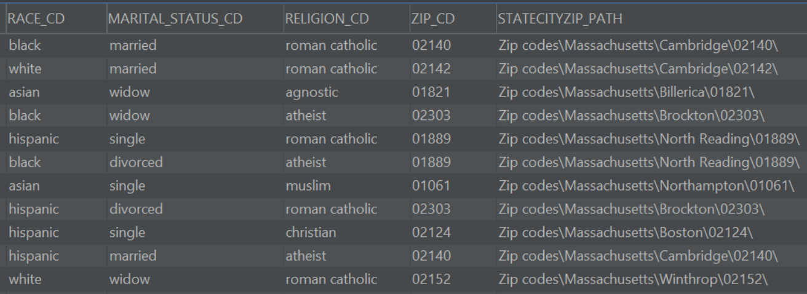    

_Figure 4 : Exemple de redondance d’information, Source : Traitement Veltys_

### Contraintes d’implémentation :
  - La plateforme i2b2 n’impose pas de contrainte d’implémentation. L'un des trois SGBDs suivants peut être utilisé[^48] :
    - Oracle (v12 ou 18)
    - PostgreSQL (9.x)
    - MS SQL Server (de 2012 à 2019)
  - Le i2b2 _Hive_ comprend plusieurs cellules qui représentent chacune une unité fonctionnelle. Ces cellules sont installées sur un ou plusieurs « serveurs i2b2 ». L'environnement d'exécution Java 8 est nécessaire pour déployer les cellules centrales (« _Core Cells_ ») sur le ou les serveurs i2b2[^49].
  - L'application Web Client peut être hébergée par tous les serveurs _web_ qui supportent HTML, JavaScript, CSS et les formats d'image GIF / JPG / PNG. Le composant suivant doit cependant être installé sur le serveur web[^50] : PHP Hypertext Preprocessor (PHP).

### Technologie de stockage et traitement de données et niveau d'adoption de la technologie

- **Type de technologie de requêtage :**
 
  Plusieurs types de technologies de requêtage peuvent être utilisés :
  - **i2b2 « _Query & Analysis Tool_ »**[^12] : outil graphique de requêtage intégré à i2b2
  - Requêtes SQL
  - **Interfaces de programmation d'application**[^51] (API)

- **Neutralité technologique :**

  Pour l’installation native, Java 8[^52] est obligatoire pour pouvoir installer i2b2.Il existe la version containerisée (créée par la communauté) pour laquelle _Docker Compose_ est obligatoire[^53].

- **Intensité de la perte de données au _mapping_ :**
  - Mate et al. (2011)[^54] ont développé un processus ETL (_Extract Transform Load_) pour charger les données stockées dans les EMR (_Electronic Medical Records_) des établissements de santé dans la base de données i2b2.
    - Leur approche n’utilise pas de programme d’import/export propriétaires, ni de code SQL, mais un langage générique flexible (_Web Ontology Language_).
    - Dans le cadre de la construction de cette méthodologie, ils ont développé plusieurs briques qui peuvent être utilisées pour faciliter la mise en place d’un processus ETL (_OntoEdit, OntoGen, OntoExport_)
    - Ils ont implémenté cette méthodologie dans deux établissements de santé en Allemagne : 75 % des données des EMR ont pu être _mappées_ à i2b2.

- **Compétences techniques et métier nécessaires pour utiliser le standard :**
  - Un profil _Data Engineer_ est nécessaire pour transformer les données en respectant le concept EAV.
  - Les profils optionnels suivants sont également intéressants :
    - _Database administrator_ pour l'optimisation des SGBDs
    - _DevOps_ pour l'installation/la gestion d’i2b2 containérisé

 [^48]: Voir : [2.2 Database Requirements](https://community.i2b2.org/wiki/display/getstarted/2.2+Database+Requirements)
 [^49]: Voir : [2.4.1 Java JDK](https://community.i2b2.org/wiki/display/getstarted/2.4.1+Java+JDK)
 [^50]: Voir : [2.5 Web Server Requirements](https://community.i2b2.org/wiki/display/getstarted/2.5+Web+Server+Requirements)
 [^51]: Voir : https://community.i2b2.org/wiki/display/ServerellsMessagingHome/
 [^52]: Voir :[Quick Installation for 1.8.0](https://www.i2b2.org/software/projects/hivecore/i2b2QuickInstall.pdf)
 [^53]: Voir :[docker images for core i2b2 containers](https://github.com/i2b2/i2b2-docker)
 [^54]: Voir l’article de Mate S., Bürkle T., Köpcke F., Breil B., Wullich B., Dugas M., Prokosch H., Ganslandt T. « *Populating the i2b2 Database with Heterogeneous EMR Data : a Semantic Network Approach* ». Stud Health Technol Inform, 2011 : https://ebooks.iospress.nl/publication/14218

## 4. Valorisation

### Accessibilité à des ressources de formation :
  - **Vidéos** sur YouTube[^55] et en particulier les vidéos de la chaîne de _i2b2 tranSMART Foundation_[^56]
  - **Vidéos** Coursera[^57]
  - Le CCTS (_Center for Clinical and Translational Science_) propose des vidéos de formation sur i2b2[^58]
  - **GitHub** d'i2b221[^21]

### Disponibilité de la documentation scientifique démontrant l'intérêt :
  - En mai 2023, environ 439 articles[^59] traitant d’i2b2 entre 2010 et 2023 sont disponibles sur PubMed (voir la requête et un extrait de la liste des publications en « _Annexe n°1_ »).
  - Selon Murphy et Wilcox (2014)[^60], i2b2 est devenu un outil central pour les chercheurs dans le domaine de la santé. Cette plateforme _open source_ repose sur une communauté de développeurs qui améliorent sans cesse les capacités analytiques et inventent de nouvelles fonctionnalités.
  - Majeed _et al._ (2021)[^61] soulignent l'intérêt d'i2b2 et notamment de sa **plateforme utilisateur simple et intuitive**, permettant des analyses de données :
    - Si le modèle OMOP-CDM est souvent choisi pour la structuration des données médicales, il ne dispose pas d'un outil d'interrogation des données permettant aux utilisateurs non-formés de faire des requêtes simples.
    - Les auteurs développent un algorithme permettant de traduire des requêtes créées dans le _Web Client_ i2b2 en des requêtes SQL pouvant être exécutées sur une base OMOP-CDM.

### Adoption du standard :
  - Adoptions officielles : pas d'adoption officielle identifiée en date de mai 2023
  - Utilisation sur le marché : plus de 250 institutions dans le monde utilisent i2b2[^62] :
    - **Des universités et des instituts de recherche** :
      - À l'international :
        - Aux États-Unis : Mayo Clinic[^63], universités (Johns Hopkins, Columbia, Harvard, Stanford, ...)
        - Universités en Autriche, Norvège, Suède, Finlande, Islande, Italie, Espagne, Japon, Allemagne, Arabie Saoudite, Corée, ...
      - En France :
        - Le Cancéropôle Île-de-France (INCa)[^64] met à disposition de ses établissements une interface i2b2 SHRINE, déjà adoptée par l'Institut Curie, Hôpital Européen Georges Pompidou et AP-HP (i2b2 va être remplacé par une solution développée en interne[^65])
        - Inserm (Rennes)
    - Des organismes d'assurance maladie (_Group Health Cooperative, Kaiser Permanente_)
    - Des entreprises : BIOMERIS, Johnson and Johnson, TriNetX, Partner HealthCare[^66], ...

### Fournisseurs de service ayant l'expertise en France :
 
  Nous n’identifions pas de fournisseur de service ayant l’expertise en France en mai 2023.

### Qualité des données :
  - **Existence de label de qualité** : pas de label de qualité pour une base de données standardisée en mai 2023
  - **Outils de vérification** de la qualité des données : pas d’outil de vérification de la qualité des données identifié en mai 2023

 [^55]: Voir : https://www.youtube.com/results?search_query=i2b2
 [^56]: Voir :[i2b2 tranSMART Foundation - YouTube](https://consent.youtube.com/m?continue=https%3A%2F%2Fwww.youtube.com%2F%40transartfoundation%3Fcbrd%3D1&gl=FR&m=0&pc=yt&cm=2&hl=fr&src=1)
 [^57]: Voir : https://www.coursera.org/lecture/clinical-data-models-and-data-quality-assessments/a-quick-tour-of-a-common-data-model-i2b2-Fjbpp
 [^58]: Voir :[i2b2 - Center for Clinical and Translational Science | UAB](https://www.uab.edu/ccts/research-commons/informatics/data-access/i2b2)
 [^59]: L’estimation du nombre d’articles traitant d’i2b2 sur PubMed a été faite en saisissant le terme « i2b2 » dans la barre de recherche du site PubMed (https://pubmed.ncbi.nlm.nih.gov/). Voir en « Annexe n°1 » pour la méthodologie utilisée et un extrait de la liste des publications.
 [^60]: Voir l’article de Murphy S, Wilcox A. « *Mission and Sustainability of Informatics for Integrating Biology and the Bedside (i2b2)* ». EGEMS (Wash DC). 2014 Sep : [Mission and Sustainability of Informatics for Integrating Biology and the Bedside (i2b2) - PMC](https://www.ncbi.nlm.nih.gov/pmc/articles/PMC4371505/)
 [^61]: Voir l’article de Majeed RW, Fischer P, Günther A. « *Accessing OMOP Common Data Model Repositories with the i2b2 Webclient - Algorithm for Automatic Query Translation* ». Stud Health Technol Inform. 2021 : [IOS Press Ebooks - Accessing OMOP Common Data Model Repositories with the i2b2 Webclient – Algorithm for Automatic Query Translation](https://ebooks.iospress.nl/doi/10.3233/SHTI210077)
 [^62]: Voir :[i2b2 Installations](https://www.i2b2.org/work/i2b2_installations.html) et [i2b2 Community Wiki](https://community.i2b2.org/wiki/) 
 [^63]: Voir :[i2b2: Informatics for Integrating Biology and the Bedside - Center for Clinical and Translational Science](https://www.mayo.edu/research/centers-programs/center-clinical-translational-science/resources/i2b2-informatics-for-integrating-biology-and-the-bedside) 
 [^64]: Le cancéropôle d’Île-de-France est un réseau d’institutions franciliennes impliquées dans la recherche sur le cancer, composé des 7 institutions suivantes : Assistance Publique – Hôpitaux de Paris (AP-HP), Fondation Jean Dausset – CEPH, Gustave Roussy, Institut Curie, Institut Universitaire d'hématologie – Université Paris-Diderot, Institut Pasteur, Sorbonne Université. Le cancéropôle met à disposition une interface i2b2 (SHRINE) pour déterminer des tailles de cohortes. La solution est déjà installée à l’hôpital européen Georges Pompidou, à l’AP-HP et à l’Institut Curie.
 Voir :[Application i2b2/SHRINE - Cancéropôle Île-de-France](https://www.canceropole-idf.fr/integration-de-donnees/i2b2-shrine/)  
 [^65]: Voir :[i2b2 & Cohort360 | Entrepôt de Données de Santé](https://eds.aphp.fr/nos-outils/cohort360) 
 [^66]: Voir l’article de Murphy SN, Weber G, Mendis M, Gainer V, Chueh HC, Churchill S, Kohane I. « *Serving the enterprise and beyond with informatics for integrating biology and the bedside (i2b2)* ». J Am Med Inform Assoc. 2010 Mar-Apr : [Serving the enterprise and beyond with informatics for integrating biology and the bedside (i2b2) - PMC](https://www.ncbi.nlm.nih.gov/pmc/articles/PMC3000779/)

## 5. Utilisation

### Simplicité d'usage :
  - **Note : 0,7 / 1**
  - Cette note combine plusieurs sous-critères. Elle s’explique par :  
    **a)** L’accès à des ressources officielles de formation (voir l’élément « _Accessibilité à des ressources de formation_ » en partie 4. Valorisation)  
    **b)** La lisibilité du schéma par un humain (voir l’élément « _Lisible par un humain_ » en partie 5. Utilisation)  
    **c)** L’absence d’outils de gestion de la qualité des données (voir l’élément « _Qualité des données_ » en partie 4. Valorisation)  
    **d)** Le nombre relativement faible de compétences requises pour l’implémentation et l’usage (voir l’élément « _Compétences techniques et métier nécessaires pour utiliser le standard_ » en partie 3. Technique)  

  - Ainsi, l’usage de la plateforme i2b2 est relativement simple, son installation peut se révéler cependant plus complexe :
    - D'après Majeed _et al._ (2021)[^63], le i2b2 « _Query & Analysis Tool_ » et ses plug-ins associés sont simples d’utilisation et permettent d’interroger facilement les données
    - Wagholikar _et al._ (2018)[^67] expliquent que l'installation d'i2b2 (du _Hive_) peut être **difficile** en raison de l'infrastructure complexe d'i2b2, et ce malgré l'existence d'une documentation riche et d'une communauté active. Pour cette raison, ils ont développé un package d'installation automatisé, appelé i2b2-*quickstart*, qui télécharge automatique la dernière version d'i2b2 et ses dépendances et configure les cellules i2b2 de manière à créer une installation fonctionnelle[^68].
 
### Existence d'une communauté en ligne et degré d'activité :
  - Il existe plusieurs **groupes de travail** (voir l’élément « _Processus de prise de décision sur le standard_ » dans la partie 2. Gouvernance). Pour rejoindre ou pour créer un nouveau groupe de travail, le remplissage d'un formulaire est nécessaire[^69].
  - Réunions bimensuelles de la **communauté i2b2 tranSMART**[^70] (présentation des nouvelles fonctionnalités, informations sur les groupes de travail, ...)

### Outils de mapping :
  - **_Mapping sémantique : i2b2 Workbench_**[^71] possède un _Mapping Tool_ pour les ontologies. Il permet de vérifier, modifier, ajouter des mappings entre deux ontologies (par exemple en ICD-9 et ICD-10).

### Outils compatibles :

  Les outils compatibles avec i2b2 sont les suivants[^12] :
  - **« _Query & Analysis Tool_ »** (on parle aussi de l’application _Web Client_) : Outil de requêtage pour identifier des cohortes de patients (voir Figure 5 ci-dessous)  

  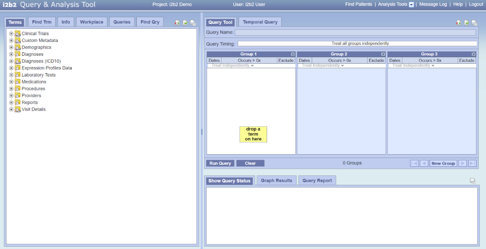    

_Figure 5 : Page d’accueil du " Query & Analysis Tool ", Source : démonstration du Web Client([i2b2 WebClient](https://www.i2b2.org/webclient/))_

  - _Plug-ins_ associés au « _Query & Analysis Tool_ » :
    - **« _ExportXLS_ »** : Permet d’exporter sous forme de fichier .csv ou .xls les concepts sélectionnés et observés sur un ensemble de patients, sous forme de tableau (voir Figure 6 ci-dessous)  
    - **« _Timeline_ »** : Permet de créer une représentation visuelle du moment où les concepts sélectionnés sont observés dans un ensemble de patients
    - **« _Demographics (1 Patient Set) – Simple Counts_ » :** Permet d’afficher les informations démographiques pour un ensemble de patients (voir Figure 7 ci-dessous)  
    - **« _Demographics (2 Patient Sets) – Simple Counts_» :** Permet de comparer les informations démographiques de 2 ensembles de patients
    - **« _WISE (Working Items Sharing Enhancement) – Searcher_ » :** Permet de faciliter la recherche d'éléments ou d'objets dans le panneau _Workplace_ du _Web Client_ i2b2
    - **« _CARE (Cohort Analysis & Refinement Expeditor) – Concept Demographics Histograms_ » :** Permet de générer des histogrammes comparatifs des répartitions démographiques pour un sous-ensemble de patients par rapport aux patients de ce sous-ensemble associés à des concepts spécifiques.
    - **« _CARE – Concept Observation Tally Demographics Histograms_ » :** Permet de générer des histogrammes comparatifs des répartitions démographiques pour un sous-ensemble de patients par rapport aux patients de ce sous-ensemble associés à plusieurs observations d'un concept spécifié.
    - **« _Communicator Tool_ » :** Permet d'interagir directement avec les objets standard de Cell Communicator depuis la plateforme
 

  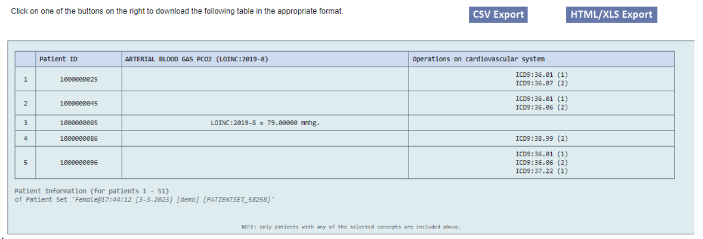

_Figure 6 : Exemple d’utilisation du plug-in ExportXLS, Source : démonstration du Web Client ([i2b2 WebClient](https://www.i2b2.org/webclient/)) (pour la population Femmes sur les concepts pression partielle en CO2 dans le sang et opérations sur le système cardiovasculaire)_

  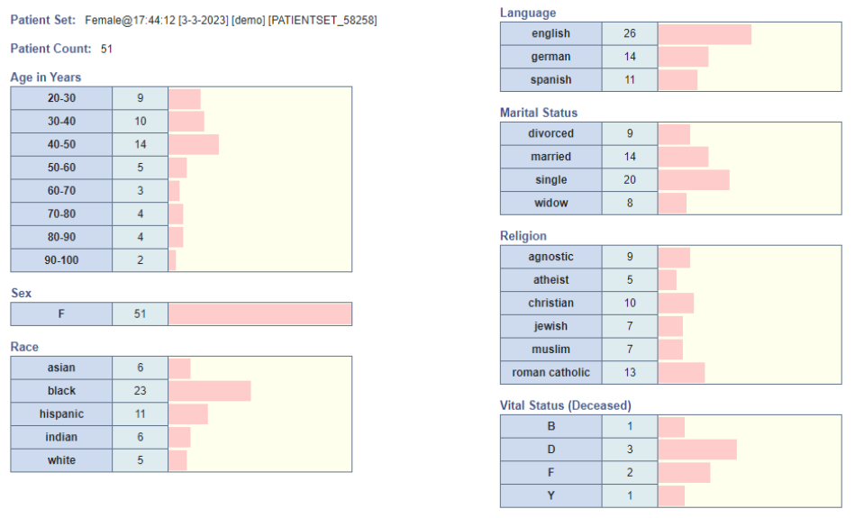

  

_Figure 7 : Exemple d’utilisation du plug-in Demographics (1 Patient Set) (pour la population Femmes), Source : démonstration du Web Client ([i2b2 WebClient](https://www.i2b2.org/webclient/))_

  - **SHRINE**[^4] : outil qui permet de relier les systèmes i2b2 provenant de différents sites ou établissements avant l'utilisation du « _Query & Analysis Tool_ » (voir Figure 8 ci-dessous). Cet outil permet ainsi de compter le nombre de patients qui vérifient certains critères dans les établissements participants. Les chercheurs l’utilisent pour inclure un nombre suffisant de patients dans leurs études[^72].  

  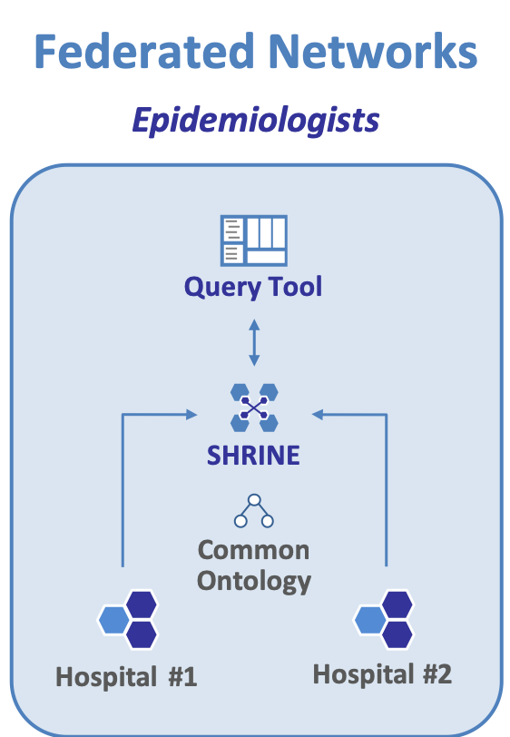    

_Figure 8 : La fédération de systèmes i2b2 par SHRINE, Source : [Software – i2b2 tranSMART Foundation](https://i2b2transmart.org/software/)_

  - **tranSMART**[^4] : suite d'outils d'exploration et de visualisation de données, d'analyses génomiques et d'ETL développés par des industries pharmaceutiques pour des avancées en recherche translationnelle
  - **Wagholikar _et al._**[^73] (2017) ont développé une interface permettant d'implémenter SMART on FHIR à partir d'une plateforme i2b2 :
    - La plateforme i2b2 est utilisée dans une approche « _sidecar_ » : le logiciel stocke une copie des données patient issues de l'EHR et exécute des requêtes sur ces données pour un usage secondaire de recherche (en parallèle de l'EHR qui continue d'être utilisé pour un usage clinique)
    - SMART on FHIR permet de transformer un EHR (ou bien son « _sidecar_ » dans le cas d'i2b2) en une plateforme de type « _App store pour la santé_ » où les utilisateurs ont accès à de nombreuses applications.
    - L'implémentation de SMART _on_ FHIR à partir d'i2b2 permet ainsi (1) de faciliter le déploiement d'applications SMART, (2) d'avoir un mécanisme additionnel d'accès et de requêtage de la plateforme i2b2 et (3) de migrer les données depuis l'EHR, en passant par la réplication dans i2b2 jusqu'à une base FHIR-compatible.

### Décrire les étapes nécessaires pour la standardisation :

  - Pour standardiser une base de données au format i2b2, il faut créer un processus ETL (Extract Transform Load).
  - **Processus de standardisation (ETL) :**

  1. **Nettoyage et vérification des données :** Cette étape vise à s'assurer de la qualité des données notamment en éliminant les redondances, les données manquantes ou erronées.
  2. **Standardisation des données (utilisation de l’ontologie d’i2b2 pour harmoniser la terminologie employée, utilisation de codes standards, etc.) :** Il est possible de définir d'autres ontologies en cas de besoin.
  3. **Pseudonymisation des données :** Pendant cette étape, des identifiants aléatoires sont attribués à chaque patient et une table de _mapping_ associée est générée
  4. **Chargement des données en base (Oracle, SQL Server ou PostgreSQL) :** Dans cette étape, les données sont transformées en un schéma en étoile compatible avec i2b2
  5. **Configuration de la sécurité et contrôle d’accès :**  
    **a.** Les utilisateurs ont besoin de s'authentifier pour accéder aux données  
    **b.** En fonction du rôle de l'utilisateur, l'utilisateur ne peut accéder qu'aux catégories auxquelles il a été autorisé à accéder.  
    **c.** Il est possible de chiffrer certains champs pour gérer la confidentialité des données (Patient Notes, Observation_Blob)  

La Figure 9 ci-dessous illustre les étapes décrites précédemment.  

  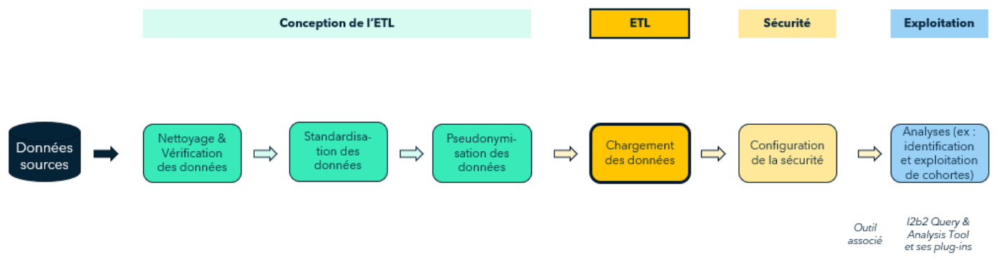

_Figure 9 : Processus ETL utilisé pour charger les données dans i2b2, Source : Schéma réalisé par Veltys_

### Existence d’extensions certifiées : plusieurs extensions existent :
  - **i2b2-_quickstart_ :**[^69] facilite l'installation de la plateforme i2b2
  - **i2b2-etl :**[^74] facilite le chargement des données vers la base de données de i2b2

### Bibliothèque de requêtes types :

La page d'aide du i2b2 « _Query & Analysis Tool_ » contient des exemples de requêtes qui sont accessibles dans la version de démonstration de l’outil[^12](voir Figure 10 ci-dessous).

  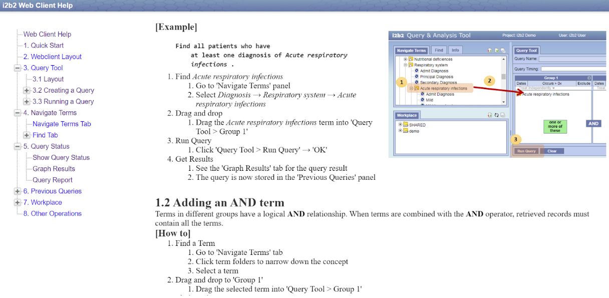

_Figure 10 : Extrait de la page d’aide de l’outil « Query & Analysis Tool », Source : démonstration du Web Client([i2b2 WebClient](https://www.i2b2.org/webclient/))_

### Lisible par un humain : Oui
  - Les données dans i2b2 sont présentées sous format tabulaire, le nom des tables et des variables est compréhensible et renseigne directement sur leur contenu.

 [^67]: Voir l’article de Wagholikar KB, Mendis M, Dessai P, Sanz J, Law S, Gilson M, Sanders S, Vangala M, Bell DS, Murphy SN. « *Automating Installation of the Integrating Biology and the Bedside (i2b2) Platform* ». Biomed Inform Insights. 2018 Jun 4 :[Automating Installation of the Integrating Biology and the Bedside (i2b2) Platform - PMC](https://www.google.com/url?q=https://www.ncbi.nlm.nih.gov/pmc/articles/PMC5989048/&sa=D&source=docs&ust=1726482166350986&usg=AOvVaw3FK5lD5FeWNjmcLJ2STS0o)
 [^68]: Voir la page GitHub :[GitHub - i2b2/i2b2-quickstart: Quick automated installation of i2b2 in VMs, Amazon-Web-Service and Docker](https://github.com/i2b2/i2b2-quickstart)
 [^69]: Voir : https://i2b2transmart.org/working-groups-2/get-involved-contact-us/
 [^70]: Voir l’agenda des meetings à venir :[i2b2 tranSMART Community Meeting](https://i2b2transmart.org/i2b2-transmart-community-meeting/). Il est possible de visionner les enregistrements des sessions passées.
 [^71]: Voir :[Mapping tools version 1.1](https://community.i2b2.org/wiki/display/NCBO/Mapping+tools+version+1.1)
 [^72]: Voir : https://open.catalyst.harvard.edu/wiki/display/SHRINE/Welcome
 [^73]: Voir l’article de Wagholikar KB, Mandel JC, Klann JG, Wattanasin N, Mendis M, Chute CG, Mandl KD, Murphy SN. « *SMART-on-FHIR implemented over i2b2* ». J Am Med Inform Assoc. 2017 Mar : [SMART-on-FHIR implemented over i2b2 - PMC](https://www.ncbi.nlm.nih.gov/pmc/articles/PMC5391721/)
 [^74]: Voir le GitHub :[GitHub - i2b2/i2b2-etl](https://github.com/i2b2/i2b2-etl) et l’article de Kavishwar B Wagholikar, Layne Ainsworth, David Zelle, Kira Chaney, Michael Mendis, Jeffery Klann, Alexander J Blood, Angela Miller, Rupendra Chulyadyo, Michael Oates, William J Gordon, Samuel J Aronson, Benjamin M Scirica, Shawn N Murphy, « *I2b2-etl: Python application for importing electronic health data into the informatics for integrating biology and the bedside platform* ». Bioinformatics, Volume 38, Issue 20, 15 October 2022, Pages 4833–4836:[I2b2-etl: Python application for importing electronic health data into the informatics for integrating biology and the bedside platform | Bioinformatics | Oxford Academic](https://academic.oup.com/bioinformatics/article/38/20/4833/6687125)

## Glossaire des acronymes

1. AP-HP : Assistance Publique – Hôpitaux de Paris
2. API REST : _Application Programming Interface REpresentational State Transfert_
3. ARCH-OMOP : _Accessible Research Commons for Health – Observational Medical Outcomes Partnership_
4. BRIDG : _Biomedical Research Integrated Domain Group_
5. CA-125 : _Cancer Antigen 125_
6. CARE : _Cohort Analysis & Refinement Expeditor_
7. CBC : _Complete Blood Count (Numération Sanguine Complète)_
8. CCTS : _Center for Clinical and Translational Science_
9. CDISC : _Clinical Data Interchange Standards Consortium_
10. CDM : _Common Data Model_
11. CDMH : _Common Data Model Harmonization_
12. CIM : Classification Internationale des Maladies (ICD : International Classification of Diseases)
13. CRC : _Client Research Chart_
14. CSV : _Comma-Separated Values_
15. DBA : _DataBase Administrator_
16. DDL : _Data Definition Language_
17. EAV : _Entity-Attribute-Value_
18. EHR : _Electronic Health Record_
19. EMR : _Electronic Medical Records_
20. ETL : _Extract Transform Load_
21. FHIR : _Fast Health Interoperability Resources_
22. HIPAA : _Health Insurance Portability and Accountability Act_
23. HL7 : _Health Level 7_
24. HCPCS : _Healthcare Common Procedure Coding System_
25. HTML : _HyperText Markup Language_
26. HTTPD : _HyperText Transfer Protocol Daemon_
27. GIF : _Graphics interchange Format_
28. I2B2 : _Informatics for Integrating Biology & the Bedside_
29. ID : IDentifiant
30. IDR : _Integrated Data Repository_
31. IIS : _Internet Information Services_
32. INCa : Institut National du Cancer
33. Inserm : Institut national de la santé et de la recherche médicale
34. JPG / JPEG : _Joint Photographic Experts Group_
35. LOINC : _Logical Observation Identifiers Names and Codes_
36. MS SQL Server : _MicroSoft Structured Query Language Server_
37. NCBC : _National Center for Biomedical Computing_
38. NDC : _National Drug Code_
39. NIH : _National Institutes of Health_
40. OAuth : _Open Authorization_
41. OMOP-CDM : _Observational Medical Outcomes Partnership – Common Data Model_
42. PCORnet CDM : _Patient-Centered Outcomes Research Network Common Data Model_
43. PHP : _Hypertext Preprocessor_
44. PNG : _Portable Network Graphics_
45. SGBD : _Système de Gestion de Base de Données_
46. SHRINE : _Shared Health Research Informatics Network_
47. SMART : _Substitutable Medical Applications and Reusable Technologies_
48. SNOMED-CT : _Systemized NOMenclature of MEDicine Clinical Terms_
49. SQL : _Structured Query Language_
50. WISE : _Workplace Items Sharing Enhancement_
51. XLS : _eXceL Spreadsheets_
52. XML : _Extensible Markup Language_

## Annexes

### Annexe n°1 : Analyse quantitative de la littérature sur i2b2 et extrait de la liste des publications  

Sur PubMed (PubMed), on réalise une requête générale sur FHIR. La recherche du mot-clé « i2b2 » renvoie 439 résultats.Voici ci-dessous un extrait de la liste des publications obtenues en résultat :

1: Bucalo M, Gabetta M, Chiudinelli L, Larizza C, Bellasi A, Zambelli A, Barbarini N. i2b2 to Optimize Patients Enrollment. Stud Health Technol Inform. 2021 May 27;281:506-507. doi: 10.3233/SHTI210217. PMID: 34042623.

2: Wagholikar KB, Mendis M, Dessai P, Sanz J, Law S, Gilson M, Sanders S, Vangala M, Bell DS, Murphy SN. Automating Installation of the Integrating Biology and the Bedside (i2b2) Platform. Biomed Inform Insights. 2018 Jun
4;10:1178222618777749. doi: 10.1177/1178222618777749. PMID: 29887730; PMCID:PMC5989048.

3: Pedrera-Jimenez M, Garcia-Barrio N, Hernandez-Ibarburu G, Baselga B, Blanco A, Calvo-Boyero F, Gutierrez-Sacristan A, Quiros V, Cruz-Bermudez JL, Bernal JL, Meloni L, Perez-Rey D, Palchuk M, Kohane I, Serrano P. Building an i2b2-Based Population Repository for COVID-19 Research. Stud Health Technol Inform. 2022May 25;294:287-291. doi: 10.3233/SHTI220460. PMID: 35612078.

4: Paris N, Mendis M, Daniel C, Murphy S, Tannier X, Zweigenbaum P. i2b2 implemented over SMART-on-FHIR. AMIA Jt Summits Transl Sci Proc. 2018 May 18;2017:369-378. PMID: 29888095; PMCID: PMC5961782.

5: Wagholikar KB, Ainsworth L, Zelle D, Chaney K, Mendis M, Klann J, Blood AJ, Miller A, Chulyadyo R, Oates M, Gordon WJ, Aronson SJ, Scirica BM, Murphy SN. I2b2-etl: Python application for importing electronic health data into the informatics for integrating biology and the bedside platform. Bioinformatics. 2022 Oct 14;38(20):4833-4836. doi: 10.1093/bioinformatics/btac595. PMID:36053173; PMCID: PMC9563689.

6: Wagholikar KB, Mandel JC, Klann JG, Wattanasin N, Mendis M, Chute CG, Mandl KD, Murphy SN. SMART-on-FHIR implemented over i2b2. J Am Med Inform Assoc. 2017 Mar 1;24(2):398-402. doi: 10.1093/jamia/ocw079. PMID:27274012; PMCID: PMC5391721.

7: Klann JG, Abend A, Raghavan VA, Mandl KD, Murphy SN. Data interchange using i2b2. J Am Med Inform Assoc. 2016 Sep;23(5):909-15. doi: 10.1093/jamia/ocv188. Epub 2016 Feb 5. PMID: 26911824; PMCID: PMC4997035.

8: Sun W, Rumshisky A, Uzuner O. Evaluating temporal relations in clinical text: 2012 i2b2 Challenge. J Am Med Inform Assoc. 2013 Sep-Oct;20(5):806-13. doi: 10.1136/amiajnl-2013-001628. Epub 2013 Apr 5. PMID: 23564629; PMCID: PMC3756273.

9: González L, Pérez-Rey D, Alonso E, Hernández G, Serrano P, Pedrera M, Gómez A, De Schepper K, Crepain T, Claerhout B. Building an I2B2-Based Population Repository for Clinical Research. Stud Health Technol Inform. 2020 Jun 16;270:78-82. doi: 10.3233/SHTI200126. PMID: 32570350.

10: Stöhr MR, Majeed RW, Günther A. Metadata Import from RDF to i2b2. StudHealth Technol Inform. 2018;253:40-44. PMID: 30147037.  

