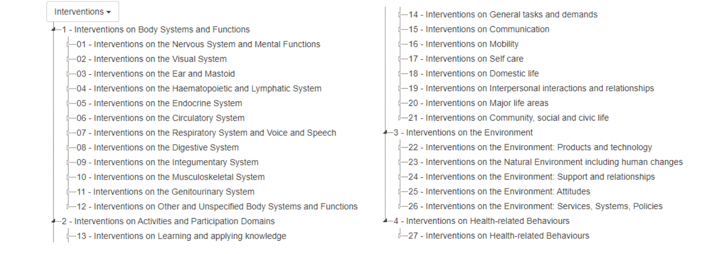
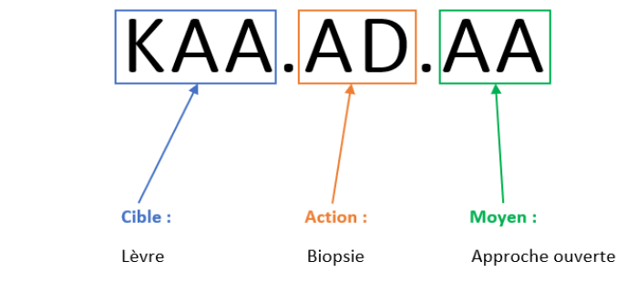
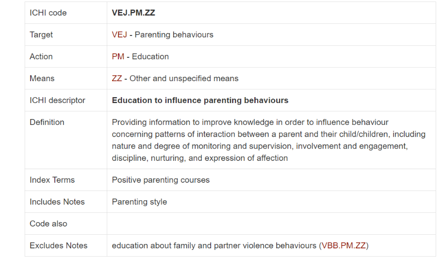
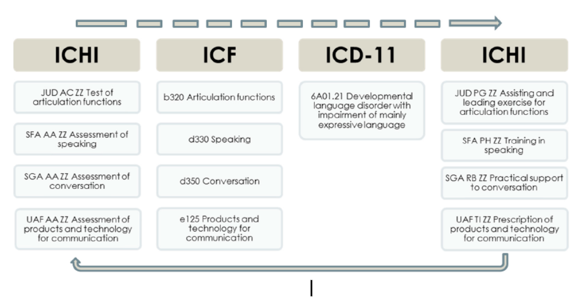
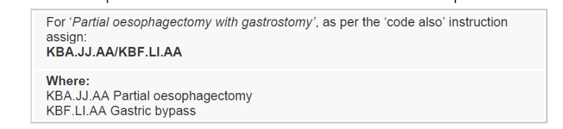
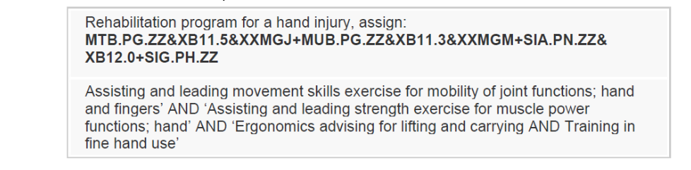
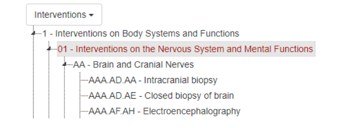

# ICHI  

### SYNTHÈSE :

Description et type de standard : ICHI est un système de classification des codes d'interventions médicales et fait partie des classifications de référence du Réseau de la famille des classifications internationales de l'OMS (WHO-FIC Network) au même titre que la CIM (Classification Internationale des Maladies) et la CIF (Classification Internationale du Fonctionnement).
Domaines d’application : ICHI est utilisée pour décrire les diagnostics, la santé mentale ou encore les soins paramédicaux.
Maturité / Utilisation : La version actuelle est disponible sur le portail de l’OMS[^1], les mises à jour sont régulières. Un version de travail beta 3 date d’octobre 2020. Cette nomenclature est encore peu utilisée, et nous n'identifions pas de pays l'ayant mise en place en mai 2023.

## 1.Général
### Présentation :
  - **Pays d’origine** : International
  - **Consortium d’origine** : Développée par **l’Organisation Mondiale de la Santé** (OMS)[^2] et **le Réseau de la famille des classifications internationales de l'OMS** (WHO-FIC Network) depuis 2007[^3]
  - **Type de standard** : Nomenclature
  - **Description** :
       - ICHI (International Classification of Health Interventions) est un **système de classification international des interventions en santé** développé en 2007. Le standard est issu en grande partie de la CCAM, bien que les deux standards poursuivent des objectifs différents : ICHI a vocation à décrire tous les actes réalisés au niveau mondial, tandis que la CCAM est destinée à coder la facturation des actes médicaux français
       - Une première classification des interventions chirurgicales, médicales et des diagnostics avait été créée par l'OMS mais n'a pas été maintenue (il s'agit d'ICPM, *International Classification of Procedures in Medicine*). L'objectif du développement d'ICHI est de disposer d'une classification internationale dans un contexte de multiplication des classifications nationales
       - ICHI est une classification de référence de la famille des classifications de l'OMS (**WHO-FIC Network**), au même titre que la CIM (Classification Internationale des Maladies) et la CIF (Classification Internationale du Fonctionnement)[^4]
       - Chaque code ICHI est composé de 3 axes (voir le moteur de recherche d'ICHI pour la composition précise de chacun des axes[^5]) :
           - ***Target*** : la cible de l'intervention (il s'agit en partie des catégories issues de la CIF, voir le paragraphe ci-dessous : elles peuvent concerner une partie du corps, une activité de la vie quotidienne, des éléments de l'environnement, des comportements liés à la santé)
           - ***Action*** : l'action réalisée sur la cible (action de diagnostic, action thérapeutique, action de gestion et d'organisation, action de prévention)
           - ***Means*** : méthodes et processus par lesquels l'action est réalisée (type d'approche, technique, méthode, échantillon)
           - Les interventions sont regroupées en **27 catégories** d’interventions regroupées en **4 grandes catégories** définies par la cible de l'intervention (voir Figure 1)[^6] :
          - **Interventions sur les fonctions organiques et les structures anatomiques** : système nerveux et fonctions mentales, système visuel, oreille et mastoïde, système hématopoïétique et lymphatique, système endocrinien, système circulatoire, système respiratoire, système digestif, système tégumentaire, système musculosquelettique, système génito-urinaire, autres systèmes et fonctions corporels non-spécifiés
          - **Interventions sur les activités et la participation** : apprentissage et application des connaissances, tâches et exigences générales, communication, mobilité, entretien personnel, vie domestique, relations et interactions avec autrui, grands domaines de la vie, vie communautaire, sociale et civique
          - **Interventions sur l’environnement** : produits et systèmes techniques, environnement naturel et changements apportés par l'homme à l'environnement, soutiens et relations, attitudes, services, systèmes et politiques
          - **Interventions sur les comportements liés à la santé** (ces catégories ne sont pas inclues dans la CIF) : dépendance, violence, sécurité, services liés à la santé, modes de vie, autres)
          - **Organisme en charge** : ICHI Task Force (de l’OMS) en collaboration étroite avec le Réseau de la famille des classifications internationales de l'OMS (WHO-FIC) depuis 2015
          
         
 

       

 **Figure 1 :Catégories d’interventions contenues dans ICHI**, Source : [ICHI](https://mitel.dimi.uniud.it/ichi/)
   
    
   

- **Application** :
    - **Domaine d’application en santé** : ICHI concerne les champs des **interventions médicales**, chirurgicales, de **santé mentale**, de **soins primaires**, **paramédicales**, de **d'assistance au fonctionnement corporel**, de **rééducation**, de **prévention** et de **santé publique**[^2]. ICHI ne contient pas d'informations sur le professionnel de santé qui réalise l'intervention, ni sur les raisons de l'intervention et ses résultats (qui doivent être classifiées en utilisant respectivement la CIM et la CIF)

   - **Principaux cas d’usage** : Les principaux cas d'usage identifiés dans le guide de référence sont les suivants[^2] :
      - **Comparer les classifications nationales existantes et calculer des statistiques** : l'OCDE et Eurostat collectent les données des États membres liées à certaines interventions hospitalières[^7] et constatent l'effet de l'utilisation de différents systèmes de classification. Le développement d'un standard international facilite la comparaison des taux d'intervention, des temps d'attente, des parcours de soins, etc.
      - **Fournir une classification aux pays qui n'en ont pas, sous réserve de traduction vers les langues officielles de l’OMS** : les pays dont les systèmes de santé sont les moins développés n'ont pas de classification. Par conséquent, ils ne peuvent pas collecter d'informations sur leur situation nationale, ce qui ralentit l'amélioration de la qualité des soins et de l'allocation des ressources
      - **Aider les pays à poursuivre le développement de leur classification nationale à partir d'ICHI** : l'idée est de permettre aux pays qui disposent déjà d'une classification de poursuivre le développement de celle-ci en utilisant ICHI comme base de travail
      - **Compléter les classifications nationales** : ICHI inclut du contenu qui n'est pas couvert, ou seulement de manière incomplète, dans les classifications nationales (santé mentale, soins primaires, soins paramédicaux, assistance au fonctionnement corporel, rééducation, prévention, santé publique). Ce contenu pourrait être inclus dans les classifications nationales à partir d'ICHI

  - **Illustration concrète : exemple d’utilisation sur un cas simple** :
      - Fortune et al. (2017)[^8]  testent le déploiement de la nomenclature ICHI (version **Alpha 2015**) sur des données liées à des interventions réalisées par des infirmières pour en évaluer la couverture et proposer des améliorations

      - *Processus* :
          - **Constitution de la terminologie source** : Sélection des 100 interventions infirmières les plus couramment réalisées dans les hôpitaux et les centres de santé de la région de Matosinhos au Portugal entre le 1er septembre 2012 et le 31 août 2013 et traduites en anglais
          - **Données sources** : les données cliniques issues de l’adaptation nationale de la nomenclature ICNP (*International Classification for Nursing Practice*)
          - **Étape 1 [Codage indépendant]** : 3 codeurs ont traduit de manière indépendante les interventions de la terminologie source dans la nomenclature ICHI
          - **Étape 2 [Discussion et consensus]** : Les résultats de l'étape 1 sont discutés par les codeurs afin de trouver un consensus, quand c'est possible
      - Résultats :
          - **Étape 1** :
              - **14%** des termes sont associés au même code ICHI par les 3 codeurs,
              - **38%** des termes sont associés au même code ICHI par 2 codeurs sur les 3
              - **35%** des termes sont associés à un code ICHI différent par codeur
          - **Étape 2** :
              - **80%** des termes sources ont finalement été associés à un code ICHI définitif
          - Le faible taux de codes similaires en phase 1 reflète le niveau de maturité du standard : la fiabilité de la nomenclature s'améliorera avec la publication de directives et de définitions plus précises des codes d'intervention. La phase 2 montre que la nomenclature couvre bien le domaine des interventions infirmières.

 - **Données** :
      - **Typologie de données concernées** : Le projet *Hospital Data* mené par l'Union Européenne a mis au jour le nombre élevé de classifications nationales des interventions de santé. Cela a conduit l'OMS à lancer les travaux de construction d'ICHI[^2]. Les données exploitées dans le cadre du projet *Hospital Data* sont similaires à celles qui pourront utiliser ICHI à l'avenir : il s'agit des bases de données nationales d'activité hospitalière (collectées dans un format standardisé dans le cadre du projet)
      - **Type de terminologie** : Ontologie
      - **Type de granularité** :
          - Les codes ICHI (codes racine ou *stem code*[^9]) sont des **codes alphanumériques** de 2 ou 7 caractères sous la forme XX ou XXX.XX.XX (voir Figure 2). Les codes avec 2 caractères correspondent à des « regroupements d’interventions » (*exemple : KA désigne la bouche et le pharynx et KAA.AD.AA désigne la biopsie de la lèvre*). Pour les codes à 7 caractères, les 3 premiers identifient la cible, les 2 suivants identifient l’action réalisée et les 2 derniers identifient la méthode utilisée
         - Les codes extension (voir l'élément *« Flexibilité du standard, personnalisation »* en partie 3. Technique) sont des codes alphanumériques de **3 à 7 caractères** sous la forme XXXX.XX, XXXXX.XX ou XXXXXX[^4] 
        

       

  -  ICHI permet de coder des **actes sur des individus et des actions de santé publique**[^10]. Un exemple d'action de santé publique est donné dans la Figure 3 : il s'agit d'une intervention visant à éduquer les parents au sujet des comportements à avoir auprès de leurs enfants. Cette intervention (codée VEJ.PM.ZZ) fait partie du chapitre 4 (interventions sur les comportements liés à la santé) et du bloc lié au mode de vie (VE)  

  **Figure 2 : Décomposition d’un code ICHI**, Source : [ICHI](https://mitel.dimi.uniud.it/ichi/)
   
 

       

       

 **Figure 3 : Description du code ICHI VEJ.PM.ZZ**, Source : [ICHI](https://mitel.dimi.uniud.it/ichi/)
   
  

                                                          
  - **Utilisation dans plusieurs langues** :
      - Pour le moment, ICHI n’est disponible entièrement qu'en **anglais** (britannique)[^2]
      - A terme, comme toutes les nomenclatures de l’OMS, ICHI devrait être traduite vers les 6 langues officielles de l’OMS : anglais, français, russe, arabe, chinois et espagnol[^11]

 - **Disponibilité de la documentation d'implémentation** :
Un guide de référence ICHI a été publié à la sortie de la version Beta-3 en octobre 2020[^2].

### 2.Gouvernance
- **Modalités d'accès et distribution des solutions basées sur ce standard** :
   - ICHI est accessible en ligne gratuitement[^1]
   - Sous la même licence que la CIM-11 : Creative Commons Attribution-NoDerivs 3.0 IGO[^12]

- **Processus de prise de décision sur le standard** :
    - Il est possible de faire **des commentaires** ou des **propositions** directement via la **plateforme ICHI Beta-3**. Pour cela, il faut **créer un compte** sur la plateforme[^2,13].
    - Toute autre demande ou retour sur la nomenclature peut être envoyé par **mail** à l’adresse ichi@who.int11
- **Maturité du standard** :
    - **Fréquence de mise à jour** :
        - La version de travail **Beta-3** sortie en octobre 2020 contenait environ 7 000 interventions2. Il s’agissait d’une version ayant vocation à recueillir les retours des utilisateurs.
        - ICHI est **encore en développement**[^14], **le portail ICHI de l’OMS affiche des mises à jour régulières**.
La version précédente est la version **Alpha** sortie en 2015. Cette version contenait 5 800 interventions[^7] (Voir l'élément dans « *Illustration concrète : exemple d’utilisation sur un cas simple* » en partie 1. Général).
    - **Niveau de maturité** :
        - **Note : 0,2 / 1**
        - Cette note s’explique par le fait que la version stable n’ayant pas encore été publiée, le standard n’est pas utilisé en production dans le monde, ni a fortiori adopté officiellement.
    - **Existence de financements pour standardisation** : *La classification étant encore en développement, elle n'a pas encore fait l'objet de financement pour la standardisation.*
    - **Ressources d’accès à la terminologie et liens associés** :
         - Moteur de recherche pour parcourir le contenu[^4]
         - Guide d’utilisation du moteur de recherche[^11]
         - Guide de référence[^2]

  #### 3.Technique

- **Capacité de traduction vers un autre standard (intra types de standards)** :
    - En tant que classification de référence de la famille des classifications internationales de l'OMS (WHO-FIC), ICHI a été conçue pour s'aligner sur la **CIM** et la CIF et pour être utilisée en parallèle avec celles-ci :
        - Les catégories CIF pour les fonctions corporelles, les activités, les domaines de participation et les facteurs environnementaux sont utilisés comme cibles dans ICHI[^2] ;
        - Plusieurs codes d'extension ICHI sont des codes d'extension CIM-11 ;
        - Les trois classifications WHO-FIC sont conçues pour être **appliquées indépendamment** de la façon suivante :
           - ICHI permet de décrire des interventions (chirurgicales, préventives, thérapeutiques, de support)
           - La CIF permet de décrire le fonctionnement de la personne (fonctions corporelles, structurelles, activités et domaines de participation, facteurs environnementaux)
           - La CIM-11 permet de décrire l'état de santé de la personne
        - Elles peuvent également être utilisées de la **manière combinée** suivante : dans une première étape, la CIF décrit les besoins d'assistance d'une personne liée à son fonctionnement ; dans une deuxième étape, ICHI décrit les interventions prévues ou réalisées pour répondre à ce besoin d'assistance ; dans une troisième étape, le fonctionnement de la personne après l'intervention est enregistré en utilisant la CIF, et permet d'évaluer si les objectifs ont été atteints (voir Figure 4).  

       

 **Figure 4 : Exemple d'utilisation combinée des classifications de la famille de l'OMS (WHO-FIC : ICHI, CIF et CIM-11)**, Source : [Fortune et al. (2018)[^15]](https://pubmed.ncbi.nlm.nih.gov/29342077/)
   
 

 - Rodrigues et al. (2017)[^16] décrivent les **difficultés de mapping** entre **ICHI** et **SNOMED-CT** :
    - Il n'y a pas d'équivalent ICHI du lien sémantique SNOMED-CT « *hasSubsurgicaldeed* », ce qui empêche de coder avec ICHI deux actions lors d'une même intervention, ce qui est pourtant possible avec SNOMED-CT
    - Il n'y a pas de liaison sémantique équivalente au « *Procedure site indirect* » de SNOMED-CT permettant de lier les catégories « *lesion* » et « *interventional equipment* » au « *anatomical entity* »
       

**Communication avec d'autres standards (inter typologies de standards**) : *La classification est
encore en développement, nous n'avons pas identifié de communication avec d'autres standards
(inter typologies de standards).*

- **Flexibilité du standard, personnalisation** :
   - ICHI permet l'utilisation, si nécessaire, de **codes extension** pour renseigner des informations additionnelles sur une intervention, qui ne sont pas contenues dans le code racine. Les codes extension peuvent contenir les informations suivantes : numériques[^17], description additionnelle de l'intervention[^18], topologie[^19], télésanté[^20], tests essentiels réalisés, cible additionnelle, détail anatomique spécifique, médicaments, produits d'assistance, produits thérapeutiques. Certains codes extensions sont issus de la CIM-11 (ex : détail anatomique spécifique, médicament).

   - Les codes ICHI peuvent **être associés entre eux** :
      - En cas de **combinaison d'un code racine et d'un ou plusieurs codes extension** (à l'aide de « & » et de parenthèses pour grouper plusieurs codes extension ensemble) : ICHI code racine&(extension code&extension code)&(extension code&extension code)
      - En cas **d’interventions réalisées en même temps** (avec un « / », voir Figure 5) : les codes extension peuvent également être utilisés si nécessaire 

       

 **Figure 5 : Exemple de codes ICHI 
pour des interventions réalisées en même temps**, Source : [Guide de référence version Beta-3](https://www.who.int/standards/classifications/international-classification-of-health-interventions)
   
 
  
 - En cas d'interventions combinées (avec un « + », voir Figure 6) : les codes extension peuvent également être utilisés si nécessaire 
    

       

 **Figure 6 :Exemple de codes ICHI 
pour des interventions combinées**, Source : [Guide de référence version Beta-3](https://www.who.int/standards/classifications/international-classification-of-health-interventions)
   
 
                                                       
           
 - Les codes ICHI peuvent également être combinés à des codes issus d'autres classifications pour ajouter des précisions (avec un « # », ex : LOINC, International Standard Classification of Occupations pour décrire le prestataire de l'intervention, etc.)

- **Contraintes d'implémentation** : *ICHI ne présente pas de contrainte d'implémentation.*

- **Intensité de la perte de données au mapping** :
 La perte de données au *mapping* est encore peu documentée, quelques articles abordent cependant le sujet :  
    - L'article de Fortune et al. (2017)[^7] (voir l'élément *« Illustration concrète : exemple d’utilisation sur un cas simple »* en partie 1. Général) nous renseigne sur la perte d'informations lors du mapping de codes d'interventions infirmières portugais à la version Alpha de 2015. D'après cette analyse, 20 % des codes source ne sont pas associés à un code ICHI. Parmi les 80 % de codes source traduits dans un code ICHI, 64 % des codes ICHI décrivent une cible plus large que le code d'origine, dont 12 % décrivent également une action plus large. Cependant, 2 % des codes sont plus précis sur la cible. Cette évaluation de la perte de données au mapping ne peut toutefois pas être généralisée. Elle est valable uniquement dans le cas de la traduction de codes nationaux (portugais, en l'occurrence) concernant le domaine précis des interventions infirmières. Elle n'est pas représentative de l'ensemble des interventions contenues dans ICHI.

    - Fung et al. (2021)[^21] évaluent la performance d'ICHI pour le cas du codage des procédures chirurgicales communes, en comparaison à SNOMED-CT, CIM-10 et CCI (*Canadian Classification of Health*). Ces résultats montrent qu'ICHI couvre imparfaitement les procédures chirurgicales communes. Compte tenu du large périmètre couvert par ICHI (depuis les tests, en passant par les interventions médicales et chirurgicales, jusqu'à la rééducation et la santé publique), et de sa taille relativement petite, cette couverture imparfaite n'est pas surprenante. Elle s'explique également par l'importance du cas d'usage de l'analyse statistique : ce cas d'usage implique d'être parcimonieux dans la création des codes racine pour réduire la variabilité du codage et améliorer la comparabilité entre les pays.

- **Existence d’un historique et accessibilité à l’historique** : Le moteur de recherche ICHI ne donne accès qu'à la version courante Beta-3.

## 4.Valorisation

- **Accessibilité à des ressources de formation** : *La classification étant encore en développement, il n'existe pas encore de ressources de formation.*

- **Disponibilité de la documentation scientifique démontrant l'intérêt** :
La classification étant encore en développement, la documentation scientifique associée est relativement restreinte. Les articles suivants évaluent cependant l'intérêt d'ICHI selon différents cas d'usage :
   - Thun et Dewenter (2018[^22]) évaluent l'interopérabilité de la CIM-11 et ICHI, et leur adaptabilité aux cas d'usage de la e-santé, en comparaison à SNOMED-CT. Ils en concluent qu'en termes d'expressivité du contenu et d'utilisation internationale dans le contexte de la e-santé, SNOMED-CT est plus adaptée que la CIM-11 et ICHI, même sur leur périmètre initial que sont les diagnostics et les procédures. ICHI peut cependant être recommandé pour des cas d'usage spécifiques (tels que les statistiques)  
   - Fung et al. (2021)[^19] montrent qu'entre SNOMED-CT, ICHI, CIM-10 et CCI, SNOMED-CT est la classification la plus adaptée au cas d'usage clinique. Par ailleurs, ICHI et la CIM-10 ont des performances similaires. En effet, SNOMED-CT permet de représenter 94,3 % des 300 procédures chirurgicales les plus courantes dès la première phase de mapping. À titre de comparaison, ICHI permet d'en représenter 52,8 % en première phase, puis 72,2 % en deuxième phase (à la suite d'une étape de coordination entre les deux codeurs), soit un taux similaire à ce qui est obtenu avec la CIM-10 dès la première phase

- **Adoption du standard** :
   - *La classification étant encore en développement*, *elle n'est pas *encore utilisée, ni de manière officielle*, *ni sur le marché*
   - *Des tests d'utilisation de la classification sont en cours pour validation*[^12,23]

- **Fournisseurs de service ayant l'expertise en France** :
En mai 2023, nous n'identifions pas de fournisseurs de service ayant l'expertise. Seules les instances publiques participant au développement de la classification en sont expertes : l'ATIH a ainsi été sollicitée par l'OMS pour mener les tests de la classification en France[^21].

## 5.Utilisation
- **Simplicité d'usage** :
   - **Note : 0 / 1** en raison de l’absence d’accès à des ressources officielles de formation (voir l’élément « *Accessibilité à des ressources de formation* » en partie 4. Valorisation), malgré l’existence du guide de référence de la version Beta-3[^2] qui est détaillé et donne notamment des recommandations pour identifier le code racine pertinent, c'est-à-dire pour choisir la cible, l'action et le moyen les plus adaptés à l'intervention concernée

- **Existence d'une communauté en ligne et degré d'activité** :
*La classification étant encore en développement, il n'y a pas de communauté en ligne. Néanmoins, les standards de l’OMS en sont usuellement dotés.*

- **Outils d’implémentation / aide au codage** :
ICHI Coding Tool[^24] et sa page d’aide[^25] : en mai 2023, la version de l'outil en ligne est non-finalisée (« working draft with daily updates »)

- **Outils compatibles** : *La classification étant encore en développement, des outils compatibles ne sont pas encore publiés.*

- **Existence d'extensions certifiées** :
ICHI permet de combiner plusieurs codes racine et également d'ajouter des codes extension (voir l'élément « *Flexibilité du standard, personnalisation* » dans la partie 3. Technique). Cependant, la classification étant encore en développement, il n'existe pas d'extensions certifiées.

- **Bibliothèque de requêtes types** :
Le guide de référence de la version Beta-3[^2] donne plusieurs exemples de codes d'intervention ICHI et en détaille la composition.

- **Lisible par un humain : Oui**
Les codes ICHI sont compréhensibles par l’humain en consultant l'arborescence ICHI (voir Figure 7).

       

 **Figure 7 : Extrait de l'arborescence ICHI**, Source : [ICHI](https://mitel.dimi.uniud.it/ichi/)
   
 

[^1]: Voir : [International Classification of Health Interventions (ICHI)](https://www.who.int/standards/classifications/international-classification-of-health-interventions). Le réseau WHO-FIC contient notamment trois nomenclatures de référence que sont la CIM (Classification Internationale des Maladies), la CIF (Classification Internationale du Fonctionnement) et ICHI ainsi que des nomenclatures dérivées.
[^2]: Voir : [International Classification of Health Interventions (ICHI)](https://www.who.int/standards/classifications/international-classification-of-health-interventions). Le réseau WHO-FIC contient notamment trois nomenclatures de référence que sont la CIM (Classification Internationale des Maladies), la CIF (Classification Internationale du Fonctionnement) et ICHI ainsi que des nomenclatures dérivées.
[^3] : Voir le guide de référence de la version Beta-3 d’ICHI : https://mitel.dimi.uniud.it/ichi/docs/ICHI Beta-3 Reference Guide.pdf
[^4]: Voir : [Classifications](https://www.who.int/standards/classifications). Ce réseau contient notamment trois nomenclatures de référence que sont la CIM, la CIF (Classification Internationale du Fonctionnement) et ICHI (International Classification of Health Interventions) ainsi que des nomenclatures dérivées.
[^5]: Voir le moteur de recherche de ICHI Beta-3 : [ICHI](https://mitel.dimi.uniud.it/ichi/)
[^6]: Ces catégories incluent notamment les catégories de la CIF, voir la version française du guide de référence de la classification CIF (2001) : [Classification internationale du fonctionnement, du handicap et de la santé: CIF](https://apps.who.int/iris/bitstream/handle/10665/42418/9242545422_fre.pdf)
[^7]: Voir : [Health Status](https://stats.oecd.org/Index.aspx?DatasetCode=HEALTH_STAT)
[^8]: Nicola Fortune, Nicholas R Hardiker, Gillian Strudwick, « Embedding Nursing Interventions into the World Health Organization’s International Classification of Health Interventions (ICHI) », Journal of the American Medical Informatics Association, Volume 24, Issue 4, July 2017 : [Embedding Nursing Interventions into the World Health Organization’s International Classification of Health Interventions (ICHI) | Journal of the American Medical Informatics Association | Oxford Academic](https://doi.org/10.1093/jamia/ocw173)
[^9]: Par opposition aux codes extension, voir ci-dessous et l’élément « Flexibilité du standard, personnalisation » en partie 3. Technique pour plus d’informations sur les codes extension.
[^10]: Dans le guide de référence de la version Beta-3 d'ICHI (https://mitel.dimi.uniud.it/ichi/docs/ICHI Beta-3 Reference Guide.pdf), une intervention de santé est définie de la façon suivante : « A health intervention is an act performed for, with or on behalf of a person or a population whose purpose is to assess, improve, maintain, promote or modify health, functioning or health conditions. »
[^11]: Voir : [Multilingualism and WHO](https://www.who.int/about/policies/multilingualism)
[^12]: CC BY-ND 3.0 IGO, ou la licence CIM-11 disponible ici : [CC BY-ND 3.0 IGO Deed | Attribution-NoDerivs 3.0 Intergovernmental Organization | Creative Commons](https://creativecommons.org/licenses/by-nd/3.0/igo/)
[^13]: Voir la page d’inscription : [ICHI info page](https://mitel.dimi.uniud.it/ichi/docs/)
[^14]: Par ailleurs, le moteur de recherche de la version Beta-3 ([ICHI](https://mitel.dimi.uniud.it/ichi/)) indique à cette date : « Finalisation of ICHI is planned by the end of 2020. ICHI Beta-3 is : - updated on regular basis – not yet approved by WHO (…) Until finalised, ICHI is not to be used for coding. »
[^15]: Fortune N, Madden R, Almborg AH. « Use of a New International Classification of Health Interventions for Capturing Information on Health Interventions Relevant to People with Disabilities ». Int J Environ Res Public Health. 2018 Jan 17 : [Use of a New International Classification of Health Interventions for Capturing Information on Health Interventions Relevant to People with Disabilities](https://pubmed.ncbi.nlm.nih.gov/29342077/)
[^16]: Voir l’article : Jean Marie RODRIGUES, Sukil KIM, Béatrice ROMBERT PAVIOT, Jae Jin LEE and Syed ALJUNID « How to Link SNOMED CT Procedure and WHO International Classification of Health Interventions (ICHI) », 2017 : https://books.google.fr/books?hl=fr&lr=&id=2UXiDgAAQBAJ&oi=fnd&pg=PA40&dq=ichi+who&ots=bijydMBOYK&sig=yi3eYUPL5Gd6X19OQhEjiI206BU&redir_esc=y#v=onepage&q=ichi%20who&f=false
[^17]: Nombre de structures anatomiques concernées par l’intervention, nombre d’interventions réalisées, nombre de produits thérapeutiques utilisés
[^18]: Relations avec d’autres interventions, structure, utilisation d’un équipement ou difficulté, techniques ou compétences spécifiques, intervention non-planifiée, etc.
[^19]: Latéralité, mesure, relationnel
[^20]: Intervention réalisée avec une assistance à distance, intervention réalisée sur un bénéficiaire à distance, intervention réalisée par le biais de la technologie sans intervention humaine directe
[^21]: Voir : Fung KW, Xu J, Ameye F, Burelle L, MacNeil J. « Evaluation of the International Classification of Health Interventions (ICHI) in the coding of common surgical procedures ». J Am Med Inform Assoc. 2021 Dec 28 : [Evaluation of the International Classification of Health Interventions (ICHI) in the coding of common surgical procedures](https://pubmed.ncbi.nlm.nih.gov/34643710/)
[^22]: Voir : Thun S, Dewenter H. « ICD-11, ICHI und SNOMED CT – was bedeuten die Systematiken für E‑Health-Anwendungen? [ICD-11, ICHI and SNOMED CT-What do the standards mean for eHealth applications?](https://pubmed.ncbi.nlm.nih.gov/29846742/) ». Bundesgesundheitsblatt Gesundheitsforschung Gesundheitsschutz. 2018 Jul : [ICD-11, ICHI and SNOMED CT-What do the standards mean for eHealth applications?]
[^23]: En août 2019, l'ATIH (Agence technique de l'information sur l'hospitalisation) a publié une sollicitation de professionnels du codage afin de tester ICHI : [Future classification internationale des interventions en santé (ICHI) | ATIH](https://www.atih.sante.fr/actualites/future-classification-internationale-des-interventions-en-sante-ichi). Cette sollicitation s'inscrit dans le cadre de la validation de la version Beta-3 qui était initialement prévue pour fin 2020.
[^24]: Voir : [ICHI Coding Tool International Classification of Health Interventions](https://icd.who.int/devct11/Help?state=Current&lang=en)
[^25]: Voir : [ICD-11 Coding Tool Help (who.int)](https://icd.who.int/devct11/Help?state=Current&lang=en)

### Glossaire des acronymes

1. **ATIH** : Agence technique de l'information sur l'hospitalisation
2. **CCI** : Canadian Classification of Health Interventions
3. **CIM** : Classification Internationale des Maladies (en anglais : International Classification of Diseases ICD)
4. **CIF** : Classification Internationale du Fonctionnement
5. **ICHI** : International Classification of Health Interventions
6. **ICNP** : International Classification for Nursing Practice
7. **ICPM** : International Classification of Procedures in Medicine
8. **IGO** : Intergovernmental Organisation
9. **LOINC** : Logical Observation Identifiers Names and Codes
10. **OCDE** : Organisation de coopération et de développement économiques
11. **OMS** : Organisation Mondiale de la Santé
12. **SNOMED-CT** : Systemized NOMenclature of MEDicine Clinical Terms
13. **WHO FIC** : World Health Organization Family of International Classifications

       

       

         

         
     

