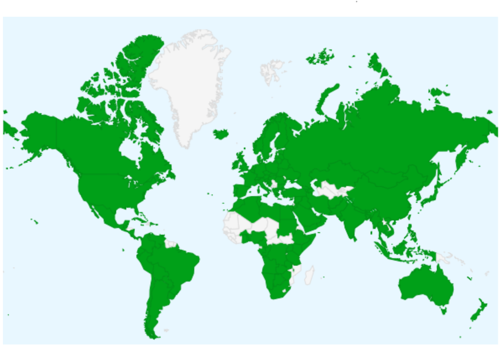

# Fiche d’identité : Loinc

## SYNTHÈSE :

**Description et type de standard** : LOINC (*Logical Observation Identifiers Names and Codes*) est une terminologie développée par le *Regenstrief Institute*, utilisée pour **identifier les résultats des tests de laboratoire, les résultats des tests cliniques et les documents de santé**.

**Domaines d’application** : LOINC couvre **toutes les observations cliniques, les tests effectués par les laboratoires**, ainsi qu'une grande partie de la **médecine vétérinaire**. Ainsi, LOINC assure l'**interopérabilité sémantique** des observations cliniques et des tests de laboratoire.

**Maturité / Utilisation** : LOINC est mise à jour deux fois par an : la version actuelle de LOINC est la **v2.75** (sortie en septembre 2023). En 2021, LOINC est reconnue comme un standard national dans plus de 30 pays et utilisée en 2023 dans **196 pays** (Chine, États-Unis, Afrique du Sud, France, Australie, etc.). En France, dans le cadre du déploiement du **Ségur du numérique en santé**, l'usage de LOINC est obligatoire pour la **production et l'exploitation de comptes-rendus d'examens dématérialisés de biologie médicale structurés** (voir l'élément « *Adoption du standard* » en partie 4. Valorisation)

## 1. Général

- **Présentation** :
  - **Pays d’origine** : États-Unis[^1].
  - **Consortium d’origine** : *Regenstrief Insitute*[^1][^2].
  - **Type de standard** : Nomenclature
  - **Description** :
    - LOINC (*Logical Observation Identifiers Names and Codes*) est un standard international créé en 1994 permettant d'**identifier les mesures, les observations et les documents du domaine de la santé**[^3]. A l'origine, LOINC ne contenait que les observations des tests de laboratoire. En 1996, la terminologie s'est étendue et intègre les observations cliniques[^4].
    - LOINC répond à un besoin d'**interopérabilité sémantique** : les systèmes locaux ont plusieurs manières différentes d'identifier un même test ou une même mesure clinique[^5]. En identifiant les observations cliniques et les tests réalisés de manière unique, LOINC permet ainsi aux établissements de santé d'échanger des données de santé (documents cliniques, résultats de laboratoire, etc.). LOINC n'a pas vocation à coder les résultats des observations[^6].
    - LOINC contient **101 632 termes LOINC**[^1] dans sa version la plus récente (v2.76) qui s'articule autour de quatre catégories principales[^4] :
      - Catégorie laboratoire ou « *Laboratory LOINC* »[^7] (environ 60 000 codes de biologie)
      - Catégorie clinique ou « *Clinical LOINC* »[^8] (environ 20 000 codes)
        - Contient notamment la *Document Ontology*, ensemble de termes permettant de décrire le type de document clinique[^9].
      - « *HIPAA Attachments* » pour standardiser les échanges électroniques de pièces jointes entre payeurs et prestataires de soins
      - « *Standardized Survey Instruments* »[^10]  sur la standardisation des supports d'enquête
    - Un « terme LOINC » est associé à un « code LOINC » et à un « libellé LOINC »[^4] :
      - Un **terme LOINC** représente une question sur un phénomène clinique pouvant être observé ou mesuré
      - Un **code LOINC** est un code numérique unique et permanent pouvant être traité par l'ordinateur qui n'a pas de structure intrinsèque. Il n'y a pas d'arborescence des codes LOINC.
      - Un **libellé LOINC** est un texte lisible par un humain associé au code LOINC. Il y a trois types de libellés LOINC[^11] :
        - _**Fully-Specified Name**_ (FSN) : il s'agit du libellé complet qui contient les six dimensions du terme LOINC (ex : « *Sodium:SCnc:Pt:Urine:Qn* »[^12], voir l'élément « *Type de granularité* » en partie 1. Général)
        - _**Long Common Name**_ (LCN) : il s'agit du libellé commun plus facile à lire et à comprendre pour le clinicien (ex : « *Sodium [Moles/volume] in Urine* »)
        - _**Short Name**_ : il est plus court et peut être utilisé pour les libellés de colonnes (ex : « *Sodium Ur-sCnc* »)
    - En France, deux principaux jeux de valeurs LOINC[^13] sont utilisés :
      - **Le jeu de valeurs “LOINC Biologie France”**, qui est une sélection de 57 343 codes LOINC traduits en français (chapitres correspondants aux examens de biologie).
      - **Le jeu de valeurs plus restreint appelé “Circuit de Biologie”**, contenant 7 583 codes, qui constitue une référence à utiliser par les biologistes pour coder les analyses les plus fréquentes en France (80% de l’activité de biologie médicale en ville).

[^1]: Voir : [About LOINC)(https://loinc.org/about/)
[^2]: Le *Regenstrief Institute* est une organisation de recherche à but non-lucratif associée à l'université d'Indiana aux États-Unis. Le *Regenstrief Institute* a créé le comité LOINC (LOINC Committee) pour le développement de la terminologie LOINC.
[^3]: Voir : [What LOINC is](https://loinc.org/get-started/what-loinc-is/) 
[^4]: Voir la vidéo « *Introduction to LOINC* » : [Videos – LOINC](https://loinc.org/videos/)
[^5]: Voir : [Get Started – LOINC](https://loinc.org/get-started/)  
[^6]: LOINC code les mesures cliniques et les tests de laboratoire effectués, c'est-à-dire que le code LOINC répond à la question suivante : « Quelle mesure ou quel test a été effectué ? ». LOINC ne code cependant pas les résultats des tests, qui peuvent prendre une valeur issue d'autres standards (par ex : SNOMED-CT). Voir : [What LOINC is](https://loinc.org/get-started/what-loinc-is/) 
[^7]: Il s'agit notamment des termes relatifs aux tests pratiqués en laboratoire et à domicile, du dépistage néo-natal, des tests vétérinaires.
[^8]: Il s'agit de l'ensemble des termes relatifs aux mesures, interventions, documents et autres informations cliniques qui ne sont pas inclus dans la catégorie laboratoire (mesures anthropomorphiques, signes vitaux, examen physique, électrocardiogramme, échocardiographie, procédures en radiologie et en ophtalmologie, notes cliniques, etc.).  
[^9]: Voir : [LOINC Document Ontology](https://loinc.org/document-ontology/). Les codes contenus dans la *Document Ontology* peuvent décrire jusqu’à cinq attributs : le domaine d'activité (ex : cardiologie, etc.), le rôle (patient, praticien, etc.), le cadre (ex : ambulatoire, etc.), le type de prestation (ex : consultation, etc.) et le type de document (note, etc.).
[^10]:  Il s'agit des termes liés aux questionnaires complétés par les patients ou les professionnels de santé (évaluation fonctionnelle, évaluation des symptômes, de la santé comportementale, de la psychiatrie, de la consommation de drogues, etc.).
[^11]: Voir : [LOINC Term Basics](https://loinc.org/get-started/loinc-term-basics/). Le nom français des composants est celui de la version française proposée par l’outil « *SearchLOINC* ». Voir l’élément « *Outils d’implémentation / aide au codage :* » en partie 5. Utilisation.
[^12]: Voir : [LOINC 2955-3 Sodium [Moles/volume] in Urine](https://loinc.org/2955-3)
[^13]: Voir [Webinaire LOINC](https://esante.gouv.fr/sites/default/files/media_entity/documents/ans_aphp_sfil_webinar-loinc-toutes-cibles-du-24062021_vf.pdf)

  - **Organisme en charge** :
    - *Regenstrief Institute*[^14].
    - **En France, l’ANS a confié la maintenance du jeu de valeurs LOINC à un consortium constitué de l’AP-HP, les sociétés Vidal et Mondéca, la SFIL, Phast et le CHU de Rouen[^15].**

- **Application** :
  - **Domaine d’application en santé** :
    - La terminologie LOINC couvre **toutes les observations cliniques ainsi que celles rapportées par des laboratoires**[^16], y compris pour certaines spécialités, telles que : la chimie (dont le suivi thérapeutique des médicaments et de la toxicologie), l’hématologie, la sérologie, la banque du sang, la microbiologie, la cytologie, la pathologie chirurgicale, la fertilité.
    - Une grande partie des termes utilisés en **médecine vétérinaire** ont également été inclus dans la terminologie.
    - Certaines mesures ne sont pas directement liées aux tests mais sont nécessaires à l'interprétation des résultats (ex : la phase du cycle menstruel pour les frottis cervicaux, etc.). Elles sont également incluses dans LOINC.
    - En France, LOINC est principalement utilisé en biologie médicale et en imagerie médicale.

  - **Principaux cas d’usage** :
    - LOINC permet l'interopérabilité sémantique des tests et des observations cliniques, dans un contexte de transferts croissants de données médicales[^1].
    - Uchegbu et al. (2017)[^17] détaillent les situations où la terminologie LOINC peut être utilisée pour :
      - La prescription d'un test par un médecin lors d'une consultation
      - La facturation du patient par le laboratoire à la suite des tests effectués
      - La transmission et documentation des résultats d'un test effectué
      - La vérification de la cohérence du test prescrit et des résultats associés
    - En France, le JDV Circuit de la biologie est utilisé pour coder les analyses élémentaires de biologie médicale dans les compte-rendus dématérialisés. L’objectif d’utiliser ce jeu de valeurs est d’harmoniser la manière dont les examens sont codés, pour garantir l’interopérabilité des informations concernant les demandes et résultats d’examens de biologie[^18].
    - LOINC est également utilisé pour coder les actes d’imagerie médicale dans les compte-rendus d’imagerie[^13].

  - **Illustration concrète : exemple d’utilisation sur un cas simple** :
    - Fiebeck et al.[^19] (2019) détaillent l'implémentation de LOINC au sein du système de gestion de laboratoire du MHH (l'école de médecine de Hanovre, MHH : *Medizinische Hochschule Hannover*) dans le cadre d'un projet de recherche sur la leucémie entre l'université de sciences appliquées de Hanovre et la MHH.
      - Les résultats du *mapping* des terminologies locales vers LOINC sont les suivants :
        - 451 termes locaux ont été *mappés* à des codes LOINC : il s'agit de 26,7% des termes stockés dans l'entrepôt, qui représentent 37,7% des tests réalisés entre août 2018 et mai 2019
        - Les 451 termes locaux ont été mappés à 373 codes LOINC distincts (certains termes locaux, très similaires, partagent un même code LOINC)
        - Seuls 209 codes LOINC ont pu être intégrés dans le système informatique (dans une première étape) : parmi ceux-là, 65 codes devront être revus (en raison d'unités ou d'intervalles de référence trompeurs ou manquants)
      - Les auteurs insistent sur les avantages de l'implémentation de LOINC :
        - Pour améliorer la prise en charge des patients : l'interprétation des résultats des tests est facilitée et les coûts sont réduits
        - Pour faciliter l'échange de données à des fins de recherche
      - L'implémentation de LOINC est cependant compliquée, en particulier pour de petits hôpitaux, car elle est chronophage et les spécialistes sont rares.

[^14]: Voir le guide d’introduction : [1 - Introduction](https://loinc.org/kb/users-guide/introduction/)
[^15]: Voir [Jeu de valeurs « LOINC » | Agence du Numérique en Santé](https://esante.gouv.fr/jeu-de-valeurs-loinc)
[^16]: Voir la section 1.3 du guide d’introduction.  
[^17]: Voir l’article de Uchegbu C, Jing X. « *The potential adoption benefits and challenges of LOINC codes in a laboratory department: a case study* ». Health Inf Sci Syst. 2017: [The potential adoption benefits and challenges of LOINC codes in a laboratory department: a case study - PMC](https://www.ncbi.nlm.nih.gov/pmc/articles/PMC5636728/)
[^18]: Voir [BIOLOINC.fr](https://bioloinc.fr/bioloinc/KB/index)
[^19]: Voir l’article de Fiebeck J, Gietzelt M, Ballout S, Christmann M, Fradziak M, Laser H, Ruppel J, Schönfeld N, Teppner S, Gerbel S. « *Implementing LOINC - Current Status and Ongoing Work at a Medical University* ». Stud Health Technol Inform. 2019 : [Implementing LOINC - Current Status and Ongoing Work at a Medical University](https://pubmed.ncbi.nlm.nih.gov/31483255/)
 
- **Données** :
  - **Type de terminologie** : Terminologie
  - **Type de granularité :**
    - Un **terme LOINC** peut correspondre à[^20] :
      - Des données de tests de laboratoires ou des observations cliniques, représentant des événements discrets (ex : glucose [mg/dL] dans l'urine, etc.)
      - Des données de panel, c'est-à-dire d'un **ensemble de mesures** (ex : numération sanguine complète contenant plusieurs tests)
    - Un **code LOINC** comprend **3 à 7 caractères**, allant de **X-0 à XXXXX-9**[^21] :
      - Le dernier chiffre est un chiffre de contrôle. Il est compris entre 0 et 9 et est séparé des autres chiffres par un tiret. Il permet d'éviter les erreurs de retranscription.
      - Un code LOINC n'a pas de signification, ni de relations hiérarchiques avec d'autres codes.
      - Lorsque le 100 000e terme de la terminologie sera atteint, la longueur d'un code LOINC sera étendue pour comprendre jusqu'à 8 caractères.
    - Six dimensions définissent un terme LOINC (*LOINC* parts)[^11] :
      -  Le composant principal (*<component/analyte>*) : substance ou entité mesurée ou observée (ex : leucocytes)
      - La grandeur (<*property*>) : caractéristique ou attribut du composant (ex : concentration, masse)
      - Le temps (<time>) : temporalité de l'observation, ponctuelle ou dans un intervalle de temps (ex : à un instant donné, épisode, moins d'1 heure, 6 heures)
      - Le milieu (<*system*>) : cadre ou partie du corps sur lequel l'observation a été faite (ex : liquide cérébrospinal, œil)
      - L'échelle (<*scale*>) : manière dont l'observation est quantifiée ou exprimée (ex : quantitative)
      - La technique (<*method*>, optionnelle) : manière dont l'observation est faite (ex : comptage manuel, agglutination, immunofluorescence)
    - Par exemple[^22], le libellé complet (FSN) « *Sodium:SCnc:Pt:Urine:Qn* » se décompose de la manière suivante :
      - « Sodium » désigne le composant principal du test
      - « SCnc » désigne la grandeur du composant (ici la concentration de la substance)
      - « Pt » signifie que l'observation a été réalisée à un point dans le temps
      - « Urine » désigne la nature de l’échantillon sur lequel le test a été effectué
      - « Qn » signifie que le résultat s'exprime de manière quantitative
      - Ce FSN correspond au code LOINC 2955-3 et au LCN (*Long Common Name*) « Sodium [Moles/volume] in Urine »[^12].
    - Les dimensions peuvent être complétées par des **attributs optionnels**[^19] :
      - Pour le composant principal, deux attributs optionnels : un challenge (action préliminaire à réaliser avant le test, ex : quantité à administrer), un ajustement (correction appliquée à la valeur obtenue, ex : ajusté à un pH 7,4)
      - Pour le temps, un attribut optionnel : fonctions qui s'appliquent à l'intervalle temporel (*min, max, first, last, mean*)
      - Pour le milieu, un attribut optionnel : le super-system qui indique l'origine de l'échantillon quand ce n'est pas un patient (ex : fœtus)
    - L'usage des **symboles** est codifié[^19] :
      - Les différentes parties du composant principal sont séparées par un astérisque (*) ou un caret (^)
      - Le symbole *slash* (/) représente :
        - Dans un composant, un symbole de fraction (ex : basophiles / 100 leucocytes)
        - Dans un milieu, l'équivalent d'une conjonction « ou » (ex : « Ser/Plas » : sérum ou plasma)
      - Les accolades ({.}) signifient dans un milieu que le matériel est inconnu ou spécifié ailleurs

[^20]: Voir : [Scope of LOINC](https://loinc.org/get-started/scope-of-loinc/)  
[^21]: Voir : [What is the LOINC code structure?](https://loinc.org/kb/faq/structure/)
[^22]: Voir : [2 - Major Parts of a LOINC term](https://loinc.org/kb/users-guide/major-parts-of-a-loinc-term/)  

  

_Figure 1 : Décomposition d'un concept LOINC, Source : Nikiema et al. (2021),  Six attributs sont obligatoires (rectangles aux bords arrondis), quatre attributs sont optionnels (ovales) pour affiner la description de trois attributs obligatoires. Chaque concept LOINC a une classe qui correspond au type d'analyse du test (microbiologie, allergie, hématologie, etc.)._[^23]

  - **Utilisation dans plusieurs langues** :
    - La terminologie originale est en anglais.
    - En mai 2023, des traductions[^24] en chinois, néerlandais, estonien, français, allemand, grec, italien, coréen, polonais, portugais, russe, espagnol, turque et ukrainien sont disponibles.

- **Disponibilité de la documentation d'implémentation** :
  - LOINC *Knowledge Base* contenant notamment[^25] :
    - Un guide utilisateur disponible en anglais[^26].
    - Une page FAQ[^27] (*Frequently Asked Questions*) sur les bases, la structure, le contenu de LOINC, etc.
  - *Quick Start Guide*[^5].
  - Lectures recommandées[^28].
  - Guides de *mapping*[^29].
  - Webinar de l’ANS, avec une méthode recommandée pour transcoder les catalogues internes des laboratoires en LOINC (Circuit de Biologie)
  - Guide d’implémentation du jeu de valeurs Circuit de biologie, pour aider à l’intégration du référentiel dans les logiciels de compte-rendus de biologie dématérialisés[^13].

[^23]: Voir l’article de Nikiema JN, Griffier R, Jouhet V, Mougin F. « *Aligning an interface terminology to the Logical Observation Identifiers Names and Codes (LOINC®)* ». JAMIA Open : [Aligning an interface terminology to the Logical Observation Identifiers Names and Codes (LOINC®) - PMC](https://www.ncbi.nlm.nih.gov/pmc/articles/PMC8200133/)
[^24]: Voir : [International – LOINC](https://loinc.org/international/). Plusieurs traductions pour une même langue sont parfois disponibles. Par exemple, trois versions existent pour la traduction française :
(1) La version « France », traduite par l’Agence des Systèmes d’Information Partagés de Santé (ASIP Santé)
(2) La version « Canada », traduite par *Canada Health Infoway Inc*.
(3) La version « Belgique », traduite par Jean M. Prevost, Biopathologiste
Il est possible de contribuer à la traduction de LOINC : [Contact LOINC](https://loinc.org/contact/?t=translations)
[^25]: Voir : [Knowledge Base – LOINC](https://loinc.org/kb/)
[^26]: Voir : [Users' Guide](https://loinc.org/kb/users-guide/). Des traductions du guide d’utilisateur sont disponibles dans d’autres langues mais elles ne sont pas à jour de la dernière version. Par exemple, le guide utilisateur traduit en français date de 2010 ([French Translations – LOINC](https://loinc.org/international/french/)). Voir le détail de la documentation disponible pour chaque langue : [International – LOINC](https://loinc.org/international/)
[^27]: Voir : [FAQ](https://loinc.org/kb/faq/)
[^28]: Voir : [Recommended Readings – LOINC](https://loinc.org/learn/recommended-readings/)
[^29]: Voir : [LOINC Mapping Guides](https://loinc.org/guides/)

## 2. Gouvernance

- **Modalités d'accès et distribution des solutions basées sur ce standard :**
  - LOINC est **accessible à tous, gratuitement**, après avoir créé un compte LOINC :
    - Soit en téléchargeant le fichier CSV ou Microsoft Access[^30]
    - Soit via les plateformes de recherche (« *SearchLOINC* »[^31]) et de hiérarchie (« *HierarchyBrowser* »[^32])
  - La Table LOINC existe en **deux formats** : *Full LOINC Table* (table complète contenant tous les termes), *Core LOINC Table* (table contenant les champs essentiels avec une structure stable)
  - Les « Artefacts du Groupe 1 » (codes LOINC, tables LOINC, etc.) et les « Documents du Groupe 1 » (notes de publication et guide d'utilisation) sont publiés sous **copyright © 1995-2023, Regenstrief Institute, Inc et Comité LOINC, tous droits réservés.**[^33]
  - Les « Artefacts du Groupe 2 » (RELMA[^34], terminologie LOINC FHIR, etc.), les « Documents du Groupe 2 » (notes de publication et guide d'utilisation de RELMA), les « Artefacts du Groupe 3 » (Ontologie et Hiérarchie LOINC, etc.) et les « Documents du Groupe 3 » (notes et readme associés aux artefacts du groupe 3) sont publiés sous **copyright © 1995-2023, Regenstrief Institute, Inc, tous droits réservés**[^30].

- **Processus de prise de décision sur le standard** :
  - Le **Comité LOINC** gère le développement et la distribution de LOINC (définition des conventions de nommage et du processus de développement). Il est composé de plusieurs comités, dont les membres sont des experts dans leurs domaines spécifiques[^35] :
    - Comité Clinique (*Clinical LOINC Committee*)
    - Comité Ontologie des documents (*Document Ontology Committee*)
    - Comité Laboratoire (*Laboratory LOINC Committee*)
    - Comité Soins infirmiers (*Nursing Committee*)
    - Comité Radiologie (*Radiology Committee*)
  - Plusieurs **groupes de travail** existent et font des recommandations au Comité LOINC[^36] :
    - « _**Consumer Names**_ » émet des recommandations pour la création et l'utilisation des « *consumer names* »[^37].
    - « _**Sorting out Panels, Groups, and Value sets**_ » définit les objectifs spécifiques de chacun des projets LOINC développés au cours du temps (panels, groupes, jeux de valeurs)[^38].
  - Ces deux groupes de travail ne sont plus ouverts à de nouveaux participants mais il est possible d'entrer en contact avec LOINC, soit pour indiquer ses domaines de compétences afin d'intégrer de futurs groupes de travail, soit pour poser des questions, faire des remarques et/ou des suggestions[^39].
  - Il est possible d'effectuer une **demande pour créer un nouveau terme LOINC**. Pour cela, il faut compléter un formulaire[^40]. Les demandes sont examinées par le *Regenstrief Institute*. En moyenne, 6 à 8 semaines sont nécessaires pour la création d'un nouveau terme[^41].
  - Au sujet des jeux de valeurs français, il est possible de proposer des ajouts et modifications des codes existants sur le portail BIOLOINC[^18].

[^30]: Voir la page de téléchargement de LOINC ici : [Download LOINC](https://loinc.org/downloads/) et la description de la base : [LOINC Database Structure](https://loinc.org/kb/users-guide/loinc-database-structure/)    
[^31]: Voir la plateforme « *SearchLOINC* » : [Search.loinc.org](https://loinc.org/wp-login.php?redirect_to=https%3A%2F%2Floinc.org%2Fsearch%2F&reauth=1), voir l’élément « *Outils d’implémentation / aide au codage*  » en partie 5. Utilisation
[^32]: Voir la plateforme « *Hierarchy Browser* » : https://loinc.org/tree/, voir l’élément « *Outils d’implémentation / aide au codage*  » en partie 5. Utilisation
[^33]: Voir les détails de la licence, des groupes et des termes de la licence : [Copyright Notice and License](https://loinc.org/kb/license/). L'utilisation, la copie et la distribution du matériel associé à la licence à une fin commerciale ou non commerciale est autorisée, sous réserve de conditions, notamment : le matériel associé à la licence ne peut pas servir au développement ou à la promulgation d'un autre standard pour les observations de patients ; les noms et le contenu des artefacts du groupe 1 ne peuvent pas être changés ; des éléments peuvent être ajoutés ou supprimés de la table LOINC selon certaines conditions pour répondre à des contraintes locales ; les documents ne sont pas modifiables sans autorisation écrite du *Regenstrief Institute* (pour demander une permission écrite, contacter loinc@loinc.org).
[^34]: Voir l’élément « *Outils d’implémentation / aide au codage*  » en partie 5. Utilisation
[^35]: Voir : [LOINC Committee](https://loinc.org/committee/)
[^36]: Voir : [Special Topics Workgroups – LOINC](https://loinc.org/workgroups/)
[^37]: Les « *consumer names* » ont été créés pour un usage dans les applications destinées aux consommateurs. Ces libellés sont plus généraux et sont plus compréhensibles par les utilisateurs. Voir : [Consumer Names – LOINC](https://loinc.org/workgroups/)  
[^38]: Les panels LOINC sont un ensemble de termes relatifs à un sujet spécifique (ex : laboratoire, évaluation clinique, sondage, etc. ; voir : [Panels and Forms – LOINC](https://loinc.org/panels/)). Les groupes LOINC rassemblent des codes LOINC similaires (ex : tous les codes relatifs au poids du patient, voir : [LOINC Groups](https://loinc.org/groups/)).
 
- **Maturité du standard** :
  - **Fréquence de mise à jour** :
    - LOINC est mise à jour **deux fois par an**[^42] (en février et en août)
    - Le numéro de version, au format <Version majeure> ; <Version mineure>, dépend des changements effectués lors d'une mise à jour[^43] :
      - Une version est dite **majeure** si des changements sont apportés à structure de la table *Core LOINC*[^44] (par exemple, ajout, suppression ou modification de champs). Les derniers changements structurels datent de janvier 2001[^45].
      - Une version est dite **mineure** si des changements sont apportés au contenu de la table *Core LOINC* (par exemple,  modification du contenu d'un champ existant ou ajout de nouvelles lignes dans la table *Core LOINC* (nouveaux termes LOINC). Ces changements ne nécessitent pas d'efforts de programmation supplémentaires pour l'utilisateur, il suffit de mettre à jour l'implémentation pour inclure le nouveau contenu.
    - La version actuelle est la **version 2.76**, sortie en février 2023[^46]
      - **Les deux jeux de valeurs français sont mis à jour tous les six mois**[^13].
        - **Version courante du jeu de valeurs LOINC Biologie : 2.19**
        - **Version courante du jeu de valeurs Circuit de Biologie : 1.1.19**
  - **Maturité :**
    - **Note : 0,8 / 1**
    - Cette note combine plusieurs sous-critères. Elle s’explique par :
      - 1) La publication d’une version stable
      - 2) La fréquence moyenne faible de mise à jour des versions principales
      - 3) La fréquence moyenne élevée de mise à jour des versions mineures
      - 4) L’âge élevé du standard
      - 5) Son utilisation dans le monde à l’échelle d’un ensemble de pays / mondiale (voir l’élément « *Adoption du standard*  » en partie 4. Valorisation)
      - 6) Son adoption officielle par un ou plusieurs pays ou par une organisation de référence (voir l’élément « *Adoption du standard*  » en partie 4. Valorisation)

[^39]: Voir la page de prise de contact : [Contact LOINC](https://loinc.org/contact/) et la page pour indiquer ses expertises dans son profil : https://loinc.org/profile/expertise/  
[^40]: Voir le formulaire pour demander la création d’un nouveau terme LOINC : [Submitting New Term Requests – LOINC](https://loinc.org/submissions/new-terms/)
[^41]: Voir : [Where can I find the meaning of the abbreviations (eg MCnc, SCnc, etc.) used in LOINC?](https://loinc.org/kb/faq/content/)
[^42]: Voir : [Basics](https://loinc.org/kb/faq/basics/)
[^43]: Voir : [LOINC version](https://loinc.org/kb/versioning/)
[^44]: Il s'agit de la base de données téléchargeable complète contenant l'ensemble de la nomenclature.
[^45]: La version 2.00, succédant à la version 1.0n, a été publiée en janvier 2001. Voir la note de publication, disponible en téléchargeant la table LOINC 2.00 : https://loinc.org/file-access/?download-id=8870
[^46]: Voir : [LOINC version 2.74 is now available](https://loinc.org/news/loinc-version-2-74-is-now-available/)

- **Existence de financements pour standardisation :**
  - Dans le cadre du **Ségur du Numérique** (couloir « Biologie médicale »), un « appel à financement de l'équipement numérique des acteurs de l'offre de soins » est mis en place par l'ANS. Ce dispositif permet d'encourager le passage puis l'utilisation de « transcodeurs LOINC »[^47].

- **Ressources d’accès à la terminologie et liens associés :**
  - La terminologie LOINC est **disponible en téléchargement**[^27].
  - Les jeux de valeurs LOINC Biologie et Circuit de biologie sont téléchargeables sur le portail de BIOLOINC. Ce portail propose également un moteur de recherche pour naviguer dans les jeux de valeurs.
  - Plusieurs outils existent pour chercher des codes LOINC (voir l'élément « *Outils d’implémentation / aide au codage* » en partie 5. Utilisation) :
    - « RELMA »[^31] (REgenstrief LOINC Mapping Assistant)
    - « SearchLOINC »[^28].  
    - « Hierarchy Browser »[^29].

[^47]: Voir l’appel à financement de l’ANS (version 1.4. du 7 avril 2023) : [Appel à financement de l’équipement numérique des acteurs de l’offre de soins [AF-BIO-LOINC-Va1]](https://esante.gouv.fr/sites/default/files/media_entity/documents/af-bio-loinc-va1.pdf) 

## 3. Technique

- **Capacité de traduction vers un autre standard (intra types de standards) :**
  - _**Mapping entre LOINC et SNOMED-CT**_[^48] :
    - En juillet 2013, le *Regenstrief Institute* et SNOMED *International* signent un accord pour créer un *mapping* entre LOINC et SNOMED-CT
    - Dans ce *mapping*, la terminologie LOINC est utilisée pour coder les observations cliniques ainsi que les tests de laboratoire et leurs résultats sont codés avec SNOMED-CT (voir l'élément « *Description* » en partie 1. Général).
    - Le *mapping* est disponible, sur demande[^49], mais n'a pas été mis à jour depuis 2017. Le *Regenstrief Institute* et SNOMED *International* n'en prévoient pas la mise à jour.
    - En 2022, un projet « LOINC *in* SNOMED-CT » a été initié[^50].
      - En mai 2023, la preuve de concept n'a pas encore été effectuée[^51].
      - L'objectif du projet est de rendre disponible au format SNOMED-CT chaque observation clinique ou test de laboratoire exprimée dans la terminologie LOINC.
  - _**Mapping**_ entre LOINC et _**Current Proceddural Terminology**_ (CPT)[^52], une nomenclature qui codifie les procédures médicales et les opérations chirurgicales :
    - La version préliminaire du *mapping* entre la version 2.15 de LOINC et la 4e édition datant de 2005 de CPT a été créée par *Intermountain Health Care* (IHC).
    - Il contient les *mappings* les plus courants (plus de 2 000) fournis par les personnes utilisant LOINC et CPT dans leurs systèmes locaux.
    - Les *mappings* ont été examinés par le *Regenstrief Institute* et par l'*American Medical Association* (AMA), qui produit CPT, pour en évaluer la précision.
    - Pour accéder au *mapping* il faut disposer d'une licence CPT[^49][^53].
  - *Mapping* entre LOINC et NABM :
    - L’alignement des codes LOINC et NABM est disponible sur le portail BIOLOINC. En 2021, 783 codes NABM étaient alignés vers le jeu de valeurs LOINC Biologie.

- **Communication avec d'autres standards (inter typologies de standards) :**
  - Certains codes LOINC (*Document Ontology*) sont utilisés dans CDA (*Clinical Document Architecture*) et dans C-CDA (*Consolidated Clinical Document Architecture*) pour décrire le type de documents cliniques (ex : résumé de sortie, notes médicales de consultations, de suivi, etc.)[^54]
  - La terminologie LOINC a été *mappée* aux ressources FHIR (*CodeSystem, ValueSet, ConceptMap*)  : cela permet d'avoir accès au contenu de la terminologie LOINC directement à partir de l'API FHIR, et de faciliter l'usage de LOINC dans l'écosystème FHIR.
  - Les codes LOINC peuvent être utilisés dans les images et les rapports **DICOM** pour représenter les mesures et les observations.[^55]
  - Les codes LOINC sont utilisés dans les schémas de données **OMOP-CDM**[^56] et **i2b2**[^57] pour les tests de laboratoire et les observations cliniques.

[^48]: Voir : [SNOMED International – LOINC](https://loinc.org/collaboration/snomed-international/)
[^49]: Remplir le formulaire de demande pour accéder au *mapping* de 2017 : [Request Form for LOINC/SNOMED CT Expression Association and Map Sets File](https://loinc.org/snomed-file-request/)
[^50]: Voir : [LOINC and SNOMED CT: LOINC Extension - What this means for NHS and Unified Test List - Termlex](https://termlex.com/loinc-and-snomed-for-nhs-and-unified-test-list/)
[^51]: Voir : [LOINC SNOMED CT Extension - Why, What and How - Termlex](https://termlex.com/loinc-snomed-ct-extension-why-what-and-how/)
[^52]: Voir : [LOINC To CPT Mapping](https://www.nlm.nih.gov/research/umls/mapping_projects/loinc_to_cpt_map.html) et la description de la CPT : [CPT® overview and code approval | American Medical Association)(https://www.ama-assn.org/practice-management/cpt/cpt-overview-and-code-approval)  
[^53]: Voir les termes de la licence : https://www.cms.gov/license/ama?agree=yes&next=Accept
[^54]: Voir : [LOINC Document Ontology](https://loinc.org/document-ontology/)
[^55]: Voir : [DICOM Standards Committee – LOINC](https://loinc.org/adopters/dicom-standards-committee/)
[^56]: Voir : https://github.com/OHDSI/Vocabulary-v5.0/wiki/Standardized-Vocabularies
[^57]: Voir : [Ontologies 101](https://community.i2b2.org/wiki/display/IWG/Ontologies+101)

- **Flexibilité du standard, personnalisation** :
  - **Ni les codes LOINC ni le contenu de la table LOINC ne peuvent être modifiés**, néanmoins certains ajouts ou suppressions sont possibles (voir les détails de la licence dans l'élément « *Modalités d'accès et distribution des solutions basées sur ce standard* » en partie 2. Gouvernance).
  - Concernant les jeux de valeurs français, il est possible de proposer des ajouts ou modifications sur le portail BIOLOINC[^18].

- **Intensité de la perte de données au mapping :**
  - Kelly et *al.* (2022)[^58] évaluent l'efficacité de **méthodes de mapping automatisées** pour attribuer un code LOINC à des données issues de dossiers médicaux électroniques (EHR : *Electronic Health Record*) sur un ensemble de données d'oncologie
    - Les auteurs évaluent trois types d'algorithmes : la régression logistique, les forêts d'arbres décisionnels (*random forest*) et les classificateurs KNN (*K-Nearest Neighbors*)
    - Sur ces données, les forêts d'arbres décisionnels sont les meilleurs classifieurs : le bon code LOINC a ainsi pu être prédit dans environ **94,5%** des cas.
    - Les outils de *mapping* automatiques permettent :
      - Une réduction du temps associée à un *mapping* manuel  
      - Un *mapping* de meilleure qualité
  - Peng et *al.* (2019)[^59] évaluent le mapping de termes de tomodensitométrie (ou CT : *computed tomography*, il s'agit d'une technique d'imagerie médicale) au standard LOINC, à partir des données provenant de 40 hôpitaux participant à un programme d'échange d'informations médicales (HIE : *Health Information Exchange*). 10 539 termes de CT ont été repérés au sein des 40 sites :
    - **83 % des termes CT** ont pu être mappés à l'un des termes LOINC de la version 2.54 en utilisant l'outil de *mapping RELMA*, et cela représente **95 %** des examens réalisés dans les établissements
    - Après ajout de 215 nouveaux termes LOINC (dont 208 sur demande des auteurs) entre la version 2.54 et la version 2.63, **93%** des termes de CT ont pu être *mappés* à l'un des termes LOINC
  - Nikiema et *al.* (2021) évaluent le *mapping* des termes d'une terminologie utilisée au CHU de Bordeaux pour les analyses biomédicales (TLAB : Terminologie Locale d'Analyses Biomédicales) vers LOINC :f
    - Au total, **55,0 %** des entités TLAB utilisées dans l'entrepôt de données de l'hôpital ont été mappées aux concepts LOINC.
- **Existence d’un historique et accessibilité à l’historique** :
  - Un historique des mises à jour est disponible[^60].
  - Les anciennes versions sont disponibles et archivées[^61].

[^58]: Voir l’article de Kelly J, Wang C, Zhang J, Das S, Ren A, Warnekar P. « *Automated Mapping of Real-world Oncology Laboratory Data to LOINC* ». AMIA Annu Symp Proc. 2022 : Automated Mapping of Real-world Oncology Laboratory Data to LOINC - PMC  
[^59]: Voir l’article de Peng P, Beitia AO, Vreeman DJ, Loo GT, Delman BN, Thum F, Lowry T, Shapiro JS. « *Mapping of HIE CT terms to LOINC®: analysis of content-dependent coverage and coverage improvement through new term creation* ». J Am Med Inform Assoc. 2019 : [Mapping of HIE CT terms to LOINC®: analysis of content-dependent coverage and coverage improvement through new term creation](https://pubmed.ncbi.nlm.nih.gov/30445562/)
[^60]: Voir : [LOINC Release Notes](https://loinc.org/kb/loinc-release-notes/) 
[^61]: Voir : [LOINC Release Archive](https://loinc.org/downloads/archive/)

## 4. Valorisation

- **Accessibilité à des ressources de formation** :
    - Vidéos officielles de présentation sur LOINC[^62].
    - Formations LOINC de la SFIL (Société Française d'Informatique de Laboratoire)[^63]. Des *replays* sont disponibles pour les événements passés.

- **Disponibilité de la documentation scientifique démontrant l'intérêt** :
  - À partir d'une revue de 16 publications, Uchegbu et *al.* (2017)[^15] insistent sur l'intérêt de l'utilisation de LOINC :
    - LOINC est le premier standard d'**interopérabilité permettant le partage et la réutilisation des résultats de tests** de laboratoire
    - L'adoption de LOINC a conduit à :
      - L'amélioration de l'interopérabilité des résultats de tests de laboratoire. L'usage de codes universels facilite le partage, la réutilisation, la communication, l'agrégation, la comparaison et l'interprétation des résultats de tests entre différents établissements. En effet, l'usage de LOINC permet :
        - De réduire la duplication de tests, ce qui, par conséquent, permet de réduire les coûts
        - Une interprétation des résultats de meilleure qualité et sans ambiguïté
        - D'améliorer le contrôle de la qualité et des mesures au cours du temps
      - L'**amélioration de l'administration hospitalière** (meilleur management financier et suivi des tests réalisés, etc.)

- **Adoption du standard** :
  - *Adoption officielle* :
    - LOINC a été adoptée officiellement par l'*American Clinical Laboratory Association* et le *College of American Pathologists*[^64].
    - En France, dans le cadre du **CI-SIS** (Cadre d'interopérabilité des systèmes d'information de santé)[^15][^65] :
      - L'utilisation de valeurs LOINC est obligatoire pour la production et l'exploitation de comptes-rendus d'examens dématérialisés de biologie médicale structurés.
      - L'utilisation de LOINC est recommandée pour la transmission par message des informations de biologie médicale.
    - *Utilisation sur le marché :*
      - En 2021, LOINC est reconnue comme le standard officiel dans **plus de 30 pays**[^4].
      - En mai 2023, LOINC est utilisée par **166 929 utilisateurs** dans 196 pays (voir Carte 1 ci-dessous)[^66].
      - Une liste des institutions, des organisations et des professionnels utilisant LOINC est disponible (majoritairement aux États-Unis)[^67].

[^62]: Plusieurs vidéos de formation sont disponibles sur le site de LOINC : [Videos – LOINC)(https://loinc.org/videos/)
[^63]: Voir : [Nos formations : mise en place de groupes de travail](https://www.sfil.asso.fr/formations)
[^64]: Voir : [LOINC | Digital Healthcare Research](https://digital.ahrq.gov/loinc) 
[^65]: Voir le volet « Compte-rendu d’examens de biologie médicale » du CI-CIS, publié le 28 juin 2021 : [CI-SIS - Volet CR Biologie médicale](https://esante.gouv.fr/sites/default/files/media_entity/documents/CI-SIS_VOLET_CONTENUS_CR-BIO_2021.01_20210628.pdf)
[^66]: Voir : [Atlas – LOINC](https://loinc.org/atlas/)
[^67]: Voir : [Adopters Archive – LOINC](https://loinc.org/adopters/)

  

_Carte 1 : Pays de provenance des utilisateurs de LOINC, Source : [LOINC is a Growing Global Community](https://loinc.org/get-started/a-global-community/),Les pays identifiés sur la carte comptabilisent au minimum une implémentation de LOINC._

- **Fournisseurs de service ayant l'expertise en France :**
  - En France, l'entreprise Technidata SAS est identifiée de par LOINC comme ayant une expertise[^66].

## 5. Utilisation

- **Simplicité d'usage :**
  - **Note : 1 / 1** en raison de l’accès à des ressources officielles de formation (voir l’élément « *Accessibilité à des ressources de formation* » en partie 4. Valorisation).
  - Le choix d'un code LOINC est **complexe** et **chronophage**[^68] : l'expérience révèle que les codes LOINC ne sont pas attribués de manière uniforme entre les laboratoires.
  - Cette complexité peut provoquer des erreurs dans le choix des codes LOINC. Stram et *al.* (2020)[^69] réalisent un sondage auprès de 1 916 laboratoires aux États-Unis et au Canada pour analyser le choix de sélection d'un code LOINC et constatent près de 20% d'erreurs. Les auteurs alertent sur la fiabilité du codage et l'utilité de l'utilisation de LOINC pour la recherche clinique et pour l'agrégation des données.

- **Existence d'une communauté en ligne et degré d'activité :**
  - La communauté LOINC échange à travers les canaux suivants[^70] :
    - Les conférences LOINC (gratuites)[^71].
    - Le forum utilisateur[^72]
    - La *mailing list* de LOINC[^73] pour être notifié des nouvelles publications et des nouveautés
  - Sur le portail BIOLOINC, il est possible de poser des questions en lien avec l’utilisation des terminologies[^18].

- **Outils d’implémentation / aide au codage :**
  - Les outils suivants sont accessibles en ligne avec un compte LOINC :
    - « *SearchLOINC* »[^28] (voir Figure 2) :
      - Il permet de rechercher des codes LOINC en entrant un mot clé dans la barre de recherche (des filtres et différentes vues peuvent être appliqués)
      - Il est possible de spécifier la langue de la terminologie LOINC à utiliser dans l'outil de recherche

[^68]: Voir l’article de Stram M, Gigliotti T, Hartman D, Pitkus A, Huff SM, Riben M, Henricks WH, Farahani N, « *Pantanowitz L. Logical Observation Identifiers Names and Codes for Laboratorians* ». Arch Pathol Lab Med. 2020 Feb : [Logical Observation Identifiers Names and Codes for Laboratorians](https://pubmed.ncbi.nlm.nih.gov/31219342/)
[^69]: Voir l’article de Stram M, Seheult J, Sinard JH, Campbell WS, Carter AB, de Baca ME, Quinn AM, Luu HS; Members of the Informatics Committee, College of American Pathologists. « *A Survey of LOINC Code Selection Practices Among Participants of the College of American Pathologists Coagulation (CGL) and Cardiac Markers (CRT) Proficiency Testing Programs* ». Arch Pathol Lab Med. 2020 May : [A Survey of LOINC Code Selection Practices Among Participants of the College of American Pathologists Coagulation (CGL) and Cardiac Markers (CRT) Proficiency Testing Programs](https://pubmed.ncbi.nlm.nih.gov/31603714/)
[^70]: Voir : [Stay Connected with the LOINC Community](https://loinc.org/get-started/stay-connected/)
[^71]: Voir le planning des conférences à venir et des conférences passées : [LOINC Meetings](https://loinc.org/conference/)
[^72]: Pour accéder au forum utilisateur : [LOINC Community Forum](https://forum.loinc.org/)  
[^73]: Voir : [LOINC Mailing List](https://loinc.org/mailing-list/)

  

_Figure 2 : Aperçu de l'outil « SearchLOINC », Source : Outil « SearchLOINC », mot clé « Blood »_

  - _**« Hierarchy Browser »**_[^29] :
    -  Nouvel outil complémentaire à *SearchLOINC*
    - La différence est qu'il est possible de choisir un axe de recherche (appelé « hiérarchie ») parmi les six dimensions des termes LOINC : *component* (voir Figure 3 ci-dessous), *property, time, system* (voir Figure 4 ci-dessous), *scale ou method* (voir l'élément « *Type de granularité* » en partie 1. Général).

  

_Figure 3 : Aperçu de l'outil « Hierarchy Browser » – hiérarchie : component, Source : Outil « Hierarchy Browser », mot clé « Blood », hiérarchie « component »_

  

_Figure 4 : Aperçu de l'outil « Hierarchy Browser » – hiérarchie : system, Source : Outil « Hierarchy Browser », mot clé « Blood », hiérarchie « system »_

  - L'outil « _**RELMA**_ » (*Regenstrief LOINC Mapping Assistant*)[^74] peut être téléchargé gratuitement et installé en local :
    - Permet la recherche des termes LOINC dans toute langue disponible
    - Facilite la construction d'un *mapping* des termes locaux à LOINC
  - « BGLM » (*Big Data-guided LOINC Mapper*)[^75] : outil pouvant être utilisé en complément de *RELMA* pour améliorer la qualité du *mapping*[^76].
  - Les **outils de transcodage LOINC** référencés par l'ANS[^77] :
    - « *LOINC-Mapper – 1.0* » de ONAOS SAS
    - « Kaducée – 1.32.0 » de MY HEALTH-LA SANTÉ DANS LA POCHE
    - « *Lingua – 2.0.0* » de Medicus Al France
    - « *KIRO LOINC MAPPER – 1.0.0* » de Kiro
    - « *Bio Logbook – Transcodification – 1.0* » de Bio Logbook
    - « *PHAST Mapping Ségur – 3.1* » de PHAST
  - Le transcodage LOINC permet d'associer aux codifications locales les codes LOINC correspondants.
  - « Bioloinc.fr »[^18] : portail utilisé en France permettant de consulter ou de télécharger la dernière version de LOINC Biologie ou Imagerie, de rechercher un code LOINC à partir de la NABM, d'effectuer une demande de modification de codes LOINC, d'alignement LOINC-NABM, de poser des questions et de consulter la FAQ.

[^74]: Voir la présentation de l’outil « *RELMA* » : [About RELMA – LOINC](https://loinc.org/relma/) . Le guide d’utilisation de « *RELMA* » est disponible ici : [Overview](https://loinc.org/kb/relma/overview/) .
Pour télécharger « *RELMA* » :
Dans un environnement *Windows* : [RELMA – LOINC](https://loinc.org/downloads/relma/)
Dans un environnement *Mac* : [Installing RELMA on Mac – LOINC](https://loinc.org/relma/mac/)
[^75]: Voir l’article présenté sur le site de LOINC ([BGLM: big data-guided LOINC mapping with multi-language support.](https://loinc.org/articles/?id=664&bglm-big-data-guided-loinc-mapping-with-multi-language-support) de Liu K, Witteveen-Lane M, Glicksberg BS, Kulkarni O, Shankar R, Chekalin E, Paithankar S, Yang J, Chesla D, Chen B. « *BGLM : big data-guided LOINC mapping with multi-language support* ». JAMIA Open. 2022 : [BGLM: big data-guided LOINC mapping with multi-language support](https://pubmed.ncbi.nlm.nih.gov/36448022/)
[^76]: Voir la page *GitHub BGLM* pour télécharger *BGLM*: [GitHub - Bin-Chen-Lab/BGLM](https://github.com/Bin-Chen-Lab/BGLM)
[^77]: Voir : https://esante.gouv.fr/segur/solutions-referencees?search_api_fulltext=loinc&field_categorie=All&field_type_logiciel=All

- **Outils compatibles :**
  - _**« LabKey »**_[^78] : suite logicielle (payante) disponible pour les scientifiques pour intégrer, analyser et partager des données de recherche biomédicale. La terminologie LOINC est utilisée dans le module d'ontologie de *LabKey*[^79].
  - « _**OpenClinica**_ »[^80] : système de gestion de données cliniques open source utilisé pour la recherche clinique.

- **Existence d'extensions certifiées :**
  *En mai 2023, LOINC n'a pas d'extensions certifiées. La nomenclature couvre cependant déjà de nombreuses catégories de termes (voir l'élément « Présentation » en partie 1. Général).*

- **Bibliothèque de requêtes types :**
  Le guide utilisateur[^23] donne plusieurs exemples de codes LOINC et en détaille la composition.

- **Lisible par un humain :** Oui
  Les codes LOINC sont lisibles et compréhensibles, en particulier dans le format *Long Common Name* (voir l'élément « *Description* » en partie 1. Général).

[^78]: Voir : [LabKey](https://www.labkey.com/)
[^79]: Voir : [Ontology Integration: /Documentation](https://www.labkey.org/Documentation/wiki-page.view?name=ontology)
[^80]: Voir : [Free Community Edition Software » OpenClinica](https://www.openclinica.com/get-free-community-edition-software/). La terminologie LOINC est utilisée dans OpenClinica : [eCRF Design Guide Components » OpenClinica](https://www.openclinica.com/ecrf-design-guide/ecrf-components-access-oc4/)

## Glossaire des acronymes

1. AMA : *American Medical Association*
2. ANS : Agence du Numérique en Santé
3. AP-HP : Assistance Publique Hôpitaux de Paris
4. API : *Application Programming Interface*
5. ASIP : Agence des Systèmes d'Information Partagés
6. BGLM : *Big data-Guided LOINC Mapper*
7. C-CDA : *Consolidated Clinical Document Architecture*
8. CDA : *Clinical Document Architecture*
9. CHU : Centre Hospitalier Universitaire
10. CI-SIS : *Cadre d'Interopérabilité des Systèmes d'Information de Santé*
11. CPT : *Current Procedural Terminology*
12. CSV : *Comma Separated Values*
13. CT : *Computed Tomography*
14. DICOM : *Digital Imaging and COmmunication in Medicine*
15. EHR : *Electronic Health Record*
16. FAQ : *Frequently Asked Questions / Foire Aux Questions*
17. FHIR : *Fast Health Interoperability Resources*
18. FSN : *Fully – Specified Name*
19. HIPAA : *Health Insurance Portability and Accountability Act*
20. I2B2 : *Informatics for Integrating Biology & the Bedside*
21. IHC : *Intermountain Health Care*
22. KNN : *K- Nearest Neighbors*
23. LCN : *Long Common Name*
24. LOINC : *Logical Observation Identifiers Names and Codes*
25. MHH : *Medizinische Hochschule Hannover*
26. NABM : Nomenclature des Actes de Biologie Médicale
27. NIH : *National Institutes of Health*
28. OMOP-CDM : *Observational Medical Outcomes Partnership – Common Data Model*
29. pH : Potentiel Hydrogène
30. RELMA : *REgenstrief LOINC Mapping Assistant*
31. SFIL : Société Française d'Information de Laboratoire
32. SNOMED CT : *Systematized Nomenclature of Medicine Clinical Terms*
33. TLAB : Terminologie Locale d'Analyses Biomédicales