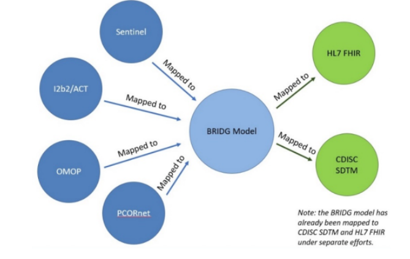

# OMOP-CDM  

### SYNTHÈSE

**Description et type de standard** :
OMOP-CDM (Observational Medical Outcomes Partnership - Common Data Model) est un modèle relationnel de données développé par la FDA (*Food and Drug Administration*) en 2008 et actuellement maintenu par OHDSI (*Observational Health Data Sciences and Informatics*). Ce schéma de données standardise la structure et la sémantique des bases de données de santé pour faciliter l’interopérabilité et l’analyse des données de santé.

**Domaines d’application** :
Le modèle OMOP-CDM est utilisé pour des études cliniques observationnelles fédérées.

**Maturité / Utilisation** :
La version la plus récente est la v6.0 (avril 2023), mais les versions v5.3 et v5.4 sont plus couramment utilisées car elles sont compatibles avec les outils OHDSI. OMOP-CDM est largement adopté à l'international, notamment en Europe (réseau EHDEN), aux États-Unis, en Corée du Sud et en Chine.

## 1.Général

### Présentation
  - **Pays d’origine** :
États-Unis

  - **Consortium d’origine** :
*Food and Drug Administration (FDA)*,  standard développé 2008[^1]

  - **Type de standard** :
Schéma de données

  - **Description** :
OMOP-CDM est un schéma de données qui facilite l'interopérabilité entre différentes bases de données de santé grâce à la standardisation de la structure et de la sémantique. Il permet une analyse simplifiée des parcours de soins des patients.

  - **Organisme en charge** :
OHDSI[^2]

 ### Application

  - **Domaine d'application en santé** :
Le modèle OMOP-CDM est utilisé études cliniques observationnelles fédérées

  - **Principaux cas d'usage** :
Dans la littérature concernant OMOP-CDM, d’après une analyse quantitative menée par Veltys en avril 2023, les articles de recherche concernent principalement les thématiques suivantes[^3] : les
médicaments ( environ 70 publications : surveillance, pharmacovigilance, évaluation des effets,...)
Épidémiologie ( environ 60 publications)
Analyse de diverses pathologies ( environ 40 publications pour par exemple : maladies rares, pulmonaires, cardio-vasculaires),dont oncologie (40 publications) et Covid-19 (35 publications), Une extension pour l’oncologie est en préparation pour la future v6.1, qui alimentera ce cas d’usage (voir l'élément *« Existence d’extensions certifiées »* dans la partie 5. Utilisation).

- **Illustration concrète exemple d’utilisation sur un cas simple** :
  - En France, la base des données hospitalières médico-administratives du SNDS (Système National des Données de Santé) est difficile à exploiter en raison de sa complexité. Dans le cadre de l’appel à projet d'EHDEN en 2020, le Health Data Hub a reçu un appui financier et un accompagnement humain pour convertir un échantillon du SNDS au format OMOP-CDM. Cet échantillon contenait les données des patients ayant reçu un diagnostic hospitalier Covid-19 entre janvier et mai 2020. L’historique des données remonte jusqu’à janvier 2019.

 - **Processus d'OMOPisation suivi par le Health Data Hub** (processus standard en deux étapes)[^4]:

   - **Mapping syntaxique :** il s’agit de **la structuration de la base initiale en tables et en variables standard OMOP-CDM**. Au cours de cette phase, des règles de mapping entre les tables et variables du SNDS sont écrites puis les scripts SQL effectuant la transformation sont développés[^5].
  
   - **Mapping sémantique :** il s’agit de **la traduction des terminologies du SNDS vers les terminologies standard OMOP-CDM**. Cette étape a été réalisée par des internes en médecine à partir de plusieurs milliers de codes de différentes nomenclatures (CCAM, NABM, CSARR, …) vers SNOMED-CT et autres terminologies standards.

- La base de données standardisée est ensuite validée en utilisant les outils open source d'OHDSI pour la vérification de la qualité des données[^6].

- Résultat :
 - **Le nombre de tables de l'échantillon a été réduit de 180 à une vingtaine**, ce qui facilite la lecture du parcours de soin.

- Le Health Data Hub travaille actuellement sur un second appel à projet d'EHDEN pour la standardisation du SNDS au format OMOP-CDM sur les données générées de 2015 à 2021.

### Données

 - **Typologie de données concernées** :
   - Données observationnelles de différentes sources : elles peuvent provenir des dossiers de santé électroniques (EHR : Electronic Health Record), des demandes de remboursement des soins (claims data), d’une enquête, etc[^7].

  - Données textuelles (pas nécessairement structurées[^8])

  - **Type de granularité** :
   - La granularité du schéma de données est celle de **l’événement clinique** (on parle de « concept » dans le modèle OMOP-CDM : diagnostic, procédure, visite, prise de médicament, etc.). Il s’agit donc de **données individuelles** (chaque ligne concerne un seul patient et un seul événement). Chaque événement clinique a un identifiant patient et une date[^9].

   - Les événements (hors table NOTE) sont représentés sur **deux niveaux** : certaines tables contenant des données cliniques contiennent les champs VISIT_OCCURRENCE_ID et VISIT_DETAIL_ID
   - **Un premier niveau VISIT_OCCURRENCE** : ce niveau décrit l'événement de contact avec le système de santé (séjour hospitalier, visite chez un praticien en ville, à domicile, ...) ;

   - **Un deuxième niveau VISIT_DETAIL** : ce niveau décrit les différents enregistrements qui ont lieu au cours d'un même événement de contact avec le système de santé

 - **Utilisation dans plusieurs langues** : Oui
   - **La table CONCEPT_SYNONYM** contient à la fois les concepts standards normalisés dans leur langue d’origine (ex : SNOMED en anglais, CCAM en français, ...) et leurs traductions dans la langue de l’utilisateur (ex : SNOMED en chinois, espagnol, ...) avec l'id du concept de langue approprié dans le champ LANGUAGE_CONCEPT_ID[^10]

  - NB : **Les noms des concepts** sont toujours en **anglais**

- **Disponibilité de la documentation d'implémentation** :
 - Documentation **officielle** : Observational Health Data Sciences and Informatics - GitHub[^11]

 - **Exemple** de documentation d'implémentation : Documentation sur l’OMOPisation du SNDS (Système National des Données de Santé)[^12]

[^1]: Plus précisément, un partenariat public-privé appelé OMOP (Observational Medical Outcomes Partnership), présidé par la FDA et financé par un consortium de sociétés pharmaceutiques a été créé en 2008. Ce partenariat a donné lieu à la conception du schéma de données OMOP-CDM (voir OMOP - Common Data Model).
[^2]:  Voir le site officiel : Standardized Data: The OMOP Common Data Model
[^3]: Il existe peu d’analyses sur les domaines d’application en santé d’OMOP-CDM. Une analyse quantitative à partir de mots-clés identifiés dans la littérature sur PubMed : PubMed a été réalisée par Veltys en avril 2023. Un article traitant de plusieurs thématiques peut être comptabilisé plusieurs fois dans notre analyse. Voir en « Annexe n°1 » la méthodologie, les requêtes utilisées et un extrait de la liste des publications obtenues en résultat.
 [^4]: Le processus est décrit ici : Transformer le SNDS au format OMOP : Contexte
   [^5]: Les scripts sont disponibles ici : Health Data Hub / BOAS - Bibliothèque Ouverte d’Algorithmes en Santé / HDH / SNDS_OMOP · GitLab
[^6]: Voir le paragraphe dédié aux outils dans la section “4. Valorisation”
[^7]: Voir la liste des concepts présents dans l’outil Athena : https://athena.ohdsi.org/search-terms/terms?domain=Type+Concept&page=1&pageSize=15&query=
[^8]: C’est le cas de la table NOTE par exemple (voir l’élément « Description technique du schéma de données » dans la partie 1. Général ci-dessous, et la Figure 1 : Liste des tables contenues dans la v5.4 d'OMOP-CDM).
   [^9]: Voir les spécifications officielles de la version 5.4 : OMOP CDM v5.4
[^10]: Voir le chapitre 5 dans The Book of OHDSI, en particulier la section 5.2.2 Concept Names qui traite de la traduction des nomenclatures : Chapter 5 Standardized Vocabularies | The Book of OHDSI  
[^11]:  Voir le GitHub officiel d’OHDSI (ohdsi - Observational Health Data Sciences and Informatics) et la documentation associée (OMOP CDM v5.3)
[^12]:  Voir la documentation sur l’OMOPisation du SNDS par le Health Data Hub : Le modèle OMOP

- **Description technique du schéma de données** :
 - OMOP-CDM est centré autour de la **table Patient** (PERSON) et contient **39 tables organisées en 6 blocs** (voir Figure 1 ci-dessous)[^12]

   

   **Figure 1 : Liste des tables contenues dans la v5.4 d'OMOP-CDM**, Source  : [OMOP Common Data Model](https://ohdsi.github.io/CommonDataModel/)

- **Liste des blocs du schéma de données** :
  - Bloc des **données cliniques standardisées (17 tables)** : contient les informations essentielles sur les événements cliniques pour chaque personne, et des informations démographiques sur la personne ;
  - Bloc des **systèmes de santé standardisés (3 tables)** : contient les caractéristiques de l’établissement de santé concerné et des professionnels de santé ;
 - Bloc des **vocabulaires standardisés (10 tables)** : contient des informations détaillées sur les concepts décrivant les événements cliniques ;
 - Bloc des **métadonnées standardisées** (2 tables) ;
 - Bloc des éléments dérivés standardisés et schémas de résultats (3 tables + 2 tables) : contient des informations sur les événements cliniques d'un patient qui ne sont pas obtenues directement à partir des données sources brutes, mais à partir d'autres tables du modèle ;
 - Bloc des **éléments dérivés standardisés et schémas de résultats (3 tables + 2 tables)** : contient des informations sur les événements cliniques d'un patient qui ne sont pas obtenues directement à partir des données sources brutes, mais à partir d'autres tables du modèle ;

 - Bloc de **l'économie de la santé standardisé (2 tables)** : contient des informations sur les coûts des soins de santé

- Extension Oncologie (voir l'élément *« Existence d'extensions certifiées »* dans la partie 5. Utilisation) dans la version v6.1

- **Niveau de généralisation (facilité de remplissage des champs du standard)** :

 - La facilité de remplissage des champs du standard dépend d'une part de **la disponibilité des données sources (1)** et d'autre part de **la facilité à réaliser le mapping syntaxique des données sources (2)**

  - (1) Sur le premier point, les tables du modèle OMOP-CDM font référence à des données que l’on peut retrouver dans les bases de données des hôpitaux, des laboratoires, des cabinets de ville (détails des visites, des médicaments prescrits, des diagnostics, des actes, des examens ...). Cependant, en pratique, plusieurs difficultés peuvent être rencontrées pour remplir ces champs :
   - Dans les établissements de santé, ces données sont rarement stockées de manière centralisée, elles sont **dispersées** dans de nombreuses tables ;
   - Selon les pratiques de l'établissement et des professionnels de santé, le niveau de **complétude** des champs ainsi que la **profondeur de l'historique** varient ;
   - Les établissements de santé ont en général une vision parcellaire du parcours de soins, qui se limite au périmètre de leur établissement, sauf en cas de chaînage de l'entrepôt de données de santé de l'établissement avec le SNDS
- (2) Sur le deuxième point, la facilité à réaliser le mapping syntaxique est difficile à évaluer de manière générale (se référer aux éléments d'évaluation de l'intensité de la perte de données au mapping de la partie 3. Technique ; cf. l’élément « Intensité de la perte de données au mapping»)

## 2.Gouvernance

### Libre accès aux schémas de données : Oui[^12]

### Modalités d'accès et distribution des solutions basées sur ce standard** :

 - Le modèle OMOP-CDM est open source publié sous la **licence Apache 2.0**[^13];
 - Les outils OHDSI compatibles avec OMOP-CDM sont **open source** sous la **licence Apache 2.0 et accessibles en ligne**[^14];
L’utilisation de chaque vocabulaire est soumise aux **conditions de sa licence** : certains vocabulaires peuvent être utilisés **gratuitement et librement** tandis que d’autres nécessitent une **licence payante** ;
   - Par exemple, pour utiliser **SNOMED-CT**, une licence est requise : la licence est gratuite dans les pays membres de SNOMED International mais payante pour les utilisateurs des pays non-membres[^15]. Cependant, depuis juin 2022, un accord entre OHDSI et SNOMED International permet aux utilisateurs d’OMOP-CDM d’utiliser SNOMED-CT dans le cadre de la création du modèle et de l’utilisation des outils associés[^16] (mais pas pour des usages en dehors du cadre d’OMOP-CDM, sauf s’ils disposent d’une licence par ailleurs).
   - Dans l'**outil Athena**, l'utilisation du moteur de recherche est libre mais le téléchargement des vocabulaires nécessite une inscription gratuite[^17]. Sur la page de téléchargement, les licences pré-requises sont listées, le cas échéant.

### Processus de prise de **décision sur le standard** :
  - Il existe **plusieurs groupes de travail** d'OHDSI sur différentes thématiques[^18] :

[^13]: Voir la licence : https://github.com/OHDSI/CommonDataModel/blob/main/LICENSE
[^14]:  Voir la licence de WhiteRabbit : license - OHDSI/WhiteRabbit 
[^15]:  Voir : Get SNOMED CT
[^16]: Voir le détail de la collaboration entre OHDSI et SNOMED International : https://www.snomed.org/news/snomed-international-and-international-health-research-network-ohdsi-collaborate?lang=fr.
[^17]:  Voir la page d’authentification qui s’affiche lorsque l’on souhaite accéder au téléchargement : Login or register to access 
[^18]:  Voir la liste des groupes de travail d’OHDSI : Workgroups Template – OHDSI

   - Schéma de données (réflexions sur le schéma, les vocabulaires, les extensions, etc.) ;
   - Nouvelles technologies (NLP, outils OHDSI, etc.) ;
   - Compatibilité avec d'autres standards (FHIR)
- Il est possible de rejoindre un groupe[^19], d’y présenter un nouveau cas d'utilisation d'OMOP-CDM, d’en solliciter l'aide pour la résolution d'un problème[^20], de poser des questions et de faire des suggestions en s’inscrivant sur le forum d’OHDSI[^21]
### Maturité du standard :
 - **Fréquence de mise à jour** :
   - Version actuelle (en avril 2023) : La **version 6.0** est sortie en octobre 2018[^22]. Il est cependant conseillé d’utiliser la **v5.3** (sortie en janvier 2018[^23]) et la **v5.4** (sortie en septembre 2021[^24]) qui sont compatibles avec les outils OHDSI
   - À noter, la version 5.4 n’est compatible qu’avec certains outils en avril 2023 (elle est supportée par CDM R package, *Data Quality Dashboard, ACHILLES, Rabbit-In-a-Hat* et *FeatureExtraction* mais pas par ARES, ATLAS, *CohortDiagnostics*[^25])

   - Le calendrier prévoit la publication de versions principales tous les ans et de versions intermédiaires tous les trimestres mais cela est aussi soumis aux besoins de la communauté[^26]
   - Une version v6.1 est *en préparation* : elle devrait contenir les champs et tables nécessaires pour l’extension oncologie

[^19]:  Voir le formulaire à remplir pour rejoindre un groupe de travail : https://forms.office.com/Pages/ResponsePage.aspx?id=lAAPoyCRq0q6TOVQkCOy1ZyG6Ud_r2tKuS0HcGnqiQZUOVJFUzBFWE1aSVlLN0ozR01MUVQ4T0RGNyQlQCN0PWcu&wdLOR=c6BE271AA-FD1E-4D54-9520-B12409DE247E

[^20]: Voir le GitHub officiel d’OMOP-CDM : OMOP Common Data Model
[^21]: Voir la liste des forums d’OHDSI : OHDSI Forums
[^22]: Voir la publication du forum OHDSI : CDM v6.0 Release - General - OHDSI Forums
[^23]:  Voir : https://github.com/OHDSI/CommonDataModel/releases/tag/v5.3.0
[^24]: Voir : https://github.com/OHDSI/CommonDataModel/releases/tag/v5.4.0

[^25]: Voir la liste des outils qui supportent la v5.4 : OMOP CDM v5.4. OHDSI fait la distinction entre le legacy support (c’est-à-dire les outils qui supportent la version précédente, v5.3) et le feature support (c’est-à-dire les outils qui supportent les nouveaux champs de la v5.4). Dans certains cas, les pages GitHub des outils concernés sont plus à jour que la page OHDSI, c’est le cas du DataQualityDashboard et d’Achilles, qui supportent tous les deux la v5.4 d’après leurs pages respectives :  https://github.com/OHDSI/DataQualityDashboard, GitHub - OHDSI/Achilles: Automated Characterization of Health Information at Large-scale Longitudinal Evidence Systems (ACHILLES) - descriptive statistics about a OMOP CDM database  

### Existence de financements pour standardisation :
  - **EHDEN** dispose d'un **fond pour soutenir les efforts de standardisation et de normalisation** des données à travers l'Europe[^27]. Il y a eu 3 types d'appels à projets :
   - Covid : appel à projet pour permettre aux organisations détenant des données de patients atteints du Covid de bénéficier d'une aide pour les convertir vers un format standardisé[^28]
   - **PME** : appel à projet pour que les PME puissent demander une formation et une certification pour convertir les données de santé au modèle OMOP-CDM<[^29] (voir la liste des PME ayant reçu la certification dans l'élément *« Fournisseurs de service ayant l'expertise en France »* en partie 4. Valorisation).
   - **Normal** : appel à projet pour les institutions détenant des données de santé pour qu'elles bénéficient d'un financement de départ pour des conversions vers OMOP-CDM[^29]
 - Le premier appel à projet de financement a eu lieu en septembre 2019[^30]. Toutefois, ces derniers **sont terminés depuis octobre 2022**. Depuis, EHDEN est devenue une **entité à but non lucratif**.

[^26]: Les nouvelles versions contiennent les suggestions, remarques et souhaits des utilisateurs et membres envoyés via leur page de signalement de problèmes.
[^27]:  Voir le site d’EHDEN dédié : Harmonisation Fund – ehden.eu
[^28]: Voir les détails ici : Got COVID-19 patient data? Want to collaborate? IMI’s EHDEN project can help you standardise it.
[^29]:  Voir les détails ici : Small and Medium-sized Enterprise Certification Open Call Description
[^30]:  Voir les détails ici : Data Partner Pilot Call Description | Ehden.eu

## 3.Technique

 ### Capacité de traduction vers un autre standard (intra types de standards) :
  - Le projet Common Data Model Harmonization (CDMH)[^31] vise à **harmoniser les 4 schémas de données suivants : PCORnet, OMOP-CDM, i2b2 et Sentinel**.
    - **L'objectif est d'avoir un outil d'accès unifié à ces données permettant aux chercheurs d'accéder à un réseau plus large de patients et à des données variées** (EHR, demandes de remboursement, données issues des essais cliniques, ...)
    - Le projet consiste à **mapper chacun de ces schémas de données (OMOP-CDM compris, v5.1) vers le modèle intermédiaire BRIDG v3.2**[^32] (voir Figure 2 ci-dessous). Ce modèle a été choisi comme modèle intermédiaire car il a été mappé dans une première étape à HL7 FHIR et CDISC SDTM

  [^31]: Voir la page HL7 décrivant le projet : HL7.FHIR.US.CDMH\IG Home Page et le rapport final « Common Data Model Harmonization (CDMH) and Open Standards for Evidence Generation », U.S Food & Drug Administration, NIH, The Office of the National Coordinator for Health Information Technology, 2020
  [^32]: Voir la page d’implémentation : Reference Implementations | Biomedical Research Integrated Domain Group

       

   **Figure 2 : Procédure de mapping**, Source : [Common Data Model Harmonization (CDMH) and Open Standards for Evidence Generation
](https://aspe.hhs.gov/sites/default/files/private/pdf/259016/CDMH-Final-Report-14August2020.pdf)

  

   

- Il existe un processus de transformation depuis i2b2 vers OMOP-CDM par les scripts SQL développés dans le cadre du projet ARCH-OMOP[^33,34] .

### Communication avec d'autres standards (inter typologies de standards) :
  - **Communication entre OMOP-CDM et FHIR** : il existe deux processus, OMOP-CDM vers FHIR (OMOPonFHIR) et FHIR vers OMOP-CDM (FHIR to OMOP)[^35] :
   - OMOPonFHIR permet de récupérer les données stockées dans OMOP-CDM sous la forme de ressources FHIR ;
   - FHIR to OMOP permet de transformer les données individuelles des patients pour être compatibles avec OMOP-CDM. FHIR to OMOP est utilisé par exemple pour l’échange de données d’oncologie pour des études.

   
- **Communication entre OMOP-CDM et CDA** : plusieurs articles ont développé des correspondances entre OMOP-CDM et CDA.
  - Ji et al. (2020)[^36]  ont converti des documents CDA utilisés pour renvoyer des patients vers un autre professionnel de santé (« referral CDA documents ») au standard OMOP-CDM. Leur étude utilise des documents CDA stockés depuis 10 ans dans un hôpital de Corée du Sud.
   - Les correspondances entre les éléments des documents CDA contenus dans l’en-tête et dans le corps du document [^37] vers la structure d’OMOP-CDM sont établies : 9 tables OMOP-CDM ont pu être complétées avec les éléments des documents CDA.
   - Le mapping entre les vocabulaires CDA vers les vocabulaires standardisés d’OMOP-CDM a été effectué : les données ont pu être mappées à 98,6 % pour l’état de santé, 68,8 % pour les médicaments, 35,7 % pour les mesures, 100 % pour les observations et 56,4 % pour les procédures.
   - Les taux relativement faibles observés pour les mesures, les procédures et les médicaments s’expliquent par la faible qualité des données initiales dans les documents CDA ainsi que par l’utilisation de vocabulaires locaux.
 - Abedtash et Duke ont démontré dans une série d’études[^38] la faisabilité et la bonne performance de la conversion de documents CCD basés sur C-CDA vers OMOP-CDM.

 ### Flexibilité dans les choix des terminologies :
  - OMOP-CDM supporte **55 vocabulaires**[^39] pour lesquels le mapping vers les vocabulaires standards utilisés par OMOP-CDM est déjà mis en place par OHDSI et disponible en téléchargement dans l'outil Athena[^40].
  - Les **principaux vocabulaires** standards utilisés par OMOP-CDM sont les suivants :
    - LOINC (Logical Observation Identifiers Names & Codes) : identifie les résultats des tests de laboratoire et des tests cliniques
    - RxNorm : fournit des noms normalisés pour les médicaments cliniques (principalement des médicaments utilisés au Etats-Unis)
    - RxNorm Extension : extension de RxNorm pour les médicaments utilisés hors Etats-Unis
    - SNOMED-CT (Systematized Nomenclature of Medicine Clinical Terms) : identifie des diagnostics, des procédures, des symptômes, des historiques familiaux...

[^33]: Voir l’article de Klann JG, Joss MAH, Embree K, Murphy SN (2019) « Data model harmonization for the All Of Us Research Program: Transforming i2b2 data into the OMOP common data model ». PLoS ONE (2019) : Data model harmonization for the All Of Us Research Program: Transforming i2b2 data into the OMOP common data model | PLOS ONE
[^34]:  Voir le GitHub : GitHub - i2b2-omop/i2o-transform: PCORnet Ontology to OMOP - beta!
[^35]: Voir la page internet : OMOPonFHIR
[^36]: Voir l’article de Ji H, Kim S, Yi S, Hwang H, Kim JW, Yoo S. « Converting clinical document architecture documents to the common data model for incorporating health information exchange data in observational health studies: CDA to CDM ». J Biomed Inform. 2020 Jul : Converting clinical document architecture documents to the common data model for incorporating health information exchange data in observational health studies: CDA to CDM
[^37]: À savoir les caractéristiques du patient et de la visite d’une part ; le diagnostic, les médicaments administrés, les résultats de tests et la raison pour laquelle le professionnel de santé a envoyé ce patient vers un autre professionnel d’autre part. 
[^38]: Voir : H. Abedtash, J.D. Duke, « CCD2OMOP: An Interoperable Extract-Transform-Load Package to Support the Implementation of OHDSI Software Tools Across Non-OMOP- based Electronic Health Records », OHDSI Symp., 2016. (Converting clinical document architecture documents to the common data model for incorporating health information exchange data in observational health studies: CDA to CDM - ScienceDirect), H. Abedtash, « An interoperable electronic medical record-based platform for personalized predictive analytics », 2017. (https://www.proquest.com/openview/12559a6b4b653b4a5f0a9c6dee43009c/1?pq-origsite=gscholar&cbl=18750)
[^39]: Voir la FAQ OHDSI : OMOP CDM Frequently Asked Questions
[^40]:  Voir l’outil Athena : https://athena.ohdsi.org/search-terms/terms?invalidReason=Valid&standardConcept=Standard&page=1&pageSize=15&query=

### Flexibilité du standard, personnalisation :
Il n'y a **pas de possibilité** de personnaliser le standard (par exemple, d'ajouter un domaine ou de nouvelles tables ou variables).

### Performance :
  - Performance jugée rapide avec **1 requête imbriquée et entre 2 et 5 jointures de tables pour chaque requête**[^41]
  - Il a été reporté dans une analyse de réplication que le temps de programmation dans OMOP-CDM pouvait être jusqu'à 80 % plus rapide qu'avec les données brutes[^42]

### Complexité du modèle :
  - Le schéma OMOP-CDM est bien normalisé avec un schéma similaire à un schéma en étoile donc il y a peu de redondance.
  - Le modèle complet, déployé à partir du GitHub du projet OMOP-CDM, comprend 39 tables et 176 relations, 432 champs[^43]
  - 38 tables ont 121 relations vers la table CONCEPT

### Contraintes d'implémentation :
Aucune contrainte d’implémentation mais il est **recommandé** de disposer d’un **SGBDR** (Système de Gestion de Base de Données Relationnelles) pour utiliser les outils OHDSI.

### Technologie de stockage et traitement de données et niveau d'adoption de la technologie :
 Aucune technologie de stockage spécifique n’est requise. Comme indiqué précédemment, il est cependant recommandé d’utiliser un SGBD pour utiliser les outils OHDSI.

- **Type de technologie de requêtage** :
   - Aucune technologie de requêtage n’est requise
   - Il existe une REST API développée par OHDSI (OHDSI WebApi[^44]) : elle n'est pas contenue par défaut dans OMOP-CDM mais peut être téléchargée en supplément. Elle permet de faire des requêtes sur le schéma de données.

- **Neutralité technologique** : Oui, sauf si l’utilisateur veut utiliser les outils OHDSI
  - Le standard OMOP-CDM n’impose aucune technologie, mais les outils développés par OHDSI pour OMOP-CDM nécessitent d'utiliser :
   - Le langage SQL : *Data Quality Dashboard*, FeatureExtraction, ATLAS, etc.
   - Le langage de programmation R : HADES packages (FeatureExtraction, CohortDiagnostics, etc), ACHILLES.
   - Le JRE (environnement d'exécution Java) : WhiteRabbit, WebAPI, Athena, Usagi, etc.
 - L’utilisation d’un SGBD est recommandée

- **Sécurité des outils d'exploitation** (y compris la compatibilité HDS) :

- **Intensité de la perte de données au mapping** :
   - La perte de données peut être évaluée sur deux niveaux : sémantique et syntaxique.
   - Aucune revue de littérature n’existe à date permettant d’évaluer l’intensité de la perte de manière générale.

  - Dans les trois exemples ci-dessous, l'intensité de la perte de données est plus forte pour le mapping sémantique que pour le mapping syntaxique en raison des spécificités des terminologies sources utilisées (en termes de précision, de qualité de la donnée initiale, …). Cependant, cette conclusion n’est pas généralisable car elle dépend fortement des données initiales utilisées.
  - Les paragraphes ci-dessous synthétisent les principaux résultats tirés de ces trois exemples :
   - Lamer et al. (2020) ont analysé la transformation des données françaises issues du SNDS (Système National des Données de Santé) vers OMOP-CDM. Ils ont travaillé sur une extraction du SNDS[^46]. Les résultats suivants sont obtenus pour le mapping :
     - [Mapping sémantique]  
       - 12 vocabulaires sources n’ont pas pu être mappés mais ils sont conservés dans le champ SOURCE_CONCEPT_ID de la table SOURCE_TO_CONCEPT_MAP

      - Pour les autres vocabulaires sources, le pourcentage de codes mappés est présenté dans le Tableau 1 ci-dessous

**Tableau 1 : Pourcentage de codes mappés selon la terminologie source**

| Terminologie source | Pourcentage de codes mappés |
|--------------|---------------------------------|
| UCD (Unité Commune de Dispensation) vers RxNorm |100 %|
| CIP13 (Code Identifiant de Présentation) vers RxNorm    |95,62 %[^47]                         |
| CIM-10 vers ICD-10[^48]   | 99,94 %[^49]               |

  - [Mapping syntaxique] Les données extraites du SNDS ont été mappées à une partie des tables d’OMOP-CDM (uniquement les tables qui concernent les données collectées). Cependant, compte tenu de certaines imprécisions dans les données sources du SNDS, les modifications suivantes ont été appliquées :
      - Exclusion des données de 109 paires de jumeaux, car le SNDS ne permet pas de distinguer les jumeaux à partir de l’identifiant uniquement
       - Imputation de valeurs par défaut pour le jour d’hospitalisation lorsqu’il est manquant (par défaut, le premier jour du mois est choisi)

- Voss EA et al. (2015) ont analysé la faisabilité et l'utilité de l'application d'OMOP-CDM à 6 bases de données issues de différents établissements de santé aux États-Unis[^50] :
  - [Mapping sémantique] Pour chacune des terminologies, le pourcentage de codes des terminologies sources mappés vers les vocabulaires standardisés est indiqué dans le Tableau 2 ci-dessous.

[^41]: Voir l’article de Garza M, Del Fiol G, Tenenbaum J, Walden A, Zozus MN. « Evaluating common data models for use with a longitudinal community registry ». J Biomed Inform (2016) : Evaluating common data models for use with a longitudinal community registry
[^42]: Voir l’article de Biedermann, P., Ong, R., Davydov, A. et al. « Standardizing registry data to the OMOP Common Data Model: experience from three pulmonary hypertension databases ». BMC Med Res Methodol (2021) : https://doi.org/10.1186/s12874-021-01434-3
[^43]: Les tables, relations et champs ont été comptés à partir des fichiers ddl présents dans le GitHub OMOP-CDM : https://github.com/OHDSI/CommonDataModel/tree/v5.4.0/inst
[^44]: Voir le GitHub : GitHub - OHDSI/WebAPI: OHDSI WebAPI contains all OHDSI services that can be called from OHDSI applications
[^45]: Voir l’article d’Antoine Lamer, Nicolas Depas, Matthieu Doutreligne, Adrien Parrot, David Verloop, Marguerite-Marie Defebvre, Grégoire Ficheur, Emmanuel Chazard, Jean-Baptiste Beuscart, « Transforming French Electronic Health Records into the Observational Medical Outcome Partnership's Common Data Model: A Feasibility Study » (2020) : Transforming French Electronic Health Records into the Observational Medical Outcome Partnership's Common Data Model: A Feasibility Study
[^46]: Les critères de l’extraction sont les suivants : données de 2014 à 2017 pour les patients résidant dans le Valenciennois-Quercitain de 75 ans et plus au 1er janvier 2014. Les données extraites concernent : les caractéristiques des patients, les données sur les séjours en ambulatoire, sur les séjours d’hospitalisation complète et sur les séjours en unité psychiatrique (issues du PMSI) ainsi que les consommations de soins de ville et de médicaments (issues du SNIIRAM).
[^47]:  Certains codes CIP13 n’ont pas pu être mappés car ils contenaient des informations sur les formulations de médicaments et niveaux de dosage non contenus dans la terminologie intermédiaire utilisée dans le mapping.
[^48]: Il s’agit d’un mapping de la version française vers la version internationale.
[^49]:  Dont 85,15 % de mapping exact et 14,79 % incluant une perte partielle. La perte d’information est due au fait que la CIM-10 est plus précise dans certains cas que la ICD-10. 
[^50]:  Voir l’article de Voss EA, Makadia R, Matcho A, et al. « Feasibility and utility of applications of the common data model to multiple, disparate observational health databases ». Journal of the American Medical Informatics Association (2015) : http://europepmc.org/article/MED/25670757

    
 **Tableau 2 : Pourcentage de codes mappés selon la terminologie source**

| Terminologies | Pourcentage de codes mappés    |
|--------------|---------------------------------|
| ICD9s | 29 % à 96,9 %[^51]             |
| READ[^52]    | 98,2 %                  |
| Standard Charge Code   | 86,6 %[^53]                |
| NDCs (National Drug Code)  | 69,4 % à 83,2 %|
| Multilex, Immunizations       | 38,9 %         |

- Vaclav Papez et al. (2021) ont présenté la transformation des données de 3 EHRs au Royaume-Uni pour les cas d’insuffisance cardiaque[^54]. Les résultats suivants sont obtenus :
  - [Mapping sémantique] Pour chacune des terminologies, le pourcentage de codes des terminologies sources mappés vers les vocabulaires standardisés est indiqué dans le Tableau 3 ci-dessous.

 **Tableau 3 :  Pourcentage de codes mappés selon la terminologie source**

| Terminologies | Pourcentage de codes mappés    |
|--------------|---------------------------------|
| READ | 82,13 %             |
|ICD-9   | 99,98 %                 |
| OPCS-4 (OPCS Classification of Interventions and Procedures version)   | 99,01 %               |
| Médicaments  | 60,09 %|
| Unités      | 45,29 %       |
|  Résultats laboratoires            |  51,35 %             |
|      Tests de laboratoire        |      97,22 %         |  

_Source : [Documentation i2b2](https://community.i2b2.org/wiki/display/BUN/i2b2+Common+Data+Model+Documentation)_

  - [Mapping syntaxique] Pourcentage d'évènements mappés au total : entre 97,4 % et 100 % (groupement par type d’évènement qui n’est pas présenté dans l’article)

- L’article de Ji et al. (2020)[^35] présenté précédemment montre également qu’un taux de réussite relativement faible peut être observé lors du mapping sémantique si les données initiales sont de mauvaise qualité ou qu’elles utilisent des vocabulaires locaux spécifiques.

- **Compétences techniques et métier nécessaires pour utiliser le standard** :
  - Compétences médicales pour les alignements de terminologies s’il est nécessaire d’aligner les terminologies
  - Connaissances approfondies des données sources et du format OMOP-CDM
  - Compétences IT :
     - Pour standardiser la base de données :
         - Data Engineers : pour le développement des pipelines ETL
         - Database Administrators : pour la gestion et maintenance des SGBDRs le cas échéant
     - Pour utiliser les outils OHDSI :
         - Data Engineers : maîtrisant Java, R, Docker

## 4.Valorisation
 ### Accessibilité à des ressources de formation :
  - GitHub d’OHDSI[^10]
  - EHDEN Academy[^56]
  - Vidéos YouTube sur la chaîne d’OHDSI de conférence sur OMOP-CDM en général[^57]
  - Cours en ligne Coursera *Clinical Data Models and Data Quality Assessments*[^58]

### Disponibilité de la documentation scientifique démontrant l'intérêt :
  - En avril 2023, environ 240 articles traitant d’OMOP-CDM **entre 2010 et 2023 sont disponibles sur PubMed**[^59]. La plupart concernent des cas d'implémentation d'OMOP-CDM.
  - L'article suivant propose une méthodologie d'évaluation des schémas de données, appliquée à OMOP-CDM :
   - Garza et al. (2016)[^40] comparent l'efficacité d'OMOP-CDM (v5.0) par rapport à celle de 3 autres schémas de données (Sentinel v5.0, PCORnet v3.0 et CDISC SDTM v1.4) dans le cas du partage de données longitudinales issues d'EHR ;  
     - L'évaluation est réalisée sur la base de 11 critères classés dans 6 catégories (complétude, intégrité, flexibilité, simplicité, intégration et implémentabilité)
     - Il ressort de cette analyse qu'**OMOP-CDM est le schéma de données qui satisfait le plus grand nombre de critères pour ce cas d'usage**. Par conséquent, dans le cas d'études basées sur des données longitudinales issues d'*EHR*, OMOP-CDM est le schéma de données le plus adapté d'après cette méthodologie.

[^51]: La différence dans le pourcentage de termes mappés s’explique par un nombre élevé de codes incorrects dans l’une des 6 bases de données.
[^52]: Les codes READ sont un système de terminologie clinique qui a été largement utilisé en médecine générale au Royaume-Uni jusqu'en 2018.
[^53]: Les codes de médicaments n’ayant pas été mappés (depuis les terminologies suivantes : Standard Charge Code, NDC, Multilex, Immunzations) se réfèrent à des dispositifs médicaux et/ou des produits en vente libre.
[^54]: Voir l’article de Vaclav Papez, Maxim Moinat, Stefan Payralbe, Folkert W Asselbergs, R Thomas Lumbers, Harry Hemingway, Richard Dobson, Spiros Denaxas, « Transforming and evaluating electronic health record disease phenotyping algorithms using the OMOP common data model: a case study in heart failure », JAMIA Open (2021) : Transforming and evaluating electronic health record disease phenotyping algorithms using the OMOP common data model: a case study in heart failure | JAMIA Open | Oxford Academic
[^55]: Voir la liste des SGBDRs dans le GitHub : https://github.com/OHDSI/CommonDataModel/tree/v5.4.0/inst/ddl/5.4 
[^56]: Voir la page internet : EHDEN Academy 
[^57]:  Voir la page YouTube : OHDSI - YouTube 
[^58]:  Voir syllabus Coursera : Clinical Data Models and Data Quality Assessments Course by University of Colorado System | Coursera 
[^59]:  Voir en « Annexe n°1 » et suivantes la requête PubMed et la liste des publications obtenues en résultat.

 ### Adoption du standard :
  - Adoptions officielles :
   - En France :
     - Lauréats EHDEN[^60] : CHU Bordeaux, Bordeaux PharmacoEpi, AP-HP, Cegedim, Health Data Hub, CHU de Montpellier, CHU de Toulouse, CHU de Lille, AP-HM
 - En Allemagne :
     - Medical Informatics Initiative (MII)[^61], lancé par le Ministère fédéral allemand de l'Éducation et de la Recherche
     - Projet pilote de déploiement d’OMOP-CDM dans 8 hôpitaux universitaires allemands [^62] du consortium MIRACUM [^63]

 - Utilisation sur le marché :
  - En Europe :
     - Des consortiums européens travaillent avec OMOP-CDM parmi lesquels[^64] :

      -  **EHDEN**[^59] : réseau constitué de partenaires (ou « Data partners », voir la répartition sur la Carte 1) qui implémentent OMOP-CDM dans 29 pays[^65] ;
    - **PIONEER** : réseau européen de 32 partenaires dans 9 pays qui développe une plateforme de Big Data sur le cancer de la prostate (les données sont harmonisées au schéma OMOP-CDM[^67] ;
   - **MIRACUM** (*Medical Informatics in Research and Care in University Medicine*)[^62] : un des 4 consortiums fondés par le Ministère fédéral allemand de l'Éducation et de la Recherche (dans le cadre de la *Medical Informatics Initiative*) afin de développer des centres d'intégration de la donnée (« data integration centers ») dans les hôpitaux universitaires allemands.

[^60]: Voir :  EHDEN
[^61]: Voir la revue sur l’utilisation d’OMOP de Reinecke I, Zoch M, Reich C, Sedlmayr M, Bathelt F. « The Usage of OHDSI OMOP - A Scoping Review ». Stud Health Technol Inform : IOS Press Ebooks - The Usage of OHDSI OMOP – A Scoping Review 
[^62]: Voir l’article de Maier C, Lang L, Storf H, Vormstein P, Bieber R, Bernarding J, Herrmann T, Haverkamp C, Horki P, Laufer J, Berger F, Höning G, Fritsch HW, Schüttler J, Ganslandt T, Prokosch HU, Sedlmayr M. « Towards Implementation of OMOP in a German University Hospital Consortium ». Appl Clin Inform (2018) : Towards Implementation of OMOP in a German University Hospital Consortium
[^63]: Voir : https://www.miracum.org/#
[^64]:  Voir la carte et la liste de l’ensemble des consortiums européens utilisant OMOP-CDM : National Nodes in the OHDSI Europe Chapter.
[^65]:  Espagne, Italie, Royaume-Uni, Belgique, Portugal, Allemagne, Pays-Bas, France, Finlande, Croatie, Hongrie, Grèce, Serbie, Turquie, Suède, Suisse, République Tchèque, Israël, Norvège, Danemark, Bulgarie, Ukraine, Monténégro, Luxembourg, Irlande, Estonie, Géorgie, Bosnie Herzégovine, Autriche, voir la source : Data Partners – ehden.eu
[^66]:  Le projet a été lancé en 2018 pour une durée de 5 ans et son financement est assuré principalement par la IMI (Innovative Medicines Initative).
[^67]: Voir la page internet : Big Data Platform - PIONEER - European Network of Excellence for Big Data in Prostate Cancer 

       

   **Carte 1 : Liste des pays du réseau EHDEN et nombre de partenaires données (Data partners) associés en 2020**, Source : [Data Partners – ehden.eu](https://www.ehden.eu/datapartners/)

  

   - Hors Europe : États-Unis41, Corée du Sud et Singapour[^68], Chine[^60]

  ### Fournisseurs de service ayant l'expertise en France :
   - Les PME certifiées par EHDEN qui accompagnent la transition vers OMOP-CDM[^69] : Arkhn, Easter-eggs, Med'Art, Oncodesign, Owkin, Quinten
   - Cegedim[^70]
   - Bordeaux PharmacoEpi[^71]

### Qualité des données :
**Existence d’un label de qualité : pas de label de qualité** pour une base de données standardisée

Outils de vérification de la qualité des données :
** *Data Quality Dashboard* **  (outil OHDSI)[^72] : outil open source ayant pour but d’évaluer la qualité des données d’observation. Il y a deux principales sorties :
Un tableau synthétique affichant sur 4 axes (Plausibilité, Conformité, Complétude et Total) un pourcentage de lignes vérifiant ces critères, ce qui permet d’évaluer la qualité globale des données (voir Tableau 4 ci-dessous).
Un tableau détaillant les tests de qualité effectués pour les différents axes mentionnés (voir Tableau 5 ci-dessous). Ce tableau contient les résultats des tests et la requête SQL permettant de reproduire le test.

**Tableau 4 :  Premier exemple de sortie du Data Quality Dashboard**

|                | Verification            |                | Validation             |                | Total                 |                |
|----------------|-------------------------|----------------|------------------------|----------------|-----------------------|----------------|
|                | Pass  | Fail  | Total | % Pass | Pass | Fail | Total | % Pass | Pass  | Fail | Total | % Pass |
|----------------|-------|-------|-------|--------|------|------|-------|--------|-------|------|-------|--------|
| **Plausibility**| 159   | 21    | 180   | 88%    | 283  | 0    | 283   | 100%   | 442   | 21   | 463   | 95%    |
| **Conformance** | 637   | 34    | 671   | 95%    | 104  | 0    | 104   | 100%   | 741   | 34   | 775   | 96%    |
| **Completeness**| 369   | 17    | 386   | 96%    | 5    | 10   | 15    | 33%    | 374   | 27   | 401   | 93%    |
| **Total**       | 1165  | 72    | 1237  | 94%    | 392  | 10   | 402   | 98%    | 1557  | 82   | 1639  | **95%**|

_Source : [OHDSI - Data Quality Dashboard
](https://data.ohdsi.org/DataQualityDashboard/)_

       

   **Tableau 5 : Deuxième exemple de sortie du Data Quality Dashboard**, Source : [Data Data Quality Dashboard](https://data.ohdsi.org/DataQualityDashboard/)

  

  - **ACHILLES**[^73] (outil OHDSI) est un package R qui produit des statistiques descriptives permettant de caractériser la base de données OMOP-CDM (voir Figure 3).

       

  **Figure 3 : Exemple de sortie d’ACHILLES**, Source : [Software Tools – OHDSI](https://www.ohdsi.org/software-tools/)

  

  

  - **CDMInspection**[^74] est un package R qui reprend une partie des résultats des tests issus d'ACHILLES et du Data Quality Dashboard. Il permet de générer un rapport PDF sur la qualité des données qui peut ensuite être partagé.

  [^68]:  Voir l’article de Tan HX, Teo DCH, Lee D, Kim C, Neo JW, Sung C, Chahed H, Ang PS, Tan DSY, Park RW, Dorajoo SR. « Applying the OMOP Common Data Model to Facilitate Benefit-Risk Assessments of Medicinal Products Using Real-World Data from Singapore and South Korea ». Healthc Inform Res : Applying the OMOP Common Data Model to Facilitate Benefit-Risk Assessments of Medicinal Products Using Real-World Data from Singapore and South Korea
  [^69]: Voir la liste complète de toutes les PME certifiées EHDEN en Europe : Business Directory – ehden.eu
  [^70]: Cegedim a OMOPisé la base de données de santé en vie réelle THIN (qui contient des données européennes issues d’EHR) : THIN® : The Health Improvement Network - Cegedim Health Data
  [^71]: Voir la description des travaux sur le BPE Data Model : https://www.bordeauxpharmacoepi.eu/expertise/#capacites-tech
 [^72]:  Voir l’outil Data Quality Dashboard (DQD) : OHDSI - Data Quality Dashboard
 [^73]:  Voir GitHub : GitHub - OHDSI/Achilles: Automated Characterization of Health Information at Large-scale Longitudinal Evidence Systems (ACHILLES) - descriptive statistics about a OMOP CDM database
[^74]: Voir GitHub : GitHub - EHDEN/CdmInspection: R Package to support quality control inspection of an OMOP-CDM instance

## 5.Utilisation
 ### Simplicité d'usage :
  - La simplicité d'usage peut être définie à partir de plusieurs critères.
  - Parmi ces critères, le temps de prise en main est un indicateur important :
     - Garza et al. (2016)[^40] ont évalué 4 schémas de données (Sentinel, PCORnet, OMOP-CDM et CDISC SDTM) à partir de 11 critères. Parmi ces critères figure le temps de formation (« training time ») : il est jugé globalement faible pour ces 4 schémas de données, mais plus élevé pour OMOP-CDM et CDISC SDTM que pour Sentinel et PCORnet[^75].

### Existence d'une communauté en ligne et degré d'activité :
   - Groupes de travail [^17]
   - Forum OHDSI[^20]

### Outils de mapping :
   - **Mapping sémantique : Usagi**[^76,77], (outil OHDSI) fait des suggestions de mapping basées sur la similarité textuelle entre les libellés des codes sources et ceux des codes standards

- Outils compatibles :
  - Outils développés par OHDSI :
    - **WhiteRabbit [^78] effectue un scan des données sources** et génère un rapport d’informations sur les tables, les variables et leur contenu (noms des tables et variables, type, nombre de lignes, exhaustivité, etc.) ;
    - **Rabbit-In-a-Hat**[^79] permet à l'utilisateur de connecter visuellement les données sources aux tables et colonnes du schéma de données par le biais d'une interface graphique. Il met en forme ces connexions sous forme de tableaux et schémas dans un document Word ;
   - **Athena**[^39] est une ressource qui permet de rechercher et de charger des vocabulaires normalisés ;
   - **HADES**[^80] est une collection de paquets R open source offrant des fonctions qui peuvent être utilisées ensemble pour réaliser une étude d'observation complète, à partir de données dans OMOP-CDM, et aboutir à des estimations et des statistiques, des graphiques et des tableaux. Il contient les package suivants :
     - ***FeatureExtraction*** [^81] pour générer des caractéristiques pour une cohorte générée à l’aide d’OMOP-CDM
     - ***CohortDiagnostics***[^82] pour évaluer les phénotypes de cohortes

   - ***CDM R package***[^83] qui permet de créer dynamiquement la documentation d’OMOP-CDM et les scripts DDL pour instancier le modèle
   - **ARES**[^84] créé pour afficher les résultats provenant d’ACHILLES et Data Quality Dashboard pour supporter les recherches sur la qualité et la caractérisation des données
 - Possibilité d’utiliser l’API i2b2 avec l’ontologie ACT-OMOP pour interroger les tables OMOP-CDM dès mars 2023[^85]

[^75]: L’article qualifie le temps de prise en main de la manière suivante pour les 4 schémas de données : « Little » (pour Sentinel et PCORnet) et « Some » (OMOP-CDM et CDISC SDTM).
[^76]:  Voir le GitHub : GitHub - OHDSI/Usagi: Usagi is an application to help create mappings between coding systems and the Vocabulary standard concepts.
[^77]:  Voir Usagi : Usagi 
[^78]:  Voir le GitHub : GitHub - OHDSI/WhiteRabbit: WhiteRabbit is a small application that can be used to analyse the structure and contents of a database as preparation for designing an ETL. It comes with RabbitInAHat, an application for interactive design of an ETL to the OMOP Common Data Model with the help of the the scan report generated by White Rabbit.
[^79]: Voir Rabbit-In-a-Hat : Rabbit in a Hat
[^80]: Voir GitHub : GitHub - OHDSI/Hades: Health Analytics Data-to-Evidence Suite (HADES): A collection of R packages for performing analytics against the Common Data Model.
[^81]: Voir GitHub : GitHub - OHDSI/FeatureExtraction: An R package for generating features (covariates) for a cohort using data in the Common Data Model.
[^82]: Voir le GitHub dédié à CohortDiagnostics : GitHub - OHDSI/CohortDiagnostics: An R package for performing various cohort diagnostics.
[^83]:  Voir le GitHub dédié au package CDM : GitHub - OHDSI/CommonDataModel: Definition and DDLs for the OMOP Common Data Model (CDM)
[^84]: Voir le GitHub dédié à ARES : GitHub - OHDSI/Ares: A Research Exploration System
[^85]:  Voir : https://community.i2b2.org/wiki/display/getstarted/%5BDRAFT%5D+OMOP#:~:text=Utilizing%20i2b2%27s%20reusable%20application%20programming%20interface%20%28API%29%20to,to%20query%20OMOP%20tables%20using%20the%20i2b2%20interface.

### Décrire les étapes nécessaires pour la standardisation :
  - Pour standardiser une base de données au format OMOP-CDM (« OMOPiser »), il faut créer un processus ETL (Extract Transform Load) automatisable qui puisse être exécuté à chaque mise à jour des données source[^86]

 - **Processus standard d'OMOPisation** (ETL) :
   1. ***Conception du mapping syntaxique*** : deux outils ont été développés par OHDSI pour aider l’utilisateur à réaliser cette étape :
     **a.**  **WhiteRabbit**[^77] produit un rapport d’analyse des données sources qui contient toutes les informations nécessaires pour construire l'ETL (sur les tables, les champs, les valeurs). Ce rapport servira de référence pour la conception de l’ETL, en conjonction avec l’outil Rabbit-In-a-Hat ;  

      **b.** **Rabbit-In-a-Hat**[^78] reprend les résultats de WhiteRabbit et les affiche dans une interface graphique où l’utilisateur peut réaliser des connexions (flèches) entre les variables et tables sources et et les tables d’OMOP-CDM. L’outil génère ensuite une documentation de l’ETL à partir des connexions ainsi établies
   2.***Conception du mapping sémantique*** : lorsque  les vocabulaires utilisés dans les données sources ont déjà été mappés vers des vocabulaires standards autorisés dans OMOP-CDM, les mappings correspondants se trouvent déjà dans les tables de vocabulaires téléchargeables sur le portail ATHENA. Dans le cas contraire, le mapping doit être créé entre les vocabulaires sources et
   les vocabulaires standards. L’outil Usagi permet de faciliter cette tâche :

     **a**.**Usagi**[^75] génère des propositions de mapping basées sur la similarité textuelle entre les libellés des codes sources et ceux des codes standards

   3.**Implémentation de l’ETL** : OHDSI ne fait pas de recommandation sur l’implémentation optimale car elle dépend de l’infrastructure, la taille des données, la complexité de l’ETL et l’expertise technique disponible. À titre d’exemple, certains groupes l’ont implémenté en SQL, SAS, C#, Java, Kettle, etc [^87].

   4.**Contrôle qualité** : La qualité est contrôlée de manière itérative en réalisant des tests puis des corrections tant que cela est nécessaire.

     **a.** Les tests suivants peuvent par exemple être réalisés : revue du document décrivant le design de l’ETL, du code et des *mappings*, comparer manuellement les données sources et finales sur un échantillon, répliquer une étude déjà réalisée sur les données sources à partir des données issues de l’ETL, etc.
     
     **b.** La qualité du mapping peut également être évaluée avec les outils OHDSI (ACHILLES[^72], *Data Quality Dashboard*)

La Figure 4 ci-dessous illustre les étapes décrites précédemment en spécifiant les outils OHDSI qui peuvent être utilisés pour chaque étape :

       

   **Figure 4 : Schéma du processus ETL détaillé avec les outils OHDSI**, Source : [Schéma réalisé par Veltys]

  

### Existence d’extensions certifiées :

 future v6.1 en préparation permettra d'ajouter une extension oncologie à OMOP-CDM[^88]. Toutefois, cette extension ne contiendrait pas de données -omiques.

### Bibliothèque de requêtes types :
  - **ATLAS**[^89] permet de construire des cohortes complexes composées de multiples éléments tels que des diagnostics, des médicaments, des procédures, des mesures, des observations et des visites, et des requêtes peuvent être développées à partir des vocabulaires standardisés ou des concepts sources. Au sein de ces cohortes définies, ATLAS fournit d'autres fonctionnalités telles que la caractérisation clinique (résumés descriptifs, estimation du taux d'incidence), l'estimation de l'effet au niveau de la population (y compris les modèles de cohortes comparatives utilisant l'appariement des scores de propension) et la prédiction au niveau du patient.
  - **OMOP** ***Query Library**[^90] : package R qui définit un ensemble de requêtes SQL  

  [^86]: Voir la description complète de l’ensemble des étapes : Chapter 6 Extract Transform Load | The Book of OHDSI 

  [^87]: Quelques exemples d’ETL : ETL Synthea (SQL) https://github.com/OHDSI/etl-synthea, ETL-CDMBuilder (.NET) ETL-CDMBuilder is a repo containing a .NET Core application to perform ETL to OMOP CDM for multiple databases, ETL-LambdaBuilder (AWS) : GitHub - OHDSI/ETL-LambdaBuilder: CDM Builder leveraging AWS Lambda 

  [^88]: Voir les spécifications de l’extension : Oncology Extension - OMOP Common Data Model

  [^89]: Voir GitHub : GitHub - OHDSI/Atlas: ATLAS is an open source software tool for researchers to conduct scientific analyses on standardized observational data 
  
  [^90]:  Voir : QueryLibrary 

### Lisible par un humain : Oui
  - Les données OMOPisées sont présentées sous format tabulaire, le nom des tables et des variables est compréhensible et renseigne directement sur leur contenu.

# Glossaire des acronymes

1. ACHILLES : Automated Characterization of Health Information at Large-scale Longitudinal Evidence Systems  
2. AP-HP : Assistance Publique Hôpitaux de Paris  
3. AP-HM : Assistance Publique Hôpitaux de Marseille  
4. API : Interface de Programmation d’Application  
5. ARES : A Research Exploration System  
6. ARCH : Accessible Research Commons for Health  
7. BRIDG : Biomedical Research Integrated Domain Group  
8. CCAM : Classification Commune des Actes Médicaux  
9. CDA : Clinical Document Architecture  
10. CDISC SDTM : Clinical Data Interchange Standards Consortium Study Data Tabulation Model  
11. CDMH : Common Data Model Harmonization  
12. CHU : Centre Hospitalier Universitaire  
13. CIM / ICD : Classification Internationale des Maladies / International Classification of Diseases  
14. CIP : Code Identifiant de Présentation  
15. CSARR : Catalogue Spécifique des Actes de Rééducation et de Réadaptation  
16. DDL : Application Programming Interface  
17. EFPIA : European Federation of Pharmaceutical Industries and Associations  
18. EHDEN : European Health Data Evidence Network  
19. EHR : Electric Health Record  
20. ETL : Extract Transform Load  
21. FAQ : Frequently Asked Questions  
22. FDA : Food and Drug Administration  
23. FHIR : Fast Healthcare Interoperability Resources  
24. HADES : Health Analytics Data-to-Evidence Suite  
25. HL7 : Health Level 7  
26. I2B2 : Informatics for Integrating Biology and the Bedside  
27. IMI : Innovative Medicines Initative  
28. IT : Information Technology  
29. JRE : Java Runtime Environment  
30. LOINC : Logical Observation Identifiers Names and Codes  
31. MII : Medical Informatics Initiative  
32. MIRACUM : Medical Informatics in Research and Care in University Medicine  
33. NABM : Nomenclature des Actes de Biologie Médicale  
34. NDC : National Drug Code  
35. NLP : Natural Language Processing  
36. OHDSI : Observational Health Data Sciences and Informatics  
37. OMOP-CDM : Observational Medical Outcomes Partnership – Common Data Model  
38. PCORnet : Patient-Centered Clinical Research Network  
39. PME : Petites et Moyennes Entreprises  
40. REST API : REpresentational State Transfer Application Programming Interface  
41. SGBD : Système de Gestion de Base de Données  
42. SGBDR : Système de Gestion de Base de Données Relationnelles  
43. SNDS : Système National des Données de Santé  
44. SNOMED CT : Systematized NOMenclature of MEDicine Clinical Terms  
45. SQL : Structured Query Language  
46. UCD : Unité Commune de Dispensation  

## Annexes

 ### Annexe n°1 : Analyse quantitative de la littérature sur OMOP-CDM et des thématiques associées à partir de PubMed

Première étape : Sur PubMed (PubMed), on réalise une première requête générale sur OMOP-CDM. La recherche du mot-clé « OMOP » renvoie 236 résultats. À partir des résultats obtenus, on identifie plusieurs groupes de thématiques. Pour chacune d’entre elles, le nombre d’articles associés est comptabilisé en réalisant des sous-requêtes.

Deuxième étape : Ces sous-requêtes sont réalisées de manière non-exclusive, c’est-à-dire qu’un article peut apparaître dans plusieurs résultats de requêtes s’il couvre plusieurs thématiques. La somme du nombre d’articles obtenus dans chaque sous-requête ne correspond donc pas aux 236 articles distincts identifiés sur OMOP-CDM. Les sous-requêtes réalisées sont les suivantes :

  - Requête « Médicaments » : la recherche des mots-clés « (omop) AND (drug) » renvoie 73 résultats (voir un extrait de la liste des publications obtenues en « Annexe n°2 »)
  - Requête « Épidémiologie » : la recherche des mots-clés « (omop) AND (epidemiology) » renvoie 62 résultats (voir un extrait de la liste des publications obtenues en « Annexe n°3 »)
  - Requête « Diverses pathologies »: la recherche des mots-clés « ((omop) AND (rare) AND (disease)) OR ((omop) AND (pulmonary)) OR ((omop) AND (cardiovascular)) » renvoie 37 résultats (voir un extrait de la liste des publications obtenues en « Annexe n°4 »). Ces pathologies ont été choisies à titre d’exemple et ne sont pas représentatives de l’ensemble des pathologies qui peuvent être analysées à l’aide d’OMOP-CDM.
  - Requête « Cancer » : la recherche des mots-clés « (omop) AND ((oncology) OR (cancer)) » renvoie 39 résultats (voir un extrait de la liste des publications obtenues en « Annexe n°5 »).
  - Requête « Covid-19 » : la recherche des mots-clés « (omop) AND (covid) » renvoie 35 résultats (voir un extrait de la liste des publications obtenues en « Annexe n°6 »).

La liste des publications obtenues en sortie de chacune de ces requêtes est détaillée dans les annexes suivantes.

### Annexe n°2 : Extrait de la liste des publications obtenues en résultat de la requête « Médicaments »

1. Trifirò G, Coloma PM, Rijnbeek PR, Romio S, Mosseveld B, Weibel D, Bonhoeffer J, Schuemie M, van der Lei J, Sturkenboom M. Combining multiple healthcare databases for postmarketing drug and vaccine safety surveillance: why and how? J Intern Med. 2014 Jun;275(6):551-61. doi: 10.1111/joim.12159. PMID: 24635221.
2. Dimitriadis VK, Gavriilidis GI, Natsiavas P. Pharmacovigilance and Clinical Environment: Utilizing OMOP-CDM and OHDSI Software Stack to Integrate EHR Data. Stud Health Technol Inform. 2021 May 27;281:555-559. doi: 10.3233/SHTI210232. PMID: 34042637.
3. Reinecke I, Zoch M, Wilhelm M, Sedlmayr M, Bathelt F. Transfer of Clinical Drug Data to a Research Infrastructure on OMOP - A FAIR Concept. Stud Health Technol Inform. 2021 Nov 18;287:63-67. doi: 10.3233/SHTI210815. PMID: 34795082.
4. Daniel C, Kalra D; Section Editors for the IMIA Yearbook Section on Clinical Research Informatics. Clinical Research Informatics. Yearb Med Inform. 2020 Aug;29(1):203-207. doi: 10.1055/s-0040-1702007. Epub 2020 Aug 21. PMID: 32823317; PMCID: PMC7442510.
5. Tan HX, Teo DCH, Lee D, Kim C, Neo JW, Sung C, Chahed H, Ang PS, Tan DSY, Park RW, Dorajoo SR. Applying the OMOP Common Data Model to Facilitate Benefit-Risk Assessments of Medicinal Products Using Real-World Data from Singapore and South Korea. Healthc Inform Res. 2022 Apr;28(2):112-122. doi: 10.4258/hir.2022.28.2.112. Epub 2022 Apr 30. PMID: 35576979; PMCID: PMC9117808.
6. Lavallee M, Yu T, Evans L, Van Hemelrijck M, Bosco C, Golozar A, Asiimwe A. Evaluating the performance of temporal pattern discovery: new application using statins and rhabdomyolysis in OMOP databases. BMC Med Inform Decis Mak. 2022 Feb 3;22(1):31. doi: 10.1186/s12911-022-01765-1. PMID: 35115001; PMCID: PMC8812213.
7. Cheng X, Cheng M, Yu L, Xiao X. iADRGSE: A Graph-Embedding and Self-Attention Encoding for Identifying Adverse Drug Reaction in the Earlier Phase of Drug Development. Int J Mol Sci. 2022 Dec 19;23(24):16216. doi: 10.3390/ijms232416216. PMID: 36555858; PMCID: PMC9786008.
8. Hauben M, Aronson JK, Ferner RE. Evidence of Misclassification of Drug-Event Associations Classified as Gold Standard 'Negative Controls' by the Observational Medical Outcomes Partnership (OMOP). Drug Saf. 2016 May;39(5):421-32. doi: 10.1007/s40264-016-0392-2. PMID: 26879560.
9. Reinecke I, Siebel J, Fuhrmann S, Fischer A, Sedlmayr M, Weidner J, Bathelt F. Assessment and Improvement of Drug Data Structuredness From Electronic Health Records: Algorithm Development and Validation. JMIR Med Inform. 2023 Jan 25;11:e40312. doi: 10.2196/40312. PMID: 36696159; PMCID: PMC9909518.
10. Zhou X, Murugesan S, Bhullar H, Liu Q, Cai B, Wentworth C, Bate A. An evaluation of the THIN database in the OMOP Common Data Model for active drug safety surveillance. Drug Saf. 2013 Feb;36(2):119-34. doi: 10.1007/s40264-012-0009-3. PMID: 23329543.

### Annexe n°3 : Extrait de la liste des publications obtenues en résultat de la requête « Épidémiologie »

1. Papez V, Moinat M, Voss EA, Bazakou S, Van Winzum A, Peviani A, Payralbe S, Kallfelz M, Asselbergs FW, Prieto-Alhambra D, Dobson RJB, Denaxas S. Transforming and evaluating the UK Biobank to the OMOP Common Data Model for COVID-19 research and beyond. J Am Med Inform Assoc. 2022 Dec 13;30(1):103-111. doi: 10.1093/jamia/ocac203. Erratum in: J Am Med Inform Assoc. 2023 Apr 19;30(5):1006. PMID: 36227072; PMCID: PMC9619789.
2. Lavallee M, Yu T, Evans L, Van Hemelrijck M, Bosco C, Golozar A, Asiimwe A. Evaluating the performance of temporal pattern discovery: new application using statins and rhabdomyolysis in OMOP databases. BMC Med Inform Decis Mak. 2022 Feb 3;22(1):31. doi: 10.1186/s12911-022-01765-1. PMID: 35115001; PMCID: PMC8812213.
3. Gini R, Schuemie M, Brown J, Ryan P, Vacchi E, Coppola M, Cazzola W, Coloma P, Berni R, Diallo G, Oliveira JL, Avillach P, Trifirò G, Rijnbeek P, Bellentani M, van Der Lei J, Klazinga N, Sturkenboom M. Data Extraction and Management in Networks of Observational Health Care Databases for Scientific Research: A Comparison of EU-ADR, OMOP, Mini-Sentinel and MATRICE Strategies. EGEMS (Wash DC). 2016 Feb 8;4(1):1189. doi: 10.13063/2327-9214.1189. PMID: 27014709; PMCID: PMC4780748.
4. Yu Y, Jiang G, Brandt E, Forsyth T, Dhruva SS, Zhang S, Chen J, Noseworthy PA, Doshi AA, Collison-Farr K, Kim D, Ross JS, Coplan PM, Drozda JP Jr. Integrating real-world data to assess cardiac ablation device outcomes in a multicenter study using the OMOP common data model for regulatory decisions: implementation and evaluation. JAMIA Open. 2023 Jan 10;6(1):ooac108. doi: 10.1093/jamiaopen/ooac108. PMID: 36632328; PMCID: PMC9831049.
5. Junior EPP, Normando P, Flores-Ortiz R, Afzal MU, Jamil MA, Bertolin SF, Oliveira VA, Martufi V, de Sousa F, Bashir A, Burn E, Ichihara MY, Barreto ML, Salles TD, Prieto-Alhambra D, Hafeez H, Khalid S. Integrating real-world data from Brazil and Pakistan into the OMOP common data model and standardized health analytics framework to characterize COVID-19 in the Global South. J Am Med Inform Assoc. 2023 Mar 16;30(4):643-655. doi: 10.1093/jamia/ocac180. PMID: 36264262; PMCID: PMC9619798.
6. Biedermann P, Ong R, Davydov A, Orlova A, Solovyev P, Sun H, Wetherill G, Brand M, Didden EM. Standardizing registry data to the OMOP Common Data Model: experience from three pulmonary hypertension databases. BMC Med Res Methodol. 2021 Nov 2;21(1):238. doi: 10.1186/s12874-021-01434-3. PMID: 34727871; PMCID: PMC8565035.
7. Yu Y, Zong N, Wen A, Liu S, Stone DJ, Knaack D, Chamberlain AM, Pfaff E, Gabriel D, Chute CG, Shah N, Jiang G. Developing an ETL tool for converting the PCORnet CDM into the OMOP CDM to facilitate the COVID-19 data integration. J Biomed Inform. 2022 Mar;127:104002. doi: 10.1016/j.jbi.2022.104002. Epub 2022 Jan 22. PMID: 35077901; PMCID: PMC8791245.
8. Zhou X, Murugesan S, Bhullar H, Liu Q, Cai B, Wentworth C, Bate A. An evaluation of the THIN database in the OMOP Common Data Model for active drug safety surveillance. Drug Saf. 2013 Feb;36(2):119-34. doi: 10.1007/s40264-012-0009-3. PMID: 23329543.
9. Nishimwe A, Ruranga C, Musanabaganwa C, Mugeni R, Semakula M, Nzabanita J, Kabano I, Uwimana A, Utumatwishima JN, Kabakambira JD, Uwineza A, Halvorsen L, Descamps F, Houghtaling J, Burke B, Bahati O, Bizimana C, Jansen S, Twizere C, Nkurikiyeyezu K, Birungi F, Nsanzimana S, Twagirumukiza M. Leveraging artificial intelligence and data science techniques in harmonizing, sharing, accessing and analyzing SARS-COV-2/COVID-19 data in Rwanda (LAISDAR Project): study design and rationale. BMC Med Inform Decis Mak. 2022 Aug 12;22(1):214. doi: 10.1186/s12911-022-01965-9. PMID: 35962355; PMCID: PMC9372951.
10. Cho S, Sin M, Tsapepas D, Dale LA, Husain SA, Mohan S, Natarajan K. Content Coverage Evaluation of the OMOP Vocabulary on the Transplant Domain Focusing on Concepts Relevant for Kidney Transplant Outcomes Analysis. Appl Clin Inform. 2020 Aug;11(4):650-658. doi: 10.1055/s-0040-1716528. Epub 2020 Oct 7. PMID: 33027834; PMCID: PMC7557323.

### Annexe n°4 : Extrait de la liste des publications obtenues en résultat de la requête « Diverses pathologies »

1. Zoch M, Gierschner C, Peng Y, Gruhl M, Leutner LA, Sedlmayr M, Bathelt F. Adaption of the OMOP CDM for Rare Diseases. Stud Health Technol Inform. 2021 May 27;281:138-142. doi: 10.3233/SHTI210136. PMID: 34042721.
2. Papez V, Moinat M, Payralbe S, Asselbergs FW, Lumbers RT, Hemingway H, Dobson R, Denaxas S. Transforming and evaluating electronic health record disease phenotyping algorithms using the OMOP common data model: a case study in heart failure. JAMIA Open. 2021 Feb 4;4(3):ooab001. doi: 10.1093/jamiaopen/ooab001. PMID: 34514354; PMCID: PMC8423424.
3. Biedermann P, Ong R, Davydov A, Orlova A, Solovyev P, Sun H, Wetherill G, Brand M, Didden EM. Standardizing registry data to the OMOP Common Data Model: experience from three pulmonary hypertension databases. BMC Med Res Methodol. 2021 Nov 2;21(1):238. doi: 10.1186/s12874-021-01434-3. PMID: 34727871; PMCID: PMC8565035.
4. Buy M, Digan W, Chen X, Husson J, Ménager M, Rieux-Laucat F, Garcelon N; ATRACTion Members. A Multi-Omics Common Data Model for Primary Immunodeficiencies. Stud Health Technol Inform. 2022 Jun 6;290:56-60. doi: 10.3233/SHTI220031. PMID: 35672970.
5. Gini R, Schuemie M, Brown J, Ryan P, Vacchi E, Coppola M, Cazzola W, Coloma P, Berni R, Diallo G, Oliveira JL, Avillach P, Trifirò G, Rijnbeek P, Bellentani M, van Der Lei J, Klazinga N, Sturkenboom M. Data Extraction and Management in Networks of Observational Health Care Databases for Scientific Research: A Comparison of EU-ADR, OMOP, Mini-Sentinel and MATRICE Strategies. EGEMS (Wash DC). 2016 Feb 8;4(1):1189. doi: 10.13063/2327-9214.1189. PMID: 27014709; PMCID: PMC4780748.
6. You SC, Lee S, Choi B, Park RW. Establishment of an International Evidence Sharing Network Through Common Data Model for Cardiovascular Research. Korean Circ J. 2022 Dec;52(12):853-864. doi: 10.4070/kcj.2022.0294. PMID: 36478647; PMCID: PMC9742390.
7. Yi W, Kim BH, Kim M, Kim J, Im M, Ryang S, Kim EH, Jeon YK, Kim SS, Kim IJ. Heart Failure and Stroke Risks in Users of Liothyronine With or Without Levothyroxine Compared with Levothyroxine Alone: A Propensity Score-Matched Analysis. Thyroid. 2022 Jul;32(7):764-771. doi: 10.1089/thy.2021.0634. Epub 2022 Jun 7. PMID: 35570696.
8. Hripcsak G, Shang N, Peissig PL, Rasmussen LV, Liu C, Benoit B, Carroll RJ, Carrell DS, Denny JC, Dikilitas O, Gainer VS, Howell KM, Klann JG, Kullo IJ, Lingren T, Mentch FD, Murphy SN, Natarajan K, Pacheco JA, Wei WQ, Wiley K, Weng C. Facilitating phenotype transfer using a common data model. J Biomed Inform. 2019 Aug; 96:103253. doi: 10.1016/j.jbi.2019.103253. Epub 2019 Jul 17. PMID: 31325501; PMCID: PMC6697565.
9. Bae WK, Cho J, Kim S, Kim B, Baek H, Song W, Yoo S. Coronary Artery Computed Tomography Angiography for Preventing Cardio-Cerebrovascular Disease: Observational Cohort Study Using the Observational Health Data Sciences and Informatics' Common Data Model. JMIR Med Inform. 2022 Oct 13;10(10):e41503. doi: 10.2196/41503. PMID: 36227638; PMCID: PMC9614618.
10. Recalde M, Roel E, Pistillo A, Sena AG, Prats-Uribe A, Ahmed WU, Alghoul H, Alshammari TM, Alser O, Areia C, Burn E, Casajust P, Dawoud D, DuVall SL, Falconer T, Fernández-Bertolín S, Golozar A, Gong M, Lai LYH, Lane JCE, Lynch KE, Matheny ME, Mehta PP, Morales DR, Natarjan K, Nyberg F, Posada JD, Reich CG, Rijnbeek PR, Schilling LM, Shah K, Shah NH, Subbian V, Zhang L, Zhu H, Ryan P, Prieto-Alhambra D, Kostka K, Duarte-Salles T. Characteristics and outcomes of 627 044 COVID-19 patients living with and without obesity in the United States, Spain, and the United Kingdom. Int J Obes (Lond). 2021 Nov;45(11):2347-2357. doi: 10.1038/s41366-021-00893-4. Epub 2021 Jul 15. PMID: 34267326; PMCID: PMC8281807.

### Annexe n°5 : Extrait de la liste des publications obtenues en résultat de la requête « Cancer »

1. Belenkaya R, Gurley M, Dymshyts D, Araujo S, Williams A, Chen R, Reich C. Standardized Observational Cancer Research Using the OMOP CDM Oncology Module. Stud Health Technol Inform. 2019 Aug 21;264:1831-1832. doi: 10.3233/SHTI190670. PMID: 31438365.
2. Ahmadi N, Peng Y, Wolfien M, Zoch M, Sedlmayr M. OMOP CDM Can Facilitate Data-Driven Studies for Cancer Prediction: A Systematic Review. Int J Mol Sci. 2022 Oct 5;23(19):11834. doi: 10.3390/ijms231911834. PMID: 36233137; PMCID: PMC9569469.
3. Daniel C, Kalra D; Section Editors for the IMIA Yearbook Section on Clinical Research Informatics. Clinical Research Informatics. Yearb Med Inform. 2020 Aug;29(1):203-207. doi: 10.1055/s-0040-1702007. Epub 2020 Aug 21. PMID: 32823317; PMCID: PMC7442510.
4. Papez V, Moinat M, Voss EA, Bazakou S, Van Winzum A, Peviani A, Payralbe S, Kallfelz M, Asselbergs FW, Prieto-Alhambra D, Dobson RJB, Denaxas S. Transforming and evaluating the UK Biobank to the OMOP Common Data Model for COVID-19 research and beyond. J Am Med Inform Assoc. 2022 Dec 13;30(1):103-111. doi: 10.1093/jamia/ocac203. Erratum in: J Am Med Inform Assoc. 2023 Apr 19;30(5):1006. PMID: 36227072; PMCID: PMC9619789.
5. Belenkaya R, Gurley MJ, Golozar A, Dymshyts D, Miller RT, Williams AE, Ratwani S, Siapos A, Korsik V, Warner J, Campbell WS, Rivera D, Banokina T, Modina E, Bethusamy S, Stewart HM, Patel M, Chen R, Falconer T, Park RW, You SC, Jeon H, Shin SJ, Reich C. Extending the OMOP Common Data Model and Standardized Vocabularies to Support Observational Cancer Research. JCO Clin Cancer Inform. 2021 Jan;5:12-20. doi: 10.1200/CCI.20.00079. PMID: 33411620; PMCID: PMC8140810.
6. Yoo S, Yoon E, Boo D, Kim B, Kim S, Paeng JC, Yoo IR, Choi IY, Kim K, Ryoo HG, Lee SJ, Song E, Joo YH, Kim J, Lee HY. Transforming Thyroid Cancer Diagnosis and Staging Information from Unstructured Reports to the Observational Medical Outcome Partnership Common Data Model. Appl Clin Inform. 2022 May;13(3):521-531. doi: 10.1055/s-0042-1748144. Epub 2022 Jun 15. PMID: 35705182; PMCID: PMC9200482.
7. Maier C, Lang L, Storf H, Vormstein P, Bieber R, Bernarding J, Herrmann T, Haverkamp C, Horki P, Laufer J, Berger F, Höning G, Fritsch HW, Schüttler J, Ganslandt T, Prokosch HU, Sedlmayr M. Towards Implementation of OMOP in a German University Hospital Consortium. Appl Clin Inform. 2018 Jan;9(1):54-61. doi: 10.1055/s-0037-1617452. Epub 2018 Jan 24. PMID: 29365340; PMCID: PMC5801887.
8. Borghetti P, Bonù ML, Giubbolini R, Levra NG, Mazzola R, Perna M, Visani L, Meacci F, Taraborrelli M, Triggiani L, Franceschini D, Greco C, Bruni A, Magrini SM, Scotti V. Concomitant radiotherapy and TKI in metastatic EGFR- or ALK-mutated non-small cell lung cancer: a multicentric analysis on behalf of AIRO lung cancer study group. Radiol Med. 2019 Jul;124(7):662-670. doi: 10.1007/s11547-019-00999-w. Epub 2019 Feb 15. PMID: 30771218.
9. Gruendner J, Schwachhofer T, Sippl P, Wolf N, Erpenbeck M, Gulden C, Kapsner LA, Zierk J, Mate S, Stürzl M, Croner R, Prokosch HU, Toddenroth D. KETOS: Clinical decision support and machine learning as a service - A training and deployment platform based on Docker, OMOP-CDM, and FHIR Web Services. PLoS One. 2019 Oct 3;14(10):e0223010. doi: 10.1371/journal.pone.0223010. Erratum in: PLoS One. 2019 Nov 13;14(11):e0225442. PMID: 31581246; PMCID: PMC6776354.
10. Yi W, Kim BH, Kim M, Kim J, Im M, Ryang S, Kim EH, Jeon YK, Kim SS, Kim IJ. Heart Failure and Stroke Risks in Users of Liothyronine With or Without Levothyroxine Compared with Levothyroxine Alone: A Propensity Score-Matched Analysis. Thyroid. 2022 Jul;32(7):764-771. doi: 10.1089/thy.2021.0634. Epub 2022 Jun 7. PMID: 35570696.

### Annexe n°6 : Extrait de la liste des publications obtenues en résultat de la requête « Covid-19 »

1. Papez V, Moinat M, Voss EA, Bazakou S, Van Winzum A, Peviani A, Payralbe S, Kallfelz M, Asselbergs FW, Prieto-Alhambra D, Dobson RJB, Denaxas S. Transforming and evaluating the UK Biobank to the OMOP Common Data Model for COVID-19 research and beyond. J Am Med Inform Assoc. 2022 Dec 13;30(1):103-111. doi: 10.1093/jamia/ocac203. Erratum in: J Am Med Inform Assoc. 2023 Apr 19;30(5):1006. PMID: 36227072; PMCID: PMC9619789.
2. Wang J, Abu-El-Rub N, Gray J, Pham HA, Zhou Y, Manion FJ, Liu M, Song X, Xu H, Rouhizadeh M, Zhang Y. COVID-19 SignSym: a fast adaptation of a general clinical NLP tool to identify and normalize COVID-19 signs and symptoms to OMOP common data model. J Am Med Inform Assoc. 2021 Jun 12;28(6):1275-1283. doi: 10.1093/jamia/ocab015. PMID: 33674830; PMCID: PMC7989301.
3. Wang J, Abu-El-Rub N, Gray J, Pham HA, Zhou Y, Manion F, Liu M, Song X, Xu H, Rouhizadeh M, Zhang Y. COVID-19 SignSym: a fast adaptation of a general clinical NLP tool to identify and normalize COVID-19 signs and symptoms to OMOP common data model. ArXiv [Preprint]. 2020 Jul 13:arXiv:2007.10286v4. Update in: J Am Med Inform Assoc. 2021 Jun 12;28(6):1275-1283. PMID: 32908948; PMCID: PMC7480086.
4. Junior EPP, Normando P, Flores-Ortiz R, Afzal MU, Jamil MA, Bertolin SF, Oliveira VA, Martufi V, de Sousa F, Bashir A, Burn E, Ichihara MY, Barreto ML, Salles TD, Prieto-Alhambra D, Hafeez H, Khalid S. Integrating real-world data from Brazil and Pakistan into the OMOP common data model and standardized health analytics framework to characterize COVID-19 in the Global South. J Am Med Inform Assoc. 2023 Mar 16;30(4):643-655. doi: 10.1093/jamia/ocac180. PMID: 36264262; PMCID: PMC9619798.
5. Nishimwe A, Ruranga C, Musanabaganwa C, Mugeni R, Semakula M, Nzabanita J, Kabano I, Uwimana A, Utumatwishima JN, Kabakambira JD, Uwineza A, Halvorsen L, Descamps F, Houghtaling J, Burke B, Bahati O, Bizimana C, Jansen S, Twizere C, Nkurikiyeyezu K, Birungi F, Nsanzimana S, Twagirumukiza M. Leveraging artificial intelligence and data science techniques in harmonizing, sharing, accessing and analyzing SARS-COV-2/COVID-19 data in Rwanda (LAISDAR Project): study design and rationale. BMC Med Inform Decis Mak. 2022 Aug 12;22(1):214. doi: 10.1186/s12911-022-01965-9. PMID: 35962355; PMCID: PMC9372951.
6. Yu Y, Zong N, Wen A, Liu S, Stone DJ, Knaack D, Chamberlain AM, Pfaff E, Gabriel D, Chute CG, Shah N, Jiang G. Developing an ETL tool for converting the PCORnet CDM into the OMOP CDM to facilitate the COVID-19 data integration. J Biomed Inform. 2022 Mar;127:104002. doi: 10.1016/j.jbi.2022.104002. Epub 2022 Jan 22. PMID: 35077901; PMCID: PMC8791245.
7. Correction to: Transforming and evaluating the UK Biobank to the OMOP Common Data Model for COVID-19 research and beyond. J Am Med Inform Assoc. 2023 Apr 19;30(5):1006. doi: 10.1093/jamia/ocad032. Erratum for: J Am Med Inform Assoc. 2022 Dec 13;30(1):103-111. PMID: 36847736; PMCID: PMC10114052.
8. Shah SC, Canakis A, Halvorson AE, Dorn C, Wilson O, Denton J, Hauger R, Hunt C, Suzuki A, Matheny ME, Siew E, Hung A, Greevy RA Jr, Roumie CL. Associations Between Gastrointestinal Symptoms and COVID-19 Severity Outcomes Based on a Propensity Score-Weighted Analysis of a Nationwide Cohort. Gastro Hep Adv. 2022;1(6):977-984. doi: 10.1016/j.gastha.2022.06.015. Epub 2022 Aug 7. PMID: 35966642; PMCID: PMC9357443.
9. Delanerolle G, Williams R, Stipancic A, Byford R, Forbes A, Tsang RSM, Anand SN, Bradley D, Murphy S, Akbari A, Bedston S, Lyons RA, Owen R, Torabi F, Beggs J, Chuter A, Balharry D, Joy M, Sheikh A, Hobbs FDR, de Lusignan S. Methodological Issues in Using a Common Data Model of COVID-19 Vaccine Uptake and Important Adverse Events of Interest: Feasibility Study of Data and Connectivity COVID-19 Vaccines Pharmacovigilance in the United Kingdom. JMIR Form Res. 2022 Aug 22;6(8):e37821. doi: 10.2196/37821. PMID: 35786634; PMCID: PMC9400842.
10. Recalde M, Roel E, Pistillo A, Sena AG, Prats-Uribe A, Ahmed WU, Alghoul H, Alshammari TM, Alser O, Areia C, Burn E, Casajust P, Dawoud D, DuVall SL, Falconer T, Fernández-Bertolín S, Golozar A, Gong M, Lai LYH, Lane JCE, Lynch KE, Matheny ME, Mehta PP, Morales DR, Natarjan K, Nyberg F, Posada JD, Reich CG, Rijnbeek PR, Schilling LM, Shah K, Shah NH, Subbian V, Zhang L, Zhu H, Ryan P, Prieto-Alhambra D, Kostka K, Duarte-Salles T. Characteristics and outcomes of 627 044 COVID-19 patients living with and without obesity in the United States, Spain, and the United Kingdom. Int J Obes (Lond). 2021 Nov;45(11):2347-2357. doi: 10.1038/s41366-021-00893-4. Epub 2021 Jul 15. PMID: 34267326; PMCID: PMC8281807.

