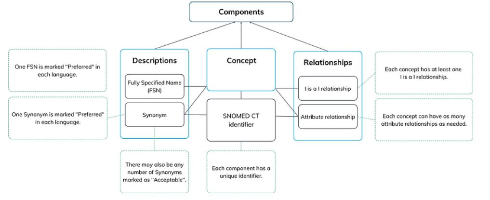

# SNOMED-CT  

### SYNTHÈSE :

**Description et type de standard** : SNOMED-CT (Systematized Nomenclature of Medicine Clinical Terms) est une terminologie médicale clinique, créée en 2002 et développée par SNOMED International.

**Domaines d’application** : SNOMED-CT couvre toutes les observations du domaine clinique (ex : résultats cliniques, interventions, médicaments, etc. ; voir l'élément « Domaine d’application en santé » en partie 1. Général). Ainsi, SNOMED-CT assure l'interopérabilité sémantique des observations cliniques.

**Maturité / Utilisation** : SNOMED-CT est mise à jour tous les mois. L'usage de la nomenclature est largement répandu dans le monde : en juin 2023, 47 pays (ex : Etats-Unis, Allemagne, Inde, Australie, Argentine, etc.) ont adopté SNOMED-CT, en tant que membres de SNOMED International, et environ 30 000 licences d'affiliation ont été délivrées à des individus et à des organisations (voir l'élément « Adoption du standard » en partie 4. Valorisation).  

### Présentation :
  - **Pays d'origine**: International[^1]
  - **Consortium d'origine**: SNOMED International
  - **Type de standard**: Nomenclature

- **Description** :

  - SNOMED-CT (Systematized Nomenclature of Medicine Clinical Terms), créée en 2002[^2], est **la terminologie médicale clinique multilingue la plus complète dans le monde[^3]**.
  - Elle répond au besoin **d'interopérabilité sémantique** dans le domaine de la santé en permettant une représentation cohérente et standardisée du contenu clinique des dossiers de santé électroniques (DSE ou EHR : *Electronic Health Record*). Par ailleurs, des correspondances (ou *un mapping*) existent entre SNOMED-CT et d'autres nomenclatures standards (ex : CIM-10), ce qui renforce l'interopérabilité sémantique de la nomenclature (voir l'élément « Capacité de traduction vers un autre standard (intra types de standards) » en partie 3. Technique).
  - Le modèle logique de la SNOMED-CT (SNOMED-CT Logical model) s'articule autour de trois composantes (voir la Figure 1 ci-dessous)[^4] :

 

       

   **Figure 1 : Les trois composantes de la SNOMED CT**, Source : [ SNOMED Internationa][^12](https://www.snomed.org/five-step-briefing?lang=fr)
   
  

  - Le concept (concept) représente une signification clinique unique et prend la forme d'un identifiant SNOMED-CT (« SCTID »).

 - **Plus de 350 000** concepts cliniques constituent la nomenclature SNOMED-CT (ex : résultats cliniques, procédures, produits pharmaceutiques, etc.)
 - Par exemple[^5], l'identifiant « 174036004 » est associé au nom complet (ou FSN, voir ci-dessous) « *Emergency appendectomy (procedure)* », une appendicectomie d'urgence.

- Les **relations** (relationships) représentent les liens logiques entre les concepts
 - Des concepts peuvent être reliés par plusieurs types d'attribut[^6] (attribute : type de relation)
 - Par exemple, les attributs permettent de définir les relations hiérarchiques entre les concepts : voir l'explication des relations parents-enfants et des différents attributs dans l'élément « *Type de granularité* » en partie 1. Général. Les relations peuvent être également horizontales pour enrichir l’information sur un concept. Dans le cas de l’appendicite :
   - Le concept de l’appendicite a des relations verticales : il se situe en aval d’une série de concepts qui le définissent (« inflammation du gros intestin », « maladie de l’appendice ») mais également en amont d’autres concepts qu’il définit à son tour (« appendicite aigüe », « appendicite chronique »)
   - De manière transversale, l’arborescence contient des informations complémentaires : sur la localisation de la pathologie (ex : l’appendice pour l’appendicite, attribut « *finding site* »), sur la morphologie associée à la pathologie (ex : l’inflammation pour l’appendicite, attribut « *associated morphology* ») mais aussi sur la localisation dans le cas d’une procédure (ex : l’appendice dans le cas de l’appendicectomie, attribut « *procedure site* »), ou encore sur la méthode utilisée (ex : l’excision dans le cas de l’appendicectomie, attribut « *method* »).

- Les **descriptions** (descriptions) associent des termes lisibles pour un être humain à un concept, en utilisant :
  - Un **nom complet** (FSN : *Fully Specified Name*) qui synthétise le sens du concept clinique. Ex : Pour l’infection au Covid-19, en français, le FSN est : « Maladie causée par le coronavirus 2 du syndrome respiratoire aigu sévère (trouble) ». Le FSN se termine par un suffixe sémantique entre parenthèses permettant d’indiquer à quelle hiérarchie le concept appartient. Le FSN est unique.
 - Des **synonymes** permettant d'exprimer un même concept de différentes manières. Dans chaque langue, un synonyme est marqué comme « préféré », les autres sont acceptables. Par défaut, le nom complet est marqué comme « préféré » également. Ex : pour l’infection au Covid-19, il existe plusieurs synonymes en français : « COVID-19 » (synonyme préféré), « Infection due au SAS-CoV-2 », « Infection due au coronavirus 2 du SRAS (syndrome respiratoire aigu sévère) », « Maladie causée par le SARS-CoV-2 », « Maladie causée par le SRAS-CoV-2 », « Maladie causée par le coronavirus 2 du syndrome respiratoire aigu sévère ».

- Organisme en charge : SNOMED International[^1]

### Application:

  - **Domaine d’application en santé :** Les concepts de la SNOMED-CT sont principalement utilisés pour décrire[^7] :
     - Des **résultats d'observations, d'évaluations et de jugements cliniques** (« *Clinical findings* » ; ex : asthme, maux de tête, etc.) pour environ 32 % des concepts
     - Des **interventions** réalisées dans le cadre de soins («*Procedure* » ; ex : appendicectomie, injection sous-cutanée, etc.) pour environ 18 % des concepts
     - Des **structures corporelles normales et anormales** (« Body structure* » ; ex : structure de la valve mitrale, etc.) pour environ 11 % des concepts
     - Des **organismes** (« *Organism* » ; ex : streptocoque du groupe A, Beagle, etc.) pour environ 9 % des concepts
     - Des **substances** chimiques, corporelles, alimentaires et de diagnostic (« *Substance* » ; ex : méthane, insuline, etc.) pour environ 7 % des concepts
     - Des **produits pharmaceutiques ou biologiques** (« Pharmaceutical/biologic product » ; ex : paracétamol, amoxicilline 250mg capsule, etc.) pour environ 6 % des concepts
     - Des **précisions** en lien avec l'observation ou l'intervention (ex : sur le contexte clinique, sur les échantillons prélevés, les objets, les forces physiques, les événements, l'environnement géographique, les circonstances sociales, des échelles de valeurs, les réponses à des questions, etc.) pour environ 17% des concepts restants[^9]

- **Principaux cas d’usage** : SNOMED-CT est un standard d'interopérabilité, utilisé pour coder les résultats cliniques. L'utilisation de SNOMED-CT permet d’influencer la prise en charge des patients et, par conséquent, d’améliorer leur santé. En effet, SNOMED-CT est utilisée[^10] :
   - Pour la standardisation des tests de diagnostic, des dossiers de santé électroniques et des échanges de données entre établissements
   - Pour la sécurité et la santé des patients : par le contrôle des infections, le suivi des patients (EHR, etc.) et par la possibilité de suivi de la santé publique générale
   - À des fins d'analyses et de recherche
- Illustration concrète : **exemple d’utilisation sur un cas simple** :
Rinaldi et al. (*2021*)[^11] décrivent l'utilisation de SNOMED-CT pour l'étude des maladies infectieuses dues à la résistance microbienne :
  - Ces résistances microbiennes représentent une menace à l'échelle planétaire. Cela requiert un approfondissement de la recherche médicale et un renforcement de la collaboration entre les différents acteurs du système de santé pour collecter et analyser des données sur ce sujet
  - Huit hôpitaux universitaires allemands, regroupés dans le consortium HiGHmed, initié par le ministère allemand de l'éducation et de la recherche, se partagent leurs données de santé relatives aux infections, dans l'objectif d'effectuer des analyses pour la détection aussi précoce que possible des germes potentiellement dangereux.
  - Le partage de données entre différents hôpitaux nécessite l'utilisation de **standards d'interopérabilité** pour pouvoir agréger les données de manière homogène. Pour cela, deux terminologies, **SNOMED-CT et LOINC**, sont utilisées :
   - **LOINC** est utilisée pour coder les tests et les observations cliniques et **SNOMED CT** pour en décrire les résultats.
   - **SNOMED-CT** permet d'apporter une réponse sous forme de code aux tests décrits par la terminologie LOINC, pour lesquels une réponse numérique est insuffisante :
       - En particulier, SNOMED-CT offre l'ensemble le plus complet de noms de microorganismes.
       - Plusieurs hiérarchies sont utilisées pour décrire les observations et les résultats cliniques :
            - **La hiérarchie Specimen** permet le codage du type d'échantillon des données microbiologiques (ex : « 119297000 |*Blood specimen (specimen)* » ; voir l'élément « *Type de granularité* » en partie 1. Général)
            - La **hiérarchie Body** structure permet le codage du site de prélèvement de ces échantillons
            - La **hiérarchie Procedure** permet la description des hémocultures anaérobies ou aérobies (ex : « 409611004 |*Aerobic blood culture (procedure)* » ; technique de prise de sang)

### Données :
  - **Type de terminologie** : Terminologie
  - **Type de granularité** :
    - SNOMED CT a une structure poly-hiérarchique, formant le modèle conceptuel (Concept model) de la SNOMED CT[^6] :
       - Les concepts sont organisés en **19 hiérarchies** (voir la Figure 2 ci-dessous et l'élément « Domaine d’application en santé » en partie 1. Général pour des exemples de concepts inclus dans les principales hiérarchies) : *Body structure, Clinical finding, Organism, Procedure, Specimen*, etc.

 

       

   **Figure 2 : Hiérarchies et relations dans le modèle SNOMED CT**, Source : [ SNOMED CT Starter Guide](https://confluence.ihtsdotools.org/display/DOCSTART/4.+SNOMED+CT+Basics)[^12]
   
  

   - Il existe une **relation hiérarchique** (|is a|), permettant de relier les concepts les plus génériques (les « **parents** ») aux concepts les plus précis (les « **enfants** »). Par exemple (voir Figure 2 ci-dessus) :
   - L'arthrite du genou est une arthropathie de l'articulation du genou, qui est une arthropathie, qui est une observation au niveau de l'articulation, qui est une observation musculosquelettique, qui est elle-même une observation clinique.
    - Par conséquent, ces différents concepts sont hiérarchisés par plusieurs attributs |is a| : une observation musculosquelettique (concept enfant) est un sous-ensemble (|is a|) des observations cliniques (concept parent).

  - Un concept peut avoir plusieurs parents : c'est la **poly-hiérarchie**. Par exemple (voir Figure 3), le concept associé au SCTID « 174036004 » :
   - Appartient à la hiérarchie « procedure »
   - Est relié à deux concepts parents :
       - « Emergency operation (procedure) »
       - « Excision of appendix (procedure) »
   - Est relié à deux concepts enfants :
     - « Emergency excision of normal appendix (procedure) »
     - « Laparoscopic emergency appendectomy (procedure) »

 

       

  **Figure 3 : Exemple de la structure hiérarchique de la SNOMED CT**, Source : [SNOMED CT Browser]()
   
  

   - Il existe d'autres relations (attributs) qui permettent de relier des concepts, **indépendamment de leur hiérarchisation**. Par exemple[^13] :
   - L'attribut « *Associated morphology* » spécifie les changements morphologiques, caractéristiques d'une maladie, observés au niveau des tissus ou des cellules. Ainsi, la pancréatite « *75694006 | Pancreatitis (disorder)*|) » est reliée à une morphologie inflammatoire « *409774005 | Inflammatory morphology (morphologic abnormality)*| » par l'attribut « Associated morphology (attribute) ».
   - L'attribut « Finding site » spécifie la partie du corps affectée par une maladie. Ainsi, l'attribut « 363698007 | Finding site (attribute)| » relie la maladie du rein « 90708001 | Kidney disease (disorder)| » à sa localisation : le rein « 64033007 | Kidney structure (body structure)| ».

- Les concepts SNOMED CT peuvent être[^13] :
   - **Pré-coordonnés** : dans ce cas, un seul identifiant de concept est utilisé (c'est le cas des exemples mentionnés au-dessus)
   - **Post-coordonnés** : dans ce cas, plusieurs identifiants de concept sont utilisés, ce qui permet d'ajouter et de combiner des précisions cliniques. Différents attributs peuvent être utilisés pour détailler un concept (voir l'élément « Flexibilité du standard, personnalisation » en partie 3. Technique.)

- **Utilisation dans plusieurs langues** :
   - Il existe **2 versions internationales*
** : une en **anglais** et une **en espagnol**[^15]
   - Il existe également des extensions locales de SNOMED CT, dans la langue du pays associée à l'extension (voir l'élément « Existence d'extensions certifiées » en partie 5. Utilisation).

- **Disponibilité de la documentation d'implémentation** :
   - Guide de démarrage (starter guide)[^16]
   - Documentation d'implémentation[^17]
   - Guide d'utilisation de SNOMED CT pour les EHR[^18]
   - Page d'onboarding pour les nouveaux membres[^19]
   - Documentation pour la mise en place de best practices[^20]
   

[^1]: SNOMED International est une organisation à but non lucratif créée en 2007 sous le nom d’International Health Terminology Standards Developement Organization. Les 9 membres fondateurs étaient l'Australie, le Canada, le Danemark, la Lituanie, la Suède, les Pays-Bas, la Nouvelle-Zélande, le Royaume-Uni et les États-Unis. Voir : [Our Members | SNOMED International](https://www.snomed.org/members?lang=fr) 
[^2] : SNOMED CT naît en 2002 de la fusion entre SNOMED Reference Terminology (RT) la CTV3 (Clinical Terms Version 3). Voir : [Overview of SNOMED CT.](https://www.nlm.nih.gov/healthit/snomedct/snomed_overview.html#:~:text=SNOMED%20CT%20originated%20from%20the,to%20describe%20morphology%20and%20anatomy.&text=Under%20Dr.,the%20growing%20needs%20of%20medicine)
[^3]:  Voir : [5-Step briefing | SNOMED International](https://www.snomed.org/five-step-briefing?lang=fr) 
[^4]:  Voir le modèle logique de la SNOMED CT : https://confluence.ihtsdotools.org/display/DOCSTART/5.+SNOMED+CT+Logical+Model 
[^5]:  Voir : https://browser.ihtsdotools.org/?perspective=full&conceptId1=174036004&edition=MAIN/2023-05-31&release=&languages=en 
[^6]: Voir : https://confluence.ihtsdotools.org/display/DOCSTART/6.+SNOMED+CT+Concept+Model#:~:text=SNOMED%20C%20attributes%20(or%20relationship,more%20branches%20of%20the%20hierarchy 
[^7]: Les six premières applications correspondent aux six principales hiérarchies de la SNOMED CT. Voir la partie 6 « SNOMED CT Concept Model » du starter guide : https://confluence.ihtsdotools.org/display/DOCSTART/6.+SNOMED+CT+Concept+Model#:~:text=SNOMED%20CT%20attributes%20(or%20relationship,more%20branches%20of%20the%20hierarchy. 
[^8]: Voir la répartition des concepts par hiérarchie : https://www.snomed.org/_files/ugd/900274_e395a31129f346bf81220fa8216b871b.pdf?lang=fr
[^9]:  Ce point regroupe 13 des 19 hiérarchies. Pour plus de précisions, consulter la partie 6 du starter guide.
[^10]: Voir : https://www.snomed.org/_files/ugd/900274_8a849a3565054d14a4c94cf1062331a3.pdf 
[^11]: Voir l’article de Rinaldi E, Saas J, Thun S. « Use of LOINC and SNOMED CT with FHIR for Microbiology Data ». Stud Health Technol Inform. 2021 : [Use of LOINC and SNOMED CT with FHIR for Microbiology Data](https://pubmed.ncbi.nlm.nih.gov/34042889/) 
[^12]:  Voir : [4. SNOMED CT Basics](https://confluence.ihtsdotools.org/display/DOCSTART/4.+SNOMED+CT+Basics) 
[^13]:  Voir les attributs de la hiérarchie Clinical Finding pour plus d’exemples d’utilisation des attributs : [Clinical Finding Defining Attributes](https://confluence.ihtsdotools.org/display/DOCEG/Clinical+Finding+Defining+Attributes). Une liste d’attributs existe pour chaque hiérarchie. 
[^14]:  Voir : [7. SNOMED CT Expression](https://confluence.ihtsdotools.org/display/DOCSTART/7.+SNOMED+CT+Expressions) 
[^15]: Voir : [Our releases | SNOMED International](https://www.snomed.org/releases?lang=fr) et [4.4.1 National Editions](https://confluence.ihtsdotools.org/display/DOCEXTPG/4.4.1+National+Editions) 
[^16]: Le guide d’introduction existe en quatre versions :
la version anglaise : [SNOMED CT Starter Guide](https://confluence.ihtsdotools.org/display/DOCSTART/SNOMED+CT+Starter+Guide)
la version allemande : https://confluence.ihtsdotools.org/display/DOCSTARTDE?preview=/61153991/87039892/doc_StarterGuide_de_INT_20190611.pdf 
la version espagnole : https://confluence.ihtsdotools.org/display/DOCSTARTES?preview=/61154093/72060549/doc_GuíadeIntroducciónaSNOMEDCT_Current-es_INT_20180820.pdf 
la version portugaise : https://confluence.ihtsdotools.org/display/DOCSTARTPT?preview=/81268875/94405747/doc_StarterGuide_PT_20190807.pdf 
[^17]: Voir : https://confluence.ihtsdotools.org/display/IMP/Implementation+Process 
[^18]: Voir : [Example EMR EHR Requirements Guide](https://confluence.ihtsdotools.org/display/DOCREQTS) 
[^19]:  Voir : https://confluence.ihtsdotools.org/ioprs/SNOMED CT-where-to-start/starter-guide-for-new-members 
[^20]: Voir la section « Best practice guidance » : https://www.implementation.snomed.org/implementation-library 

### 2. Gouvernance
- **Modalités d'accès et distribution des solutions basées sur ce standard** :
   - La consultation de SNOMED CT est accessible à tous, via un **accès gratuit en ligne** (voir l'élément « Ressources d’accès à la terminologie et liens associés » ci-dessous)[^21] .
   - Cependant, **l'utilisation et l'implémentation** de **SNOMED CT** dans les établissements de santé nécessitent le téléchargement du standard, conditionné par **l'adhésion à SNOMED International** ou **l'acquisition d'une licence d'affiliation**[^22] :
      - Pour un déploiement de SNOMED CT dans un pays membr[^23] de SNOMED International :
           - L'établissement doit enregistrer l'utilisation de SNOMED CT au NRC[^24] (*National Release Center*) du pays
           - L'utilisation de SNOMED CT **n'est pas facturée**
      - Pour les établissements de pays non-membres de SNOMED International :
           - L'utilisation nécessite une **demande d'utilisation**[^25] ainsi qu'un **contrat de licence d'affiliation**[^26]
           - Des frais éventuels peuvent s'appliquer. Pour un calcul ou une estimation des frais, contacter info@snomed.org.
      - Fin 2022, la France a initié un processus d'adhésion à *SNOMED International* (pour devenir membre de *SNOMED International* courant 2023)[^27]. L'ANS (Agence du Numérique en Santé) deviendra le futur NRC (National Release Center) français. Pour toute question sur l'utilisation ou l'implémentation de SNOMED CT en France, contacter l'ANS[^28].
- Le code source ainsi que les outils et les services développés par SNOMED International sont disponibles sous **la licence open source Apache v2**.

- **Processus de prise de décision sur le standard** :
  - Les mises à jour de SNOMED CT sont entreprises par :
      - ***SNOMED International***[^30] pour la version internationale de SNOMED CT
      - Les NRC[^31] (National Release Center) pour les extensions locales (propres à un pays ; voir l'élément « *Existence d'extensions certifiées* » en partie 5. Utilisation)
  - Il est possible d'effectuer des **demandes d'ajouts ou de modifications** à SNOMED CT par l'intermédiaire des NRC[^32]
  - Les **groupes de projet**[^33] (project groups) exécutent des tâches spécifiques dans un délai imparti. En juin 2023, **neuf groupes de projet** sont recensés sur le site de *SNOMED International : « Devices », « Diabetes », « French Translation Collaboration », « German Translation Group », « Medical Procedures », « Observable and Investigation Model », « SNOMED CT Computable Languages », « SNOMED on FHIR », « Translation User Group »*
  - Les groupes consultatifs (advisory groups), présidés par le personnel de SNOMED International, jouent un rôle capital dans la gestion et l'orientation des priorités de l'organisme. En juin 2023, cinq groupes consultatifs sont recensés sur le site de SNOMED International : « Content managers » (CMAG), « E-lerning » (ELAG), « Modeling » (MAG), « Editorial » (EAG) et « Terminology release » (TRAG)
  - Pour rejoindre l'un de ces groupes de projet ou consultatifs, contacter info@snomed.org

 - **Maturité du standard** :
     - Fréquence de mise à jour :
         - La version internationale anglaise de SNOMED CT est **mise à jour mensuellement** (à la fin du mois)[^30]
         - La version internationale espagnole de SNOMED CT est **mise à jour deux fois dans l'année** : le 30 avril et le 31 octobre
         - Pour les extensions locales :
              - L'extension américaine, l'extension Belgique et l'extension Danemark sont mises à jour aux mois de mars et de septembre
              - L'extension Autriche, l'extension Irlande, l'extension Nouvelle-Zélande et l'extension Norvège sont mises à jour aux mois d'avril et d'octobre
              - L'extension Estonie et l'extension Suède sont mises à jour aux mois de mai et novembre
              - L'extension Suisse est mise à jour aux mois de juin et décembre
              - L'extension Corée du Sud est mise à jour au mois de décembre
         - La SNOMED CT n'est **pas versionnée**
         - **Maturité** :
**Note : 1 / 1**. Cette note combine plusieurs sous-critères. Elle s’explique par :
(a) La publication d’une version stable
(b) La fréquence moyenne élevée de mise à jour des versions mineures
(c) L’âge élevé du standard
(d) Son utilisation dans le monde à l’échelle d’un ensemble de pays / mondiale (voir l’élément « *Adoption du standard*  » en partie 4. Valorisation)
(e) Son adoption officielle par un ou plusieurs pays ou par une organisation de référence (voir l’élément « *Adoption du standard*  » en partie 4. Valorisation)

- **Existence de financements pour standardisation** :
*En juin 2023, nous n'identifions pas de financements pour la standardisation*.

- **Ressources d’accès à la terminologie et liens associés** :
  - Le **Navigateur SNOMED CT**[^34] permet :
     - De visualiser le contenu de la SNOMED CT
     - De rechercher des concepts en entrant des mots-clés ou des SCTID
     - D'afficher un diagramme pour visualiser les attributs et les concepts associés (parents, enfants).
     - De choisir l’édition souhaitée (éditions internationales ou extensions ; voir l'élément « *Existence d'extensions certifiées* » en partie 3. Technique)
 - ***SNOMED CT Concept Lookup**[^35] permet de trouver rapidement le concept associé à un identifiant. Il affiche la description du concept, ses traductions éventuelles, ses attributs, ses parents et enfants directs
 - **GitHub de SNOMED International** avec le code en open source[^36]

 ### 3. Technique
- **Capacité de traduction vers un autre standard (intra types de standards)** :
   - **Mapping entre SNOMED CT et la Classification internationale des maladies** (CIM) (CIM-10 et CIM-11) :
       - **Mapping entre SNOMED CT et la CIM-10** :
            - Un codage semi-automatisé attribue une classification CIM-10 (version 2016) à un code SNOMED CT[^37].
            - Ce mapping est publié les 31 janvier et 31 juillet de chaque année
            - L'outil de mapping est disponible sur le site de l'IHTSDO[^38]
   - **Mapping entre SNOMED CT et la CIM-11** :
       - L’alignement SNOMED CT et de la CIM-11 est plus difficile à cause des structures et des niveaux de granularité différents.
       - Il existe une estimation datée de 2015[^39] qui présente le niveau de rapprochement entre ces deux terminologies par chapitre de CIM-11 :  

 

       

   **Carte 1 :Membres et affiliés de SNOMED International en 2023**, Source : [Our Members | SNOMED International](https://www.snomed.org/members?lang=fr)
   
  

   - Le double mapping consistant au mapping de SNOMED CT à la CIM-10 (1) puis de la CIM-10 à la CIM-11 (2) permet de relier SNOMED CT à la CIM-11.
- **Mapping entre SNOMED CT et CIM-O** :
    - La CIM-O est une extension de la CIM pour l'oncologie.
    - Le mapping de SNOMED CT à la CIM-O est publié par *SNOMED International* et disponible dans « SNOMED International Mapping Tool » (voir l'élément « *Outils compatibles* » en partie 5. Utilisation).
- **Mapping entre SNOMED CT et ICHI** :
Rodrigues et al. (2017)  décrivent les difficultés de mapping entre ICHI et SNOMED CT :
    - Les axes ICHI Target et Means couvrent moins de domaines que leurs équivalents SNOMED CT.
    - En particulier :  
        - Il n'est pas possible de coder avec ICHI deux actions lors d'une même intervention, ce qui est possible avec SNOMED CT.
        - Il n'y a pas de liaison sémantique ICHI équivalente au « *Procedure site indirect*[^41] » de SNOMED CT, permettant de coder les structures non tissulaires (ex : corps étranger, calcul, dispositifs, thrombus, etc.).
 - **Mapping entre SNOMED CT et LOIN** :
      - En juillet 2013, le Regenstrief Institute et SNOMED International signent un accord pour créer un mapping entre LOINC et SNOMED CT
      - Dans ce mapping, la terminologie LOINC est utilisée pour coder les observations cliniques ainsi que les tests de laboratoire et leurs résultats sont codés avec SNOMED CT.
      - Le mapping est disponible, sur demande[^43], mais n'a pas été mis à jour depuis 2017. *Le Regenstrief Institute* et *SNOMED International* n'en prévoient pas la mise à jour.
      - En 2022, un projet « LOINC in SNOMED CT » a été initié[^44]
          - En mai 2023, la preuve de concept n'a pas encore été effectuée[^45]
          - L'objectif du projet est de rendre disponible au format SNOMED CT chaque observation clinique ou test de laboratoire exprimée dans la terminologie LOINC.
 - **Mapping entre SNOMED CT et CPT** : AMA (*American Medical Association) et *SNOMED International* collaborent pour fournir des *mappings basés* sur des règles entre les concepts cliniques de SNOMED CT et les codes CPT qui permettent d'améliorer l'utilisation des ressources et les soins aux patients. Ces mappings sont publiés tous les 31 janvier.
- **Mapping entre SNOMED CT et GMDN**[^47] : l'accès à ce mapping nécessite une licence délivrée par GMDN
- **Mapping entre SNOMED CT et MedDRA**[^48] : Les mappings SNOMED CT vers MedDRA et MedDRA vers SNOMED CT sont publiés chaque année en avril et sont destinés à faciliter l'échange de données entre les bases de données réglementaires (qui utilisent MedDRA) et les bases de données de soins de santé/dossiers de santé électroniques (qui utilisent SNOMED CT)

- **Mapping entre SNOMED CT et Orphanet**[^49] : Orphanet et *SNOMED International* ont produit un *mapping* entre SNOMED CT et Orphanet pour aligner tout le contenu sur les maladies rares dans Orphanet avec SNOMED CT.

- **Communication avec d'autres standards (inter typologies de standards)** :
    - SNOMED CT est utilisée par **OMOP-CDM** pour identifier les résultats des observations cliniques (ex : des diagnostics, des procédures, des symptômes, des historiques familiaux, etc.). En particulier, dans OMOP-CDM, SNOMED CT est considéré comme standard pour les domaines suivants : les maladies, les dispositifs médicaux, les mesures, les observations, les procédures, la localisation anatomique, le statut de la maladie, les prélèvements, la voie d’administration. Il n’est cependant pas standard pour les domaines suivants : les médicaments, les professionnels de santé, les unités, les types de visites, les métadonnées.
   - La terminologie SNOMED CT peut être utilisée par FHIR de 2 façons[^50] :
      - En liant une **ressource FHIR à un ensemble de concepts** de la SNOMED CT
     - En liant une **ressource FHIR à un type de relation** (attribut) de la SNOMED CT

- **Flexibilité du standard, personnalisation** :
    - **La post-coordination**[^14] rend la nomenclature plus flexible (voir l'élément « *Type de granularité* » en partie 1. Général). En effet, la post-coordination permet **l'ajout de détails** cliniques à un concept, ce qui augmente le niveau de précision de la nomenclature. Pour ajouter des précisions, des **attributs** sont utilisés :
      - Par exemple, pour post-coordonner « 80146002 |appendectomy| », l'attribut « 260870009 | Priority (attribute[^51])|» peut être utilisé pour préciser la nature d'une intervention (élective ou d'urgence) :
          - Le SCTID « 260870009 » représente l'attribut de priorité (priority)
          - Une appendicectomie d'urgence est alors notée « 80146002 |appendectomy| : 260870009 |priority| = 25876001 |emergency| »
     - Le symbole « : » est utilisé pour préciser un concept avec un attribut
     - Il est possible d'ajouter plusieurs précisions en utilisant plusieurs attributs[^52]. Dans ce cas, les attributs sont séparés par une virgule (« , ») :
        - Par exemple, « 80146002 |appendectomy| :
        260870009 |priority| = 25876001 |emergency|, 425391005 |using access device| = 86174004 |laparoscope| » utilise deux attributs pour préciser le concept d'appendicectomie
     - Un concept post-coordonné peut avoir une représentation pré-coordonnée :
         - Par exemple, une appendicectomie d'urgence peut être représentée sous la forme d'un code unique « 174036004 | Emergency appendectomy (procedure) | »
   - Cependant, **une représentation pré-coordonnée équivalente n'existe pas toujours** :
       - Par exemple, l'idée clinique de retrait par laparoscopie d'un dispositif dans l'abdomen peut seulement se traduire de manière post-coordonnée : « 68526006 |removal of device from abdomen| : 425391005| using access device| = 6174004 |laparoscope| »

  - Le **mécanisme d'extension** permet de personnaliser la SNOMED CT pour répondre aux besoins terminologiques d'un pays ou d'une organisation, non-satisfaits par l'édition internationale (voir «*Existence d'extensions certifiées* » en partie 5. Utilisation).

- **Intensité de la perte de données au mapping** :
   - Au sein de la clinique Mayo, Elkin et al. (2006)[^53] ont sélectionné 4 996 descriptions associées aux problèmes les plus courants rencontrés par les patients et ont essayé de les mapper automatiquement à la terminologie SNOMED CT. Parmi ces 4 996 descriptions, **4 568 ont pu être correctement mappées (91.4%)**.
  - Block et al. (2021)[^54] évaluent la qualité de différentes méthodes pour mapper 107 termes relatifs aux soins infirmiers (prodigués aux plaies) à la terminologie SNOMED CT :
     - Le mapping manuel :
       - 58 % des termes ont une correspondance directe à un concept SNOMED CT
       - 10 % des termes ont plusieurs correspondances à des concepts SNOMED CT
       - 33 % des termes n'ont de correspondance avec aucun concept  
     - Le mapping automatique :
        - 53 % des termes ont une correspondance directe à un concept SNOMED CT
        - 47 % des termes ont plusieurs correspondances à des concepts SNOMED CT
     - Comparison mapping (considérer un terme de la terminologie source et consulter un ensemble de termes proches déjà mappés à SNOMED CT dans des études précédentes[^55]) :
          - 94 % des termes ont une correspondance directe à un concept SNOMED CT
          - 6 % des termes ont plusieurs correspondances à des concepts SNOMED CT
    - *Concordance mapping* (évaluation des propositions de *mapping* obtenues à l’aide des méthodes précédentes et consensus pour créer une liste finale) :
       - 40 % des termes ont une correspondance directe à un concept SNOMED CT
       - 2 % des termes ont plusieurs correspondances à des concepts SNOMED CT
       - 58 % des termes n'ont pas de correspondance avec aucun concept  
    - Cette étude démontre que la combinaison de différentes méthodes de *mapping* peut être nécessaire pour aboutir à une liste finale. Le taux d’équivalence entre les termes sélectionnés et la SNOMED CT est cependant faible (40 %) sur cet échantillon.

- **Existence d’un historique et accessibilité à l’historique** : Un historique des publications est disponible[^56]. Sont notamment téléchargeables **avec une licence** :
     - Les versions antérieures de l'édition internationale de SNOMED CT (depuis 2007)
     - Les versions antérieures de l'édition américaine de SNOMED CT (depuis 2011)
     - Les versions antérieures du mapping de SNOMED CT à la CIM-10 (depuis 2012)

### 4.Valorisation
- **Accessibilité à des ressources de formation** :
    - Cours dispensés par *SNOMED International* en anglais ou en espagnol[^57]
    - Plateforme de e-learning SNOMED[^58]

- **Disponibilité de la documentation scientifique démontrant l'intérêt** :
    - Chang et al. (2021)[^59] réalisent une étude de 622 publications scientifiques sur la SNOMED CT. Selon eux, peu d'articles montrent l'effet ou l'impact de l'utilisation de SNOMED CT sur la qualité des soins aux patients :
        - Reed et al. (2015)[^60], étudiants en médecine dentaire, ont montré que **l'utilisation de SNOMED CT dans un système EHR renforçait les capacités de réflexion critique** des étudiants
        - Souvignet at al. (2019)[^61] ont mesuré l'utilité indirecte de **SNOMED CT** :
            - Les auteurs s'appuient sur une interface web qui représente des termes MedDRA (terminologie utilisée dans le domaine pharmaceutique), issus de formulaires, par des concepts SNOMED CT.
            - L'utilisation de SNOMED CT accélère la sélection des termes MedDRA et a amélioré les capacités de recherche en pharmacovigilance
    - Thun et al. (2018)[^62] expliquent **l'intérêt de l'utilisation de SNOMED CT par rapport** à d'autres nomenclatures internationales comme **ICHI** ou la **CIM** (CIM-10, CIM-11) :
         - SNOMED CT couvre l'ensemble du domaine médical, contrairement à ICHI et à la CIM
         - En raison de l'expressivité du contenu de SNOMED CT et de son usage international, les auteurs jugent l'utilisation de SNOMED CT plus probable dans le développement des applications de santé électroniques

- **Adoption du standard** :
   - Adoption officielle :
        - En Angleterre, le NHS[^63] (National Health Service) rend obligatoire l'utilisation de SNOMED CT pour tous les prestataires de soins NHS.
        - En juin 2023, 47 pays sont membres de SNOMED International[^33] (ex : Australie, Canada, Danemark, Lituanie, Suède, Pays-Bas, Nouvelle-Zélande, Royaume-Uni, États-Unis, etc. ; voir la Carte 1 ci-dessous)
        - En France, dans le cadre du CI-SIS[^64] (Cadre d'Interopérabilité des Systèmes d'Information de Santé), l'ANS prévoit l'utilisation de SNOMED CT et l'adhésion à *SNOMED International* courant 2023[^27].

- *Utilisation sur le marché* :
   - *SNOMED International* a délivré des **licences d'affiliation à plus de 30 000 individus et organisations**[^33]

  

       

   **Carte 1 : 
 Membres et affiliés de SNOMED International en 2023**, Source : [ Our Members | SNOMED International](https://www.snomed.org/members?lang=fr)
   
  

La carte indique en bleu foncé les pays membres de SNOMED International et en bleu clair les pays non-membres qui ont besoin d'une licence d'affiliation pour pouvoir utiliser SNOMED CT. Voir l'élément « Modalités d'accès et distribution des solutions basées sur ce standard » en partie 2. Gouvernance.

  - **Fournisseurs de service ayant l'expertise en France** :
En juin 2023, nous n'identifions pas de fournisseurs de service ayant l'expertise en France.

### 5.Utilisation
- **Simplicité d'usage** :
     - **Note : 1 / 1** en raison de l’accès à des ressources officielles de formation (voir l’élément « Accessibilité à des ressources de formation » en partie 4. Valorisation).
     - La recherche de la signification d'un SCTID est simple[^65], notamment pour les débutants, avec l'utilisation des nouveaux outils comme SNOMED CT Concept Lookup. De manière générale, l'utilisation des outils d'aide au codage et des outils compatibles permet de simplifier l'utilisation de SNOMED CT[^66] (voir les éléments *« Outils d’implémentation / aide au codage »* et *« Outils compatibles » * ci-dessous).

- **Existence d'une communauté en ligne et degré d'activité** :
     - Vidéos YouTube[^67] de présentation et d'explications de SNOMED CT par SNOMED International
     - Inscription sur la mailing list[^68] de *SNOMED International* pour être informé de toutes les nouveautés
     - Forums[^69] de discussion
     - FAQ[^70] *SNOMED International*

- **Outils d’implémentation / aide au codage** :
    - ***SNOMED CT Browser***[^34] permet de requêter la terminologie SNOMED CT (voir l'élément « *Ressources d’accès à la terminologie et liens associés »* en partie 2. Gouvernance et la Figure 6 ci-dessous).
    - D'autres **navigateurs SNOMED CT**[^71] existent et sont listés sur le site officiel de SNOMED International : Athena[^72], BioPortal[^73], CSNOtk[^74], National Library of Medicine SNOMED CT Browser, NHS Digital SNOMED CT Browser[^75], NICTIZ Browser[^76], Shrimp SNOMED CT Browser, SnoChillies Browser[^77], Snowray Terminology Service[^78], Stom Browser, VTSL Terminology Browser[^79], West Coast Terminology Server[^80]

  

       

   **Figure 6 :SNOMED CT Browser**, Source : [SNOMED CT Browser ]()
   
  

     - SNOMED CT Concept Lookup35: affiche la description du concept, ses traductions éventuelles, ses attributs, ses parents et enfants directs (voir la Figure 7 ci-dessous)

 

       

   **Figure 7 : SNOMED CT Concept Lookup**, Source : [SNOMED CT Concept Lookup]()
   
 

   - ***Authoring tool***[^81] : application web conçue pour la création de contenu collaboratif SNOMED CT
   - *SNOMED CT Search Demo*[^82] est un outil qui montre les meilleurs pratiques pour utiliser SNOMED CT dans des applications EHR

- **Outils compatibles** :
  - ***Snap2Snomed***[^83] est un outil fourni par SNOMED International permettant de créer et de maintenir des mappings vers SNOMED CT
  - ***SNOMED International's mapping tool***[^84] est un outil utilisé par l'équipe en charge du contenu de SNOMED CT pour maintenir les mappings depuis SNOMED CT vers d'autres terminologies (CIM, ICPC, etc.)
  - ***Amazon Comprehend Medical***[^85] est un outil permettant de relier des données de santé (procédures, diagnostics, …) à des nomenclatures médicales comme SNOMED CT.
  - ***Reference Set and Translation Service***[^86] peut être utilisé pour créer et maintenir des traductions de SNOMED CT.
  - ***Health Data analytics***[^87] est un outil de démonstration basé sur des données synthétiques. Il permet de créer des cohortes de patients et de pouvoir les comparer entre elles par exemple pour aider les médecins à la prise de décision (utilisation risquée d'un médicament, ...)

- **Existence d'extensions certifiées** :
    - Il existe des **extensions locales** de SNOMED CT, qui permettent à des pays d'ajouter des éléments à la version internationale de SNOMED CT. Un **mécanisme d'extension**[^88] permet de personnaliser la SNOMED CT pour répondre aux besoins terminologiques d'un pays ou d'une organisation, non-satisfaits par l'édition internationale :
        - Un « namespace identifier »[^89] est un **code à 7 caractères attribué** à chaque organisation (ex : National Release Centers, organisations locales, etc.) qui met en place une extension.  
        - Les organisations utilisent ce code pour créer des extensions locales des SCTIDs pour garantir l'unicité des concepts à l'échelle locale comme globale. Un SCTID d'extension (ex : « 5281000124103 ») est composé (voir Figure 8 ci-dessous) :
            - D'un identifiant d'extension (ex : 528)
            - Du « *namespace identifier* » (ex : « 1000124 », le « *namespace identifier* » de la *National Library of Medicine*, le NRC des Etats-Unis)
            - De l'identifiant de partition (ex : 10 « SNOMED CT core module »)
            - D'une clé de contrôle (ex : 3)

       
   **Figure 8 : Structure d'un SCTID d'extension**
« 5281000124103 |Persistent asthma (disorder)|, Source : [4.1 Namespaces ](https://confluence.ihtsdotools.org/display/DOCEXTPG/4.1+Namespaces)
   
                                                                   

      
       
- Les extensions locales sont disponibles dans le navigateur SNOMED CT[^90] et sont **maintenues et mises à jour par les NRC** (National Release Center)[^31].
- En juin 2023, il existe des extensions locales pour les pays suivants : **Argentine, Australie, Autriche, Belgique, Canada, Danemark, Estonie, Finlande, Irlande, Pays-Bas, Nouvelle-Zélande, Norvège, Suède, Suisse, Etats-Unis et Uruguay.**

[^21]: Voir les différentes modalités d’accès à SNOMED CT : [Modalité d’accès à la SNOMED CT](https://industriels.esante.gouv.fr/sites/default/files/media/document/Note_information_ANS_-_Modalites_acces_SNOMED_CT.pdf)
[^22]: Voir : [Get SNOMED CT](https://www.snomed.org/get-snomed?lang=fr)
[^23]: Voir la liste des pays membres de SNOMED International et ses utilisateurs affiliés : [Our Members | SNOMED International](https://www.snomed.org/members?lang=fr)
[^24]: Un NRC sert d’intermédiaire entre SNOMED International et les utilisateurs de SNOMED CT au sein d’un pays. SNOMED International impose à chacun de ses pays membres de définir un NRC. Au sein d’un pays, un NRC est responsable de recevoir les mises à jour mensuelles de la version internationale de SNOMED CT, de la rendre disponible à tous ses licenciés et d’en promouvoir le déploiement ; voir : 2. [What Is a National Release Center?](https://confluence.ihtsdotools.org/pages/viewpage.action?pageId=26837051)
[^25]: Voir : [MLDS](https://mlds.ihtsdotools.org/#/landing) pour une demande d’utilisation de SNOMED CT
[^26]: Voir le contrat de licence d’affiliation : https://www.snomed.org/_files/ugd/900274_689013e9e0c74d23892abe9caee02612.pdf
[^27]: Voir : [NRC SNOMED CT | Portail Industriels](https://industriels.esante.gouv.fr/produits-et-services/cgts-centre-de-gestion-des-terminologies-de-sante/nrc-snomed-ct)
[^28]: Voir les modalités pour la prise de contact avec l’ANS : [Contactez-nous | Portail Industriels](https://industriels.esante.gouv.fr/contactez-nous)
[^29]: Voir : [Software and tools | SNOMED International](https://www.snomed.org/software-tools?lang=fr#:~:text=Open%20source%20software%20development,Apache%20v2%20open%20source%20license)
[^30]: Voir le calendrier des publications : [Our releases | SNOMED International](https://www.snomed.org/releases)
[^31]: Voir : [3. NRC responsibilities](https://confluence.ihtsdotools.org/display/DOCNRCG/3.+NRC+responsibilities)
[^32]: Les membres de SNOMED International et les autres utilisateurs autorisés peuvent effectuer une demande de modification ou d’ajout à SNOMED CT : voir [Change or add to SNOMED CT](https://www.snomed.org/change-or-add?lang=fr) et le guide de conseils pour effectuer la demande : https://www.snomed.org/_files/ugd/900274_84a209ac4e524e32a71c2b64d9350b3b.pdf
[^33]: Voir : [Get involved | SNOMED International](https://www.snomed.org/get-involved?lang=fr)
[^34]: Voir : [IHTSDO Browser](https://browser.ihtsdotools.org/)
[^35]: Voir : [SNOMED CT Concept Lookup](https://lookup.snomedtools.org)
[^36]: Voir : [SNOMED International · GitHub](https://github.com/IHTSDO)
[^37]: La page [SNOMED CT maps](https://www.snomed.org/maps?lang=fr) détaille les mappings de SNOMED CT avec les autres standards : CPT, GMDN, CIM-10, CIM-O, MedDRA et Orphanet.
[^38]: Pour accéder à l’outil de mapping : https://prod-mapping.ihtsdotools.org/#/
[^39]: Voir l’article de Rodrigues JM, Robinson D, Della Mea V, Campbell J, Rector A, Schulz S, Brear H, Üstün B, Spackman K, Chute CG, Millar J, Solbrig H, Brand Persson K. « [Semantic Alignment between ICD-11 and SNOMED CT](https://pubmed.ncbi.nlm.nih.gov/26262160/) ». Stud Health Technol Inform. 2015 : Semantic Alignment between ICD-11 and SNOMED CT
[^40] : Voir l’article : Jean Marie RODRIGUES, Sukil KIM, Béatrice ROMBERT PAVIOT, Jae Jin LEE and Syed ALJUNID « How to Link SNOMED CT Procedure and WHO International Classification of Health Interventions (ICHI) », 2017 : https://books.google.fr/books?hl=fr&lr=&id=2UXiDgAAQBAJ&oi=fnd&pg=PA40&dq=ichi+who&ots=bijydMBOYK&sig=yi3eYUPL5Gd6X19OQhEjiI206BU&redir_esc=y#v=onepage&q=ichi%20who&f=false
[^41]: Voir : Procedure, General[https://confluence.ihtsdotools.org/display/DOCEG/Procedure%2C+General]
[^42]: Voir : [SNOMED International – LOINC](https://loinc.org/collaboration/snomed-international/)
[^43]: Remplir le formulaire de demande pour accéder au mapping de 2017 : [Request Form for LOINC/SNOMED CT Expression Association and Map Sets File](https://loinc.org/snomed-file-request/)
[^44]: Voir : [LOINC and SNOMED CT: LOINC Extension - What this means for NHS and Unified Test List - Termlex](https://termlex.com/loinc-and-snomed-for-nhs-and-unified-test-list/)
[^45]: Voir : https://termlex.com/loinc-SNOMED CT-extension-why-what-and-how/
[^46]: La terminologie CPT (Current Procedural Terminology) est la nomenclature la plus largement utilisée et acceptée aux États-Unis pour le codage des services et procédures médicales.
[^47]: GMDN (Global Medical Device Nomenclature) est une liste de noms génériques utilisés pour identifier tous les dispositifs médicaux.
[^48]: MedDRA (Medical Dictionary for Regulatory Activities) est une terminologie médicale utilisée pour l'enregistrement, la documentation et la surveillance de la sécurité des produits médicaux.
[^49]: L'ontologie des maladies rares d'Orphanet est un vocabulaire structuré pour les maladies rares dérivé de la base de données Orphanet, capturant les relations entre les maladies, les gènes et d'autres caractéristiques pertinentes.
[^50]: Voir : https://www.hl7.org/fhir/mappings.html
[^51]: Voir les attributs associés aux Procedures : [Procedure, General](https://confluence.ihtsdotools.org/display/DOCEG/Procedure%2C+General)

[^52]: Il est également possible d’utiliser un concept post-coordonné pour définir un attribut précisant un concept. Voir le guide de démarrage pour des détails et des précisions supplémentaires.
[^53]: Voir l’article de Elkin PL, Brown SH, Husser CS, Bauer BA, Wahner-Roedler D, Rosenbloom ST, Speroff T. « Evaluation of the content coverage of SNOMED CT: ability of SNOMED clinical terms to represent clinical problem lists ». Mayo Clin Proc. 2006 : [Evaluation of the content coverage of SNOMED CT: ability of SNOMED clinical terms to represent clinical problem lists](https://pubmed.ncbi.nlm.nih.gov/16770974/)
[^54]: Voir l’article de Block LJ, Wong ST, Handfield S, Hart R, Currie LM. « Comparison of terminology mapping methods for nursing wound care knowledge representation ». Int J Med Inform. 2021 : [Comparison of terminology mapping methods for nursing wound care knowledge representation](https://pubmed.ncbi.nlm.nih.gov/34358804/)
[^55]: Le comparison mapping fonctionne sur un principe similaire à celui d’un double mapping : (1) le rapprochement d’un terme de la terminologie source à un terme d’une autre terminologie (ex : CIM-10, ICHI, etc.) déjà mappé avec SNOMED CT et (2) l’utilisation du mapping entre cette terminologie intermédiaire et SNOMED CT.
[^56]: Voir : [SNOMED CT Archives](https://www.nlm.nih.gov/healthit/snomedct/archive.html)
[^57]: Voir les cours disponibles : [SNOMED CT Course Catalogue](https://courses.ihtsdotools.org). Certains cours sont gratuits pour tous et d'autres seulement pour les membres de SNOMED International.
[^58]: Voir : [SNOMED CT E-Learning Platform](https://elearning.ihtsdotools.org). La création d’un compte est parfois nécessaire pour accéder à certains contenus
[^59]: Voir l’article de Chang E, Mostafa J. « The use of SNOMED CT, 2013-2020: a literature review ». J Am Med Inform Assoc. 2021 : [Melanoma Registry Underreporting in the Veterans Health Administration](https://pubmed.ncbi.nlm.nih.gov/30766224/)
[^60]: Voir l’article de Reed SG, Adibi SS, Coover M, Gellin RG, Wahlquist AE, AbdulRahiman A, Hamil LH, Walji MF, O'Neill P, Kalenderian E. « [Does use of an electronic health record with dental diagnostic system terminology promote dental students' critical thinking? » J Dent Educ. 2015 : Does use of an electronic health record with dental diagnostic system terminology promote dental students' critical thinking?](https://pubmed.ncbi.nlm.nih.gov/26034034/)
[^61]: Voir l’article de Souvignet J, Declerck G, Trombert-Paviot B, Asfari H, Jaulent MC, Bousquet C. « Semantic Queries Expedite MedDRA Terms Selection Thanks to a Dedicated User Interface: A Pilot Study on Five Medical Conditions ». Front Pharmacol. 2019 : [Semantic Queries Expedite MedDRA Terms Selection Thanks to a Dedicated User Interface: A Pilot Study on Five Medical Conditions](https://pubmed.ncbi.nlm.nih.gov/30792654/)
[^62]: Voir l’article de Thun S, Dewenter H. « ICD-11, ICHI und SNOMED CT – was bedeuten die Systematiken für E-Health-Anwendungen? [ICD-11, ICHI and SNOMED CT-What do the standards mean for eHealth applications?]. » Bundesgesundheitsblatt Gesundheitsforschung Gesundheitsschutz. 2018 : [ICD-11, ICHI and SNOMED CT-What do the standards mean for eHealth applications?](https://pubmed.ncbi.nlm.nih.gov/29846742/)
[^63]: Voir : https://digital.nhs.uk/services/terminology-and-classifications/SNOMED CT
[^64]: Voir : [Interopérabilité sémantique : la France choisit la SNOMED CT pour la description des localisations anatomiques | Agence du Numérique en Santé](https://esante.gouv.fr/espace-presse/interoperabilite-semantique-la-france-choisit-la-snomed-ct-pour-la-description-des-localisations-anatomiques)
[^65]: Voir : https://www.snomed.org/news/new-tool-makes-it-easy-for-non-SNOMED CT-users-to-retrieve-the-SNOMED CT-concepts-associated-with-a-given-code?lang=fr
[^66]: Voir : [Implementation tooling](https://www.implementation.snomed.org/implementation-tooling)
[^67]: Voir : [SNOMED International - YouTube](https://www.youtube.com/@snomedct/videos)
[^68]: S’inscrire ici : [SNOMED International (trading name of IHTSDO)](https://snomed.us1.list-manage.com/subscribe?u=b93335bd637a47672825e5981&id=f8cd235af3)
[^69]: Voir : [Discussions](https://confluence.ihtsdotools.org/display/DEV/Discussions)
[^70]: Voir : [SNOMED International](https://ihtsdo.freshdesk.com/support/home)
[^71]: Voir : [Browsers | Implementation](https://www.implementation.snomed.org/browsers)
[^72]: [OHDSI Athena](https://athena.ohdsi.org/search-terms/start)
[^73]: Voir : [SNOMED CT - Summary | NCBO BioPortal](https://bioportal.bioontology.org/ontologies/SNOMEDCT/?p=summary)
[^74]: [C-DAC’s Toolkit For SNOMED CT](https://cdac.in/index.aspx?id=hi_hs_medinfo_csno_overview)
[^75]: Voir : [UMLS Terminology Services](https://uts.nlm.nih.gov/uts/)
[^76]: Voir : https://terminologie.nictiz.nl/art-decor/SNOMED CT
[^77]: Voir : [Shrimp Licence Agreement](https://ontoserver.csiro.au/shrimp/licence.html)
[^78]: Voir : [Snowray](https://snowray.app)
[^79]: Voir : [InfoClinic STOM Browser](http://stom.infoclinic.co/)
[^80]: Voir : [West Coast Informatics SNOMED CT Browser](https://snomed.westcoastinformatics.com/terminology-ui/index.htm)
[^81]: Voir : https://www.implementation.snomed.org/authoring-tools
[^82]: Voir : [SnomedSearchDemo](https://ihtsdo.github.io/snomed-ui-examples/)
[^83]: Voir : [Snap2SNOMED](https://snap.snomedtools.org)
[^84]: Voir : [Mapping Tool](https://mapping.ihtsdotools.org/#/)
[^85]: Voir : [Traitement du langage naturel pour la santé – Extraire des données de santé – Amazon Comprehend Medical](https://aws.amazon.com/fr/comprehend/medical/)
[^86]: Voir : [Reference Set and Translation Service](https://refset.ihtsdotools.org/#/directory). D’autres outils de traduction sont référencés sur le site de SNOMED International : https://www.implementation.snomed.org/translation-tools
[^87]: Voir : [Snolytical - SNOMED CT Data Analytics Demonstrator](https://github.com/IHTSDO/health-data-analytics)
[^88]: Voir : https://confluence.ihtsdotools.org/display/DOCEXTPG?preview=/57815405/180922901/doc_ExtensionsPracticalGuide_Current-en-US_INT_20230523.pdf
[^89]: Voir : [4.1 Namespaces](https://confluence.ihtsdotools.org/display/DOCEXTPG/4.1+Namespaces)
[^90]: Voir : [IHTSDO Browser](https://browser.ihtsdotools.org/)

- **Bibliothèque de requêtes types** :
*En juin 2023, nous n'identifions pas de bibliothèque de requêtes types.*

- **Lisible par un humain** : Oui
SNOMED CT attribue un code numérique (SCTID) associé à une description (voir l'élément « *Description* » en partie 1. Général).

### Glossaire des acronymes
1. AMA : American Medical Organisation
2. ANS : Agence du Numérique en Santé
3. CI-SIS : Cadre d'Interopérabilité des Systèmes d'Information de Santé
4. CIM : Classification Internationale des Maladies (ICD : International Classification of Diseases)
5. CIM-O : Classification Internationale des Maladies Oncologiques
6. CMAG : Content Managers Advisory Group
7. CPT : Current Procedural Terminology
8. CTV3 : Clinical Terms Version 3
9. DSE : Dossier de Santé Electronique
10. EAG : Editorial Advisory Group
11. ELAG : E-Learning Advisory Group
12. EHR : Electronic Health Record
13. FAQ : Frequently Asked Questions / Foire Aux Questions
14. FHIR : Fast Healthcare Interoperability Resources
15. FSN : Fully Specified Name
16. GMDN : Global Medical Device Nomenclature
17. ICHI : International Classification of Health Interventions
18. ICPC : International Classification of Primary Care
19. IHTSDO : International Health Terminology Standards Development Organisation
20. LOINC : Logical Observation Identifiers Names & Codes
21. MAG : Modeling Advisory Group
22. MedDRA : Medical Dictionary for Regulatory Activities
23. NHS : National Health Services
24. NRC : National Release Center
25. OMOP-CDM : Observational Medical Outcomes Partnership – Common Data Model
26. RT : Reference Terminology
27. SCTID : SNOMED CT Identifier
28. SNOMED CT : Systematized NOMenclature of MEDicine – Clinical Terms
29. TRAG : Terminology Release Advisory Group
30. VTSL : Veterinary Terminology Services Laboratory

   

     

         

